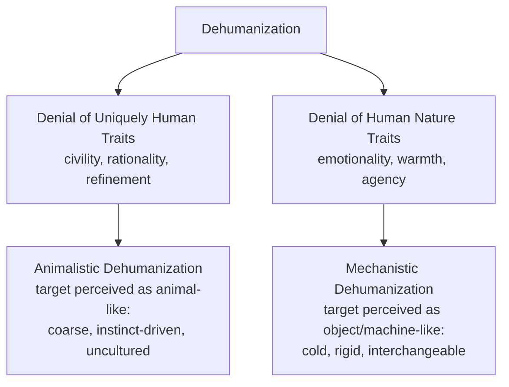

## Dehumanization

### Overview

Dehumanization refers to the psychological process of perceiving or treating another person or group as lacking the qualities that define full humanness, effectively denying them a status equivalent to one's own humanity. Dehumanization is studied both as a perceptual/cognitive phenomenon (how people mentally represent out-groups) and as a precursor to and facilitator of prejudice, discrimination, and, in extreme cases, mass violence.

### Core Premise

**Key Points**

- Dehumanization involves denying a target group the attributes considered central or unique to being human, which can lower moral concern, empathy, and inhibitions against harming or mistreating members of that group.
- Dehumanization can occur on a spectrum ranging from subtle, everyday forms (embedded in ordinary language, humor, or media portrayal) to extreme, explicit forms (associated with genocide, mass atrocity, and systematic violence).
- Unlike simple out-group derogation (disliking a group), dehumanization specifically involves denying the group's humanity itself, which theoretically removes or weakens the ordinary moral protections and empathic responses typically extended to fellow humans.

### The Dual Model of Dehumanization (Haslam, 2006)

Nick Haslam's influential dual model distinguishes two forms of humanness that can be denied, each associated with a different comparison target and psychological consequence.

**Key Points**

1. **Denial of Uniquely Human (UH) traits**: denying attributes thought to distinguish humans from animals (e.g., civility, refinement, moral sensibility, rationality, maturity). Denial of these traits results in **animalistic dehumanization**, in which the out-group is implicitly or explicitly likened to animals — perceived as coarse, uncultured, unintelligent, or driven by instinct rather than reason.
2. **Denial of Human Nature (HN) traits**: denying attributes thought to be core/essential to human nature as opposed to inanimate objects or machines (e.g., emotionality, warmth, individuality, agency, depth). Denial of these traits results in **mechanistic dehumanization**, in which the out-group is implicitly or explicitly likened to objects, machines, or automata — perceived as cold, rigid, interchangeable, and emotionally inert.

**Example**

Animalistic dehumanization occurs when a group is described using animal metaphors (e.g., referring to human beings as "vermin," "cockroaches," or "animals"), historically documented in propaganda preceding several genocides. Mechanistic dehumanization occurs in contexts such as bureaucratic or industrial settings where individuals are treated as interchangeable units or "cogs" rather than as emotionally rich individuals — for instance, referring to hospital patients solely by diagnosis or bed number rather than as whole persons.

### Infrahumanization

**Key Points**

- **Infrahumanization** (Leyens et al.) describes a subtler, more pervasive form of dehumanization in which people implicitly attribute secondary, uniquely human emotions (e.g., nostalgia, hope, admiration, resentment — complex, uniquely human emotions requiring cognitive sophistication) more readily to their in-group than to out-groups, while attributing primary emotions (e.g., fear, anger, joy — shared with animals) relatively equally to both.
- Unlike blatant animalistic/mechanistic dehumanization, infrahumanization does not involve explicitly denying an out-group's humanity altogether; rather, it involves a subtle differential attribution of "the human essence" that favors the in-group, often occurring outside conscious awareness or intent.
- Infrahumanization has been demonstrated across numerous intergroup contexts (national, ethnic, and other social categories) and is considered one of the more subtle, widespread mechanisms of intergroup bias.

### Blatant vs. Subtle Dehumanization

**Key Points**

- **Blatant dehumanization**: explicit, consciously endorsed characterizations of an out-group as less than fully human (e.g., openly agreeing with statements likening a group to animals). Kteily and colleagues developed a widely used direct measure — the "Ascent of Man" scale — asking participants to rate how "evolved" they perceive various groups to be on a pictorial scale, with lower ratings indicating more blatant dehumanization.
- **Subtle dehumanization**: indirect measures (such as infrahumanization paradigms, or implicit association tasks pairing human vs. animal words with group labels) that do not require conscious endorsement and can reveal dehumanizing associations even among people who would explicitly reject blatant dehumanizing statements.
- Blatant dehumanization measures (e.g., Kteily's Ascent of Man scale) have been found in various studies to predict support for aggressive policies and behaviors toward the dehumanized group (e.g., support for torture, punitive immigration policy, or military aggression) beyond what is predicted by general prejudice or negative stereotyping alone, suggesting dehumanization captures something distinct from ordinary intergroup dislike.

### Dehumanization and Intergroup Violence

**Key Points**

- Dehumanization has been extensively studied as a facilitating factor in historical atrocities, including genocide and ethnic cleansing, where perpetrator propaganda has frequently and documentedly employed explicit animalistic or disease-based metaphors (e.g., describing target groups as vermin, parasites, or diseases) prior to and during periods of mass violence.
- The theorized mechanism is that dehumanizing language and belief reduce empathic and moral inhibitions against violence by psychologically removing the target from the category of beings deserving of moral consideration, making cruelty and violence easier to enact and to justify to oneself and others.
- **Moral disengagement theory** (Bandura) identifies dehumanization as one of several cognitive mechanisms (alongside euphemistic labeling, diffusion of responsibility, and advantageous comparison) by which individuals and groups psychologically distance themselves from the moral implications of harmful actions.
- [Inference] Because historical case studies consistently document dehumanizing rhetoric preceding mass violence, most scholars treat dehumanization as an important contributing and enabling factor in such violence, though it is generally understood as operating alongside other political, economic, and social conditions rather than as a sole or sufficient cause on its own.

### Dehumanization in Everyday and Institutional Contexts

**Key Points**

- Beyond extreme violence, dehumanization has been studied in more ordinary contexts, including:
  - **Healthcare**: patients (particularly those from stigmatized groups, or those with certain illnesses) can be subject to mechanistic dehumanization through depersonalized medical treatment.
  - **Criminal justice**: research has examined how dehumanizing portrayals of certain groups (e.g., some studies on animalistic dehumanization applied historically and in some media contexts to Black Americans) have been associated with support for harsher punitive treatment and reduced perceived culpability concern.
  - **Media and political rhetoric**: dehumanizing language directed at immigrants, political opponents, or other out-groups in public discourse has been studied as a predictor of support for exclusionary or punitive policy.
  - **Objectification**: a related but distinct construct, particularly studied regarding the sexual objectification of women, in which a person is reduced to their physical/bodily attributes and denied attributes of mind, agency, and subjectivity (overlapping conceptually with mechanistic dehumanization).

### Reducing Dehumanization

**Key Points**

- **Individuation and personalization**: providing specific, individuating information about out-group members (as opposed to category-level information) has been shown in various studies to reduce dehumanizing perceptions, consistent with broader research on individuation as a debiasing strategy.
- **Perspective-taking**: interventions that prompt people to imagine the subjective experience of an out-group member have been associated with reduced dehumanization and infrahumanization in several studies.
- **Intergroup contact**: consistent with Allport's contact hypothesis, positive, cooperative contact between groups has been associated with reduced dehumanizing perceptions in some research, particularly when contact allows for the perception of out-group members' emotional and psychological depth.
- **Counter-narratives and media literacy**: interventions aimed at recognizing and countering dehumanizing rhetoric in political and media discourse have been proposed and piloted, though [Unverified: the durability and scalability of such counter-messaging interventions across diverse real-world contexts remains an active and unsettled area of applied research].

### Related Topics

- Dual model of dehumanization (animalistic vs. mechanistic)
- Infrahumanization and secondary emotion attribution
- Moral disengagement theory (Bandura)
- Ascent of Man scale and blatant dehumanization measurement
- Objectification theory
- Aversive racism and implicit bias
- Contact hypothesis and prejudice-reduction interventions
- Genocide studies and propaganda analysis