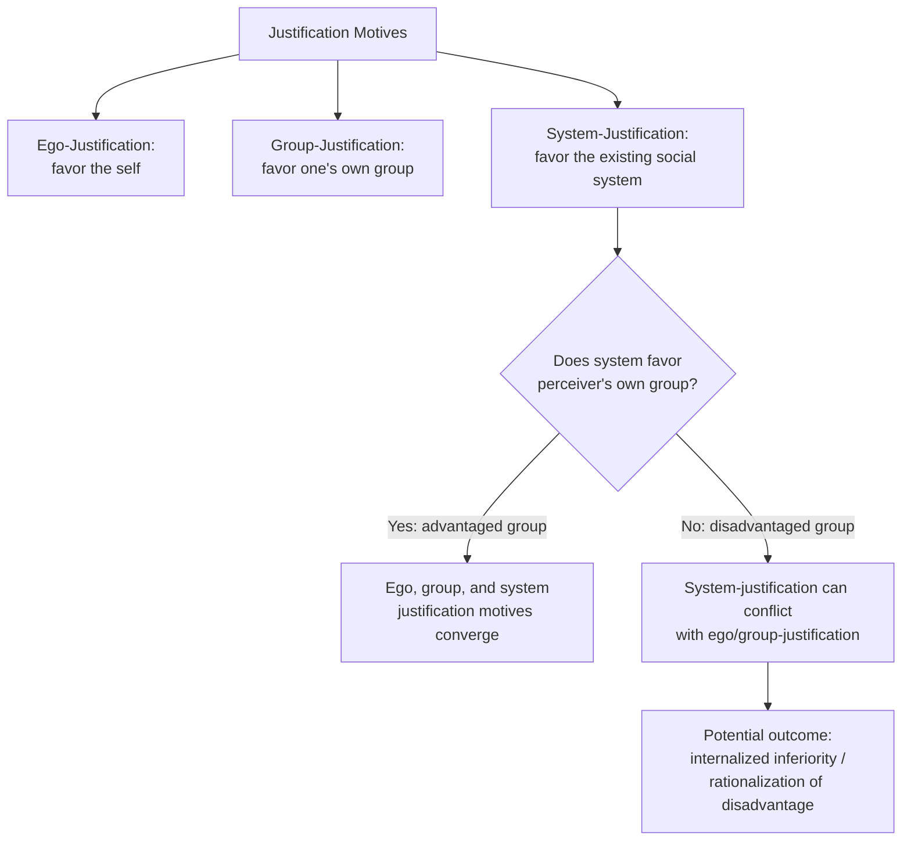

## System Justification Theory

### Overview

System Justification Theory (SJT), developed by John Jost and Mahzarin Banaji (1994), proposes that people are motivated to defend, bolster, and rationalize the existing social, economic, and political systems they live within — even when those systems disadvantage themselves or their own group. This theory extends beyond ego-justification (favoring oneself) and group-justification (favoring one's own group) to identify a third, distinct motive: system-justification, the motivation to see the overarching social order itself as fair, legitimate, and desirable.

### Core Premise

**Key Points**

- SJT proposes that, alongside well-documented motives to enhance personal self-esteem (ego-justification) and to favor one's own group (group-justification, as in Social Identity Theory), people are also motivated to justify and rationalize existing social arrangements — including systems that produce or maintain inequality.
- This system-justifying motive can, under certain conditions, operate independently of and even in conflict with self-interest or group-interest, producing the counterintuitive prediction that members of disadvantaged groups can, at times, internalize and support ideologies that rationalize their own group's subordinate status.
- The theory frames system justification as at least partly serving a palliative psychological function: believing that the existing system is fair and legitimate can reduce uncertainty, threat, and dissonance associated with living within (and being unable to easily escape) a given social arrangement.

### The Three Justification Motives

| Motive | Target of Justification | Predicted Direction | Underlying Theory |
| --- | --- | --- | --- |
| Ego-justification | The self | Favor one's own attributes, choices, group memberships | Self-esteem/self-enhancement motives |
| Group-justification | One's own group | Favor one's in-group over out-groups | Social Identity Theory |
| System-justification | The overarching social/economic/political system | Favor and rationalize existing societal arrangements, regardless of personal or group benefit | System Justification Theory |

### Key Predictions and Findings

**Key Points**

- **Stereotype endorsement by disadvantaged groups**: SJT predicts, and studies have found, that members of lower-status groups sometimes endorse stereotypes about their own group that rationalize their disadvantaged position (e.g., accepting stereotypes that frame their group as "less ambitious" rather than attributing disadvantage to structural discrimination), particularly for stereotype dimensions that make the status difference feel more palatable or legitimate.
- **"Complementary" stereotypes**: system justification is theorized to be strengthened when stereotypes about high- and low-status groups are complementary (e.g., "poor but happy," "rich but miserable") rather than uniformly favoring the high-status group — such complementary stereotype pairings make inequality appear more balanced and therefore more acceptable and legitimate. Experimental exposure to complementary stereotypes has been shown in various studies to increase system-justifying beliefs and diffuse support for redistributive social change.
- **Depression and system justification among disadvantaged groups**: some studies have found that system-justifying beliefs, while reducing certain negative affect in the short term (via the palliative function), can be associated with lower self-esteem and increased ambivalence or psychological cost specifically among members of disadvantaged groups, consistent with the theorized tension between system-justification and group/ego-justification for these individuals. [Unverified: findings regarding the palliative-versus-costly psychological consequences of system justification for disadvantaged-group members vary across studies and outcome measures, and should not be treated as a single uniform effect.]
- **Political conservatism and system justification**: SJT has been linked theoretically and empirically to political ideology, with system-justifying motivation proposed as one underlying psychological factor associated with resistance to social change and acceptance of inequality (related to, but conceptually distinct from, general political conservatism as studied separately in political psychology).

### The Palliative Function of System Justification

**Key Points**

- SJT proposes that believing the existing system is fair and just serves a palliative (comforting, anxiety-reducing) psychological function, since it allows people to feel that the world is orderly, predictable, and controllable, consistent with related literature on the **just-world hypothesis** (Lerner).
- This palliative function is theorized to be particularly appealing under conditions of system threat, uncertainty, or when alternatives to the status quo appear unavailable or costly — situations in which people may be especially motivated to defend the existing arrangement rather than confront its potential unfairness.
- Increased system threat (e.g., economic instability, terrorism threat, political crisis) has been associated in several studies with heightened system-justifying tendencies, consistent with the theory's threat-management framing.

### Relationship to the Just-World Hypothesis

**Key Points**

- Melvin Lerner's **just-world hypothesis** proposes that people have a fundamental need to believe the world is a fair place where people generally get what they deserve, which can lead to victim-blaming (derogating or blaming victims of misfortune to preserve belief in a just world).
- SJT extends and formalizes this idea specifically to the level of social systems and structural inequality, proposing that similar psychological needs operate to defend entire social, economic, and political arrangements, not only individual instances of misfortune.

### Relationship to Social Dominance Orientation

**Key Points**

- **Social Dominance Orientation (SDO)** (Sidanius & Pratto) is a related but distinct individual-difference construct describing a general preference for group-based social hierarchy and dominance of some groups over others.
- SJT and SDO are theoretically distinguished: SDO is typically framed as a relatively stable individual-difference variable reflecting a preference *for* hierarchy per se, whereas system-justification motivation is framed as a more general, situationally responsive motive to defend *whatever* system currently exists (even a relatively egalitarian one), independent of a general preference for hierarchy.
- Empirically, the two constructs are related and can jointly predict outcomes such as opposition to redistributive policy, but are treated in the literature as conceptually and empirically separable.

### Applications

**Key Points**

- Applied to explain public attitudes toward economic inequality, including why some individuals in economically disadvantaged positions do not support redistributive policies that would materially benefit them or their group.
- Applied to gender attitudes research, including analysis of why some women endorse benevolent sexist ideologies that idealize traditional roles (connecting to Ambivalent Sexism Theory's account of how benevolently-framed inequality can be more palatable and less likely to be challenged).
- Applied in organizational psychology to explain employee acceptance of unequal workplace hierarchies and compensation structures, even among employees near or at the bottom of such hierarchies.
- Applied in political psychology and public opinion research to examine responses to social protest movements and demands for structural change, where system-justifying motivation is proposed as one factor associated with resistance to such movements.

### Critiques and Limitations

**Key Points**

- Critics have questioned whether some findings attributed to a distinct "system-justification motive" could alternatively be explained by more parsimonious existing constructs (e.g., cognitive dissonance reduction, general conservatism, or specific group-identity processes), and this remains a subject of ongoing theoretical debate within the field.
- Some scholars argue the theory's predictions about disadvantaged groups internalizing system-justifying beliefs, while empirically documented in various specific studies, should not be overgeneralized to imply that most or all disadvantaged individuals passively accept inequality; collective action and resistance to unjust systems are well-documented alternative and coexisting phenomena, and SJT researchers have worked to specify the boundary conditions under which system-justification versus resistance is more likely.
- As with related motivational theories, distinguishing genuine underlying psychological motivation from the downstream behavioral or attitudinal outcomes it is inferred from can be methodologically challenging, and most support for the theory rests on correlational and experimental survey-based designs rather than direct measurement of the motive itself.

### Related Topics

- Just-world hypothesis (Lerner) and victim-blaming
- Social Dominance Orientation (Sidanius & Pratto)
- Ambivalent sexism theory (benevolent sexism and system justification)
- Stereotype Content Model (complementary stereotypes)
- Social Identity Theory (group-justification motives)
- Social, cognitive, and motivational origins of prejudice
- Political psychology of ideology and social change attitudes