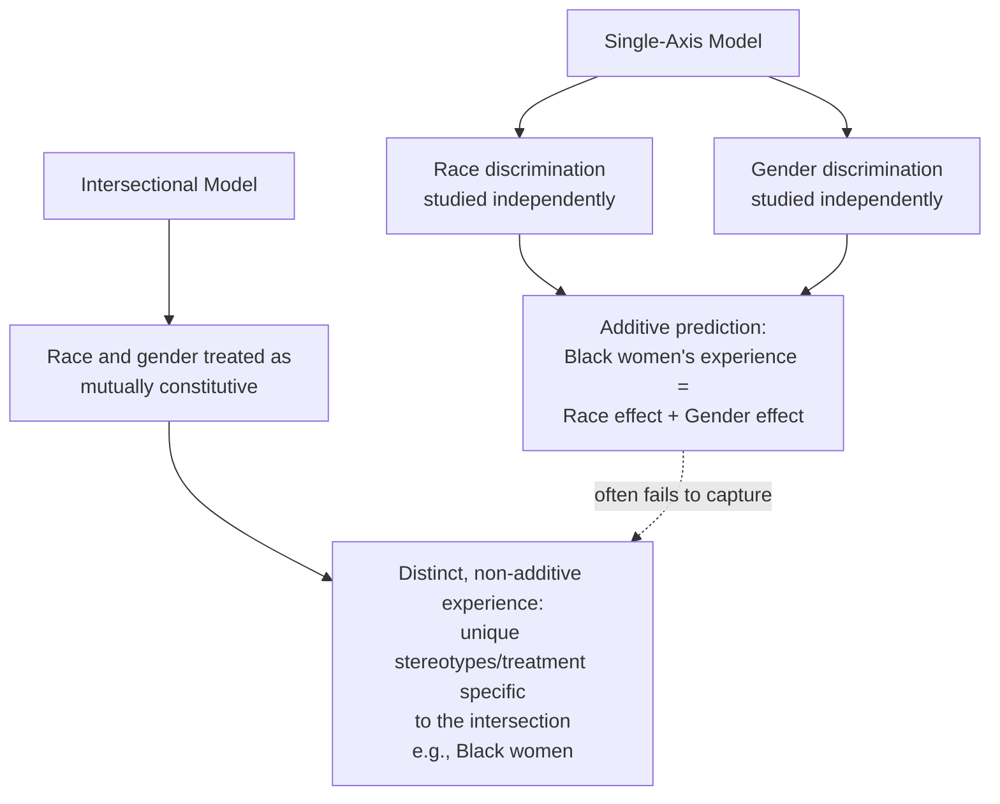

## Intersectionality in Prejudice Research

### Overview

Intersectionality is a theoretical framework holding that social categories such as race, gender, class, sexual orientation, disability, and other identity dimensions do not operate independently but interact to produce unique, qualitatively distinct experiences of privilege and disadvantage. The term was coined by legal scholar Kimberlé Crenshaw (1989) and has been substantially incorporated into social psychological research on prejudice, stereotyping, and discrimination over subsequent decades.

### Core Premise

**Key Points**

- Crenshaw's foundational argument was that treating discrimination based on single, separate categories (e.g., race-based discrimination and gender-based discrimination analyzed independently) fails to capture the distinct experiences of individuals at the intersection of multiple marginalized identities (e.g., Black women), whose experiences of discrimination are not simply additive.
- Intersectionality proposes that combinations of social identities can create experiences that are qualitatively unique — not merely the sum of the discrimination associated with each identity considered separately.
- The framework shifts analysis away from single-axis models of oppression (studying race *or* gender *or* class in isolation) toward multi-axis models that examine how these dimensions co-construct and interact with one another.

### Non-Additivity: A Central Claim

**Key Points**

- The central methodological and theoretical claim distinguishing intersectionality from simple "double disadvantage" models is **non-additivity**: the experience of holding multiple marginalized identities is not accurately predicted by summing the separate effects of each identity's associated discrimination.
- Crenshaw's original legal analysis illustrated this with employment discrimination cases in which Black women were denied standing to bring discrimination claims because courts evaluated race discrimination using the experience of Black men as the reference category and sex discrimination using the experience of White women as the reference category — leaving discrimination specific to the intersection of race and gender legally unrecognized.
- In social psychological terms, this translates to the empirical prediction that stereotypes, prejudice, and discriminatory treatment directed at intersectional groups (e.g., Black women, Asian men, older women) can differ in content and magnitude from what would be predicted by combining the stereotypes associated with each constituent group membership independently.

### Intersectional Invisibility

**Key Points**

- **Intersectional invisibility** (Purdie-Vaughns & Eibach, 2008) describes the phenomenon in which people with multiple subordinate-group identities (e.g., women of color) are less likely to be recognized as "prototypical" members of any of their constituent identity groups (e.g., less prototypically "Black" than Black men, less prototypically "female" than White women), leading to distinctive forms of marginalization, including being overlooked in both political and social movements organized around single-axis identities.
- This framework proposes that intersectional group members can experience both discrimination *and* invisibility — their distinctive experiences of bias may go unrecognized precisely because social attention and advocacy tend to center the prototypical (often single-identity) members of a given group category.
- Related research on the "default category" phenomenon has documented that when people are asked to think about a given social category (e.g., "women" or "Black people"), they often default to imagining the subgroup at the intersection with the numerically or socially dominant category (e.g., defaulting to White women when thinking of "women," or Black men when thinking of "Black people"), which can obscure the specific experiences of intersectional subgroups in both research and public discourse.

### Empirical Approaches in Social Psychology

**Key Points**

- **Stereotype content research**: studies applying the Stereotype Content Model and related frameworks have examined whether intersectional groups (e.g., Black women, Asian men) occupy distinct positions on warmth/competence dimensions that differ from the positions predicted by simply combining their constituent group stereotypes, with several studies finding evidence for such distinct, non-additive stereotype content.
- **Ambivalent sexism and intersectionality**: research has examined how hostile and benevolent sexism may be differentially applied across racial and ethnic subgroups of women, with some studies suggesting that benevolent, "protective" forms of sexism are stereotypically extended less to women of color than to White women in some contexts, illustrating how gender-based prejudice frameworks interact with race.
- **Discrimination audit studies**: correspondence/audit studies examining hiring discrimination have increasingly incorporated intersectional designs (e.g., varying both apparent race and gender of fictitious job applicants simultaneously) to test for non-additive discriminatory patterns rather than assuming race and gender effects combine linearly.
- **Person-perception and categorization research**: studies using face-categorization paradigms have examined how quickly and accurately perceivers categorize individuals at the intersection of race and gender (or other combined categories), with findings suggesting that intersectional categorization is not always a simple, additive combination of single-category processing.

### Methodological Considerations

**Key Points**

- Intersectionality research raises specific methodological challenges for traditional experimental social psychology, which has historically favored manipulating one identity dimension at a time while holding others constant; full factorial designs manipulating multiple identity dimensions simultaneously are more complex, often require larger samples to detect interaction effects, and can be logistically more difficult to construct with realistic, believable stimuli.
- Debate exists within the field regarding appropriate statistical approaches for testing non-additivity, including how to interpret and report interaction effects in factorial designs versus using specialized intersectional analytic frameworks developed in adjacent disciplines (e.g., quantitative intersectionality methods drawing on sociology and public health research).
- [Inference] Because rigorous experimental tests of non-additivity require adequately powered designs capable of detecting interaction effects (which are statistically harder to detect than main effects), some published intersectionality findings in social psychology should be interpreted with attention to sample size and replication status, consistent with broader statistical power concerns affecting interaction-effect research generally.

### Applications

**Key Points**

- Informs workplace diversity and equity research and interventions, which increasingly examine outcomes (hiring, promotion, pay, workplace treatment) disaggregated by intersectional subgroup rather than by single demographic categories alone.
- Applied in health disparities research to examine how combinations of identity (e.g., race, gender, socioeconomic status, disability) interact to predict distinctive patterns of healthcare access, treatment, and outcomes that are not captured by studying any single demographic factor alone.
- Applied in political psychology and voting behavior research to examine how candidates or political messages are evaluated differently based on intersecting identity characteristics (e.g., studies of voter evaluations of women of color candidates as distinct from generic "women candidates" or "candidates of color").
- Informs contemporary revisions to classic prejudice theories (Social Identity Theory, Stereotype Content Model, System Justification Theory) as researchers increasingly test whether these frameworks' core predictions hold, and how they should be extended, when applied to intersectional group memberships rather than single-category group memberships.

### Critiques and Ongoing Debates

**Key Points**

- Some critics argue that intersectionality's origins in critical legal and sociological theory create translation challenges when operationalizing its concepts for quantitative, hypothesis-testing social psychological research, and debate continues regarding the most appropriate methods for empirically capturing genuinely non-additive intersectional effects.
- Other scholars note that not all combinations of identity produce clearly demonstrated non-additive effects in every study, and caution against assuming non-additivity as a universal, default finding rather than an empirical question to be tested case by case across specific identity combinations and outcomes.
- There is ongoing scholarly discussion regarding how many identity dimensions can be meaningfully studied simultaneously before statistical and interpretive complexity becomes prohibitive, which has practical implications for how comprehensively any single study can operationalize a fully intersectional design.

### Related Topics

- Crenshaw's foundational intersectionality framework (legal studies origin)
- Intersectional invisibility (Purdie-Vaughns & Eibach)
- Stereotype Content Model applied to intersectional groups
- Ambivalent sexism and racial/ethnic variation in gender stereotypes
- Correspondence/audit studies of discrimination
- Distinguishing prejudice, stereotypes, and discrimination
- Statistical power and interaction effects in experimental design