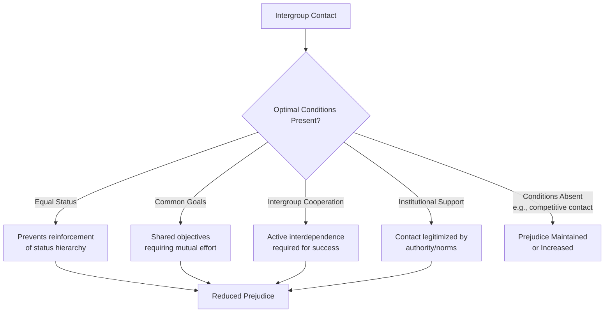

## Allport's Intergroup Contact Theory

### Overview

Intergroup Contact Theory, formulated by Gordon Allport in *The Nature of Prejudice* (1954), proposes that direct contact between members of different social groups can reduce prejudice — but only under specific, favorable conditions. Rather than claiming that mere exposure to out-group members automatically reduces bias, Allport specified a set of conditions under which contact is most likely to be effective, making the theory a conditional rather than a blanket prediction about intergroup contact.

### Core Premise

**Key Points**

- Contact alone, without particular structural and situational conditions, is not reliably sufficient to reduce prejudice and can, in some circumstances (e.g., competitive or hostile contact), increase it — a point empirically reinforced by the friction phase of Sherif's Robbers Cave experiment, in which contact without cooperative structure worsened intergroup hostility.
- Allport proposed that specific conditions transform contact from a neutral or potentially harmful interaction into one capable of reducing prejudice by fostering positive interdependence, accurate mutual knowledge, and personalized (rather than category-based) perception of out-group members.

### Allport's Four Optimal Conditions

**Key Points**

1. **Equal status**: the groups in contact should hold equal status within the specific contact situation (though they may differ in status in the broader society), preventing the interaction from reinforcing existing status hierarchies or power imbalances.
2. **Common goals**: participants should be working toward shared objectives that require mutual effort, rather than pursuing separate or competing goals.
3. **Intergroup cooperation**: achieving the common goals should require active cooperation between groups (rather than groups working in parallel without interdependence), directly mirroring the superordinate-goal mechanism identified in Realistic Conflict Theory's Robbers Cave findings.
4. **Support of authorities, law, or custom**: the contact should be explicitly sanctioned and supported by relevant authorities, institutions, or social norms, which legitimizes the interaction and signals that positive intergroup relations are socially endorsed rather than transgressive.

**Example**

A school-based intervention placing students from different ethnic backgrounds into a joint project team illustrates the four conditions when: all students are assigned equivalent roles and responsibilities (equal status), the team is graded on a single shared project outcome (common goal), the project design requires students to combine complementary skills that no single student possesses alone (cooperation), and the teacher explicitly frames the collaboration as a valued, sanctioned classroom activity (institutional support).

### Proposed Mechanisms of Contact Effects

**Key Points**

- **Reduced anxiety**: repeated positive contact has been shown in numerous studies to reduce intergroup anxiety — the discomfort or apprehension often felt when anticipating or engaging in interaction with out-group members.
- **Increased empathy and perspective-taking**: positive contact facilitates greater empathic understanding of the out-group's experiences and viewpoints.
- **Increased knowledge**: contact can correct inaccurate stereotypes by providing direct, individuating information about out-group members that contradicts overgeneralized category-level beliefs.
- **Deprovincialization**: contact can broaden a person's frame of reference, making in-group norms feel less like the only valid standard and increasing openness to other groups' norms and perspectives.
- Meta-analytic work (notably Pettigrew & Tropp, 2006, synthesizing over 500 studies) found that reduced intergroup anxiety and increased empathy/perspective-taking are among the most consistently supported mediating mechanisms linking contact to prejudice reduction.

### The Extended Contact Hypothesis

**Key Points**

- **Extended contact** (Wright, Aron, McLaughlin-Volpe, & Ropp, 1997) proposes that simply knowing that an in-group member has a close relationship with an out-group member (even without direct personal contact by the perceiver) can reduce the perceiver's own prejudice toward that out-group.
- This extension addresses practical limitations of direct-contact interventions, since not everyone has opportunities for direct, sustained intergroup contact; extended contact offers a potentially more scalable mechanism (e.g., through storytelling, media portrayal of cross-group friendships, or knowledge of one's social network's intergroup relationships).
- Several studies have found extended contact effects on prejudice reduction, generally with smaller effect sizes than direct contact but with the practical advantage of broader applicability.

### The Imagined Contact Hypothesis

**Key Points**

- **Imagined intergroup contact** (Crisp & Turner) proposes that mentally simulating a positive interaction with an out-group member, even without any actual contact occurring, can produce measurable reductions in prejudice and intergroup anxiety in experimental studies.
- This approach has been proposed as a potentially useful preparatory or low-resource intervention, particularly in contexts where direct contact opportunities are limited (e.g., segregated environments) or as a precursor intended to increase willingness to engage in future direct contact.
- [Unverified: the durability and real-world behavioral impact of imagined-contact effects, relative to direct or extended contact, remains a subject of ongoing empirical investigation, with effect sizes generally reported as smaller than those found for direct contact interventions.]

### Meta-Analytic Evidence

**Key Points**

- Pettigrew and Tropp's (2006) meta-analysis of intergroup contact research found a significant overall negative association between contact and prejudice across the studies reviewed, and notably found that this relationship held even in studies that did not fully satisfy all four of Allport's original optimal conditions — suggesting the conditions facilitate and strengthen contact's prejudice-reducing effects rather than being strictly necessary prerequisites in all cases.
- This finding led to some refinement of the theory: subsequent researchers have generally treated Allport's four conditions as *facilitating factors that enhance the likelihood and strength* of positive contact effects, rather than as an all-or-nothing threshold that must be fully met for any prejudice reduction to occur.
- Meta-analytic effects have been found across a range of target groups (racial/ethnic groups, sexual orientation, disability status, mental illness, age groups) and contact settings (educational, workplace, community, recreational).

### Critiques and Boundary Conditions

**Key Points**

- **Generalization problem**: reduced prejudice toward a specific out-group individual encountered in a positive contact situation does not automatically or fully generalize to reduced prejudice toward the out-group as a whole; researchers have proposed that contact is more likely to generalize when the individual out-group member is perceived as a reasonably typical (rather than an atypical, "exceptional") representative of their group.
- **Practical scalability**: creating genuinely optimal contact conditions (particularly institutional support and true equal status) can be difficult to arrange in many real-world settings characterized by pre-existing structural inequality, historical conflict, or segregation.
- **Negative contact effects**: some research has found that negative intergroup contact experiences can have disproportionately larger effects on increasing prejudice than positive contact has on reducing it, suggesting an asymmetry in the psychological weighting of positive versus negative intergroup experiences that complicates simple contact-based intervention design. [Inference] Given this documented asymmetry in several studies, contact-based interventions are generally understood to require careful structuring to maximize the likelihood of positive rather than negative experiences, rather than treating any contact opportunity as equally likely to be beneficial.
- **Context dependency**: the effectiveness of contact interventions can vary depending on the historical relationship between groups, the presence of ongoing real-world conflict or competition (connecting to Realistic Conflict Theory), and broader societal power dynamics — meaning contact theory's practical application typically requires attention to context-specific factors beyond the four general conditions alone.

### Related Topics

- Extended contact hypothesis (Wright et al.)
- Imagined contact hypothesis (Crisp & Turner)
- Realistic Conflict Theory and the Robbers Cave experiment
- Common In-group Identity Model
- Jigsaw classroom technique (Aronson)
- Intergroup anxiety and its reduction
- Meta-analytic methods in social psychology (Pettigrew & Tropp, 2006)
- Dehumanization and its reduction through contact