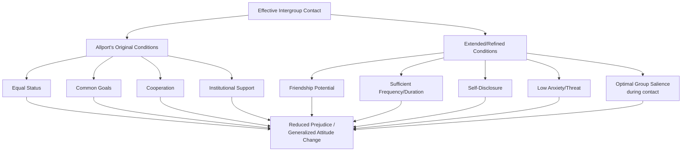

## Conditions for Effective Intergroup Contact

### Overview

Building on Gordon Allport's foundational contact hypothesis, decades of subsequent research have refined, tested, and extended the specific conditions under which intergroup contact most reliably reduces prejudice. This body of work moves beyond Allport's original four conditions to identify additional facilitating factors, boundary conditions, and mediating/moderating processes that determine when contact succeeds, fails, or backfires.

### Allport's Original Four Conditions (Baseline Framework)

**Key Points**

- **Equal status** within the contact situation itself (independent of broader societal status differences).
- **Common goals** that give both groups a shared stake in the interaction's outcome.
- **Intergroup cooperation** requiring genuine interdependence to achieve those goals.
- **Institutional/authority support**, signaling that positive intergroup relations are socially sanctioned and normative.
- These four conditions remain the theoretical starting point for virtually all subsequent contact research, though later work has treated them as facilitating rather than strictly necessary factors (see Pettigrew & Tropp's 2006 meta-analysis).

### Additional Conditions Identified in Subsequent Research

**Key Points**

- **Opportunity for friendship potential**: contact that provides opportunity for the development of close, meaningful relationships (rather than brief, superficial encounters) has been found to be a particularly strong predictor of prejudice reduction (Pettigrew, 1998), sometimes proposed as a fifth essential condition beyond Allport's original four.
- **Sufficient frequency and duration**: single or infrequent contact episodes are less reliably associated with prejudice reduction than sustained, repeated contact over time, which allows relationships and revised out-group perceptions to consolidate.
- **Self-disclosure**: contact situations that facilitate mutual self-disclosure of personal information have been associated with stronger prejudice-reduction effects, consistent with the friendship-potential condition and with broader relationship-science findings on self-disclosure and closeness.
- **Low anxiety/threat**: contact situations that minimize intergroup anxiety (the discomfort or apprehension associated with anticipating or engaging in cross-group interaction) tend to produce stronger positive effects; conversely, high-anxiety contact situations can suppress or even reverse potential benefits.
- **Salience of group membership during contact**: some research (in a partial complication of pure "decategorization" approaches) suggests that group memberships should remain at least minimally salient during positive contact for attitude change to generalize back to the broader out-group, rather than being perceived merely as an exception ("subtyped") who doesn't represent their group.

### Three Models of Categorization During Contact

A significant line of research has examined how group categories should be cognitively represented during contact for optimal generalization of positive attitude change.

**Key Points**

1. **Decategorization** (personalized-based model, Brewer & Miller): minimizing the salience of group categories during contact, encouraging perceivers to focus on individuating, personal information about out-group members rather than category membership. Strength: reduces category-based bias in the immediate interaction. Limitation: positive change may not generalize back to the out-group category as a whole, since the interaction partner may be perceived as an exception rather than as representative.
2. **Recategorization** (Common In-group Identity Model, Gaertner & Dovidio): restructuring perceptions so that both groups are recategorized as members of a single, shared, superordinate in-group (e.g., "we are all one team/organization/nation" rather than "us vs. them"). This extends in-group favoritism processes (per Social Identity Theory) to include former out-group members within a redefined, more inclusive in-group boundary.
3. **Mutual intergroup differentiation** (Hewstone & Brown): maintaining group distinctiveness during contact (rather than minimizing or dissolving it) while establishing cooperative, equal-status interaction — proposed as more likely to generalize because the contact partner remains clearly identified as a representative category member rather than a subtyped exception.

| Model | Category Salience | Primary Mechanism | Generalization Strength |
| --- | --- | --- | --- |
| Decategorization | Minimized | Individuation, personal identity | Weaker generalization to broader out-group |
| Recategorization | Replaced with superordinate identity | Shared in-group identity, extended in-group favoritism | Strong within new superordinate boundary; may not transfer to unrelated out-groups |
| Mutual Differentiation | Maintained/salient | Cooperative, equal-status contact with clear category membership | Stronger generalization to the broader out-group category |

**Key Points**

- Contemporary contact research often suggests a synthesized approach: some degree of category salience should be maintained (to support generalization, per mutual differentiation) while simultaneously fostering a sense of shared, superordinate connection (per recategorization) and allowing individuating, personal information to develop (per decategorization) — recognizing that different mechanisms may be more or less appropriate at different stages of a contact relationship or intervention.

### The Common In-group Identity Model in Detail

**Key Points**

- Developed by Samuel Gaertner and John Dovidio, this model proposes that prejudice can be reduced by inducing members of different groups to recategorize themselves as belonging to one, more inclusive superordinate group, thereby extending the well-documented in-group favoritism bias (from Social Identity Theory and the minimal group paradigm) to include former out-group members.
- Distinct from simply eliminating group identity altogether; rather, it involves shifting the psychological boundary of "us" to be more inclusive (e.g., from "my department" to "our company," or from "my nation" to "humanity").
- Has been applied and studied in contexts including corporate mergers, school desegregation and integration efforts, and post-conflict reconciliation programs.

### Negative Contact and Asymmetry Effects

**Key Points**

- Research has found that **negative** intergroup contact experiences tend to have a disproportionately stronger effect on increasing prejudice than positive contact has on reducing it — an asymmetry that has significant implications for intervention design, since a single poorly structured or negative contact experience can outweigh the benefit of multiple positive experiences.
- This finding underscores the practical importance of carefully structuring contact interventions to maximize the likelihood of the conditions described above (equal status, cooperation, low anxiety, etc.) rather than assuming that any contact opportunity carries equivalent, uniformly positive potential.

### Practical Applications

**Key Points**

- **Educational settings**: cooperative learning techniques such as the **jigsaw classroom** (Elliot Aronson) structure group tasks so that each student possesses a unique piece of information necessary for the group's success, operationalizing intergroup cooperation and interdependence within Allport's framework.
- **Organizational diversity interventions**: workplace programs that create structured, equal-status, cooperative cross-group project teams draw directly on contact theory's conditions, as do formal mentorship and cross-functional team-building programs.
- **Post-conflict and peacebuilding programs**: intergroup dialogue and reconciliation initiatives in post-conflict societies often explicitly incorporate Allport's conditions (particularly institutional support and cooperative superordinate goals) alongside recategorization strategies.
- **Media-based and parasocial contact**: given practical constraints on arranging direct contact at scale, some interventions leverage extended contact (knowledge of cross-group friendships) and media portrayals of positive cross-group relationships as more scalable alternatives.

### Limitations and Ongoing Debates

**Key Points**

- Meeting all identified optimal conditions simultaneously in real-world, non-laboratory settings remains logistically challenging, particularly regarding genuine equal status when groups differ in societal power and resources outside the specific contact situation.
- The relative effectiveness of decategorization, recategorization, and mutual differentiation approaches may depend on context-specific factors (e.g., severity of prior conflict, degree of pre-existing group salience, cultural context), and researchers continue to debate which approach, or combination, is optimal under which circumstances. [Inference] Because these approaches have each received empirical support in different study contexts rather than one being uniformly superior across all settings, most contemporary reviews favor a context-sensitive, combined-strategy approach over treating any single categorization model as a universal solution.
- As with contact research generally, most evidence for these refined conditions comes from correlational and quasi-experimental field studies alongside laboratory experiments; establishing precise causal contributions of each specific condition in complex real-world interventions (which typically combine several conditions simultaneously) can be difficult to fully disentangle.

### Related Topics

- Allport's intergroup contact theory (foundational four conditions)
- Common In-group Identity Model (Gaertner & Dovidio)
- Decategorization and mutual intergroup differentiation models
- Jigsaw classroom technique (Aronson)
- Extended and imagined contact hypotheses
- Negative contact asymmetry effects
- Realistic Conflict Theory and superordinate goals