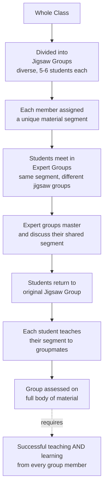

## The Jigsaw Classroom

### Overview

The jigsaw classroom is a cooperative learning technique developed by Elliot Aronson and colleagues in 1971, originally created in response to escalating racial conflict following school desegregation in Austin, Texas. The method structures small-group learning tasks so that each student holds a unique, essential piece of information required for the group's overall success, creating structural interdependence that operationalizes several of Allport's optimal conditions for intergroup contact within an ordinary classroom setting.

### Origin and Rationale

**Key Points**

- Aronson was consulted by the Austin Independent School District following the district's desegregation, which had produced highly competitive classroom dynamics and rising intergroup hostility among students of different racial and ethnic backgrounds who were suddenly sharing classrooms for the first time.
- Traditional classroom structures at the time relied heavily on individual competition (students competing for grades, teacher attention, and academic status), which Aronson identified as structurally similar to the competitive tournament conditions in Sherif's Robbers Cave experiment that had produced intergroup hostility.
- The jigsaw method was designed to restructure the classroom's underlying goal structure from competitive to cooperative, directly applying Realistic Conflict Theory's finding that cooperative interdependence toward superordinate goals reduces intergroup hostility.

### Structure and Procedure

**Key Points**

- Students are divided into small, diverse "jigsaw groups" (typically five to six students each), deliberately mixed by race, gender, ability level, and other characteristics.
- The material to be learned is divided into segments, with each group member assigned responsibility for one unique segment (e.g., in a lesson on a historical figure's biography, one student covers early life, another covers major achievements, another covers historical context, etc.).
- Students temporarily leave their jigsaw group to meet with an "expert group" composed of students from other jigsaw groups who have been assigned the same segment, where they discuss and master their shared piece of material together.
- Students then return to their original jigsaw group and take turns teaching their segment to their groupmates, who depend entirely on that student's teaching to learn that portion of the material — no other group member has access to that information independently.
- The group is subsequently assessed (individually or collectively) on the entire body of material, meaning success requires each member to have both learned their own segment well and effectively taught it to, and learned from, their groupmates.

**Example**

In a jigsaw lesson on the causes of a historical conflict, one student in each group researches economic factors, another researches political factors, another researches social factors, and another researches key figures involved. After meeting with same-topic "experts" from other groups to deepen their understanding, each student returns and teaches their piece to groupmates. No single student can pass a subsequent quiz on the full topic without having both mastered their own segment and attentively learned from each of their groupmates' teaching.

### Theoretical Mechanisms

**Key Points**

- **Structural interdependence (Realistic Conflict Theory)**: the jigsaw structure operationalizes cooperative interdependence toward a superordinate goal (group learning success), directly mirroring the mechanism Sherif identified as necessary for reducing intergroup hostility in the Robbers Cave study.
- **Allport's contact conditions**: the jigsaw method satisfies multiple optimal contact conditions simultaneously — equal status (every student's segment is equally essential and valued), common goals (shared assessment/learning outcome), intergroup cooperation (structural requirement to teach and learn from each other), and institutional support (sanctioned and structured by the teacher/school).
- **Mutual dependence and value**: because each student possesses information no one else in the group has, every student's contribution is rendered genuinely valuable and necessary, which is theorized to increase perceived competence and reduce status-based devaluation of individual students, including those from stigmatized or lower-status backgrounds.
- **Reduced competition, increased liking**: by removing the incentive for students to compete against or withhold help from classmates, the structure is theorized to reduce interpersonal and intergroup hostility while increasing empathy, perspective-taking, and liking among diverse group members through the process of successful cooperative interdependence.

### Empirical Findings

**Key Points**

- Early studies conducted by Aronson and colleagues in Austin classrooms found that jigsaw-method classrooms showed reduced prejudice and increased liking across racial and ethnic lines compared to traditionally structured classrooms, alongside benefits including increased self-esteem and improved academic performance, particularly among minority students who had previously been in traditionally competitive, lower-status classroom positions.
- Subsequent research across many classrooms and cultural contexts has generally supported the technique's effectiveness in improving intergroup attitudes and, in various studies, academic outcomes, cooperation skills, and empathy, though [Unverified: effect sizes and consistency of specific outcomes (e.g., academic performance gains) vary across studies, student populations, and implementation fidelity, and should not be treated as uniformly guaranteed in every classroom application.]
- The technique has been extended and adapted into related cooperative learning methods studied in educational psychology (e.g., Student Team Learning, Group Investigation), most of which share the jigsaw's core emphasis on structured cooperative interdependence.

### Implementation Considerations

**Key Points**

- **Group composition**: deliberate diversity in group composition (across race, gender, ability, and other relevant dimensions) is central to the method's intergroup-relations goals; the technique's cooperative-learning benefits can occur even in more homogeneous groups, but its specific prejudice-reduction application depends on intentionally mixed groups.
- **Teacher facilitation**: effective implementation typically requires teacher training in structuring expert groups, managing group dynamics, ensuring all students genuinely engage with the teaching role (rather than a more dominant or capable student simply providing answers), and providing appropriate scaffolding for students who may initially struggle with unfamiliar cooperative roles.
- **Assessment design**: individual or group accountability structures should be designed so that free-riding (relying on others without contributing) is discouraged, since the interdependence and equal-status benefits of the method depend on each member's contribution genuinely mattering to the outcome.
- **Fidelity of implementation**: as with many classroom interventions, real-world variation in how faithfully teachers implement the full jigsaw structure (versus simplified or partial versions) can affect the degree to which the theorized intergroup benefits are realized in practice.

### Relationship to Broader Contact and Conflict-Reduction Theory

**Key Points**

- The jigsaw classroom is frequently cited as one of the most successful and well-documented real-world applications of both Allport's Intergroup Contact Theory and Sherif's Realistic Conflict Theory, translating laboratory and field-experimental findings into a scalable, practically implementable classroom technique.
- It is often discussed alongside the Common In-group Identity Model, since successful jigsaw groups can foster a shared, superordinate "group" identity (the jigsaw team) that recategorizes formerly distinct racial/ethnic in-group and out-group members as members of a single cooperative unit.
- Distinguished from mere proximity-based desegregation (simply placing diverse students in the same classroom without structural change), the jigsaw method illustrates the broader theoretical point that contact's benefits depend heavily on how the contact situation is structured, not on mere physical co-presence.

### Related Topics

- Allport's intergroup contact theory and optimal conditions
- Realistic Conflict Theory and the Robbers Cave experiment
- Common In-group Identity Model
- Cooperative learning methods in educational psychology
- School desegregation research
- Superordinate goals and structural interdependence