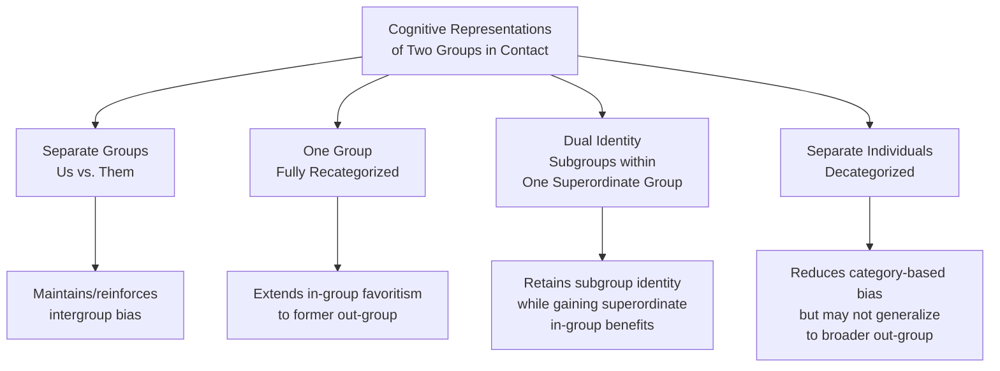

## Common Ingroup Identity Model

### Overview

The Common In-group Identity Model (CIIM), developed by Samuel Gaertner and John Dovidio, proposes that intergroup bias can be reduced by inducing members of different groups to psychologically recategorize themselves from two separate groups ("us" and "them") into a single, more inclusive superordinate group ("we"). Rather than eliminating group identity altogether, the model works by redrawing the boundary of the in-group to encompass former out-group members, thereby extending well-documented in-group favoritism to include them.

### Theoretical Foundation

**Key Points**

- The CIIM builds directly on Social Identity Theory and the minimal group paradigm's core finding that mere categorization into an in-group produces favoritism toward that group; the model's innovation is to strategically leverage this same categorization process for prejudice reduction rather than treating it only as a source of bias.
- The model proposes a specific cognitive representation shift: from a "two groups" representation (separate categories, e.g., "our department" and "their department") to a "one group" representation (a single, more inclusive category, e.g., "our organization").
- This recategorization is theorized to transform members of the former out-group into members of the newly defined in-group, extending to them the same favorable in-group biases (positive evaluation, trust, cooperation, helping behavior) previously reserved for the original, narrower in-group.

### The Four Cognitive Representations of Group Relations

Gaertner and Dovidio's broader framework identifies four possible ways perceivers can cognitively represent two distinct groups in contact:

**Key Points**

1. **Separate groups (two-group representation)**: the default, most divisive representation, in which "us" and "them" remain psychologically distinct, maintaining or reinforcing intergroup bias.
2. **One group (fully recategorized/common in-group representation)**: the two groups are merged into a single, superordinate social identity, maximizing extension of in-group favoritism to all members.
3. **Two subgroups within one group (dual identity)**: individuals maintain their original subgroup identities while simultaneously recognizing membership in an overarching superordinate group (e.g., "we are Rattlers and Eagles, but we are also all campers"), theorized in some contexts to be more practical and durable than full recategorization, particularly when subgroup identities are strongly valued and difficult or undesirable to relinquish.
4. **Separate individuals (decategorization)**: group categories are minimized altogether, and individuals are perceived primarily in terms of their unique, personal characteristics rather than any group membership.

### The Dual Identity Model as a Practical Refinement

**Key Points**

- Full recategorization (a pure "one group" representation) can be difficult to achieve and, in some cases, undesirable in practice, since it may require individuals to relinquish valued subgroup identities (e.g., ethnic, national, or organizational identities central to a person's self-concept).
- The **dual identity** representation — in which subgroup identities are maintained alongside a shared superordinate identity — is often proposed as a more practically achievable and psychologically sustainable alternative, particularly for groups with strong, valued distinct identities (e.g., ethnic minority group members who value their ethnic identity while also identifying with an overarching national or organizational identity).
- Research has found that dual identity representations can produce prejudice-reduction benefits comparable to, and in some contexts more durable than, full recategorization, particularly because they do not require the potentially threatening relinquishment of a valued group identity.

### Empirical Support

**Key Points**

- Laboratory studies using the minimal group paradigm framework have demonstrated that experimentally inducing participants to perceive two artificially created groups as members of a single combined group reduces in-group bias and increases positive evaluation of former out-group members.
- Field studies in real-world intergroup contexts — including corporate mergers, school integration and multi-ethnic classroom settings, sports teams, and blended work teams — have found that the degree to which employees or students perceive a shared, common identity (rather than maintaining separate subgroup identities) is associated with reduced intergroup bias, increased cooperation, and improved intergroup attitudes.
- Studies of racially/ethnically diverse work groups and multi-ethnic school settings have found that fostering a common in-group identity (e.g., a shared team, school, or organizational identity) is associated with more positive intergroup attitudes and reduced prejudice-related conflict, consistent with the model's predictions across applied settings.

### Relationship to Allport's Contact Theory and Realistic Conflict Theory

**Key Points**

- The CIIM is often presented as a specific psychological mechanism that helps explain *why* Allport's optimal contact conditions (particularly common goals and intergroup cooperation) succeed in reducing prejudice: cooperative, common-goal-oriented contact is theorized to facilitate the cognitive shift toward a common in-group representation.
- It also directly extends Sherif's Realistic Conflict Theory finding that superordinate goals reduce intergroup hostility (as demonstrated in the Robbers Cave experiment's final phase) by specifying the underlying social-cognitive mechanism: cooperative pursuit of superordinate goals is theorized to promote a shared, superordinate group identity, which in turn extends in-group-favoring psychological processes to former out-group members.
- The jigsaw classroom technique is frequently cited as an applied intervention that likely operates, in part, through the common in-group identity mechanism, since successful jigsaw groups often come to perceive themselves as a single cohesive team.

### Factors That Facilitate Recategorization

**Key Points**

- **Interdependence and cooperation**: as in Realistic Conflict Theory, cooperative interdependence toward shared goals facilitates the perceptual shift toward a common identity.
- **Equal status contact**: consistent with Allport's conditions, equal-status interactions are more conducive to successful recategorization than interactions that reinforce status differences between the original groups.
- **Similarity and shared fate**: perceived similarity between groups, and a sense of shared fate or shared outcomes, facilitate the perception of belonging to a single overarching category.
- **Cross-cutting categorizations**: situations that highlight alternative, cross-cutting group memberships (e.g., emphasizing a shared professional identity, shared team membership, or shared nationality that cuts across the original divisive category) can facilitate recategorization by providing an alternative, inclusive category around which to reorganize identity.

### Applications

**Key Points**

- **Organizational mergers and acquisitions**: applied to help employees from merging companies develop a shared organizational identity rather than maintaining rigid loyalty to their pre-merger company identities, which research has linked to smoother merger integration and reduced intergroup friction.
- **School and educational settings**: informs strategies for fostering inclusive school-wide or classroom-wide identities in ethnically and racially diverse student populations, working alongside contact-based interventions like the jigsaw classroom.
- **Post-conflict reconciliation**: applied in some peacebuilding and reconciliation program designs that seek to foster shared national, regional, or community identities among groups previously in conflict, often incorporating dual-identity framing to respect the continued importance of distinct ethnic or national identities.
- **Sports teams and group cohesion research**: used to explain how diverse team members come to prioritize team-level cooperation and cohesion over pre-existing subgroup divisions.

### Critiques and Limitations

**Key Points**

- Critics note that pursuing a common in-group identity, if implemented in ways that minimize or dismiss valued subgroup identities (particularly for historically marginalized or minority groups), risks provoking identity threat and resistance rather than reducing bias — a concern that has motivated the shift toward the dual identity model as a generally preferred alternative in many applied contexts.
- Some research suggests that recategorization effects may not always generalize to out-groups beyond the specific superordinate category created (e.g., uniting two rival school groups into "one school" may not reduce bias toward students from an entirely different school), limiting the model's scope to the specific groups included within the newly defined superordinate boundary.
- As with related contact-based interventions, achieving genuine cooperative interdependence and equal status in real-world applied settings (mergers, schools, post-conflict societies) that carry significant pre-existing power asymmetries or historical grievances can be considerably more difficult than in controlled laboratory demonstrations, and applied outcomes may vary accordingly. [Inference] Because most robust demonstrations of the effect come from experimental minimal-group studies and specific applied field studies rather than large-scale, long-term real-world tracking, claims about the model's effectiveness at durably transforming deeply entrenched, high-conflict intergroup relations should be treated with some caution regarding generalizability.

### Related Topics

- Social Identity Theory and Self-Categorization Theory
- Allport's intergroup contact theory and optimal conditions
- Realistic Conflict Theory and superordinate goals
- The jigsaw classroom
- Dual identity models in diversity and inclusion research
- Cross-cutting categorization and social identity complexity