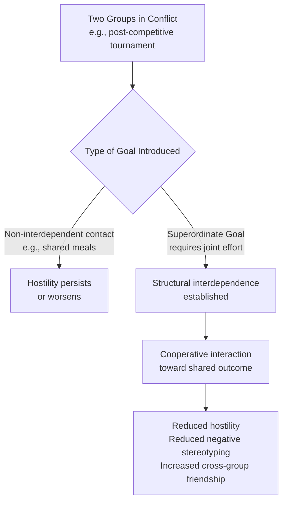

## Superordinate Goals

### Overview

Superordinate goals are objectives that two or more groups both desire but that neither group can achieve independently — success requires the groups to cooperate, pooling effort and resources toward a shared outcome. The concept was central to Muzafer Sherif's Realistic Conflict Theory and was identified, through the Robbers Cave experiment, as the key mechanism for reducing intergroup hostility that had been previously generated through competition.

### Core Premise

**Key Points**

- A goal qualifies as "superordinate" specifically because it exceeds the capacity or interest of any single group to achieve alone, structurally requiring intergroup cooperation rather than merely permitting it.
- Superordinate goals are distinguished from goals that groups merely happen to share but could pursue independently (parallel, non-interdependent goals do not carry the same conflict-reduction power, since they do not require actual cooperative interaction).
- The defining feature is **structural interdependence**: the groups' fates become linked, such that one group's success in achieving the goal is inherently tied to the other group's cooperative contribution.

### Origins: The Robbers Cave Experiment

**Key Points**

- In Sherif's Robbers Cave study, after a competitive tournament phase had generated substantial hostility between the "Rattlers" and "Eagles" groups, researchers introduced a series of staged crises that neither group could resolve alone:
  - A disruption to the camp's water supply, requiring boys from both groups to search jointly for the problem.
  - A stalled truck bringing food to camp, requiring boys from both groups to combine their strength to pull it (using the same rope previously used in a competitive tug-of-war).
  - Insufficient funds for a desired movie, resolved only by both groups pooling their money.
- Mere non-competitive contact (shared meals, joint recreational activities) had previously failed to reduce hostility and had in some instances heightened it; only the introduction of goals requiring actual cooperative effort produced measurable reductions in intergroup hostility, negative stereotyping, and hostile behavior, alongside increased cross-group friendship formation.

### Theoretical Mechanisms

**Key Points**

- **Restructured interdependence**: superordinate goals transform the groups' relationship from a zero-sum, competitive structure (in which one group's gain is the other's loss) to a positive-sum, cooperative structure (in which both groups gain or lose together), directly reversing the goal-relations structure that Realistic Conflict Theory identifies as the root cause of intergroup hostility.
- **Recategorization potential**: successful cooperative pursuit of a superordinate goal can facilitate a shift toward a Common In-group Identity — group members may begin to perceive themselves as members of a single, unified team working toward the shared objective, rather than as members of two competing groups.
- **Increased contact quality**: superordinate goals often naturally satisfy several of Allport's optimal conditions for effective intergroup contact simultaneously — particularly common goals and intergroup cooperation — helping explain why this specific form of contact proved more effective than mere non-competitive proximity in the Robbers Cave study.
- **Reduced attribution of blame**: shared responsibility for and shared benefit from a joint outcome can reduce the tendency to attribute negative events or setbacks to the out-group specifically, since success and failure become mutually shared.

### Distinguishing Superordinate Goals from Simple Cooperation

**Key Points**

- Not all cooperative activity carries the same conflict-reduction power; the theoretical emphasis is specifically on goals that are **compelling** (genuinely desired by both groups), **urgent or significant** (not trivial), and **only achievable through joint effort** (structurally requiring interdependence, not merely inviting it).
- Superficial or low-stakes cooperative tasks that do not genuinely require mutual effort, or that do not represent goals both groups authentically value, are less likely to reliably reproduce the strong effects observed in more compelling superordinate-goal manipulations such as those used in the Robbers Cave study.
- [Inference] Because the original Robbers Cave crises were both urgent (affecting basic needs like food and water) and unambiguously unsolvable by either group alone, subsequent applications of the concept in less dramatic real-world settings (e.g., workplace projects) may require more deliberate design to replicate a comparably compelling sense of genuine, high-stakes interdependence.

### Applications

**Key Points**

- **The jigsaw classroom**: directly operationalizes the superordinate-goal principle by structuring academic tasks so that shared learning success requires cooperative interdependence among diverse students, each holding a piece of information the group's success depends on.
- **Organizational and workplace conflict resolution**: managers and organizational psychologists apply the superordinate-goals concept by designing cross-departmental or cross-team projects with shared objectives and shared accountability, specifically to reduce friction between historically competing or siloed groups.
- **International relations and diplomacy**: the concept has informed diplomatic and peacebuilding strategies that identify shared challenges transcending national or ethnic divisions (e.g., joint environmental initiatives, shared economic development projects, joint responses to public health crises) as potential vehicles for improving intergroup or international relations.
- **Community and civic interventions**: local community-building initiatives sometimes deliberately design joint projects (e.g., community gardens, joint disaster-response efforts) requiring cooperation between historically divided neighborhood or ethnic groups.
- **Sports and team-building programs**: team-building exercises in organizational and athletic contexts frequently draw on the superordinate-goals principle by creating shared challenges that require collaboration among individuals or subgroups that might otherwise compete or remain divided.

### Boundary Conditions and Limitations

**Key Points**

- **Single successful episodes may not produce lasting change**: the Robbers Cave findings involved a series of repeated cooperative episodes rather than a single cooperative event; researchers generally caution that isolated instances of cooperation toward a superordinate goal may produce weaker or less durable effects than sustained cooperative interdependence over time.
- **Failure to achieve the goal**: if cooperative efforts toward a superordinate goal fail, particularly if one group is blamed (rightly or wrongly) for the failure, this could plausibly worsen rather than improve intergroup relations; the Robbers Cave crises were each successfully resolved, and the effect of unsuccessful cooperative attempts is less thoroughly documented in the classic experimental literature. [Speculation] The precise effects of failed cooperative efforts toward a superordinate goal are less established empirically than the effects of successful cooperation, and outcomes may plausibly depend heavily on how failure is attributed.
- **Generalizability of a small, historical, single-context study**: as with other conclusions drawn from Robbers Cave, the original study's methodology (a small number of homogeneous, similarly aged boys in a specific engineered camp setting) means that direct generalization to more complex, larger-scale, and more deeply entrenched real-world intergroup conflicts (e.g., long-standing ethnic or national conflicts) should be made cautiously, even though the broader principle has received considerable subsequent support in varied applied contexts.
- **Pre-existing power asymmetries**: in real-world applications, ensuring genuinely equal-status cooperative interdependence (rather than a superordinate goal that inadvertently reinforces one group's dominance in defining or leading the effort) requires careful structural design, echoing broader challenges identified in intergroup contact theory literature.

### Related Topics

- Realistic Conflict Theory and the Robbers Cave experiment
- Allport's intergroup contact theory and optimal conditions
- Common In-group Identity Model
- The jigsaw classroom
- Conditions for effective intergroup contact
- Conflict resolution in organizational and international contexts