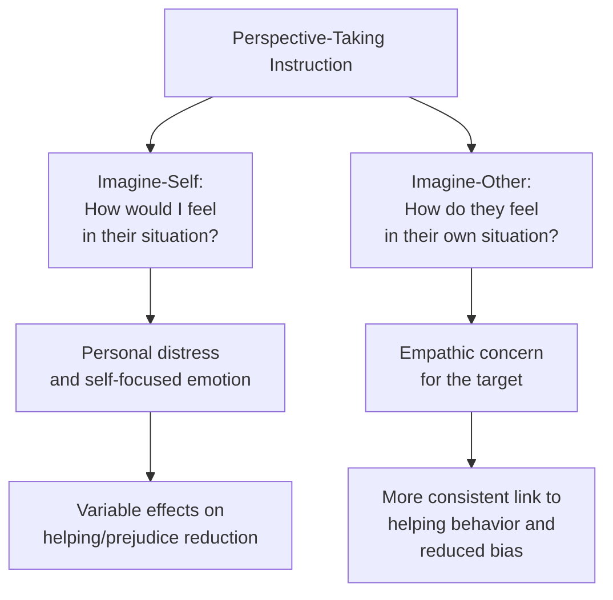

## Perspective-Taking and Empathy Interventions

### Overview

Perspective-taking and empathy interventions represent a class of prejudice-reduction strategies focused on cultivating cognitive and affective understanding of an out-group member's subjective experience. Rather than relying solely on structural changes to intergroup contact (as in Allport's contact theory), these interventions target the internal psychological processes — imagining another's viewpoint (perspective-taking) and sharing or resonating with another's emotional state (empathy) — theorized to reduce bias, stereotyping, and discrimination.

### Core Constructs

**Key Points**

- **Perspective-taking** refers to the cognitive process of imagining a situation from another person's point of view, including their thoughts, motivations, and circumstances — sometimes described as "putting oneself in another's shoes."
- **Empathy** is typically distinguished into two related but separable components:
  - **Cognitive empathy** (closely related to perspective-taking): understanding another's mental state, emotions, or viewpoint intellectually.
  - **Affective empathy** (empathic concern): sharing or vicariously experiencing another's emotional state, often accompanied by concern or compassion for their wellbeing.
- Batson and colleagues' influential empathy-altruism research distinguishes **imagine-self perspective-taking** (imagining how *you* would feel in the other person's situation) from **imagine-other perspective-taking** (imagining how the *other person* feels in their own situation), which have been found in various studies to produce somewhat different emotional and motivational consequences.

### Theoretical Mechanisms

**Key Points**

- **Reduced stereotyping through individuation**: perspective-taking directs attention to an out-group member's individual thoughts and circumstances, which is theorized to counteract category-based, stereotype-driven processing by promoting more individuated, personalized perception.
- **Self–other overlap**: some theoretical accounts (drawing on models of interpersonal closeness, such as the Inclusion of Other in the Self model) propose that perspective-taking increases the degree to which an out-group member's traits, experiences, and even identity become psychologically merged with the perceiver's own self-concept, extending self-related positive regard to the target.
- **Empathic concern and motivation to help**: Batson's empathy-altruism hypothesis proposes that empathic concern for a target (particularly via imagine-other perspective-taking) can generate genuinely altruistic motivation to improve that person's (and by extension, their group's) welfare, rather than motivation driven solely by self-interest or reputational concern.
- **Reduced dehumanization**: perspective-taking has been theorized and found in some studies to counteract dehumanizing perceptions by highlighting an out-group member's rich inner emotional and mental life — directly countering the mechanisms (denial of human nature/uniquely human traits) identified in dehumanization research.

### Empirical Findings

**Key Points**

- Perspective-taking interventions have been shown across numerous studies to reduce stereotype accessibility and application, reduce automatic/implicit bias in some paradigms, increase helping behavior directed at out-group members, and improve evaluations of out-group members generally.
- Galinsky and Moskowitz's foundational studies found that instructing participants to take the perspective of an elderly or Black target (compared to control conditions) reduced both stereotype activation and stereotype application in subsequent judgment tasks.
- Batson and colleagues' research on empathy-induction found that inducing empathy for a single stigmatized individual (e.g., a person with a stigmatized illness, or a convicted offender) could improve not only attitudes toward that specific individual but also generalize to more positive attitudes toward the individual's broader group.
- [Unverified: the degree to which single-session perspective-taking or empathy inductions produce durable, long-term changes in attitudes and behavior — as opposed to short-term shifts measured immediately post-intervention — remains a subject of ongoing research, with some studies finding effects that diminish over time.]

### Contrasting Findings and Boundary Conditions

**Key Points**

- Not all perspective-taking research finds uniformly positive effects: some studies have found that perspective-taking can, under certain conditions, increase perceived threat or paradoxically reinforce stereotypic expectations if the imagined perspective aligns with negative stereotype content, suggesting the technique's effects are not universally and unconditionally positive.
- Imagine-self perspective-taking has, in some studies, been found to increase personal distress (a self-focused, aversive emotional reaction to another's suffering) rather than pure empathic concern, which can in some circumstances motivate avoidance of the distressing situation rather than genuine engagement or helping — a less consistently beneficial outcome than imagine-other framing in several studies.
- Effectiveness may depend on the perceiver's motivation and the perceived voluntariness of the exercise: perspective-taking imposed in ways that feel coercive or that trigger reactance (particularly among people who feel unfairly accused of bias) may be less effective or could backfire, an important practical consideration for real-world application in mandatory training contexts.
- **Perspective-giving** (having the stigmatized/target group member share their perspective directly, rather than having the perceiver imagine it unprompted) has been proposed and studied as a related but distinct approach, with some evidence suggesting direct narrative sharing from the target's own voice can be particularly effective, though this remains an active area of comparative research relative to perceiver-generated perspective-taking.

### Related Approaches: Extended and Imagined Contact

**Key Points**

- Perspective-taking and empathy interventions are conceptually related to, and sometimes combined with, extended contact (learning about an in-group member's positive relationship with an out-group member) and imagined contact (mentally simulating positive intergroup interaction) interventions, since all three approaches leverage internal cognitive/imaginative processes rather than requiring actual, structured face-to-face contact.
- Perspective-taking is frequently incorporated as a component within broader imagined-contact scenarios, where participants are asked not only to imagine an interaction but specifically to imagine it from the out-group member's point of view.

### Applications

**Key Points**

- **Diversity and inclusion training**: widely incorporated into organizational diversity training programs, often through structured exercises, narrative sharing, or role-play designed to elicit perspective-taking regarding colleagues' experiences of bias or exclusion.
- **Healthcare provider training**: used in medical and clinical training to increase provider empathy and perspective-taking toward patients from different cultural, racial, or socioeconomic backgrounds, with the goal of reducing healthcare disparities linked to implicit bias and reduced patient-centered communication.
- **Restorative justice and conflict mediation**: perspective-taking exercises are commonly incorporated into restorative justice practices and conflict mediation programs, encouraging parties in conflict to understand and articulate the other party's viewpoint and emotional experience.
- **Media and narrative-based interventions**: films, books, and narrative-based educational content that immerse audiences in an out-group character's perspective (sometimes referred to as "narrative transportation") have been studied as a scalable delivery mechanism for perspective-taking-based attitude change.

### Critiques and Limitations

**Key Points**

- As with many single-session social-psychological interventions, effect sizes for perspective-taking manipulations vary across studies, and some published findings have faced replication scrutiny consistent with broader replication debates within social psychology; researchers generally recommend caution against assuming any single perspective-taking exercise will produce large, durable, real-world behavioral change.
- Distinguishing genuine empathic concern from more superficial or performative perspective-taking (e.g., in mandatory workplace training contexts) is difficult to assess empirically, and the depth or sincerity of the perspective-taking exercise may moderate its effectiveness in ways not fully captured by brief laboratory manipulations.
- Some critics caution that an overreliance on perspective-taking-based interventions, without complementary structural or institutional changes (e.g., policy reform, equitable resource allocation), risks placing the burden of prejudice reduction primarily on individual-level cognitive/emotional exercises rather than addressing systemic and institutional sources of discrimination. [Inference] This critique reflects a broader, ongoing methodological and policy debate about the relative role of individual-attitude-focused interventions versus structural/institutional interventions in producing durable reductions in discrimination, rather than a settled empirical conclusion about perspective-taking's inherent value.

### Related Topics

- Allport's intergroup contact theory and optimal conditions
- Imagined and extended contact hypotheses
- Dehumanization and its reduction
- Batson's empathy-altruism hypothesis
- Implicit bias and its measurement
- Diversity, equity, and inclusion (DEI) intervention research
- Narrative transportation and media-based attitude change