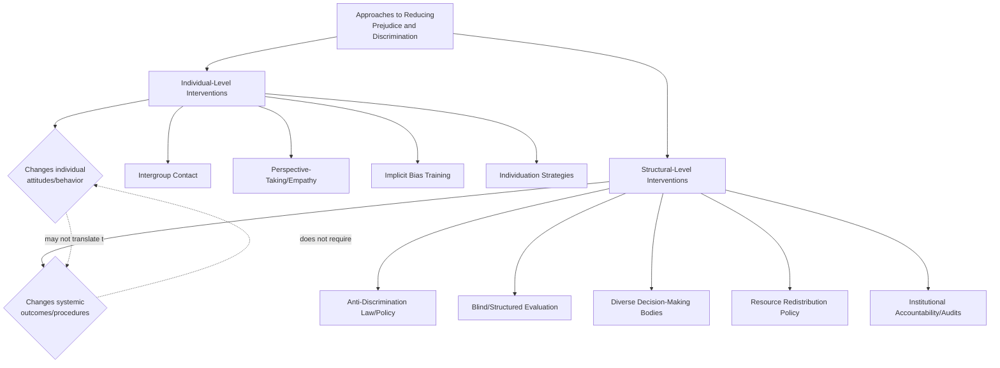

## Structural Versus Individual-Level Interventions

### Overview

Approaches to reducing prejudice, stereotyping, and discrimination can be broadly categorized into two levels of analysis: **individual-level interventions**, which target the attitudes, beliefs, or behaviors of individual people, and **structural-level interventions**, which target the policies, institutions, incentive structures, and systemic arrangements that produce or perpetuate unequal outcomes. This distinction is central to contemporary debates about which approaches are most effective for producing durable, large-scale reductions in discrimination.

### Individual-Level Interventions

**Key Points**

- Focus on changing what happens inside a person's mind or in a single interpersonal interaction: attitudes, stereotypes, implicit associations, empathy, and behavior toward specific individuals.
- Representative approaches include:
  - **Intergroup contact** (Allport's contact theory and its refinements): structuring positive, cooperative interactions between individuals from different groups.
  - **Perspective-taking and empathy interventions**: exercises designed to increase understanding of, and empathic concern for, out-group members.
  - **Implicit bias training**: workshops and exercises aimed at increasing awareness of automatic biases and providing strategies to counteract them.
  - **Individuation strategies**: providing specific, personalizing information about out-group members to counteract category-based stereotyping.
  - **Self-affirmation and stereotype threat interventions**: brief psychological interventions aimed at buffering individuals from the performance-impairing effects of stereotype threat.
- Strengths: often relatively low-cost, scalable to individual workshops or classroom settings, directly measurable via pre/post attitude or behavior change, and grounded in a substantial experimental literature (contact theory, perspective-taking research).
- Limitations: individual-level attitude change does not automatically translate into changes in institutional policies, resource allocation, or systemic outcomes; effects from brief interventions (e.g., single-session implicit bias trainings) are often modest and may not durably persist over time.

### Structural-Level Interventions

**Key Points**

- Focus on changing the policies, procedures, institutional incentives, and resource-allocation structures that produce or perpetuate discriminatory outcomes, independent of whether any individual within the system holds conscious prejudicial attitudes.
- Representative approaches include:
  - **Anti-discrimination law and policy**: legal frameworks prohibiting discriminatory treatment in employment, housing, education, and other domains.
  - **Blind or structured evaluation procedures**: removing or obscuring group-identifying information from resumes, applications, or performance evaluations, or using standardized, structured evaluation criteria to reduce the influence of individual discretion and bias (directly informed by aversive racism theory's finding that bias concentrates in ambiguous, discretion-heavy decisions).
  - **Diversity in decision-making bodies**: increasing representation of historically underrepresented groups in hiring committees, leadership positions, or other decision-making structures.
  - **Resource redistribution and affirmative action policy**: policies aimed at addressing historical or ongoing structural disadvantage through targeted resource allocation, admissions, or hiring practices.
  - **Institutional accountability mechanisms**: audits, transparency requirements, and outcome tracking (e.g., pay equity audits, disparate impact analysis) designed to identify and correct systemic disparities regardless of individual intent.
- Strengths: can address discrimination that occurs through institutional mechanisms even absent any individual's conscious prejudice (a key insight from aversive racism and modern prejudice research); potentially larger-scale and more durable impact since changes are embedded in ongoing procedures rather than dependent on sustained individual attitude change.
- Limitations: structural change is often politically and organizationally more difficult and slower to implement than individual-level training; can generate backlash or resistance; effectiveness depends heavily on implementation fidelity and ongoing enforcement/accountability.

### Why the Distinction Matters: Discrimination Without Individual Prejudice

**Key Points**

- A central finding motivating attention to structural interventions is that discriminatory outcomes can occur through institutional processes even when no individual decision-maker holds consciously endorsed prejudicial attitudes (e.g., biased historical data feeding into seemingly neutral algorithmic hiring tools, or informal, discretion-heavy promotion processes that produce disparate outcomes without any single evaluator's overt bias).
- This finding, closely linked to aversive racism theory and modern prejudice research, implies that interventions targeting only individual attitudes may be insufficient to address discrimination that is embedded in institutional structure and procedure rather than in any specific person's conscious beliefs.
- Conversely, structural interventions alone (e.g., a non-discrimination policy) do not necessarily change the underlying attitudes, implicit associations, or interpersonal behaviors of individuals within the institution, meaning subtler, interpersonal forms of bias (e.g., microaggressions, exclusionary informal social dynamics) may persist even when formal, structural discrimination is reduced.

### Complementary Rather Than Competing Approaches

**Key Points**

- Contemporary reviews generally treat individual- and structural-level interventions as complementary and often mutually reinforcing, rather than as competing alternatives — a comprehensive discrimination-reduction strategy typically incorporates both.
- Example of complementarity: an organization might combine structured, blind resume screening (structural) with an intergroup contact-based team-building initiative (individual) and mandatory diversity-related decision-making accountability audits (structural) with perspective-taking training for managers (individual).
- Structural changes can also indirectly support individual-level attitude change over time: sustained institutional diversity (achieved through structural policy) can itself function as an intergroup contact opportunity, potentially producing individual-level attitude change as a downstream consequence of structural policy.

### Evaluating Effectiveness: Methodological Considerations

**Key Points**

- Individual-level interventions (e.g., contact-based programs, perspective-taking exercises) are more readily studied using randomized experimental designs with pre/post attitude measurement, providing relatively strong internal validity for demonstrating short-term individual-level effects.
- Structural interventions are more often evaluated using quasi-experimental, longitudinal, or policy-analysis methods (e.g., comparing outcomes before and after a policy change, or comparing outcomes across organizations with different structural practices), which can provide valuable evidence of real-world, large-scale impact but typically involve greater causal ambiguity than tightly controlled laboratory experiments.
- [Inference] Because these two intervention types are typically evaluated using different methodological approaches (controlled experiments vs. policy/organizational analysis), direct head-to-head comparisons of relative effectiveness are less common in the literature than within-category comparisons, making it difficult to draw simple, universally applicable conclusions about which approach is "more effective" in an absolute sense; effectiveness likely depends heavily on the specific outcome measured, the timescale considered, and the context of implementation.

### Debates and Critiques

**Key Points**

- Critics of individual-focused interventions (e.g., some diversity training programs) argue that without accompanying structural change, such programs risk providing symbolic, feel-good activity that does not durably alter organizational outcomes, and some empirical evaluations of mandatory diversity trainings have found limited or inconsistent long-term behavioral effects.
- Critics of purely structural approaches note that policy and procedural changes can face implementation challenges, enforcement gaps, and unintended consequences (e.g., new procedures may be inconsistently applied, or backlash effects may emerge if structural changes are perceived as illegitimate or unfairly imposed), and that persistent interpersonal bias can undermine the intended benefits of structural reform if not also addressed.
- The relative political feasibility of structural versus individual interventions also differs across contexts: structural interventions such as policy reform or affirmative action often generate more significant political and legal contestation than individual-level educational or training interventions, which can affect which approaches organizations and policymakers are willing or able to pursue in a given context. [Unverified: the relative political feasibility and associated debate vary substantially by jurisdiction, time period, and specific policy under consideration, and should be understood as a live and evolving area of policy and legal discussion rather than a fixed, settled matter.]

### Related Topics

- Aversive racism and modern/symbolic prejudice
- Allport's intergroup contact theory and optimal conditions
- Perspective-taking and empathy interventions
- Correspondence/audit studies of institutional discrimination
- Distinguishing prejudice, stereotypes, and discrimination
- Diversity, equity, and inclusion (DEI) intervention research
- Common In-group Identity Model