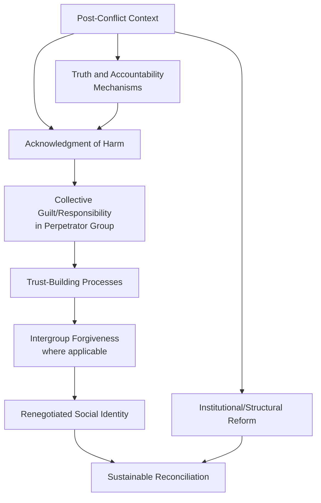

## Post-Conflict Reconciliation Processes

### Overview

Post-conflict reconciliation refers to the range of psychological, social, and institutional processes aimed at rebuilding trust, reducing hostility, and re-establishing constructive relationships between groups following periods of significant intergroup conflict, violence, or mass atrocity (e.g., civil war, genocide, ethnic cleansing, apartheid). Social psychological research on reconciliation draws on and extends many of the intergroup relations theories developed in less extreme contexts (contact theory, superordinate goals, common in-group identity) while addressing challenges unique to severe, historically embedded conflict.

### Core Premise

**Key Points**

- Reconciliation is generally distinguished from mere conflict cessation (e.g., a ceasefire or peace agreement) — it involves a deeper psychological and social transformation in how former adversary groups perceive, feel about, and relate to one another, typically requiring sustained processes rather than a single event.
- Post-conflict contexts present distinct psychological challenges not always present in more ordinary intergroup relations research, including: collective trauma, grief, and loss; entrenched narratives of victimhood and perpetration (sometimes held by both sides simultaneously); significant power asymmetries between groups; and the practical and psychological challenge of physical proximity between former perpetrators and victims (or their descendants) in shared post-conflict societies.
- Reconciliation processes typically operate at multiple, interacting levels: individual psychological healing, interpersonal relationship repair, and societal/institutional transformation (e.g., truth commissions, legal accountability mechanisms, educational curriculum reform).

### Key Psychological Components of Reconciliation

**Key Points**

- **Acknowledgment**: recognition by the perpetrator group (or its representatives) of wrongdoing, harm caused, and the victim group's suffering — theorized as a foundational component without which trust-building is difficult to initiate.
- **Forgiveness**: a psychological process (distinct from reconciliation itself) in which victims or victim groups release resentment and desire for retribution toward the perpetrator group; research distinguishes interpersonal forgiveness from intergroup forgiveness, noting that intergroup forgiveness involves additional collective and identity-related complexities beyond individual forgiveness processes.
- **Trust-building**: given that conflict typically generates deep intergroup distrust, reconciliation processes aim to gradually rebuild a belief that the other group can be relied upon not to repeat harmful behavior; this is often described as a slow, incremental process vulnerable to setbacks from any renewed incidents of violence or hostility.
- **Collective guilt and responsibility**: research has examined the conditions under which members of a perpetrator group experience collective guilt (linked to acknowledgment of in-group wrongdoing) as opposed to defensive responses (denial, minimization, or moral disengagement) that can impede reconciliation.
- **Renegotiated social identity**: successful reconciliation often requires some redefinition of group identities and their relationship to one another (potentially drawing on Common In-group Identity Model principles), moving away from identities primarily defined in opposition to the other group.

### Truth and Reconciliation Commissions

**Key Points**

- Institutional mechanisms such as truth and reconciliation commissions (e.g., South Africa's Truth and Reconciliation Commission following apartheid) represent formalized, society-level approaches to reconciliation, typically involving public testimony from victims, acknowledgment (and in some models, amnesty) processes for perpetrators, and official documentation of historical wrongdoing.
- Social psychological research on such commissions has examined their effects on collective memory, intergroup attitudes, and psychological wellbeing among both victim and perpetrator group members, with findings generally suggesting mixed and context-dependent effects rather than uniformly positive outcomes across all measured psychological indicators. [Unverified: the specific psychological benefits and limitations of truth commissions vary considerably across different studies, countries, and outcome measures, and this remains an active area of interdisciplinary research spanning psychology, political science, and transitional justice studies.]
- Such commissions illustrate the broader point that reconciliation processes often operate simultaneously at the societal/institutional level (formal truth-seeking and accountability mechanisms) and the individual/interpersonal level (personal psychological processes of acknowledgment, grief processing, and attitude change among ordinary citizens).

### Applying Intergroup Contact and Related Theories

**Key Points**

- **Contact theory in post-conflict settings**: Allport's optimal conditions (equal status, common goals, cooperation, institutional support) remain theoretically relevant but are often considerably harder to establish in post-conflict contexts due to entrenched power asymmetries, ongoing segregation, and residual distrust or fear; researchers have proposed that additional conditions (e.g., explicit acknowledgment of historical harm, structured facilitation, psychological safety) may be necessary prerequisites for productive contact in these more severe contexts.
- **Superordinate goals**: shared post-conflict challenges (e.g., joint economic development, shared public health needs, environmental cooperation) have been proposed and, in some cases, implemented as vehicles for fostering cooperative interdependence between former adversary groups, drawing directly on Sherif's Realistic Conflict Theory findings.
- **Common in-group identity**: some reconciliation initiatives attempt to foster shared civic, national, or regional identities that transcend the conflict-defining group boundaries, though — as in the broader Common In-group Identity Model literature — this approach requires care to avoid dismissing or minimizing group identities that remain deeply important to affected populations, particularly for historically victimized groups.
- **Narrative and perspective-taking interventions**: programs incorporating structured storytelling, joint historical narrative development, and perspective-taking exercises between former adversary group members have been studied as tools for humanizing the out-group and countering dehumanization that frequently develops during violent conflict.

### Addressing Dehumanization and Moral Disengagement

**Key Points**

- Given that severe intergroup violence is frequently preceded and accompanied by dehumanization of the target group (as documented in genocide studies and moral disengagement research), reconciliation processes often explicitly target the reversal of dehumanizing beliefs through individuation, humanizing narrative-sharing, and structured contact.
- Reconciliation initiatives frequently incorporate elements aimed at countering moral disengagement mechanisms (Bandura) — such as encouraging acknowledgment of victim suffering (counteracting minimization) and personal/collective responsibility-taking (counteracting diffusion of responsibility) — as psychological prerequisites for genuine attitude and behavior change.

### Challenges Specific to Severe Conflict Contexts

**Key Points**

- **Trauma and grief**: unlike ordinary prejudice-reduction contexts, post-conflict reconciliation must contend with clinically significant trauma experienced by substantial portions of the affected population, which can complicate both psychological readiness for reconciliation processes and the design of appropriate interventions. [This overview addresses reconciliation processes at a general/institutional level and does not provide individual trauma treatment guidance.]
- **Competing victimhood narratives**: in many protracted conflicts, both groups hold sincere and often historically grounded beliefs that they are (or have primarily been) victims rather than perpetrators, complicating acknowledgment and trust-building processes that presuppose a clearer victim/perpetrator distinction.
- **Intergenerational transmission**: research has examined how conflict-related attitudes, narratives, and trauma can be transmitted across generations, meaning reconciliation processes often must address not only those who directly experienced the conflict but subsequent generations who inherit conflict-related identities and narratives.
- **Political and structural obstacles**: genuine reconciliation is often constrained by ongoing political contestation, unequal power distribution, incomplete implementation of peace agreements, and, in some cases, political incentives for leaders to maintain rather than reduce intergroup division.

### Applications and Case Contexts

**Key Points**

- Social psychological reconciliation research has been applied and studied in numerous post-conflict contexts, including but not limited to post-apartheid South Africa, post-genocide Rwanda, the Northern Ireland peace process, post-conflict Balkan states, and various other regions that have experienced significant ethnic, religious, or political violence.
- Reconciliation-focused interventions have included structured intergroup dialogue programs, joint economic development initiatives, educational curriculum reform (addressing how conflict history is taught to subsequent generations), and community-based reconciliation programs incorporating storytelling, joint commemoration, and cooperative community projects.

### Critiques and Limitations

**Key Points**

- Critics note that psychological research on reconciliation, while valuable, cannot address reconciliation in isolation from the broader political, economic, legal, and historical context of a given conflict, and most researchers explicitly frame psychological interventions as necessary but not sufficient components of a comprehensive reconciliation process.
- The generalizability of specific reconciliation intervention findings across vastly different conflict contexts (differing in severity, duration, cultural context, and political resolution) is limited, and most researchers caution against assuming a single intervention model will transfer effectively across all post-conflict settings.
- As with structural versus individual-level intervention debates more broadly, some scholars caution that individual-level or interpersonal reconciliation initiatives, absent accompanying structural and institutional reform (transitional justice mechanisms, equitable resource distribution, political power-sharing), may produce limited or superficial change without addressing underlying structural drivers of conflict.

### Related Topics

- Allport's intergroup contact theory and its extension to severe conflict contexts
- Realistic Conflict Theory and superordinate goals
- Dehumanization and moral disengagement theory
- Common In-group Identity Model
- Structural versus individual-level interventions
- Collective guilt and intergroup emotions research
- Truth and reconciliation commissions (transitional justice studies)