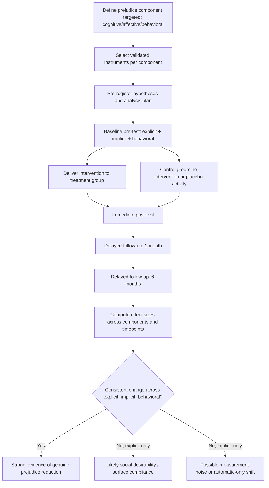

## Measuring Prejudice-Reduction Outcomes

### Overview

Measuring prejudice-reduction outcomes concerns the methods, instruments, and design choices used to determine whether an intervention (intergroup contact, perspective-taking exercises, diversity training, media-based interventions, etc.) actually reduced prejudice, and whether that reduction is real, durable, and behaviorally meaningful. This is a methodological subfield within intergroup relations research, distinct from the interventions themselves — it asks: *how do we know it worked?*

The core challenge is that prejudice is a multi-component construct (cognitive, affective, behavioral) that can be measured explicitly or implicitly, and each measurement approach carries distinct validity threats, especially social desirability bias and demand characteristics.

### Why Measurement Is Difficult

**Key Points**

- Prejudice reduction is rarely a single observable event; it must be inferred from proxy measures
- Self-report measures of prejudice are highly susceptible to social desirability bias — participants often know what "correct" answer is expected, especially post-intervention
- Effects observed immediately after an intervention frequently decay over time ("attitude rebound" or reversion to baseline)
- Attitudes (what people say/feel) often diverge from behavior (what people do), producing an attitude-behavior gap
- Publication bias in this literature has historically favored large, immediate effects, inflating perceived intervention efficacy

### The Three-Component Framework of Prejudice

Measurement strategy typically maps onto which component of prejudice is targeted:

| Component | Definition | Example Measure |
| --- | --- | --- |
| Cognitive | Stereotypic beliefs about a group | Trait-rating scales, stereotype endorsement checklists |
| Affective | Emotional reactions (dislike, anxiety, disgust) toward a group | Feeling thermometers, Intergroup Anxiety Scale |
| Behavioral | Discriminatory or approach/avoidance actions | Behavioral approach tasks, resource allocation games |

An intervention may successfully shift one component (e.g., reduce explicit stereotyping) while leaving another untouched (e.g., implicit affective bias), which is why comprehensive evaluation designs measure multiple components simultaneously.

### Explicit Measures

Explicit measures rely on deliberate, self-reported attitudes. Participants consciously report their beliefs or feelings.

**Common Instruments**

- **Feeling Thermometer**: single-item 0–100 scale rating warmth toward a group; simple, widely used, but coarse
- **Modern Racism Scale (McConahey)** and **Symbolic Racism Scale**: designed to capture subtler, socially-acceptable-sounding forms of prejudice (e.g., "Discrimination against [group] is no longer a problem")
- **Social Distance Scale (Bogardus)**: measures willingness to engage in progressively intimate contact (living in same country → same neighborhood → marrying into the group)
- **Intergroup Anxiety Scale (Stephan & Stephan)**: measures anticipated discomfort in intergroup interaction
- **Semantic Differential Scales**: bipolar adjective pairs (e.g., "trustworthy–untrustworthy") rated for a target group

**Example**

A pre/post diversity training study might administer the Modern Racism Scale before and after the workshop, along with a two-month follow-up, to assess both magnitude and durability of change.

**Limitations**

- Vulnerable to social desirability and self-presentation motives, especially in workplace or evaluated settings
- Ceiling/floor effects: participants already scoring low on prejudice pre-test leave little room for measurable improvement
- Demand characteristics: participants infer the "expected" post-test answer if pre/post design is transparent

### Implicit Measures

Implicit measures attempt to bypass conscious control by inferring bias from response latency, automatic associations, or physiological reactions.

**Common Instruments**

- **Implicit Association Test (IAT)**: measures reaction-time differences when pairing group concepts (e.g., Black/White faces) with valenced words (good/bad); faster pairing implies stronger automatic association
- **Affect Misattribution Procedure (AMP)**: primes participants with a group-related image, then asks them to judge an ambiguous Chinese pictograph as pleasant/unpleasant; misattributed affect reveals bias
- **Evaluative Priming Task**: measures speed of categorizing positive/negative words after subliminal or supraliminal group-related primes
- **Physiological measures**: facial electromyography (EMG), skin conductance response (SCR), and event-related potentials (ERPs, e.g., the P200/N200 components associated with rapid categorization) as autonomic indices of affective response

**Example**

A contact-based intervention study might pair a self-report thermometer with a race-IAT administered on the same laptop session, checking whether explicit warmth improved while implicit association scores remained unchanged — a common and theoretically important dissociation.

[Inference] The IAT's test-retest reliability (commonly cited around $r \approx 0.5$) is lower than most explicit self-report scales, which is a frequently cited psychometric limitation when using it as a sole outcome measure in intervention research.

**Limitations**

- Debate persists in the field regarding what the IAT actually measures — individual bias vs. cultural association knowledge
- Predictive validity for individual behavior is modest; meta-analyses (e.g., Oswald et al., 2013) found weaker IAT–behavior correlations than originally assumed
- Practice effects and method variance can produce artifactual pre-post "improvement" unrelated to the intervention

### Behavioral Measures

Behavioral measures assess actual intergroup conduct rather than internal states, addressing the attitude-behavior gap directly.

**Common Paradigms**

- **Resource allocation tasks**: e.g., Minimal Group Paradigm matrices (Tajfel), where participants allocate points/money between ingroup and outgroup members
- **Seating distance / physical proximity paradigms**: measuring how close a participant chooses to sit to an outgroup confederate
- **Helping behavior paradigms**: willingness to assist an outgroup member in a staged scenario (e.g., dropped materials, request for help)
- **Economic games**: Trust Game, Dictator Game, and Ultimatum Game adapted with outgroup vs. ingroup partners to quantify discriminatory allocation
- **Field-based audit studies**: correspondence/résumé audit studies sending matched applications differing only by group-signaling names, measuring callback-rate disparities as real-world discrimination outcomes

**Example**

An intervention testing perspective-taking might use a Dictator Game where participants allocate a fixed sum between themselves and an anonymous outgroup partner; increased allocation post-intervention serves as a behavioral (not just attitudinal) outcome.

**Limitations**

- Lower ecological validity for lab-based games versus real-world discrimination
- Single-shot behavioral measures may not generalize to habitual behavior
- Expensive and logistically complex relative to self-report surveys, limiting sample sizes

### Study Design Considerations

**Key Points**

- **Pre-registration**: specifying hypotheses, measures, and analysis plans before data collection reduces p-hacking and researcher degrees of freedom, a major concern following replication crises in this literature
- **Control groups**: necessary to rule out regression to the mean, maturation, and testing effects (e.g., no-contact or placebo-activity control conditions)
- **Longitudinal follow-up**: single post-test designs cannot distinguish durable change from short-term compliance; follow-ups at multiple intervals (e.g., immediate, 1-month, 6-month) test for decay
- **Multi-method measurement**: combining explicit, implicit, and behavioral measures triangulates whether change is superficial (self-presentation) or deep (automatic/behavioral)
- **Effect size reporting**: standardized mean difference ($d$) or correlation coefficients should accompany significance tests, since statistical significance alone does not indicate practical magnitude

$$d = \frac{M_1 - M_2}{SD_{pooled}}$$

- **Meta-analytic benchmarks**: Pettigrew & Tropp's (2006) meta-analysis of intergroup contact theory is a frequently cited benchmark showing a mean weighted correlation of approximately $r = -0.21$ between contact and prejudice, a common effect-size reference point for evaluating new intervention studies

### Common Methodological Pitfalls

**Key Points**

- **Demand characteristics inflate self-report change**: if participants can guess the study's purpose, socially desirable responding increases post-test scores independent of true attitude change
- **Single-item measures lack reliability**: relying on one feeling-thermometer item rather than a multi-item validated scale increases measurement error
- **Short follow-up windows overstate efficacy**: many published studies measure outcomes only minutes or hours after intervention, a limitation raised prominently in Paluck, Porat, Clark, and Green's (2021) meta-analysis of prejudice-reduction interventions, which found that studies with longer follow-up periods tended to report smaller effects than those measuring immediately post-intervention
- **Ceiling effects in student samples**: convenience samples (often university students, already low-prejudice and socially liberal) constrain how much improvement can be detected
- **Construct mismatch**: measuring a broad construct (general racial attitudes) when the intervention targeted a narrow one (attitudes toward a specific policy) — or vice versa — produces false negatives

### Diagram: Multi-Method Measurement Framework (svg_diagram)

<svg xmlns="http://www.w3.org/2000/svg" viewBox="0 0 760 460">
<text x="380" y="30" text-anchor="middle" font-size="18" font-weight="bold" fill="#1a1a1a">Prejudice-Reduction Measurement Framework (svg_diagram)</text>
<rect x="290" y="50" width="180" height="50" rx="8" fill="#e8eef7" stroke="#3b5b92" stroke-width="2" />
<text x="380" y="80" text-anchor="middle" font-size="14" fill="#1a1a1a">Intervention</text>
<line x1="380" y1="100" x2="380" y2="130" stroke="#555" stroke-width="2" marker-end="url(#arrow)" />
<rect x="60" y="140" width="180" height="60" rx="8" fill="#fdf2e3" stroke="#b5762a" stroke-width="2" />
<text x="150" y="165" text-anchor="middle" font-size="13" font-weight="bold" fill="#1a1a1a">Explicit</text>
<text x="150" y="182" text-anchor="middle" font-size="11" fill="#1a1a1a">Self-report scales</text>
<rect x="290" y="140" width="180" height="60" rx="8" fill="#e9f5ec" stroke="#2f7d46" stroke-width="2" />
<text x="380" y="165" text-anchor="middle" font-size="13" font-weight="bold" fill="#1a1a1a">Implicit</text>
<text x="380" y="182" text-anchor="middle" font-size="11" fill="#1a1a1a">IAT / AMP / physiological</text>
<rect x="520" y="140" width="180" height="60" rx="8" fill="#f3e9f7" stroke="#7a3b92" stroke-width="2" />
<text x="610" y="165" text-anchor="middle" font-size="13" font-weight="bold" fill="#1a1a1a">Behavioral</text>
<text x="610" y="182" text-anchor="middle" font-size="11" fill="#1a1a1a">Games / audits / proximity</text>
<line x1="150" y1="200" x2="150" y2="240" stroke="#555" stroke-width="2" marker-end="url(#arrow)" />
<line x1="380" y1="200" x2="380" y2="240" stroke="#555" stroke-width="2" marker-end="url(#arrow)" />
<line x1="610" y1="200" x2="610" y2="240" stroke="#555" stroke-width="2" marker-end="url(#arrow)" />
<rect x="230" y="250" width="300" height="50" rx="8" fill="#f7f7f7" stroke="#444" stroke-width="2" />
<text x="380" y="280" text-anchor="middle" font-size="13" fill="#1a1a1a">Triangulated Outcome Profile</text>
<line x1="380" y1="300" x2="380" y2="330" stroke="#555" stroke-width="2" marker-end="url(#arrow)" />
<rect x="150" y="340" width="180" height="60" rx="8" fill="#fdeaea" stroke="#a13333" stroke-width="2" />
<text x="240" y="365" text-anchor="middle" font-size="12" font-weight="bold" fill="#1a1a1a">Immediate Follow-up</text>
<text x="240" y="382" text-anchor="middle" font-size="10" fill="#1a1a1a">Detect initial shift</text>
<rect x="430" y="340" width="180" height="60" rx="8" fill="#fdeaea" stroke="#a13333" stroke-width="2" />
<text x="520" y="365" text-anchor="middle" font-size="12" font-weight="bold" fill="#1a1a1a">Delayed Follow-up</text>
<text x="520" y="382" text-anchor="middle" font-size="10" fill="#1a1a1a">Test durability / decay</text>
<line x1="330" y1="370" x2="430" y2="370" stroke="#555" stroke-width="2" stroke-dasharray="4,3" />
</svg>

### Process Flow: Designing a Measurement Protocol

### Applied Example: Evaluating a Contact-Based Intervention

**Output**

A researcher evaluating an intergroup contact program (e.g., structured cross-group roommate assignment) might construct the following measurement battery:

1. **Baseline (Week 0)**: Feeling thermometer, Intergroup Anxiety Scale, race-IAT, Dictator Game allocation
2. **Immediate post-test (Week 10, end of semester)**: same battery repeated
3. **Delayed follow-up (Month 8)**: same battery repeated, plus a naturalistic behavioral measure (e.g., voluntary attendance at a cross-group social event)
4. **Analysis**: mixed-effects model with time (pre/post/follow-up) and condition (treatment/control) as fixed effects, participant as random effect, examining component-specific interaction effects

This design allows the researcher to distinguish (a) whether change occurred at all, (b) which component(s) changed, and (c) whether change persisted — addressing the three most common threats to validity in this literature simultaneously.

### Related Topics / Next Steps

- Intergroup contact theory (Allport's conditions for optimal contact)
- Implicit Association Test: psychometric critiques and alternatives (e.g., Single-Category IAT, Brief IAT)
- Social desirability bias and the Bogus Pipeline technique
- Meta-analytic methods in social psychology (effect size aggregation, publication bias correction)
- Minimal Group Paradigm and intergroup discrimination measures
- Longitudinal design and attrition bias in intervention research
- Field experiments and audit study methodology in discrimination research
- Dual-process models of attitude change (explicit vs. implicit systems)