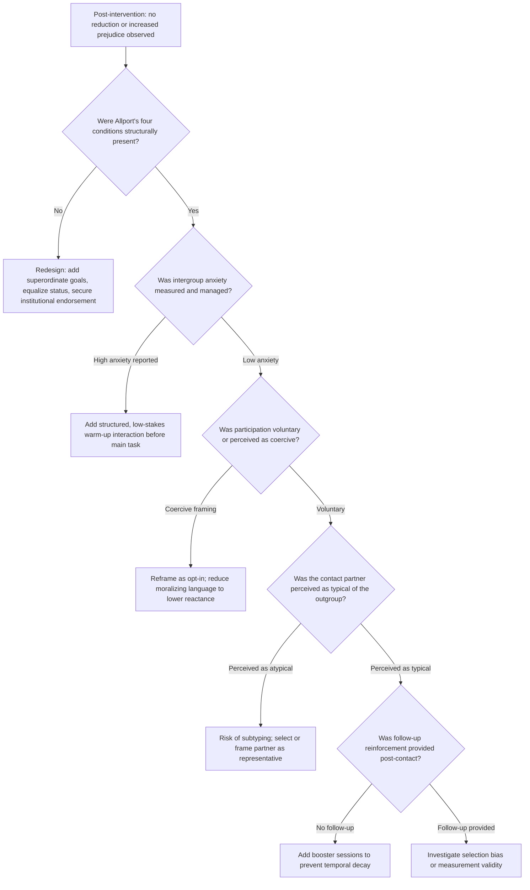

## Limits and Backlash of Contact Interventions

### Overview

While intergroup contact theory (Allport, 1954) remains one of the most empirically supported frameworks for prejudice reduction, decades of subsequent research have identified significant boundary conditions, failure modes, and cases of outright backlash. This entry documents the conditions under which contact interventions fail to reduce prejudice, produce no effect, or actively increase intergroup hostility — knowledge essential for responsible intervention design and evaluation.

### Boundary Conditions on Allport's Optimal Contact Conditions

Allport's original four conditions (equal status, common goals, intergroup cooperation, institutional support) are necessary but frequently insufficient in practice.

**Key Points**

- **Equal status is difficult to achieve and perceive**: status must be equal *within the contact situation*, not merely intended as equal; participants often import pre-existing societal status hierarchies into the interaction regardless of situational framing
- **Cooperation can fail under competitive framing**: if any competitive element is present (even unintentionally, e.g., grading curves in a classroom contact intervention), cooperative benefits are undermined
- **Institutional support signals matter more than institutional presence**: passive institutional tolerance is not equivalent to active, visible endorsement; ambiguous institutional stances can be read as tacit disapproval
- **Common goals must be superordinate, not merely shared**: goals perceived as belonging to one group more than another (e.g., a task historically "owned" by the majority group) can reinforce rather than dissolve group boundaries

### Mechanisms of Contact Failure

**Anxiety and Avoidance**

Intergroup anxiety (Stephan & Stephan, 1985) — apprehension about how one will be perceived or whether one will commit a social error — can be *increased* by poorly structured contact, particularly first encounters. High-anxiety contact can produce avoidance of future contact rather than reduced prejudice, creating a self-reinforcing cycle where reluctant participants have the most negative experiences.

**Negative Contact Asymmetry**

[Inference] Meta-analytic evidence (Barlow et al., 2012) indicates that negative intergroup contact experiences tend to have a disproportionately larger effect on increasing prejudice than positive contact has on reducing it, a pattern consistent with general negativity-bias findings in psychology. This asymmetry means a single poorly-managed contact intervention can outweigh multiple successful ones.

**Re-categorization Failure**

When contact fails to blur group boundaries (e.g., participants remain acutely aware of "us" and "them" throughout the interaction), any positive experience is often filed as an **exception** to the outgroup stereotype ("he's not like the others") rather than generalized to the group as a whole — a process termed subtyping. Subtyping protects the original stereotype rather than revising it.

**Example**

A workplace diversity mixer in which employees are told "get to know someone different from you" without any structured cooperative task frequently fails because: (1) status differences from the organizational hierarchy remain salient, (2) no superordinate goal is introduced, and (3) awkward, anxiety-driven interactions are subtyped as atypical rather than generalized.

### Documented Backlash Effects

**Key Points**

- **Reactance-driven backlash**: when contact or diversity messaging is perceived as morally coercive or as an attempt to control attitudes, participants — particularly those high in psychological reactance — can respond with *increased* prejudice as a defense of autonomy
- **Threat-based backlash**: contact interventions framed around correcting majority-group bias can trigger **intergroup threat** (realistic or symbolic), especially among majority-group members who perceive the intervention as implying illegitimate privilege or moral deficiency
- **Diversity training backlash**: corporate diversity training research (Dobbin & Kalev) has found that mandatory, compliance-oriented programs are associated with null or negative effects on subsequent representation and attitudes, compared to voluntary engagement models
- **Moral licensing**: exposure to a single positive contact experience or diversity message can paradoxically license subsequent biased behavior, as individuals feel their "moral credentials" have already been established
- **Zero-sum backlash**: contact or equity interventions framed as redistributive (implying one group's gain is another's loss) can activate zero-sum thinking and increase outgroup hostility, particularly under resource scarcity conditions

### Extended Contact and Vicarious Contact Limits

Extended contact (knowing that an ingroup member has an outgroup friend) and vicarious/parasocial contact (media exposure to positive outgroup portrayals) are lower-intensity alternatives to direct contact, but carry their own limitations:

- Effects are generally **smaller in magnitude** than direct contact effects
- Effects are **more fragile** to counter-messaging or subsequent negative real-world encounters
- **Selection effects** confound observational studies: individuals who already hold lower prejudice may be more likely to form or report cross-group friendships, inflating apparent intervention efficacy in non-experimental designs

### Segregation and Selection Confounds

**Key Points**

- Real-world contact interventions frequently operate in already-segregated contexts (schools, neighborhoods, workplaces), meaning voluntary contact opportunities are structurally rare, and those who do engage are self-selected on pre-existing low prejudice
- This **selection bias** substantially inflates correlational estimates of contact's effect relative to experimentally manipulated (randomly assigned) contact
- Pettigrew & Tropp's (2006) meta-analysis found weaker effects in studies employing random assignment/experimental control compared to purely correlational survey studies, indicating that a portion of the widely cited contact-prejudice correlation reflects selection rather than causation

### Durability and Generalization Failures

**Key Points**

- **Temporal decay**: prejudice reduction observed immediately post-contact frequently attenuates or fully reverts within weeks to months without reinforcement (see companion topic: Measuring Prejudice-Reduction Outcomes)
- **Failure to generalize across group members**: reduced prejudice toward a specific contact partner does not reliably generalize to the outgroup as a whole unless the partner is perceived as a **typical** group representative during the interaction
- **Failure to generalize across contexts**: reduced prejudice in a controlled/structured setting (e.g., classroom) often fails to transfer to unstructured, real-world settings (e.g., hiring decisions, neighborhood interactions) where the original optimal conditions are absent
- **Failure to generalize across outgroups**: prejudice reduction toward one outgroup (secondary transfer effect) is inconsistently observed and, when present, tends to be substantially smaller than the primary effect

### Diagram: Pathways from Contact to Backlash vs. Reduction (svg_diagram)

<svg xmlns="http://www.w3.org/2000/svg" viewBox="0 0 780 480">
<text x="390" y="28" text-anchor="middle" font-size="17" font-weight="bold" fill="#1a1a1a">Contact Intervention: Divergent Pathways (svg_diagram)</text>
<rect x="310" y="45" width="160" height="45" rx="8" fill="#e8eef7" stroke="#3b5b92" stroke-width="2" />
<text x="390" y="72" text-anchor="middle" font-size="13" fill="#1a1a1a">Contact Intervention</text>
<line x1="390" y1="90" x2="390" y2="115" stroke="#555" stroke-width="2" marker-end="url(#a2)" />
<rect x="310" y="115" width="160" height="55" rx="8" fill="#fdf6e3" stroke="#a1791f" stroke-width="2" />
<text x="390" y="138" text-anchor="middle" font-size="12" fill="#1a1a1a">Optimal Conditions Met?</text>
<text x="390" y="155" text-anchor="middle" font-size="10" fill="#1a1a1a">(status, goals, cooperation, support)</text>
<line x1="330" y1="170" x2="150" y2="210" stroke="#555" stroke-width="2" marker-end="url(#a2)" />
<line x1="450" y1="170" x2="630" y2="210" stroke="#555" stroke-width="2" marker-end="url(#a2)" />
<text x="220" y="195" font-size="11" fill="#444">Yes</text>
<text x="560" y="195" font-size="11" fill="#444">No / Partial</text>
<rect x="60" y="215" width="180" height="55" rx="8" fill="#e9f5ec" stroke="#2f7d46" stroke-width="2" />
<text x="150" y="238" text-anchor="middle" font-size="12" fill="#1a1a1a">Low anxiety, cooperative</text>
<text x="150" y="255" text-anchor="middle" font-size="12" fill="#1a1a1a">interaction</text>
<rect x="540" y="215" width="180" height="55" rx="8" fill="#fdeaea" stroke="#a13333" stroke-width="2" />
<text x="630" y="238" text-anchor="middle" font-size="12" fill="#1a1a1a">High anxiety, threat,</text>
<text x="630" y="255" text-anchor="middle" font-size="12" fill="#1a1a1a">or reactance</text>
<line x1="150" y1="270" x2="150" y2="305" stroke="#555" stroke-width="2" marker-end="url(#a2)" />
<line x1="630" y1="270" x2="630" y2="305" stroke="#555" stroke-width="2" marker-end="url(#a2)" />
<rect x="60" y="305" width="180" height="55" rx="8" fill="#e9f5ec" stroke="#2f7d46" stroke-width="2" />
<text x="150" y="328" text-anchor="middle" font-size="12" fill="#1a1a1a">Generalization to</text>
<text x="150" y="345" text-anchor="middle" font-size="12" fill="#1a1a1a">outgroup as a whole</text>
<rect x="540" y="305" width="180" height="55" rx="8" fill="#fdeaea" stroke="#a13333" stroke-width="2" />
<text x="630" y="328" text-anchor="middle" font-size="12" fill="#1a1a1a">Subtyping or</text>
<text x="630" y="345" text-anchor="middle" font-size="12" fill="#1a1a1a">moral licensing</text>
<line x1="150" y1="360" x2="150" y2="395" stroke="#555" stroke-width="2" marker-end="url(#a2)" />
<line x1="630" y1="360" x2="630" y2="395" stroke="#555" stroke-width="2" marker-end="url(#a2)" />
<rect x="30" y="400" width="240" height="50" rx="8" fill="#dff0e0" stroke="#2f7d46" stroke-width="2" />
<text x="150" y="430" text-anchor="middle" font-size="13" font-weight="bold" fill="#1a1a1a">Durable Prejudice Reduction</text>
<rect x="510" y="400" width="240" height="50" rx="8" fill="#fadcdc" stroke="#a13333" stroke-width="2" />
<text x="630" y="430" text-anchor="middle" font-size="13" font-weight="bold" fill="#1a1a1a">Null Effect or Backlash</text>
</svg>

### Process Flow: Diagnosing Why a Contact Intervention Failed

### Applied Example: Diagnosing a Failed Corporate DEI Training

**Output**

A company implements mandatory one-day diversity training and observes no change (or a slight increase) in post-training implicit bias scores. Applying the failure-mode framework:

1. **Coercion check**: training was mandatory with disciplinary language in the invitation → reactance risk
2. **Framing check**: content emphasized majority-group culpability rather than shared organizational goals → threat-based backlash risk
3. **Status check**: training was delivered top-down with no peer facilitation → equal-status condition violated
4. **Follow-up check**: no reinforcement scheduled after the single session → likely temporal decay even if short-term change occurred

**Conclusion**: the intervention violated at least three of Allport's conditions and introduced two independent backlash mechanisms (reactance, threat), explaining the null/negative outcome independent of any flaw in contact theory itself.

### Related Topics / Next Steps

- Allport's Contact Hypothesis: original conditions and revisions
- Intergroup Threat Theory (Stephan & Stephan)
- Psychological reactance theory
- Subtyping and stereotype maintenance mechanisms
- Extended and parasocial/vicarious contact effects
- Moral licensing in prosocial and equity contexts
- Selection bias in observational contact research
- Measuring prejudice-reduction outcomes (companion topic)
- Dobbin & Kalev's research on diversity training effectiveness