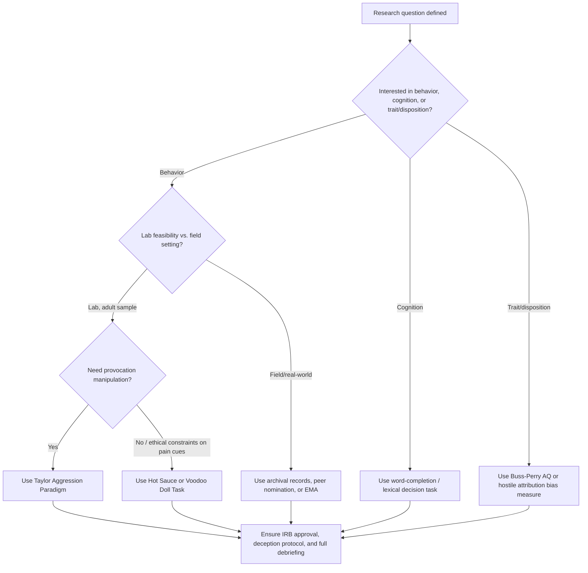

## Defining and Operationalizing Aggression

### Overview

Before aggression can be studied empirically, it must be precisely defined and translated into measurable variables — a process called operationalization. This entry covers the conceptual definition of aggression as used in social psychology, its distinction from related constructs (violence, anger, hostility), the major taxonomies used to classify aggressive acts, and the standard laboratory and field paradigms used to measure it.

### Conceptual Definition

**Key Points**

- The consensus social-psychological definition: aggression is **any behavior directed toward another individual that is carried out with the proximate (immediate) intent to cause harm**, where the perpetrator believes the behavior will harm the target, and the target is motivated to avoid the behavior (Baron & Richardson; Bushman & Anderson)
- This definition requires **intent** — accidental harm (e.g., bumping into someone) does not qualify as aggression regardless of outcome
- This definition requires the target to be a **motivated avoider** — harm that is welcomed by the recipient (e.g., consensual contact sports, medical procedures) does not qualify, even if injury results
- Aggression is a **behavior**, not an emotion or trait — it must be distinguished from internal states that may precede it

### Distinguishing Aggression from Related Constructs

| Construct | Definition | Key Distinction from Aggression |
| --- | --- | --- |
| Violence | Aggression at the extreme end of severity, intended to cause extreme physical harm (e.g., death, serious injury) | All violence is aggression; not all aggression is violence |
| Anger | An internal affective/emotional state of arousal and hostility | An emotion, not a behavior; can occur without aggression, and aggression can occur without anger (e.g., cold/instrumental aggression) |
| Hostility | A cognitive attitude or attributional style involving negative beliefs about others (hostile attribution bias) | A cognitive predisposition, not a behavior itself; predicts but does not equal aggression |
| Assertiveness | Socially appropriate self-advocacy without intent to harm | Lacks the harm-intent component definitionally |

### Major Taxonomies of Aggression

**Hostile vs. Instrumental Aggression**

- **Hostile (affective/reactive) aggression**: driven by anger, impulsive, the harm itself is the goal (e.g., a bar fight following an insult)
- **Instrumental (proactive) aggression**: harm is a means to another goal (e.g., money, status), often planned and unemotional (e.g., a robbery involving violence)

[Inference] This dichotomy, while widely used in teaching and applied contexts, has been critiqued in the literature as an oversimplification, since many real-world aggressive acts contain both reactive and instrumental elements simultaneously.

**Direct vs. Indirect (Relational/Social) Aggression**

- **Direct aggression**: harm delivered face-to-face to the target (physical or verbal)
- **Indirect/relational/social aggression**: harm delivered through damage to relationships, reputation, or social standing (e.g., spreading rumors, social exclusion, cyberbullying); disproportionately studied in developmental contexts and often found to show different gender patterns than direct aggression

**Physical vs. Verbal Aggression**

- **Physical aggression**: bodily harm (hitting, pushing)
- **Verbal aggression**: harm through language (insults, threats, verbal abuse)

**Active vs. Passive Aggression**

- **Active aggression**: performing a harmful act
- **Passive aggression**: withholding a needed behavior to cause harm (e.g., deliberately failing to pass along critical information)

### Operationalization: Translating Definition into Measurement

Operationalizing aggression requires researchers to select a concrete, observable, quantifiable proxy that satisfies the intent-to-harm criterion under ethical (non-injurious) laboratory constraints.

**Key Points**

- Laboratory measures must **simulate** harm without causing actual injury, given ethical constraints on human-subjects research
- A valid operationalization must retain the **intent** component — participants must believe their actions will cause the target discomfort or harm
- Different operationalizations tap different aggression subtypes (e.g., some capture only hostile aggression, others can capture instrumental aggression), so measure selection should match the theoretical question

### Standard Laboratory Paradigms

**Teacher-Learner / Shock Paradigm (Buss Aggression Machine)**

Participants are told they are "teaching" a confederate learner and are instructed to deliver electric shocks of their choosing (intensity and/or duration) for incorrect answers. No real shocks are delivered; the confederate simulates receiving them. Intensity/duration selected is the aggression measure.

- [Unverified] Contemporary IRB standards have led most modern replications to substitute this paradigm with the noise-blast method below rather than use the shock cover story, due to deception and distress concerns.

**Competitive Reaction Time Task (Taylor Aggression Paradigm, TAP)**

Participants compete against an ostensible opponent (actually computer-controlled) in a reaction-time task; the loser of each trial receives a blast of white noise at an intensity and duration set by the winner. The participant's selected noise intensity/duration across trials is the primary dependent variable.

- Widely regarded as the most validated and frequently used modern aggression paradigm
- Allows manipulation of provocation by varying the noise levels ostensibly set by the "opponent" in early trials

**Hot Sauce Paradigm**

Participants are told a confederate dislikes spicy food, then allocate an amount of hot sauce the confederate must consume. Amount allocated operationalizes aggression without the ethical concerns of shock or noise-based deception involving false pain cues.

**Voodoo Doll Task**

Participants are given a virtual or physical doll representing a specific target person and asked to insert pins; number of pins inserted operationalizes symbolic/displaced aggression, often used in relationship-conflict research.

**Word-Completion / Lexical Decision Tasks**

Used to measure **aggressive cognition** rather than behavior — participants complete word fragments (e.g., "H_T" → "HIT" vs. "HAT") following a provocation manipulation; more aggressive completions indicate accessible aggressive cognitive schemas. This operationalizes a *precursor* to aggression rather than the behavior itself.

### Field and Archival Operationalizations

**Key Points**

- **Self-report inventories**: the Buss-Perry Aggression Questionnaire (AQ) measures four factors — physical aggression, verbal aggression, anger, and hostility — via Likert-scale self-report
- **Peer nomination**: participants (commonly children in developmental studies) nominate peers who fit aggressive behavior descriptions; used heavily in relational aggression research
- **Observational coding**: trained coders rate videotaped interactions (e.g., parent-child, playground) using structured behavioral coding schemes
- **Archival/official records**: crime statistics, disciplinary records, hospital admission data — high ecological validity but limited by reporting biases and inability to capture unreported aggression
- **Experience sampling / ecological momentary assessment (EMA)**: real-time self-report of aggressive urges/acts via smartphone prompts across a day, reducing retrospective recall bias

### Validity Considerations in Aggression Measurement

**Key Points**

- **Ecological validity vs. experimental control trade-off**: lab paradigms (TAP, hot sauce) offer causal control but questionable generalization to real-world violence; archival data offers high real-world relevance but weak causal inference
- **Construct validity debates**: critics (notably Tedeschi & Quigley) have argued that some paradigms, particularly shock/noise-blast tasks, may not cleanly isolate aggression from competitiveness or task compliance
- [Inference] Meta-analytic work (e.g., Anderson & Bushman's General Aggression Model literature) has generally supported convergent validity between lab-based paradigms and self-report/peer-report measures, though the correlation magnitudes are described as moderate rather than large, meaning no single measure should be treated as a complete proxy for aggression
- **Deception and debriefing requirements**: most lab paradigms require deception (fake confederate, fake shocks/noise) and mandate thorough debriefing per ethical guidelines (APA Ethics Code, institutional IRB standards)

### Diagram: Aggression Construct Hierarchy (svg_diagram)

<svg xmlns="http://www.w3.org/2000/svg" viewBox="0 0 760 420">
<text x="380" y="28" text-anchor="middle" font-size="17" font-weight="bold" fill="#1a1a1a">Aggression: Construct and Operationalization Hierarchy (svg_diagram)</text>
<rect x="290" y="45" width="180" height="50" rx="8" fill="#e8eef7" stroke="#3b5b92" stroke-width="2" />
<text x="380" y="75" text-anchor="middle" font-size="13" fill="#1a1a1a">Aggression (construct)</text>
<line x1="380" y1="95" x2="380" y2="120" stroke="#555" stroke-width="2" marker-end="url(#a3)" />
<rect x="60" y="120" width="180" height="50" rx="8" fill="#fdf2e3" stroke="#b5762a" stroke-width="2" />
<text x="150" y="150" text-anchor="middle" font-size="12" fill="#1a1a1a">Hostile / Reactive</text>
<rect x="290" y="120" width="180" height="50" rx="8" fill="#e9f5ec" stroke="#2f7d46" stroke-width="2" />
<text x="380" y="150" text-anchor="middle" font-size="12" fill="#1a1a1a">Instrumental / Proactive</text>
<rect x="520" y="120" width="180" height="50" rx="8" fill="#f3e9f7" stroke="#7a3b92" stroke-width="2" />
<text x="610" y="150" text-anchor="middle" font-size="12" fill="#1a1a1a">Direct vs. Indirect</text>
<line x1="150" y1="170" x2="150" y2="205" stroke="#555" stroke-width="2" marker-end="url(#a3)" />
<line x1="380" y1="170" x2="380" y2="205" stroke="#555" stroke-width="2" marker-end="url(#a3)" />
<line x1="610" y1="170" x2="610" y2="205" stroke="#555" stroke-width="2" marker-end="url(#a3)" />
<rect x="20" y="210" width="120" height="55" rx="6" fill="#fdeaea" stroke="#a13333" stroke-width="1.5" />
<text x="80" y="232" text-anchor="middle" font-size="10" fill="#1a1a1a">Taylor Aggression</text>
<text x="80" y="247" text-anchor="middle" font-size="10" fill="#1a1a1a">Paradigm (TAP)</text>
<rect x="150" y="210" width="120" height="55" rx="6" fill="#fdeaea" stroke="#a13333" stroke-width="1.5" />
<text x="210" y="232" text-anchor="middle" font-size="10" fill="#1a1a1a">Hot Sauce</text>
<text x="210" y="247" text-anchor="middle" font-size="10" fill="#1a1a1a">Paradigm</text>
<rect x="320" y="210" width="120" height="55" rx="6" fill="#fdeaea" stroke="#a13333" stroke-width="1.5" />
<text x="380" y="232" text-anchor="middle" font-size="10" fill="#1a1a1a">Word-Completion</text>
<text x="380" y="247" text-anchor="middle" font-size="10" fill="#1a1a1a">(cognition proxy)</text>
<rect x="460" y="210" width="120" height="55" rx="6" fill="#fdeaea" stroke="#a13333" stroke-width="1.5" />
<text x="520" y="232" text-anchor="middle" font-size="10" fill="#1a1a1a">Peer Nomination</text>
<text x="520" y="247" text-anchor="middle" font-size="10" fill="#1a1a1a">(relational)</text>
<rect x="600" y="210" width="140" height="55" rx="6" fill="#fdeaea" stroke="#a13333" stroke-width="1.5" />
<text x="670" y="232" text-anchor="middle" font-size="10" fill="#1a1a1a">Archival Records</text>
<text x="670" y="247" text-anchor="middle" font-size="10" fill="#1a1a1a">(official/crime data)</text>
<line x1="380" y1="265" x2="380" y2="300" stroke="#555" stroke-width="2" marker-end="url(#a3)" />
<rect x="230" y="305" width="300" height="55" rx="8" fill="#f7f7f7" stroke="#444" stroke-width="2" />
<text x="380" y="330" text-anchor="middle" font-size="12" fill="#1a1a1a">Buss-Perry Aggression Questionnaire</text>
<text x="380" y="348" text-anchor="middle" font-size="10" fill="#1a1a1a">(cross-cutting self-report validation)</text>
</svg>

### Process Flow: Selecting an Aggression Measure for a Study

### Applied Example: Operationalizing Aggression in a Provocation Study

**Output**

A researcher testing whether social exclusion increases aggression might operationalize the study as follows:

1. **Manipulation**: participants are excluded or included in a virtual ball-tossing game (Cyberball paradigm)
2. **Dependent variable (behavioral aggression)**: Taylor Aggression Paradigm noise-blast intensity/duration set for a subsequent "opponent"
3. **Dependent variable (cognitive aggression)**: word-completion task measuring aggressive schema accessibility
4. **Dependent variable (trait covariate)**: Buss-Perry AQ administered as a control variable to account for baseline trait aggression

Using this multi-measure design allows the researcher to determine whether exclusion increases aggressive *behavior* specifically, or only aggressive *cognition*, addressing the construct-validity concerns noted above.

### Related Topics / Next Steps

- General Aggression Model (Anderson & Bushman)
- Hostile attribution bias and social information processing
- Provocation and the frustration-aggression hypothesis
- Media violence and aggression research (desensitization, priming)
- Ethical considerations in deception-based aggression research
- Developmental trajectories of relational aggression
- Displaced aggression and the "weapons effect"
- Measuring prejudice-reduction outcomes (methodological parallel, companion topic)