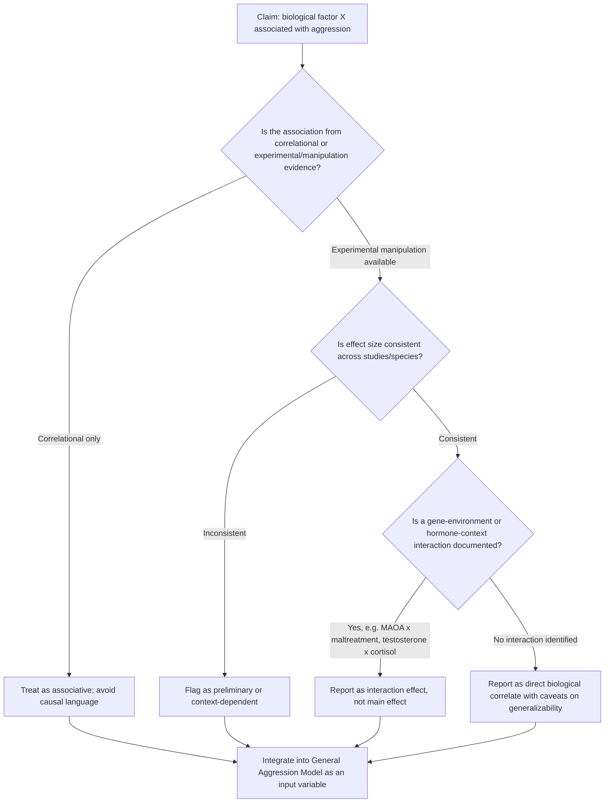

## Biological and Evolutionary Bases of Aggression

### Overview

This entry examines aggression through biological and evolutionary lenses, covering neuroanatomical structures, neurochemical and hormonal mechanisms, genetic contributions, and evolutionary-psychological explanations for why aggressive behavior emerged and persists across human populations. These perspectives complement social-psychological models by explaining the proximate physiological mechanisms and ultimate (evolutionary) functions underlying aggressive behavior.

### Neuroanatomical Substrates

**Key Points**

- **Amygdala**: central to threat detection and the generation of fear and anger responses; heightened amygdala reactivity to provocative or threatening stimuli is consistently associated with increased aggressive responding in neuroimaging studies
- **Prefrontal cortex (PFC)**, particularly the **orbitofrontal** and **ventromedial prefrontal cortex**: exerts top-down inhibitory control over amygdala-driven impulses; damage or reduced activity in these regions is associated with disinhibited, impulsive aggression
- **Hypothalamus**: implicated in the generation of both "affective" (defensive, emotionally charged) and "predatory" (quiet, biting) attack patterns in animal models, mediated by distinct hypothalamic nuclei
- **Periaqueductal gray (PAG)**: coordinates defensive behavioral responses, including fight-or-flight output, in coordination with hypothalamic and amygdalar input
- **Anterior cingulate cortex (ACC)**: involved in detecting social pain and conflict monitoring, implicated in reactive aggression following social rejection or provocation

**Example**

The classic **Phineas Gage case** (1848), in which severe damage to the frontal cortex via an iron rod produced marked personality change including increased impulsivity and reduced behavioral inhibition, remains a frequently cited historical illustration of the PFC's inhibitory role, later substantiated by modern neuroimaging studies linking reduced prefrontal gray matter volume to antisocial and aggressive behavior patterns.

### Neurochemical Mechanisms

**Serotonin**

- The most robust neurochemical correlate of aggression in the literature is the **serotonin deficiency hypothesis**: lower serotonergic activity (commonly indexed via cerebrospinal fluid levels of 5-HIAA, a serotonin metabolite) is associated with increased impulsive aggression across both animal and human studies
- Serotonin is thought to normally exert an inhibitory, regulatory influence on limbic threat-response circuits; reduced serotonergic tone is theorized to weaken this inhibition

**Dopamine**

- Associated with reward and motivational salience; implicated particularly in **instrumental/proactive** aggression, where aggressive acts are pursued for anticipated reward (status, resources)

**Testosterone**

- Testosterone's relationship with aggression is more nuanced than commonly assumed in popular accounts
- [Inference] The literature increasingly favors a **status/dominance-seeking model** over a direct "testosterone causes aggression" model — testosterone appears to promote behaviors aimed at acquiring or maintaining social status, which manifest as aggression only in contexts where aggression is an effective status-acquisition strategy
- The **Challenge Hypothesis** (Wingfield et al.), originally developed in avian research and extended to humans, proposes that testosterone rises in response to social challenges (e.g., competition, status threats) rather than driving unprovoked aggression
- Testosterone-aggression correlations are stronger for **dominance-related** and status-driven aggression than for reactive aggression in ambiguous provocation contexts

**Cortisol**

- The **dual-hormone hypothesis** (Mehta & Josephs) proposes that testosterone's association with dominant/aggressive behavior is moderated by cortisol: high testosterone predicts aggression primarily when cortisol (a stress hormone) is low; high cortisol appears to suppress the testosterone-aggression link

**Vasopressin and Oxytocin**

- Vasopressin is associated with increased territorial and defensive aggression in animal models
- Oxytocin's role is context-dependent: it can increase prosocial bonding toward ingroup members while simultaneously increasing defensive aggression toward outgroup threats — a pattern termed the "tend-and-defend" or intergroup oxytocin effect

### Genetic Contributions

**Key Points**

- **Twin and adoption studies**: heritability estimates for aggressive/antisocial behavior typically fall in the moderate range (commonly cited around 40–50% in behavioral genetics meta-analyses), indicating substantial but partial genetic contribution, with the remaining variance attributed to shared and non-shared environmental factors
- **MAOA gene ("warrior gene")**: encodes monoamine oxidase A, an enzyme that metabolizes serotonin, dopamine, and norepinephrine; the low-activity variant (MAOA-L) has been associated with increased aggression, but critically, this association is consistently found to be **conditional on early childhood maltreatment** (Caspi et al., 2002) — a canonical gene-by-environment (G×E) interaction finding
- **Polygenic nature**: contemporary genetics research treats aggression as a polygenic trait influenced by many genes of small individual effect rather than any single "aggression gene," and MAOA-focused media narratives are considered oversimplified relative to current genomic evidence
- **Gene-environment interaction is the dominant framework**: genetic predispositions are understood to confer differential *sensitivity* to environmental risk factors (e.g., abuse, deprivation) rather than deterministically producing aggressive outcomes

### Evolutionary Psychological Explanations

**Key Points**

- Evolutionary approaches treat aggression not as a pathology but as a behavioral strategy that was, under ancestral conditions, adaptive for solving recurrent survival and reproductive problems
- **Buss's evolutionary framework** identifies several adaptive problems aggression may have solved: co-opting others' resources, defending against attack, negotiating status/power hierarchies, deterring rivals from future aggression, deterring mate infidelity, and reducing resource investment in genetically unrelated offspring

**Sexual Selection and Male Intrasexual Competition**

- Male-male aggression is theorized to stem substantially from **intrasexual competition** for mating access, consistent with the pattern (well documented across species) that the higher-investing sex is choosier and the lower-investing sex competes more aggressively for mating opportunities
- This framework is frequently invoked to explain the cross-culturally robust finding that young adult males exhibit substantially higher rates of same-sex physical violence than any other demographic group — sometimes termed the **"young male syndrome"** (Daly & Wilson)

**Parental Investment Theory and Aggression**

- Predicts sex differences in aggression type: males theorized to favor more direct/physical aggression (higher risk tolerance tied to higher variance in reproductive success), females theorized to favor indirect/relational aggression (preserving survival for offspring investment, given the higher minimum obligatory parental investment in females)
- [Inference] This evolutionary account of sex differences remains actively contested; critics note it does not fully explain observed cross-cultural variability in aggression patterns, and sociocultural theories (e.g., social role theory) offer competing explanations for the same behavioral patterns

**Jealousy and Mate-Guarding**

- Evolutionary models propose that male sexual jealousy evolved partly as an anti-cuckoldry mechanism (given males' unique paternity uncertainty), theorized to underlie mate-guarding aggression and intimate partner violence in contexts of perceived infidelity threat
- Female jealousy is theorized to focus more on emotional infidelity/resource diversion, given the lower paternity-uncertainty-driven pressure but comparable resource-loss risk

**Coalitional Aggression**

- Beyond individual aggression, evolutionary theory addresses **coalitional/intergroup aggression** (warfare, raiding) as potentially adaptive at the group level for resource acquisition and territory defense, though the extent to which ancestral coalitional violence was common remains an active empirical and anthropological debate
- [Speculation] Some evolutionary anthropologists argue ancestral coalitional violence was a significant selective pressure shaping modern intergroup psychology, while others argue it was comparatively rare and that modern warfare represents largely a post-agricultural, culturally-driven phenomenon rather than a direct evolutionary carryover; this remains unresolved in the literature.

### Critiques of Biological and Evolutionary Models

**Key Points**

- **Biological determinism critique**: heritability and neurochemical correlations describe population-level statistical associations, not fixed individual destinies; environment and learning remain substantial contributors even for highly heritable traits
- **Naturalistic fallacy concern**: evolutionary explanations for why a behavior may have been adaptive historically do not constitute moral justification for the behavior in contemporary contexts — a frequently emphasized distinction in evolutionary psychology pedagogy
- **Testability limitations**: many evolutionary hypotheses about ancestral conditions are difficult to directly test, since they rely on inference about environments no longer directly observable, leading some critics to characterize certain evolutionary aggression narratives as post-hoc rather than predictive
- **Integration with social models**: contemporary frameworks (e.g., the General Aggression Model) explicitly integrate biological predispositions as *inputs* alongside situational and social-cognitive variables, rather than treating biology as a standalone deterministic explanation

### Diagram: Biological Pathway from Provocation to Aggressive Response (svg_diagram)

<svg xmlns="http://www.w3.org/2000/svg" viewBox="0 0 780 440">
<text x="390" y="28" text-anchor="middle" font-size="17" font-weight="bold" fill="#1a1a1a">Biological Pathway: Provocation to Aggressive Response (svg_diagram)</text>
<rect x="300" y="45" width="180" height="45" rx="8" fill="#e8eef7" stroke="#3b5b92" stroke-width="2" />
<text x="390" y="72" text-anchor="middle" font-size="12" fill="#1a1a1a">Provocation / Threat Cue</text>
<line x1="390" y1="90" x2="390" y2="115" stroke="#555" stroke-width="2" marker-end="url(#a4)" />
<rect x="300" y="115" width="180" height="45" rx="8" fill="#fdeaea" stroke="#a13333" stroke-width="2" />
<text x="390" y="142" text-anchor="middle" font-size="12" fill="#1a1a1a">Amygdala Activation</text>
<line x1="390" y1="160" x2="200" y2="195" stroke="#555" stroke-width="2" marker-end="url(#a4)" />
<line x1="390" y1="160" x2="580" y2="195" stroke="#555" stroke-width="2" marker-end="url(#a4)" />
<rect x="100" y="200" width="200" height="50" rx="8" fill="#fdf2e3" stroke="#b5762a" stroke-width="2" />
<text x="200" y="222" text-anchor="middle" font-size="11" fill="#1a1a1a">HPA Axis: Cortisol Release</text>
<text x="200" y="238" text-anchor="middle" font-size="10" fill="#1a1a1a">(stress response)</text>
<rect x="480" y="200" width="200" height="50" rx="8" fill="#fdf2e3" stroke="#b5762a" stroke-width="2" />
<text x="580" y="222" text-anchor="middle" font-size="11" fill="#1a1a1a">HPG Axis: Testosterone Shift</text>
<text x="580" y="238" text-anchor="middle" font-size="10" fill="#1a1a1a">(Challenge Hypothesis)</text>
<line x1="200" y1="250" x2="390" y2="285" stroke="#555" stroke-width="2" marker-end="url(#a4)" />
<line x1="580" y1="250" x2="390" y2="285" stroke="#555" stroke-width="2" marker-end="url(#a4)" />
<rect x="270" y="290" width="240" height="55" rx="8" fill="#e9f5ec" stroke="#2f7d46" stroke-width="2" />
<text x="390" y="313" text-anchor="middle" font-size="12" fill="#1a1a1a">Prefrontal Cortex</text>
<text x="390" y="330" text-anchor="middle" font-size="11" fill="#1a1a1a">Regulatory / Inhibitory Control</text>
<line x1="390" y1="345" x2="220" y2="380" stroke="#555" stroke-width="2" marker-end="url(#a4)" />
<line x1="390" y1="345" x2="560" y2="380" stroke="#555" stroke-width="2" marker-end="url(#a4)" />
<text x="255" y="368" font-size="10" fill="#444">Strong inhibition</text>
<text x="500" y="368" font-size="10" fill="#444">Weak inhibition</text>
<rect x="100" y="385" width="240" height="45" rx="8" fill="#dff0e0" stroke="#2f7d46" stroke-width="2" />
<text x="220" y="412" text-anchor="middle" font-size="12" fill="#1a1a1a">Regulated / Non-aggressive Response</text>
<rect x="440" y="385" width="240" height="45" rx="8" fill="#fadcdc" stroke="#a13333" stroke-width="2" />
<text x="560" y="412" text-anchor="middle" font-size="12" fill="#1a1a1a">Impulsive Aggressive Response</text>
</svg>

### Process Flow: Evaluating a Biological Aggression Claim

### Applied Example: Interpreting a Testosterone-Aggression Finding

**Output**

A study reports that male participants with higher salivary testosterone allocated more noise-blast punishment in a Taylor Aggression Paradigm following provocation. Applying the evaluative framework above:

1. **Correlational or experimental?** Testosterone was measured, not manipulated — correlational
2. **Consistent across literature?** Testosterone-aggression correlations are typically small-to-moderate and inconsistent across studies unless dominance/status threat is explicitly present
3. **Interaction check**: was cortisol also measured? If so, the dual-hormone hypothesis predicts the testosterone-aggression link should be strongest specifically among low-cortisol individuals
4. **Correct interpretation**: testosterone likely reflects a status-defense/dominance-motivational state activated by the provocation, not a direct chemical trigger for aggression — consistent with the Challenge Hypothesis rather than a simple "testosterone causes aggression" narrative

### Related Topics / Next Steps

- The General Aggression Model (integrating biological, situational, and cognitive inputs)
- Defining and operationalizing aggression (companion topic, methodological foundation)
- Gene-environment interaction (Caspi et al. MAOA-maltreatment study in depth)
- The Challenge Hypothesis and dual-hormone hypothesis
- Evolutionary psychology of mate-guarding and intimate partner violence
- Young male syndrome and homicide demographic patterns
- Neuroimaging methods in aggression research (fMRI, structural MRI)
- Frustration-aggression hypothesis and its biological correlates