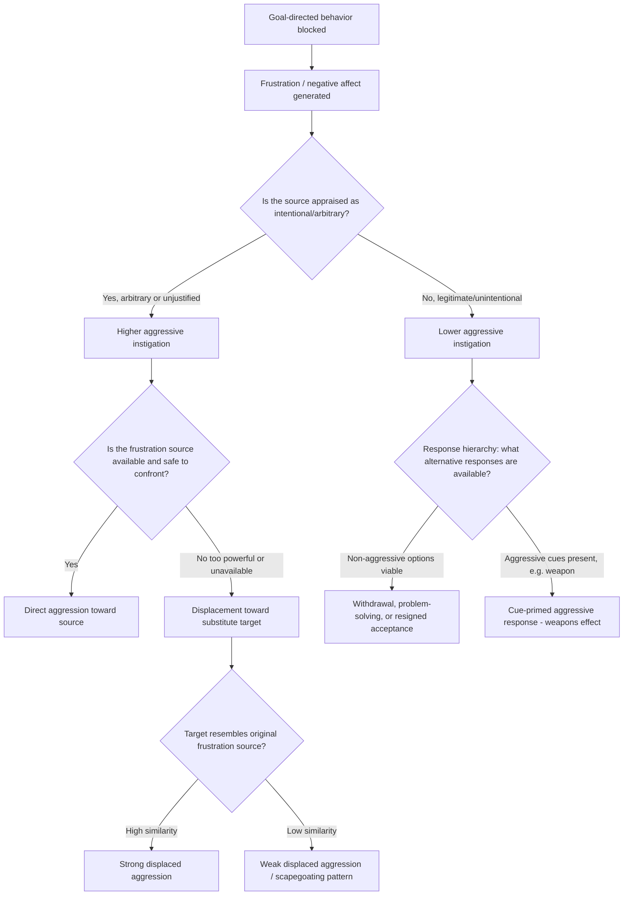

## Frustration-Aggression Hypothesis

### Overview

The frustration-aggression hypothesis is one of the earliest and most influential theoretical accounts of aggression in social psychology, proposing a causal link between goal-blocking frustration and aggressive behavior. Originally formulated as a strong, deterministic claim, the hypothesis has undergone substantial theoretical revision over eight decades and remains foundational to contemporary aggression models, including the General Aggression Model.

### The Original Formulation (Dollard, Doob, Miller, Mowrer, & Sears, 1939)

**Key Points**

- The original **Yale group** formulation made two strong, symmetric claims: (1) **frustration always leads to some form of aggression**, and (2) **aggression is always caused by some form of frustration**
- **Frustration** was defined as the blocking or interference of a goal-directed behavior sequence
- The theory proposed a direct causal chain: goal blockage → frustration (a drive state) → aggressive drive → aggressive behavior
- Drew on **psychodynamic drive theory**, treating aggressive energy as building pressure requiring discharge — conceptually related to the later-criticized **catharsis hypothesis** (the idea that expressing aggression reduces subsequent aggressive urges)

**Example**

A commonly cited illustrative case from this tradition: a child who is prevented from reaching a desired toy (goal blockage → frustration) subsequently hits a sibling (aggression), even though the sibling did not cause the original obstruction — illustrating the *displacement* concept discussed below.

### Early Revisions: Miller (1941)

Within just two years, one of the theory's own originators substantially weakened the strong dual-directional claim.

**Key Points**

- **Miller's revision** proposed that frustration creates an instigation to a **range of possible responses**, of which aggression is only one; other possible responses include withdrawal, problem-solving, regression, or resigned acceptance
- This revision preserved "aggression is always caused by frustration" as a weaker background disposition while abandoning "frustration always leads to aggression"
- Introduced the concept of a **response hierarchy**: the dominant response to frustration is situationally determined, and aggression rises in the hierarchy under specific conditions (e.g., when non-aggressive responses have previously failed or been punished)

### Berkowitz's Cognitive Neoassociationistic Reformulation

Leonard Berkowitz's revisions (1960s–1990s) represent the most significant theoretical advance beyond the original hypothesis, integrating cognitive and associative learning principles.

**Key Points**

- **Frustration produces negative affect, not aggression directly**: Berkowitz proposed that frustration generates a state of negative affect/arousal, and this negative affect — not frustration per se — is the proximate trigger for aggressive tendencies
- **Aggressive cues facilitate the frustration-aggression link**: the presence of aggression-associated environmental stimuli (e.g., weapons) can prime aggressive responding when a person is already in a negative affective state — this is the theoretical basis of the well-known **weapons effect** (Berkowitz & LePage, 1967), in which the mere visual presence of a weapon (versus a neutral object) increased aggressive responding among provoked participants
- **Any aversive stimulus can trigger aggression, not only frustration**: pain, heat, loud noise, and other unpleasant stimuli were shown to independently increase aggressive tendencies through the same negative-affect pathway, generalizing the theory beyond goal-blockage frustration specifically
- **Appraisal and attribution moderate the response**: whether negative affect translates into aggression depends on higher-order cognitive appraisal — particularly whether the source of frustration/aversion is appraised as **intentional**

### The Critical Role of Attribution

**Key Points**

- Later research (notably **Pastore, 1952**, and subsequent attribution-focused studies) established that **arbitrary or unjustified frustration** produces substantially more aggression than frustration perceived as **legitimate, unintentional, or justified**
- This finding directly challenges the original strong hypothesis: identical goal-blockage produces different aggressive outcomes depending entirely on the cognitive appraisal of intent and legitimacy
- This integrates frustration-aggression theory with broader **attribution theory** and **hostile attribution bias** research: individuals prone to interpreting ambiguous frustrating events as intentional show elevated aggressive responding across contexts

**Example**

A person whose bus is late due to an announced mechanical failure (legitimate, unintentional cause) typically shows less aggressive response than a person whose bus is late because the driver visibly stopped for a personal errand (arbitrary, intentional-seeming cause) — despite both individuals experiencing an objectively identical goal-blockage (delay).

### Displacement and Scapegoating

**Key Points**

- **Displacement** occurs when aggression is redirected from the actual source of frustration toward a substitute target, typically because the original source is unavailable, too powerful, or too threatening to confront directly (e.g., an authority figure)
- **Displaced aggression** has been experimentally demonstrated in triggered-displaced-aggression paradigms, where a provoked participant shows elevated aggression toward a subsequent, unrelated, innocent target
- **The displacement gradient**: displaced aggression is theorized to be strongest toward targets that resemble the original frustration source and weakens as target similarity decreases
- **Scapegoating** represents a social/group-level extension of displacement, in which frustration experienced by a group (e.g., economic hardship) is redirected toward a socially available, relatively powerless outgroup, historically invoked as a partial explanation for prejudice and intergroup hostility during periods of societal stress
- [Inference] While scapegoating remains a widely taught explanatory framework, contemporary intergroup relations research treats it as one contributing mechanism among several (alongside realistic conflict theory and social identity processes) rather than a complete standalone explanation for prejudice

### Empirical Support and Limitations

**Key Points**

- **Support**: numerous laboratory studies using standard aggression paradigms (see companion topic: Defining and Operationalizing Aggression) have confirmed that goal-blockage frustration reliably increases aggressive responding relative to non-frustrated control conditions, particularly when frustration is arbitrary
- **Limitation — non-aggressive alternative responses**: substantial evidence supports Miller's revision that non-aggressive responses (withdrawal, helplessness, problem-solving) commonly follow frustration, invalidating the strong universal claim
- **Limitation — insufficient explanation for instrumental aggression**: the theory explains hostile/reactive aggression reasonably well but has limited applicability to planned, unemotional instrumental aggression (see companion topic on aggression taxonomies), which frequently occurs without frustration or negative affect
- **Limitation — individual differences**: trait aggression, trait hostility, and prior learning history substantially moderate whether a given frustrating event produces aggression, factors absent from the original formulation
- **Integration into modern theory**: the General Aggression Model (Anderson & Bushman) subsumes frustration as one of several situational input variables that increase aggression risk via negative affect and hostile cognition, rather than treating it as a standalone causal theory

### Diagram: Evolution of the Frustration-Aggression Hypothesis (svg_diagram)

<svg xmlns="http://www.w3.org/2000/svg" viewBox="0 0 780 460">
<text x="390" y="28" text-anchor="middle" font-size="16" font-weight="bold" fill="#1a1a1a">Frustration-Aggression Hypothesis: Theoretical Evolution (svg_diagram)</text>
<rect x="300" y="45" width="180" height="50" rx="8" fill="#e8eef7" stroke="#3b5b92" stroke-width="2" />
<text x="390" y="68" text-anchor="middle" font-size="12" fill="#1a1a1a">Dollard et al. (1939)</text>
<text x="390" y="85" text-anchor="middle" font-size="10" fill="#1a1a1a">Frustration → always aggression</text>
<line x1="390" y1="95" x2="390" y2="120" stroke="#555" stroke-width="2" marker-end="url(#a5)" />
<rect x="300" y="120" width="180" height="50" rx="8" fill="#fdf2e3" stroke="#b5762a" stroke-width="2" />
<text x="390" y="143" text-anchor="middle" font-size="12" fill="#1a1a1a">Miller (1941)</text>
<text x="390" y="160" text-anchor="middle" font-size="10" fill="#1a1a1a">Response hierarchy; aggression is one option</text>
<line x1="390" y1="170" x2="390" y2="195" stroke="#555" stroke-width="2" marker-end="url(#a5)" />
<rect x="280" y="195" width="220" height="55" rx="8" fill="#e9f5ec" stroke="#2f7d46" stroke-width="2" />
<text x="390" y="218" text-anchor="middle" font-size="12" fill="#1a1a1a">Berkowitz (1960s-90s)</text>
<text x="390" y="235" text-anchor="middle" font-size="10" fill="#1a1a1a">Negative affect as mediator;</text>
<text x="390" y="248" text-anchor="middle" font-size="10" fill="#1a1a1a">any aversive stimulus, not just frustration</text>
<line x1="330" y1="250" x2="180" y2="290" stroke="#555" stroke-width="2" marker-end="url(#a5)" />
<line x1="450" y1="250" x2="600" y2="290" stroke="#555" stroke-width="2" marker-end="url(#a5)" />
<rect x="80" y="295" width="220" height="55" rx="8" fill="#f3e9f7" stroke="#7a3b92" stroke-width="2" />
<text x="190" y="318" text-anchor="middle" font-size="11" fill="#1a1a1a">Attribution research</text>
<text x="190" y="335" text-anchor="middle" font-size="10" fill="#1a1a1a">Arbitrary vs. justified frustration</text>
<rect x="480" y="295" width="240" height="55" rx="8" fill="#f3e9f7" stroke="#7a3b92" stroke-width="2" />
<text x="600" y="318" text-anchor="middle" font-size="11" fill="#1a1a1a">Weapons effect</text>
<text x="600" y="335" text-anchor="middle" font-size="10" fill="#1a1a1a">Aggressive cues prime response</text>
<line x1="390" y1="250" x2="390" y2="370" stroke="#555" stroke-width="2" marker-end="url(#a5)" />
<rect x="230" y="375" width="320" height="55" rx="8" fill="#f7f7f7" stroke="#444" stroke-width="2" />
<text x="390" y="398" text-anchor="middle" font-size="12" fill="#1a1a1a">General Aggression Model</text>
<text x="390" y="415" text-anchor="middle" font-size="10" fill="#1a1a1a">Frustration = one situational input among many</text>
</svg>

### Process Flow: From Frustration to Behavioral Outcome

### Applied Example: Analyzing a Real-World Frustration Scenario

**Output**

An employee is passed over for a promotion. Applying the theoretical framework:

1. **Goal blockage**: promotion (goal) is blocked
2. **Attribution check**: if the employee believes the decision was based on **arbitrary favoritism** (intentional, illegitimate) rather than a **transparent, merit-based process** (legitimate), aggressive instigation is predicted to be substantially higher per Pastore's arbitrary-frustration findings
3. **Target availability**: the employee's manager (the frustration source) holds organizational power, making direct confrontation risky — predicting **displacement** toward a safer target, such as family members at home or a subordinate
4. **Aggressive cue check**: per Berkowitz's cognitive neoassociationistic model, if aggression-associated cues are present in the displaced context (e.g., a heated political discussion, an argument already in progress), the probability of aggressive expression increases further
5. **Conclusion**: the theory predicts elevated risk of displaced aggression specifically when perceived arbitrariness is high and safe direct confrontation is unavailable — a testable, falsifiable prediction distinguishing this refined model from the original 1939 formulation

### Related Topics / Next Steps

- The General Aggression Model (Anderson & Bushman) — integration of frustration as one input
- The weapons effect and aggressive cue priming (Berkowitz & LePage)
- Hostile attribution bias and social information processing
- Displaced aggression paradigms and the displacement gradient
- Scapegoat theory and realistic conflict theory in prejudice research
- Catharsis hypothesis and its empirical rejection
- Defining and operationalizing aggression (companion topic)
- Biological and evolutionary bases of aggression (companion topic)