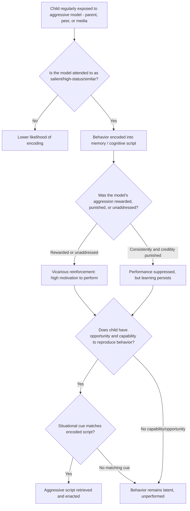

## Social Learning Theory of Aggression

### Overview

Social learning theory (SLT) proposes that aggressive behavior is acquired and maintained primarily through learning processes — observation, imitation, and reinforcement — rather than through innate drives or purely biological mechanisms. Developed principally by Albert Bandura, this theory shifted the field's focus from internal drive states (as in the frustration-aggression hypothesis) toward environmental and cognitive determinants of aggression, and remains foundational to media-violence research and contemporary integrative models.

### Bandura's Core Theoretical Claims

**Key Points**

- Aggression is **learned**, not instinctual: individuals are not born with aggressive response repertoires but acquire them through experience, much like any other complex social behavior
- Learning occurs through two primary pathways: **direct experience** (reinforcement/punishment of one's own behavior) and **observational learning** (modeling), with SLT's distinctive contribution being its emphasis on the latter
- Aggression, once learned, is **maintained or extinguished** based on its consequences — reinforcement increases future likelihood, punishment decreases it, consistent with operant conditioning principles
- SLT integrates cognitive mediating processes between observation and behavior, distinguishing it from strict behaviorist accounts that treat the organism as a passive stimulus-response mechanism

### The Bobo Doll Experiments

**Key Points**

- Bandura, Ross, and Ross's (1961, 1963) **Bobo doll studies** are the foundational empirical demonstration of observational learning of aggression
- **Basic design**: children observed an adult model behaving aggressively (or non-aggressively) toward an inflatable Bobo doll, including distinctive, novel aggressive acts (e.g., striking the doll with a mallet while shouting specific phrases) unlikely to occur spontaneously
- **Key finding**: children who observed the aggressive model subsequently reproduced highly similar aggressive behaviors — including the specific novel acts and verbalizations — at substantially higher rates than children in non-aggressive or no-model control conditions, demonstrating that aggression can be acquired purely through observation, without direct reinforcement of the observer
- **Model characteristics mattered**: children imitated same-sex models more readily than opposite-sex models, and imitation was stronger when the model was perceived as similar, high-status, or nurturant

**Vicarious Reinforcement Variant (1963 follow-up)**

- Children who observed the aggressive model **rewarded** for aggression showed the highest subsequent imitation
- Children who observed the model **punished** for aggression showed reduced imitation — but critically, when later directly incentivized to perform the behaviors themselves, these children demonstrated they had **learned** the aggressive acts just as thoroughly as the reward-condition children
- This dissociation between **learning** (acquisition) and **performance** (behavioral enactment) is one of SLT's most theoretically important findings: observing punishment suppresses performance without preventing learning

### The Four Component Processes of Observational Learning

Bandura specified four sequential cognitive sub-processes required for modeled behavior to be reproduced:

| Process | Function | Aggression-Relevant Factor |
| --- | --- | --- |
| Attention | Observer must attend to and accurately perceive the model's behavior | Salient, distinctive, or high-status models more likely to be attended to |
| Retention | Behavior must be encoded and stored in memory (symbolic/verbal coding) | Simple, memorable, or repeated aggressive scripts are retained more readily |
| Reproduction | Observer must possess the physical/cognitive capability to reproduce the behavior | Requires sufficient motor and cognitive development |
| Motivation | Observer must have incentive to perform the behavior | Anticipated reinforcement, vicarious reinforcement, or self-reinforcement (matching personal standards) |

### Reinforcement Pathways for Aggression

**Key Points**

- **Direct reinforcement**: aggression that successfully achieves a goal (obtaining a toy, ending harassment, gaining status) is directly reinforced and becomes more probable in future similar situations
- **Vicarious reinforcement**: observing another person be rewarded for aggression (in real life or media) increases the observer's own aggressive tendencies, even without personal reinforcement
- **Self-reinforcement**: individuals who hold personal standards approving of aggression (e.g., viewing aggression as consistent with a valued self-image, such as toughness) self-administer psychological reward for aggressive acts, sustaining the behavior independent of external consequences

### Primary Sources of Aggressive Modeling

**Key Points**

- **Familial modeling**: children of physically punitive or aggressive parents show elevated rates of aggression, partially attributable to modeling (in addition to genetic and attachment-related pathways); this is a key mechanism in the **intergenerational transmission of violence**
- **Subcultural modeling**: aggression prevalent within a peer group, neighborhood, or subculture is more likely to be adopted by members embedded in that context, particularly where aggression is normatively reinforced (e.g., status-linked aggression in some peer groups)
- **Symbolic/media modeling**: television, film, video games, and other media provide observational models even without direct real-world contact with an aggressive model — this pathway is the basis for the extensive **media violence research** literature

### Media Violence as an Applied Extension

**Key Points**

- SLT provided the core theoretical mechanism underlying decades of media-violence research: fictional or real aggressive models viewed on screen are theorized to be encoded and available for later imitation via the same four-process pathway as live models
- **Meta-analytic evidence** (e.g., Anderson et al., Bushman & Huesmann syntheses) has generally found small-to-moderate positive associations between media violence exposure and subsequent aggressive behavior/cognition, though effect sizes and causal interpretation remain **actively debated** in the field
- [Inference] Critics of the media-violence literature argue that many studies rely on short-term laboratory aggression measures (see companion topic on operationalizing aggression) with uncertain generalization to real-world violent behavior, and that publication bias and methodological heterogeneity across studies complicate meta-analytic conclusions
- **Desensitization** is a related but theoretically distinct proposed mechanism: repeated exposure to violent media is theorized to reduce physiological and cognitive-emotional reactivity to violence (e.g., reduced skin conductance response to violent imagery), separate from the direct observational-learning/imitation pathway

### Script Theory as a Cognitive Extension (Huesmann)

**Key Points**

- **Huesmann's script theory** extends SLT by proposing that repeated observation of aggressive models leads to the encoding of **cognitive scripts** — organized sequences of expected events and appropriate responses — for social situations
- Once encoded, scripts can be automatically retrieved and enacted in matching situations with minimal conscious deliberation, providing a cognitive mechanism for how early modeling produces durable adult aggressive tendencies
- This framework directly informed the **social-cognitive input variables** in the General Aggression Model, connecting SLT to contemporary integrative aggression theory

### Distinguishing SLT from Frustration-Aggression and Biological Accounts

**Key Points**

- **Vs. frustration-aggression hypothesis**: SLT does not require an aversive/frustrating antecedent state — aggression can be acquired and performed without any frustration, purely through modeling and anticipated reward (explaining, for example, planned instrumental aggression, which the frustration-aggression hypothesis handles poorly)
- **Vs. biological/evolutionary accounts**: SLT does not deny biological predispositions but emphasizes that the specific **form, target, and circumstances** of aggressive expression are substantially shaped by learning history, environment, and culture — the two perspectives are generally treated as complementary rather than competing in contemporary theory
- **Integration**: the General Aggression Model explicitly incorporates SLT's learning-based acquisition of aggressive scripts and normative beliefs alongside biological predispositions and situational triggers (e.g., frustration, provocation) as joint inputs to aggressive behavior

### Diagram: Observational Learning Pathway to Aggressive Behavior (svg_diagram)

<svg xmlns="http://www.w3.org/2000/svg" viewBox="0 0 780 460">
<text x="390" y="28" text-anchor="middle" font-size="16" font-weight="bold" fill="#1a1a1a">Social Learning Pathway to Aggression (svg_diagram)</text>
<rect x="300" y="45" width="180" height="45" rx="8" fill="#e8eef7" stroke="#3b5b92" stroke-width="2" />
<text x="390" y="72" text-anchor="middle" font-size="12" fill="#1a1a1a">Aggressive Model Observed</text>
<line x1="390" y1="90" x2="390" y2="115" stroke="#555" stroke-width="2" marker-end="url(#a6)" />
<rect x="60" y="115" width="150" height="50" rx="8" fill="#fdf2e3" stroke="#b5762a" stroke-width="2" />
<text x="135" y="145" text-anchor="middle" font-size="12" fill="#1a1a1a">Attention</text>
<rect x="230" y="115" width="150" height="50" rx="8" fill="#fdf2e3" stroke="#b5762a" stroke-width="2" />
<text x="305" y="145" text-anchor="middle" font-size="12" fill="#1a1a1a">Retention</text>
<rect x="400" y="115" width="150" height="50" rx="8" fill="#fdf2e3" stroke="#b5762a" stroke-width="2" />
<text x="475" y="145" text-anchor="middle" font-size="12" fill="#1a1a1a">Reproduction</text>
<rect x="570" y="115" width="150" height="50" rx="8" fill="#fdf2e3" stroke="#b5762a" stroke-width="2" />
<text x="645" y="145" text-anchor="middle" font-size="12" fill="#1a1a1a">Motivation</text>
<line x1="210" y1="140" x2="230" y2="140" stroke="#555" stroke-width="2" marker-end="url(#a6)" />
<line x1="380" y1="140" x2="400" y2="140" stroke="#555" stroke-width="2" marker-end="url(#a6)" />
<line x1="550" y1="140" x2="570" y2="140" stroke="#555" stroke-width="2" marker-end="url(#a6)" />
<line x1="390" y1="165" x2="390" y2="195" stroke="#555" stroke-width="2" marker-end="url(#a6)" />
<rect x="290" y="195" width="200" height="45" rx="8" fill="#e9f5ec" stroke="#2f7d46" stroke-width="2" />
<text x="390" y="222" text-anchor="middle" font-size="12" fill="#1a1a1a">Behavior Learned (encoded)</text>
<line x1="390" y1="240" x2="390" y2="265" stroke="#555" stroke-width="2" marker-end="url(#a6)" />
<rect x="290" y="265" width="200" height="55" rx="8" fill="#f3e9f7" stroke="#7a3b92" stroke-width="2" />
<text x="390" y="288" text-anchor="middle" font-size="12" fill="#1a1a1a">Consequence observed:</text>
<text x="390" y="305" text-anchor="middle" font-size="11" fill="#1a1a1a">vicarious reward or punishment</text>
<line x1="330" y1="320" x2="180" y2="355" stroke="#555" stroke-width="2" marker-end="url(#a6)" />
<line x1="450" y1="320" x2="600" y2="355" stroke="#555" stroke-width="2" marker-end="url(#a6)" />
<rect x="80" y="360" width="200" height="50" rx="8" fill="#fadcdc" stroke="#a13333" stroke-width="2" />
<text x="180" y="382" text-anchor="middle" font-size="11" fill="#1a1a1a">Model rewarded →</text>
<text x="180" y="398" text-anchor="middle" font-size="11" fill="#1a1a1a">performance likely</text>
<rect x="500" y="360" width="220" height="50" rx="8" fill="#dff0e0" stroke="#2f7d46" stroke-width="2" />
<text x="610" y="382" text-anchor="middle" font-size="11" fill="#1a1a1a">Model punished →</text>
<text x="610" y="398" text-anchor="middle" font-size="11" fill="#1a1a1a">performance suppressed (still learned)</text>
</svg>

### Process Flow: Assessing Learned Aggression Risk in a Child

### Applied Example: Interpreting a Media-Exposure Finding

**Output**

A longitudinal study finds that children with high violent-media consumption at age 8 show elevated aggressive behavior at age 15. Applying the SLT framework:

1. **Modeling pathway**: violent media provides repeated observational exposure to aggressive models, satisfying the attention and retention components even without live models present
2. **Vicarious reinforcement check**: media violence is frequently portrayed as effective, justified, or unpunished (protagonist violence succeeding), which per Bandura's 1965 findings would be expected to increase motivation to perform similarly
3. **Script theory extension**: per Huesmann, repeated exposure across years (ages 8+) is consistent with durable cognitive script encoding rather than a transient priming effect, plausibly explaining the long time lag to the age-15 outcome
4. **Necessary caveat**: as a longitudinal correlational design, this finding cannot rule out reverse causation (more aggressive children selecting violent media) or third-variable confounds (e.g., family aggression modeling co-occurring with unrestricted media access) — a limitation frequently raised in critiques of this literature

### Related Topics / Next Steps

- Bandura's Bobo doll experiments (extended methodological detail)
- Huesmann's script theory and social-cognitive information processing
- Media violence research and desensitization mechanisms
- The General Aggression Model (integration point for SLT, biology, and frustration)
- Intergenerational transmission of violence
- Frustration-aggression hypothesis (companion topic, contrasting mechanism)
- Biological and evolutionary bases of aggression (companion topic)
- Vicarious reinforcement and observational learning beyond aggression (prosocial modeling)