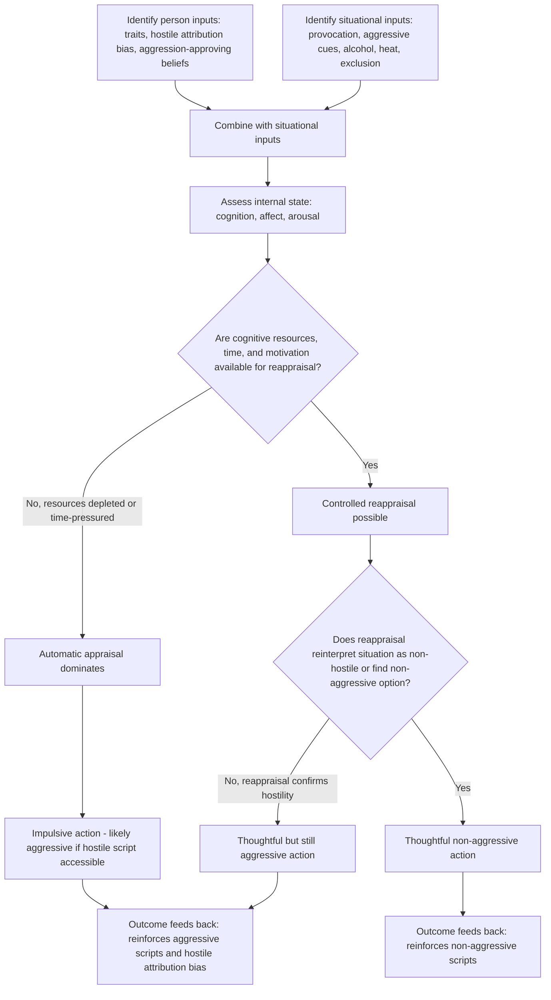

## General Aggression Model

### Overview

The General Aggression Model (GAM), developed principally by Craig Anderson and Brad Bushman, is the field's leading integrative framework for understanding aggressive behavior. Rather than proposing a single causal mechanism, GAM synthesizes prior theories — biological predispositions, frustration-aggression processes, social learning theory, cognitive script theory, and excitation transfer — into a unified person-situation-cognition-affect-arousal model operating across immediate (single-episode) and long-term (developmental) timescales.

### Theoretical Purpose and Integration

**Key Points**

- GAM was explicitly designed to **integrate rather than replace** earlier domain-specific theories: frustration-aggression, social learning theory, cognitive neoassociation (Berkowitz), excitation transfer theory, and script theory (Huesmann) are all incorporated as component mechanisms rather than competitors
- The model treats aggression as the outcome of a **person-situation interaction**, explicitly rejecting both pure trait-based ("aggressive personality") and pure situational ("aggression is entirely context-driven") explanations in favor of their joint operation
- GAM operates at **two nested timescales**: the **single-episode cycle** (a single instance of provocation leading to a single aggressive or non-aggressive act) and the **developmental cycle** (repeated episodes over time shaping long-term personality structures, such as trait hostility or aggressive normative beliefs)

### Structure of the Single-Episode Cycle

The single-episode process unfolds in three sequential stages: Inputs → Routes (internal state) → Outcomes.

**Stage 1: Inputs**

| Input Type | Examples |
| --- | --- |
| Person factors | Trait aggressiveness, trait irritability, hostile attribution bias, beliefs/attitudes about aggression, genetic predispositions, gender |
| Situational factors | Provocation, frustration, aggressive cues (e.g., weapons), pain/discomfort, drugs/alcohol, incentives for aggression, social exclusion |

**Stage 2: Routes — Internal State**

Inputs are theorized to influence aggression through three interacting internal-state components, corresponding directly to prior standalone theories:

- **Cognition**: hostile thoughts, aggressive scripts (Huesmann), and accessible aggression-related knowledge structures activated by inputs
- **Affect**: negative mood/affect, particularly anger (drawing directly on Berkowitz's cognitive neoassociation model)
- **Arousal**: physiological activation, which can be **directly aggression-inducing**, **irrelevant** (unrelated arousal, e.g., from exercise), or subject to **excitation transfer** — a process (Zillmann) whereby residual arousal from an unrelated source is misattributed to the current provocation, intensifying the aggressive response
- These three components are theorized to be **mutually interacting and reciprocally influencing**: hostile cognition can increase anger, anger can bias cognitive interpretation, and arousal can amplify either

**Stage 3: Outcomes — Appraisal and Decision Processes**

- **Immediate/automatic appraisal**: a rapid, low-effort assessment of the situation and one's internal state, often relying on the most accessible cognitive scripts (per social learning/script theory)
- **Controlled/reappraisal processes**: if sufficient cognitive resources, time, and motivation are available, a more effortful, deliberate reappraisal can override the automatic appraisal — this is the primary theoretical point of intervention for anger-management and de-escalation techniques
- **Thoughtful action vs. impulsive action**: the outcome of the appraisal process determines whether the resulting behavior is impulsive (driven by the automatic appraisal) or thoughtful (shaped by reappraisal), with only the latter allowing effective inhibition of aggressive impulses under high provocation

### The Developmental (Distal) Cycle

**Key Points**

- Repeated cycling through the single-episode process is theorized to **shape long-term personality structures**: chronic exposure to aggression-eliciting inputs and repeated aggressive outcomes progressively strengthens aggression-related knowledge structures (scripts, schemas, normative beliefs)
- This creates a feedback loop: **biological/genetic predispositions** and **early environmental modeling** (per social learning theory) jointly shape the developing person, whose resulting trait aggressiveness then influences how future situational inputs are appraised — a person with strong hostile attribution bias will interpret ambiguous provocations more readily as hostile, generating more single-episode cycles that further reinforce the trait
- This developmental feedback loop is the theoretical mechanism by which distal factors (childhood maltreatment, media violence exposure, genetic predisposition) produce durable individual differences in adult aggressiveness, connecting GAM directly to both the biological/evolutionary and social-learning literatures

### Distal and Proximate Causes Integrated

**Key Points**

- GAM explicitly distinguishes **distal causes** (biological predispositions, early environmental modeling, sociocultural context — operating over developmental time) from **proximate causes** (immediate situational provocation, arousal, cues — operating within a single episode)
- This distinction resolves apparent conflicts between competing single-mechanism theories: biological and evolutionary theories (see companion topic) primarily address distal causes, while frustration-aggression and cognitive-cue theories (weapons effect) primarily address proximate causes — GAM positions both as valid within their respective temporal scope

### Hostile Attribution Bias Within GAM

**Key Points**

- Hostile attribution bias — the tendency to interpret ambiguous or neutral behavior from others as intentionally hostile — operates as both an **input** (a stable person factor shaping the automatic appraisal in any given episode) and an **outcome** of the developmental cycle (repeated hostile appraisals reinforce the bias itself)
- This bidirectional role is a signature example of how GAM's cyclical structure explains the persistence and escalation of aggressive tendencies over an individual's life course, distinguishing it from earlier linear (single-direction) theories

### Empirical Applications and Support

**Key Points**

- GAM has been applied extensively to **media violence research**, providing the theoretical scaffolding for predicting that repeated violent media exposure functions as a distal input strengthening aggressive scripts and hostile normative beliefs over time (the developmental cycle), while acute exposure functions as a proximate input priming aggressive cognition and arousal in the short term (the single-episode cycle)
- Applied to **alcohol-related aggression**: alcohol is modeled as simultaneously affecting arousal (physiological activation), cognition (reduced capacity for reappraisal, "alcohol myopia"), and affect (mood alteration), illustrating GAM's capacity to integrate a single input across all three internal-state routes
- Applied to **heat and aggression research**: ambient temperature is modeled as a situational input affecting both physiological arousal and irritability/negative affect, consistent with well-documented seasonal and geographic correlations between heat and violent crime rates
- [Inference] While GAM is widely regarded as the dominant integrative framework in contemporary aggression research, critics have noted that its breadth makes some specific predictions difficult to falsify, and that the relative causal weighting among cognition, affect, and arousal in any given episode remains empirically underspecified in many applied contexts

### Diagram: General Aggression Model — Single-Episode Cycle (svg_diagram)

<svg xmlns="http://www.w3.org/2000/svg" viewBox="0 0 800 480">
<text x="400" y="26" text-anchor="middle" font-size="16" font-weight="bold" fill="#1a1a1a">General Aggression Model: Single-Episode Cycle (svg_diagram)</text>
<rect x="60" y="55" width="180" height="55" rx="8" fill="#e8eef7" stroke="#3b5b92" stroke-width="2" />
<text x="150" y="78" text-anchor="middle" font-size="12" fill="#1a1a1a">Person Inputs</text>
<text x="150" y="95" text-anchor="middle" font-size="10" fill="#1a1a1a">Traits, beliefs, hostile bias</text>
<rect x="560" y="55" width="180" height="55" rx="8" fill="#e8eef7" stroke="#3b5b92" stroke-width="2" />
<text x="650" y="78" text-anchor="middle" font-size="12" fill="#1a1a1a">Situation Inputs</text>
<text x="650" y="95" text-anchor="middle" font-size="10" fill="#1a1a1a">Provocation, cues, alcohol, heat</text>
<line x1="240" y1="95" x2="330" y2="150" stroke="#555" stroke-width="2" marker-end="url(#a7)" />
<line x1="560" y1="95" x2="470" y2="150" stroke="#555" stroke-width="2" marker-end="url(#a7)" />
<rect x="130" y="155" width="150" height="55" rx="8" fill="#fdf2e3" stroke="#b5762a" stroke-width="2" />
<text x="205" y="188" text-anchor="middle" font-size="12" fill="#1a1a1a">Cognition</text>
<rect x="320" y="155" width="150" height="55" rx="8" fill="#fdf2e3" stroke="#b5762a" stroke-width="2" />
<text x="395" y="188" text-anchor="middle" font-size="12" fill="#1a1a1a">Affect</text>
<rect x="510" y="155" width="150" height="55" rx="8" fill="#fdf2e3" stroke="#b5762a" stroke-width="2" />
<text x="585" y="188" text-anchor="middle" font-size="12" fill="#1a1a1a">Arousal</text>
<line x1="280" y1="182" x2="320" y2="182" stroke="#555" stroke-width="2" stroke-dasharray="3,3" />
<line x1="470" y1="182" x2="510" y2="182" stroke="#555" stroke-width="2" stroke-dasharray="3,3" />
<text x="300" y="175" font-size="9" fill="#444">interact</text>
<text x="490" y="175" font-size="9" fill="#444">interact</text>
<line x1="395" y1="210" x2="395" y2="240" stroke="#555" stroke-width="2" marker-end="url(#a7)" />
<rect x="270" y="240" width="250" height="55" rx="8" fill="#e9f5ec" stroke="#2f7d46" stroke-width="2" />
<text x="395" y="263" text-anchor="middle" font-size="12" fill="#1a1a1a">Appraisal Process</text>
<text x="395" y="280" text-anchor="middle" font-size="10" fill="#1a1a1a">Automatic vs. controlled reappraisal</text>
<line x1="330" y1="295" x2="220" y2="335" stroke="#555" stroke-width="2" marker-end="url(#a7)" />
<line x1="460" y1="295" x2="570" y2="335" stroke="#555" stroke-width="2" marker-end="url(#a7)" />
<rect x="100" y="340" width="240" height="50" rx="8" fill="#fadcdc" stroke="#a13333" stroke-width="2" />
<text x="220" y="362" text-anchor="middle" font-size="11" fill="#1a1a1a">Insufficient resources →</text>
<text x="220" y="378" text-anchor="middle" font-size="11" fill="#1a1a1a">Impulsive aggressive action</text>
<rect x="460" y="340" width="240" height="50" rx="8" fill="#dff0e0" stroke="#2f7d46" stroke-width="2" />
<text x="580" y="362" text-anchor="middle" font-size="11" fill="#1a1a1a">Sufficient resources →</text>
<text x="580" y="378" text-anchor="middle" font-size="11" fill="#1a1a1a">Thoughtful, non-aggressive action</text>
<line x1="220" y1="390" x2="220" y2="415" stroke="#555" stroke-width="2" marker-end="url(#a7)" />
<line x1="580" y1="390" x2="580" y2="415" stroke="#555" stroke-width="2" marker-end="url(#a7)" />
<line x1="220" y1="425" x2="580" y2="425" stroke="#8a8a8a" stroke-width="2" stroke-dasharray="5,4" marker-end="url(#a7)" />
<text x="400" y="440" text-anchor="middle" font-size="10" fill="#444">Feeds back into Person Inputs (developmental cycle)</text>
</svg>

### Process Flow: Applying GAM to Diagnose an Aggressive Episode

### Applied Example: Full GAM Analysis of a Road-Rage Incident

**Output**

A driver is cut off in traffic on a hot afternoon after a stressful workday and reacts with aggressive horn-honking and shouting. Applying GAM systematically:

1. **Person inputs**: trait irritability (elevated from workplace stress), possible pre-existing hostile attribution bias regarding other drivers
2. **Situational inputs**: sudden provocation (being cut off), heat (ambient temperature as arousal-affecting input), possible aggressive cues (e.g., bumper stickers, visible weapons in the other vehicle)
3. **Internal state (routes)**: cognition — immediate hostile interpretation ("that driver did it on purpose"); affect — anger, compounded by residual workplace stress; arousal — heat-elevated physiological activation, subject to **excitation transfer** (workplace-stress arousal misattributed to the traffic incident, intensifying the reaction)
4. **Appraisal**: minimal time available for reappraisal in a fast-moving traffic situation favors the automatic pathway
5. **Outcome**: impulsive aggressive action (horn-honking, shouting) rather than thoughtful non-aggressive action (e.g., simply slowing down)
6. **Developmental note**: if this pattern repeats regularly, GAM predicts it will progressively reinforce this driver's trait irritability and hostile attribution bias toward other drivers specifically, illustrating the single-episode-to-developmental-cycle feedback loop

### Related Topics / Next Steps

- Excitation transfer theory (Zillmann) in depth
- Hostile attribution bias and social information processing models
- Script theory (Huesmann) as GAM's cognitive component
- Alcohol myopia theory and substance-related aggression
- Heat hypothesis and environmental correlates of violence
- Anger management and cognitive reappraisal interventions
- Frustration-aggression hypothesis, biological bases, and social learning theory (component theories integrated into GAM)
- Media violence research through the GAM developmental-cycle lens