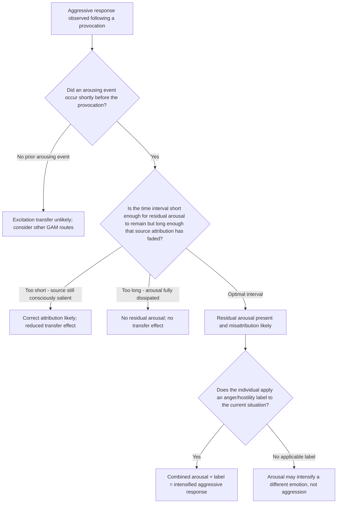

## Excitation Transfer Theory

### Overview

Excitation transfer theory, developed by Dolf Zillmann, explains how physiological arousal generated by one source can carry over and intensify an emotional or behavioral response to a subsequent, often unrelated, stimulus. Within aggression research, the theory provides the specific mechanism by which residual arousal from a prior event (exercise, sexual arousal, media exposure, environmental heat) amplifies aggressive reactions to a later provocation, even when the individual is unaware that the arousal originated elsewhere. It serves as the theoretical basis for the "arousal" component within the General Aggression Model.

### Core Theoretical Claims

**Key Points**

- **Physiological arousal is relatively non-specific and slow to dissipate**: the sympathetic nervous system activation produced by different stimuli (exercise, fear, sexual excitement, provocation) is physiologically similar in its basic autonomic signature and decays gradually rather than instantly
- **Arousal from one source can transfer to a subsequent emotional experience**: if residual arousal from an earlier event has not fully dissipated by the time a new emotion-eliciting stimulus is encountered, the leftover arousal combines with the new arousal, producing a more intense subjective and behavioral response than the new stimulus would produce alone
- **Misattribution is central**: individuals typically do not consciously recognize that part of their current arousal originates from an unrelated prior source; they instead attribute the full intensity of their arousal to the immediate triggering event, intensifying their appraisal of that event
- **The transfer is bidirectional in principle** but has been most extensively studied and applied in the context of anger/aggression amplification

### The Three-Factor Structure

Zillmann's model specifies three necessary components for excitation transfer to intensify a behavioral response:

| Component | Description |
| --- | --- |
| Residual excitation | Physiological arousal from a prior stimulus that has not yet fully dissipated |
| Appropriate cognitive label | A cognitive/emotional label (e.g., "anger") available and applied to the current situation, providing the interpretive frame the residual arousal energizes |
| Misattribution of arousal source | The individual attributes the combined (residual + new) arousal entirely to the current situation, unaware of the contribution from the earlier source |

### Classic Empirical Demonstrations

**Zillmann's Physical Exercise Studies**

- Participants engaged in strenuous physical exercise, then were provoked by a confederate either immediately afterward (while physiological arousal from exercise remained elevated) or after a delay (once arousal had returned to baseline)
- Participants provoked while residual exercise-induced arousal was still present showed **significantly higher aggressive responding** (e.g., higher shock/noise-blast intensity in standard aggression paradigms — see companion topic on operationalizing aggression) than those provoked after arousal had dissipated, despite the objective provocation being identical
- Critically, participants in the high-residual-arousal condition typically **misattributed** their elevated arousal to anger at the provocateur rather than to the preceding exercise

**Media and Arousal Transfer**

- Exposure to arousing (not necessarily violent) media content — including sexually arousing or suspenseful/exciting content — has been shown in some studies to similarly transfer residual arousal into subsequent aggressive responding when followed closely by provocation
- [Inference] This finding has informed debates in the media-effects literature about whether some apparent "media violence" effects may partially reflect generalized arousal transfer from exciting content rather than aggression-specific modeling, complicating clean causal attribution in applied media studies

### Temporal Dynamics of Arousal Decay

**Key Points**

- Excitation transfer effects are **time-dependent**: the intensifying effect is strongest when the interval between the arousing event and the provocation is short enough that residual arousal remains physiologically elevated but the individual no longer consciously attributes their current state to the original source
- If the interval is **too short**, the individual may still correctly attribute arousal to the original source (e.g., still consciously aware of being out of breath from exercise), reducing misattribution and thus reducing the amplifying effect
- If the interval is **too long**, arousal has fully dissipated and no transfer occurs
- This creates a theoretically predicted **inverted-U-shaped relationship** between time-since-arousing-event and the magnitude of the excitation transfer effect on subsequent aggression

### Integration with Other Aggression Theories

**Key Points**

- **Within the General Aggression Model** (see companion topic): excitation transfer is the specific mechanism explaining how the model's "arousal" route can amplify aggressive outcomes independent of, or in combination with, the cognition and affect routes
- **Relationship to Berkowitz's cognitive neoassociation model**: both theories address how negative affect and arousal states translate into aggressive readiness, but excitation transfer specifically explains cross-source arousal *misattribution*, while Berkowitz's model emphasizes associative networks linking negative affect to aggressive cognitions and cues
- **Relationship to frustration-aggression hypothesis** (see companion topic): excitation transfer helps explain observed cases where aggressive responses to frustration appear disproportionately intense relative to the objective severity of the frustrating event — the "extra" intensity may partly reflect transferred residual arousal from an unrelated prior source

### Applied Domains

**Key Points**

- **Intimate partner violence research**: some researchers have applied excitation transfer to explain how residual arousal from unrelated stressors (e.g., work stress, traffic) can amplify aggressive responses to comparatively minor domestic provocations, contributing to episodes disproportionate to the immediate triggering event
- **Sports and spectator violence**: arousal generated by the excitement of competitive sports viewing has been studied as a potential contributor to postgame violence and rioting, particularly following close or high-stakes contests
- **Media violence and "excitatory" content**: informs ongoing debate about disentangling content-specific violent modeling effects (social learning theory) from generalized arousal effects (excitation transfer) in media-effects research
- **Everyday relevance**: the theory is frequently cited in applied psychoeducation (e.g., anger management contexts) to explain why seemingly minor triggers can produce disproportionate aggressive reactions when they occur shortly after an unrelated stressful or arousing event

### Diagram: Excitation Transfer Process (svg_diagram)

<svg xmlns="http://www.w3.org/2000/svg" viewBox="0 0 780 420">
<text x="390" y="26" text-anchor="middle" font-size="16" font-weight="bold" fill="#1a1a1a">Excitation Transfer to Aggressive Response (svg_diagram)</text>
<rect x="40" y="55" width="200" height="55" rx="8" fill="#e8eef7" stroke="#3b5b92" stroke-width="2" />
<text x="140" y="78" text-anchor="middle" font-size="12" fill="#1a1a1a">Prior Arousing Event</text>
<text x="140" y="95" text-anchor="middle" font-size="10" fill="#1a1a1a">Exercise, stress, exciting media</text>
<line x1="240" y1="82" x2="300" y2="82" stroke="#555" stroke-width="2" marker-end="url(#a8)" />
<rect x="300" y="55" width="200" height="55" rx="8" fill="#fdf2e3" stroke="#b5762a" stroke-width="2" />
<text x="400" y="78" text-anchor="middle" font-size="12" fill="#1a1a1a">Residual Arousal</text>
<text x="400" y="95" text-anchor="middle" font-size="10" fill="#1a1a1a">Gradual, incomplete decay</text>
<line x1="500" y1="82" x2="560" y2="82" stroke="#555" stroke-width="2" marker-end="url(#a8)" />
<rect x="560" y="55" width="180" height="55" rx="8" fill="#fdf2e3" stroke="#b5762a" stroke-width="2" />
<text x="650" y="78" text-anchor="middle" font-size="12" fill="#1a1a1a">New Provocation</text>
<text x="650" y="95" text-anchor="middle" font-size="10" fill="#1a1a1a">Separate triggering event</text>
<line x1="400" y1="110" x2="400" y2="150" stroke="#555" stroke-width="2" marker-end="url(#a8)" />
<line x1="650" y1="110" x2="470" y2="150" stroke="#555" stroke-width="2" marker-end="url(#a8)" />
<rect x="300" y="155" width="200" height="55" rx="8" fill="#f3e9f7" stroke="#7a3b92" stroke-width="2" />
<text x="400" y="178" text-anchor="middle" font-size="12" fill="#1a1a1a">Combined Arousal</text>
<text x="400" y="195" text-anchor="middle" font-size="10" fill="#1a1a1a">Residual + new arousal summed</text>
<line x1="400" y1="210" x2="400" y2="245" stroke="#555" stroke-width="2" marker-end="url(#a8)" />
<rect x="270" y="250" width="260" height="55" rx="8" fill="#fadcdc" stroke="#a13333" stroke-width="2" />
<text x="400" y="273" text-anchor="middle" font-size="12" fill="#1a1a1a">Misattribution</text>
<text x="400" y="290" text-anchor="middle" font-size="10" fill="#1a1a1a">All arousal attributed to new provocation</text>
<line x1="400" y1="305" x2="400" y2="340" stroke="#555" stroke-width="2" marker-end="url(#a8)" />
<rect x="250" y="345" width="300" height="50" rx="8" fill="#dff0e0" stroke="#2f7d46" stroke-width="2" />
<text x="400" y="375" text-anchor="middle" font-size="12" fill="#1a1a1a">Intensified Aggressive Response</text>
</svg>

### Process Flow: Testing for Excitation Transfer in an Aggressive Episode

### Applied Example: Diagnosing Disproportionate Anger

**Output**

A person snaps angrily at a family member over a minor issue (a dropped dish) shortly after finishing an intense gym workout. Applying excitation transfer theory:

1. **Prior arousing event**: strenuous exercise, producing sustained sympathetic nervous system activation
2. **Interval check**: the family interaction occurs shortly after the workout — arousal has not fully dissipated but the person is no longer consciously monitoring their heart rate as exercise-related, satisfying the optimal misattribution window
3. **Combined arousal**: residual exercise arousal sums with the new, minor irritation generated by the dropped dish
4. **Misattribution**: the person subjectively experiences intense anger and attributes it entirely to the dish incident, unaware that most of the physiological intensity originates from the workout
5. **Conclusion**: the resulting outburst is disproportionate to the objective triggering event specifically because of transferred residual arousal — a pattern the theory predicts would not occur, or would be markedly weaker, if the same minor incident occurred after a full rest period

### Related Topics / Next Steps

- General Aggression Model (arousal route — companion topic)
- Berkowitz's cognitive neoassociation model
- Two-factor theory of emotion (Schachter-Singer) as a theoretical precursor
- Misattribution of arousal in social psychology more broadly (e.g., attraction research)
- Frustration-aggression hypothesis (companion topic)
- Applied anger management and de-escalation techniques
- Sports spectator violence and postgame aggression research
- Media arousal effects versus content-specific modeling effects