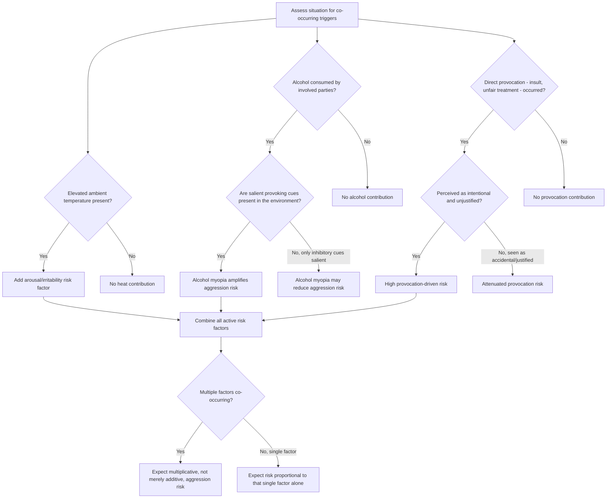

## Situational Triggers: Heat, Alcohol, Provocation

### Overview

This entry surveys three of the most extensively researched situational (proximate) inputs to aggression within the General Aggression Model framework: ambient heat, alcohol consumption, and direct provocation. Each represents a distinct causal pathway — environmental, pharmacological, and interpersonal, respectively — but all converge on the same underlying mechanism of altering the cognition-affect-arousal routes that determine whether an aggressive or non-aggressive response is enacted.

### Heat and Aggression

**The Heat Hypothesis**

- The heat hypothesis proposes that elevated ambient temperature increases aggressive behavior, operating through both physiological arousal and negative affect/irritability pathways
- Supported by convergent evidence across multiple methodologies: laboratory studies manipulating room temperature during aggression-paradigm tasks (see companion topic on operationalizing aggression), field/archival studies correlating temperature with violent crime rates across cities and seasons, and studies of specific real-world events

**Key Points**

- **Linear vs. curvilinear debate**: an early competing hypothesis proposed a **curvilinear (inverted-U)** relationship, suggesting aggression rises with heat up to a point but then declines at extreme temperatures as heat-induced lethargy/escape motivation overtakes aggressive motivation; however, [Inference] the weight of subsequent archival evidence, including large-scale crime-data analyses, has generally favored a **linear (or near-linear) positive relationship** across the range of temperatures typically studied, though this remains an area of continued empirical refinement
- **Archival evidence**: violent crime rates (assault, homicide) show consistent seasonal and geographic correlation with temperature, with hotter years, seasons, and regions generally associated with higher violent crime rates, controlling for other factors
- **Sports-based field evidence**: studies of Major League Baseball games have found associations between higher game-time temperatures and increased hit-by-pitch incidents (used as a real-world proxy for retaliatory aggression), controlling for pitcher skill and other confounds
- **Proposed mechanisms**: (1) direct physiological arousal and discomfort-driven irritability (consistent with Berkowitz's negative affect model), (2) routine-activity effects (heat increases outdoor social contact, increasing opportunities for interpersonal friction), and (3) potential excitation transfer from heat-induced arousal to unrelated provocations (see companion topic)
- **Climate change implications**: the heat-aggression literature has been extended into applied climate research, with some researchers projecting increases in interpersonal and intergroup violence associated with rising global temperatures, though such projections carry substantial uncertainty given the complexity of scaling laboratory and short-term archival findings to long-term societal outcomes

### Alcohol and Aggression

**Key Points**

- Alcohol is among the most consistently documented pharmacological correlates of aggression, with strong support across experimental (alcohol administration studies using standard aggression paradigms), correlational, and archival (crime and domestic violence statistics) research
- The relationship is **not simply dose-linear in a direct pharmacological sense** — alcohol's effect on aggression is substantially mediated by cognitive and situational factors rather than being a direct toxic effect on aggressive impulse alone

**Alcohol Myopia Theory (Steele & Josephs)**

- The dominant explanatory framework: alcohol narrows attentional capacity, causing individuals to focus disproportionately on the most **salient, immediate cues** in a situation while neglecting more subtle, distal, or inhibitory cues
- In a **provocative situation with salient provoking cues**, alcohol myopia is theorized to increase aggression, since attention narrows onto the provocation itself while inhibitory considerations (social consequences, empathy for the target, long-term costs) are relatively neglected
- In a **situation with salient inhibitory cues** (e.g., a visible authority figure, an obviously non-hostile explanation), alcohol myopia can actually **reduce** aggression, since attention narrows onto the inhibitory cue instead — illustrating that alcohol amplifies whatever is most situationally salient rather than uniformly increasing aggression
- **Expectancy effects**: alcohol's behavioral effects are also shaped by learned cultural expectancies about how alcohol "should" affect behavior; placebo-alcohol studies (participants believe they consumed alcohol but did not) have found increased aggression in some studies, indicating a genuine expectancy-driven component independent of pharmacological action
- **Interaction with provocation**: meta-analytic evidence consistently finds that alcohol's aggression-increasing effect is substantially **larger under conditions of provocation** than in unprovoked contexts, consistent with the myopia framework's emphasis on situational cue salience rather than a generalized pharmacological aggression trigger

**Applied Relevance**

- Alcohol involvement is disproportionately represented in domestic violence, bar/nightlife violence, and sexual assault statistics, informing situational-crime-prevention approaches (e.g., alcohol service policies, venue design) aimed at reducing provocative cue salience in drinking contexts

### Provocation

**Key Points**

- **Direct provocation** — an insult, physical affront, unfair treatment, or threat directed at the individual — is the most robust and extensively replicated proximate trigger of aggression across the experimental literature, consistently producing large effect sizes in standard aggression paradigms
- **Provocation operates through multiple GAM routes simultaneously**: cognitive (activating hostile attribution and aggressive scripts), affective (generating anger), and arousal (physiological activation), making it one of the most theoretically "complete" situational triggers
- **Attribution moderates the response magnitude**: consistent with earlier attribution research (see companion topic on the frustration-aggression hypothesis), provocation perceived as **intentional and unjustified** produces substantially stronger aggressive responding than provocation perceived as accidental, well-intentioned, or contextually justified
- **Reciprocity and escalation**: provocation-response sequences frequently escalate, since an aggressive response to initial provocation often functions as a new provocation to the original provocateur, creating an aggression "spiral" documented in both laboratory paradigms (using ascending-intensity retaliation designs, e.g., the Taylor Aggression Paradigm) and real-world conflict research
- **Individual differences moderate provocation sensitivity**: trait hostility, trait rejection sensitivity, and narcissistic traits (particularly threatened egotism) are associated with heightened aggressive responses to comparably sized provocations, illustrating the person-by-situation interaction central to GAM

### Interaction Effects Among the Three Triggers

**Key Points**

- These situational triggers are frequently studied in **combination** rather than isolation, since real-world aggressive incidents commonly involve co-occurring factors (e.g., a bar altercation on a hot summer night involving alcohol and a provoking insult)
- **Alcohol × provocation**: as noted above, this is the most robustly documented interaction — alcohol substantially amplifies aggressive responding specifically in provoked conditions
- **Heat × arousal transfer**: heat-induced arousal is theorized to be subject to excitation transfer, potentially amplifying responses to a co-occurring provocation beyond what either factor would produce alone (see companion topic)
- **Practical/forensic relevance**: this interactive, multiplicative pattern (rather than simple additive risk) has practical implications for violence-prevention efforts, suggesting that reducing any single contributing factor (e.g., cooling public spaces, reducing alcohol availability, de-escalation training to reduce provocation salience) may yield disproportionate reductions in aggression when multiple risk factors would otherwise co-occur

### Diagram: Convergence of Situational Triggers on Aggressive Outcome (svg_diagram)

<svg xmlns="http://www.w3.org/2000/svg" viewBox="0 0 780 420">
<text x="390" y="26" text-anchor="middle" font-size="16" font-weight="bold" fill="#1a1a1a">Situational Triggers Converging on Aggression (svg_diagram)</text>
<rect x="30" y="55" width="200" height="55" rx="8" fill="#fdf2e3" stroke="#b5762a" stroke-width="2" />
<text x="130" y="78" text-anchor="middle" font-size="12" fill="#1a1a1a">Heat</text>
<text x="130" y="95" text-anchor="middle" font-size="10" fill="#1a1a1a">Arousal + irritability</text>
<rect x="290" y="55" width="200" height="55" rx="8" fill="#fdf2e3" stroke="#b5762a" stroke-width="2" />
<text x="390" y="78" text-anchor="middle" font-size="12" fill="#1a1a1a">Alcohol</text>
<text x="390" y="95" text-anchor="middle" font-size="10" fill="#1a1a1a">Myopia narrows attention to salient cues</text>
<rect x="550" y="55" width="200" height="55" rx="8" fill="#fdf2e3" stroke="#b5762a" stroke-width="2" />
<text x="650" y="78" text-anchor="middle" font-size="12" fill="#1a1a1a">Provocation</text>
<text x="650" y="95" text-anchor="middle" font-size="10" fill="#1a1a1a">Cognition + affect + arousal</text>
<line x1="130" y1="110" x2="330" y2="160" stroke="#555" stroke-width="2" marker-end="url(#a9)" />
<line x1="390" y1="110" x2="390" y2="160" stroke="#555" stroke-width="2" marker-end="url(#a9)" />
<line x1="650" y1="110" x2="450" y2="160" stroke="#555" stroke-width="2" marker-end="url(#a9)" />
<rect x="270" y="165" width="240" height="55" rx="8" fill="#f3e9f7" stroke="#7a3b92" stroke-width="2" />
<text x="390" y="188" text-anchor="middle" font-size="12" fill="#1a1a1a">GAM Internal State</text>
<text x="390" y="205" text-anchor="middle" font-size="10" fill="#1a1a1a">Cognition / Affect / Arousal</text>
<line x1="390" y1="220" x2="390" y2="255" stroke="#555" stroke-width="2" marker-end="url(#a9)" />
<rect x="290" y="260" width="200" height="50" rx="8" fill="#e9f5ec" stroke="#2f7d46" stroke-width="2" />
<text x="390" y="290" text-anchor="middle" font-size="12" fill="#1a1a1a">Appraisal Process</text>
<line x1="390" y1="310" x2="390" y2="345" stroke="#555" stroke-width="2" marker-end="url(#a9)" />
<rect x="240" y="350" width="300" height="50" rx="8" fill="#fadcdc" stroke="#a13333" stroke-width="2" />
<text x="390" y="380" text-anchor="middle" font-size="12" fill="#1a1a1a">Aggressive Behavioral Outcome</text>
</svg>

### Process Flow: Assessing Combined Situational Risk

### Applied Example: Analyzing a Nightlife Violence Incident

**Output**

An altercation occurs outside a bar on a warm summer night after one patron bumps into another, spilling a drink. Applying the situational-triggers framework:

1. **Heat**: warm evening temperature contributes background arousal and irritability (heat hypothesis)
2. **Alcohol**: both parties have been drinking; per alcohol myopia theory, attention narrows onto the immediate salient cue — the spilled drink and the bump — while more distal inhibitory considerations (consequences of a public fight, uninvolved bystanders) are relatively neglected
3. **Provocation**: the bump and spill function as a provocation; attribution is critical — if perceived as a deliberate act ("he did that on purpose") rather than an accidental crowd-related bump, aggressive escalation risk rises sharply
4. **Interaction effect**: per the alcohol × provocation interaction, the combination of intoxication and a perceived-intentional provocation is expected to produce substantially higher aggression risk than either factor alone — consistent with the multiplicative pattern documented in the situational-triggers literature
5. **Prevention implication**: venue-level interventions (improved crowd spacing to reduce accidental bumps, staff trained to de-escalate before misattribution solidifies, managed alcohol service) target multiple risk factors simultaneously rather than relying on any single intervention point

### Related Topics / Next Steps

- The General Aggression Model (integrative framework — companion topic)
- Excitation transfer theory (heat and arousal mechanism — companion topic)
- Alcohol myopia theory (Steele & Josephs) in depth
- Frustration-aggression hypothesis and attribution of intent (companion topic)
- Climate change and projected violence trends
- Situational crime prevention and environmental design
- Threatened egotism and narcissistic reactivity to provocation
- Domestic violence risk factors and alcohol-involvement research