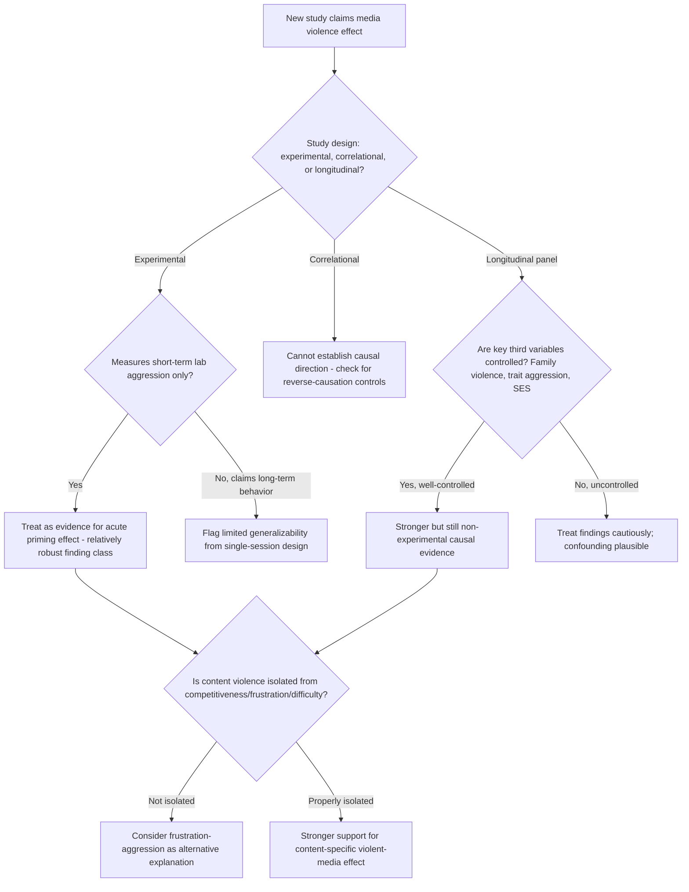

## Media Violence and Video Game Effects

### Overview

The study of media violence and video game effects examines whether exposure to violent television, film, and interactive video game content causally influences aggressive cognition, affect, and behavior. This is among the most methodologically scrutinized and publicly contested areas of aggression research, characterized by genuine scientific disagreement about effect size, causal direction, and real-world generalizability, alongside strong theoretical grounding in social learning theory, script theory, and the General Aggression Model.

### Theoretical Mechanisms

**Key Points**

- **Observational learning/modeling** (Bandura, social learning theory — see companion topic): media provides observational models whose aggressive behaviors can be encoded and later reproduced, following the same attention-retention-reproduction-motivation sequence as live models
- **Script acquisition** (Huesmann): repeated media exposure is theorized to contribute to the encoding of aggressive cognitive scripts — automated behavioral routines retrieved in matching real-world situations with minimal deliberation
- **Priming**: acute exposure to violent content can temporarily increase the cognitive accessibility of aggression-related concepts, increasing the likelihood that ambiguous subsequent social information is interpreted through an aggressive lens (hostile attribution bias activation)
- **Desensitization**: repeated exposure to violent content is theorized to produce habituation of the normal physiological and affective response to violence (e.g., reduced skin conductance response, reduced negative affect when viewing violent imagery), theoretically reducing the inhibitory "aversion" response that would otherwise discourage aggressive behavior
- **Excitation transfer** (see companion topic): arousing media content, including but not limited to violent content, can transfer residual arousal into subsequent unrelated provocations, complicating clean attribution of effects specifically to violent *content* versus general media-induced arousal
- **Within GAM**: acute exposure functions as a proximate situational input (affecting the immediate cognition-affect-arousal state); chronic exposure functions as a distal input contributing to the developmental cycle shaping long-term aggressive personality structures

### Research Methodologies

| Method | Description | Strength | Limitation |
| --- | --- | --- | --- |
| Laboratory experiments | Random assignment to violent vs. non-violent media, followed by standard aggression paradigm (see companion topic) | High internal validity, causal inference | Short-term measures, artificial context, questioned ecological validity |
| Cross-sectional correlational studies | Survey-based measurement of habitual media exposure and current aggression/attitudes | Real-world samples | Cannot establish causal direction |
| Longitudinal panel studies | Repeated measurement over months/years, allowing lagged-effect and cross-lagged panel analysis | Can partially address causal direction and reverse-causation concerns | Attrition, confound control challenges, still not fully experimental |
| Meta-analyses | Statistical aggregation across many studies | Larger effective sample, identifies overall trend | Sensitive to publication bias, study-selection criteria, and moderator coding decisions |

### Empirical Findings and the Ongoing Debate

**Key Points**

- **Meta-analytic consensus on direction**: the substantial majority of published meta-analyses (e.g., Anderson & Bushman-associated syntheses, Anderson et al. 2010) report **small-to-moderate positive associations** between violent media/video game exposure and aggressive behavior, aggressive cognition, and aggressive affect, alongside small negative associations with prosocial behavior and empathy
- **Effect size magnitude is contested**: reported effect sizes across meta-analyses commonly fall in a range that critics characterize as small in absolute terms (frequently discussed in relation to Cohen's conventional benchmarks, with many estimates near or below the "small effect" threshold), fueling disagreement about real-world practical significance despite statistical significance
- **Prominent critical positions**: researchers such as Christopher Ferguson have published meta-analyses and reviews reporting substantially smaller or null effects once methodological factors (publication bias correction, unstandardized aggression measures, researcher-allegiance effects) are accounted for, and have argued that laboratory aggression measures have uncertain translation to serious real-world violence
- **APA Task Force position**: the American Psychological Association's technical reports have generally concluded that violent video game exposure is a risk factor associated with increased aggression, while explicitly declining to characterize it as a primary predictor of serious real-world violent crime, situating it as one contributing factor among many (family environment, mental health, socioeconomic factors, peer influence)
- **Societal-level crime trend disconnect**: a frequently cited point in the debate is that violent crime rates among youth **declined** substantially in many countries during the period of rapid growth in violent video game popularity, a pattern critics argue is difficult to reconcile with claims of a strong causal aggression-increasing effect at the population level, though defenders note this comparison conflates individual-level psychological effects with population-level crime trends shaped by many co-occurring factors

### Publication Bias and Methodological Critiques

**Key Points**

- **Researcher allegiance effects**: some meta-analytic evidence suggests that studies conducted by researchers with a stated prior position (either pro- or anti-media-effects) tend to report effect sizes consistent with their prior stance, raising concerns about confirmation bias in study design and reporting across the field
- **Aggression measure heterogeneity**: as discussed in the companion topic on operationalizing aggression, studies vary widely in which proxy measure is used (noise-blast paradigms, word-completion tasks, self-report hostility), and meta-analytic pooling across dissimilar measures is a recurring methodological criticism
- **Publication bias correction methods**: techniques such as funnel-plot analysis and trim-and-fill procedures have been applied to this literature with mixed conclusions about the extent of file-drawer bias inflating the apparent effect
- **Debate over "third variable" confounds**: family violence exposure, trait aggression, and general sensation-seeking are commonly proposed confounds that could jointly cause both media preference and aggressive tendencies, complicating causal interpretation of correlational and even some longitudinal findings

### Distinguishing Short-Term and Long-Term Effects

**Key Points**

- **Short-term (priming) effects**: laboratory studies most consistently and robustly demonstrate immediate, short-duration increases in aggressive cognition and lab-based aggressive behavior following acute violent media exposure — this finding is comparatively less contested than long-term claims
- **Long-term (developmental) effects**: claims about cumulative, long-term real-world violent behavior are more heavily contested, given the methodological difficulty of isolating media as a causal factor across years of confounded developmental influences
- This short-term/long-term distinction is frequently proposed as a way to reconcile apparently conflicting findings in the literature: robust short-term laboratory effects on aggressive cognition and mild aggression measures do not necessarily imply an equally robust long-term causal effect on serious real-world violent behavior

### Video-Game-Specific Considerations

**Key Points**

- **Interactivity as a distinct mechanism**: video games are theorized to differ from passive media (film, television) because the player actively performs the aggressive action (via game controls) and often receives in-game rewards for successful violent acts — directly engaging the **vicarious/direct reinforcement** pathway from social learning theory rather than pure observation
- **Competitive vs. violent content confound**: some critics note that many studies comparing "violent" and "non-violent" games fail to adequately control for competitiveness, difficulty, and frustration level, raising the possibility that some observed aggression increases reflect general competitive frustration (see companion topic on the frustration-aggression hypothesis) rather than violent content specifically
- **Esports and prosocial gaming counter-evidence**: research on cooperative and prosocial game content has found corresponding increases in prosocial behavior following exposure, supporting the broader social-learning-based prediction that game content generally (not only violent content) shapes subsequent behavior in the modeled direction

### Diagram: Media Exposure Pathways to Aggression-Relevant Outcomes (svg_diagram)

<svg xmlns="http://www.w3.org/2000/svg" viewBox="0 0 780 440">
<text x="390" y="26" text-anchor="middle" font-size="16" font-weight="bold" fill="#1a1a1a">Media Violence: Short-Term and Long-Term Pathways (svg_diagram)</text>
<rect x="290" y="50" width="200" height="50" rx="8" fill="#e8eef7" stroke="#3b5b92" stroke-width="2" />
<text x="390" y="80" text-anchor="middle" font-size="12" fill="#1a1a1a">Violent Media Exposure</text>
<line x1="330" y1="100" x2="200" y2="140" stroke="#555" stroke-width="2" marker-end="url(#a10)" />
<line x1="450" y1="100" x2="580" y2="140" stroke="#555" stroke-width="2" marker-end="url(#a10)" />
<rect x="80" y="145" width="240" height="60" rx="8" fill="#fdf2e3" stroke="#b5762a" stroke-width="2" />
<text x="200" y="168" text-anchor="middle" font-size="12" fill="#1a1a1a">Acute Exposure</text>
<text x="200" y="185" text-anchor="middle" font-size="10" fill="#1a1a1a">Priming, excitation transfer</text>
<rect x="460" y="145" width="240" height="60" rx="8" fill="#fdf2e3" stroke="#b5762a" stroke-width="2" />
<text x="580" y="168" text-anchor="middle" font-size="12" fill="#1a1a1a">Chronic Exposure</text>
<text x="580" y="185" text-anchor="middle" font-size="10" fill="#1a1a1a">Script encoding, desensitization</text>
<line x1="200" y1="205" x2="200" y2="245" stroke="#555" stroke-width="2" marker-end="url(#a10)" />
<line x1="580" y1="205" x2="580" y2="245" stroke="#555" stroke-width="2" marker-end="url(#a10)" />
<rect x="80" y="250" width="240" height="55" rx="8" fill="#e9f5ec" stroke="#2f7d46" stroke-width="2" />
<text x="200" y="273" text-anchor="middle" font-size="12" fill="#1a1a1a">Short-Term Effect</text>
<text x="200" y="290" text-anchor="middle" font-size="10" fill="#1a1a1a">Lab aggression measures (robust)</text>
<rect x="460" y="250" width="240" height="55" rx="8" fill="#f3e9f7" stroke="#7a3b92" stroke-width="2" />
<text x="580" y="273" text-anchor="middle" font-size="12" fill="#1a1a1a">Long-Term Effect</text>
<text x="580" y="290" text-anchor="middle" font-size="10" fill="#1a1a1a">Real-world behavior (contested)</text>
<line x1="200" y1="305" x2="390" y2="345" stroke="#555" stroke-width="2" marker-end="url(#a10)" />
<line x1="580" y1="305" x2="390" y2="345" stroke="#555" stroke-width="2" marker-end="url(#a10)" />
<rect x="230" y="350" width="320" height="55" rx="8" fill="#fdeaea" stroke="#a13333" stroke-width="2" />
<text x="390" y="373" text-anchor="middle" font-size="12" fill="#1a1a1a">Moderated by third variables</text>
<text x="390" y="390" text-anchor="middle" font-size="10" fill="#1a1a1a">Family environment, trait aggression, SES</text>
</svg>

### Process Flow: Evaluating a Media-Violence Study's Claims

### Applied Example: Interpreting a Contested Finding

**Output**

A new meta-analysis reports a small positive correlation ($r \approx 0.15$) between violent video game play and aggressive behavior across 50 studies, while a competing meta-analysis by different researchers reports a near-zero effect after publication-bias correction. Applying the evaluative framework:

1. **Check effect size interpretation**: $r \approx 0.15$ falls within the commonly cited "small effect" range under conventional benchmarks — statistically real but practically modest at the individual level
2. **Check for researcher allegiance patterns**: verify whether the diverging meta-analyses differ systematically by known prior researcher positions, a documented pattern in this specific literature
3. **Check publication-bias correction methods**: determine whether the near-zero finding resulted from trim-and-fill or other bias-correction procedures, and whether those procedures are methodologically well-justified for this dataset
4. **Distinguish claim type**: determine whether either meta-analysis is claiming a short-term cognitive/lab-behavior effect (more consistently supported) versus a long-term real-world violent-crime effect (more contested)
5. **Conclusion**: the appropriate synthesis is typically that a small, statistically reliable association with aggressive cognition and mild lab-based aggression is reasonably well-supported, while claims about video games as a substantial cause of serious real-world violence remain a genuinely unresolved empirical and methodological debate within the field

### Related Topics / Next Steps

- Social learning theory of aggression (companion topic, core mechanism)
- The General Aggression Model (proximate/distal input integration — companion topic)
- Desensitization to violence: physiological and attitudinal measures
- Excitation transfer theory (arousal confound in media studies — companion topic)
- Publication bias and meta-analytic methodology in psychology
- APA and other professional body position statements on media effects
- Prosocial media and video game effects (contrasting evidence)
- Youth violent crime trends and population-level versus individual-level effect interpretation