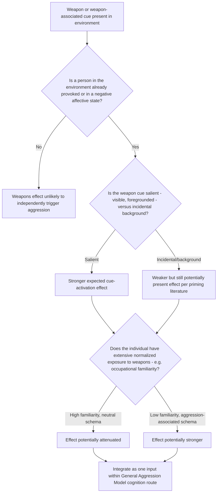

## The Weapons Effect

### Overview

The weapons effect refers to the empirical finding that the mere visual presence of a weapon can increase aggressive thoughts, feelings, and behaviors, even without the weapon being used or threatened. First demonstrated by Leonard Berkowitz and Anthony LePage in 1967, the effect became a cornerstone finding supporting cognitive neoassociation theory and remains one of the most replicated (and debated) phenomena in aggression research.

### The Original Berkowitz and LePage Study (1967)

**Key Points**

- **Design**: provoked and non-provoked participants were seated at a table where either a **shotgun and revolver** (weapons condition), **badminton racquets** (neutral object condition), or **no objects** (control condition) were present, ostensibly left over from a previous unrelated experiment
- Participants were told the objects belonged to another participant or were irrelevant to the study, minimizing any explicit instruction to attend to or use them
- **Dependent variable**: shock intensity delivered to a confederate in a standard aggression paradigm (see companion topic on operationalizing aggression)
- **Key finding**: **provoked** participants in the weapons-present condition delivered **significantly more intense shocks** than provoked participants in the neutral-object or no-object conditions — despite never touching, holding, or being told to use the weapons
- Critically, the effect was found primarily among **provoked** participants; non-provoked participants showed little to no weapons-effect difference across conditions, establishing that the effect amplifies an existing aggressive state rather than independently generating one

### Theoretical Explanation: Cognitive Neoassociation

**Key Points**

- Berkowitz's **cognitive neoassociationistic model** (see companion topic on the frustration-aggression hypothesis) proposes that weapons function as **aggression-associated cues** stored in associative memory networks alongside aggression-related concepts, feelings, and action tendencies
- When a person is already in a state of negative affect/anger (e.g., following provocation), the mere perception of a weapon **automatically activates** this associative network, increasing the cognitive accessibility of aggressive thoughts and lowering the threshold for aggressive behavioral responding
- This is theorized to occur largely **outside conscious deliberation** — the effect does not require the person to consciously plan to use the weapon or even consciously register its aggressive significance
- The phrase commonly associated with this line of research — **"the finger pulls the trigger, but the trigger may also be pulling the finger"** — captures the counterintuitive claim that environmental cues can shape behavior in ways beyond simple instrumental availability

### Replications, Boundary Conditions, and Meta-Analytic Support

**Key Points**

- The weapons effect has been replicated across numerous studies using varied methodologies (word-completion/lexical decision tasks measuring aggressive cognition accessibility, as well as behavioral aggression paradigms), with a **meta-analysis by Carlson, Marcus-Newhall, and Miller (1990)** finding a reliable overall effect across the accumulated literature, though with meaningful variability in magnitude across study designs
- **Moderating factors identified in subsequent research**:
  - **Prior provocation**: the effect is consistently stronger, and in some studies only present, among provoked participants, consistent with the original finding
  - **Familiarity and ownership context**: some studies suggest the effect may be attenuated among individuals with extensive, normalized weapon exposure (e.g., hunters, some law enforcement or military samples), for whom weapons may be less strongly associated with aggression-specific cognitive networks and more associated with sport, occupational, or neutral schemas — an active area of continued study
  - **Explicit vs. incidental presentation**: effects are generally more consistent when weapon presence is incidental/background rather than a deliberate focal manipulation, though study designs vary
- **Extension beyond firearms**: subsequent research has examined weapon-related words, images, and even weapon-associated brand names/media content as cues capable of producing smaller-scale priming effects on aggressive cognition, extending the original physical-object finding into a broader cue-priming literature

### Integration with the General Aggression Model

**Key Points**

- Within GAM (see companion topic), the weapons effect is classified as a **situational input** operating primarily through the **cognition route** — weapon presence increases the accessibility of aggressive scripts and hostile interpretive frames, which then interacts with concurrent affect and arousal states
- The finding that the effect is **conditional on prior provocation** is a clear illustration of GAM's person-by-situation interaction principle: the weapon cue alone (without an activated negative affective/cognitive state) is insufficient to reliably produce aggression, but it substantially amplifies aggression when combined with an already-activated aggressive internal state
- This positions the weapons effect as complementary to, rather than competing with, the **provocation** and other situational-trigger literature (see companion topic on heat, alcohol, and provocation)

### Critiques and Alternative Interpretations

**Key Points**

- **Demand characteristics critique**: some researchers (e.g., early critiques by Buss and colleagues) argued that participants in early weapons-effect studies may have inferred the experimental hypothesis from the presence of weapons and adjusted their behavior to match perceived expectations, though subsequent studies using less transparent designs and implicit cognitive measures (word-completion tasks measuring reaction time rather than deliberate behavior) have found supportive evidence less vulnerable to this critique
- **Effect size debate**: as with media-violence research, the practical/real-world magnitude of the weapons effect (as opposed to its statistical reliability) remains debated; [Inference] most researchers in this area treat it as one moderate contributing situational factor within a broader multi-causal aggression framework rather than a sufficient standalone explanation for firearm violence
- **Real-world extrapolation caution**: laboratory demonstrations using non-injurious proxy aggression measures are frequently noted as having uncertain direct translation to serious real-world armed violence, which involves numerous additional situational, legal, and motivational factors beyond simple cue-priming

### Applied and Policy-Relevant Discussion

**Key Points**

- The weapons effect has been cited in discussions of **household firearm storage** and **environmental design** in contexts prone to interpersonal conflict (e.g., domestic disputes), on the theoretical basis that reducing weapon visibility/accessibility during high-conflict-risk situations may reduce cue-triggered escalation, independent of any question about firearm use intent
- The finding has also informed discussion of **media and advertising imagery** featuring weapons in contexts unrelated to their function (e.g., background props), based on the broader cue-priming literature extending beyond the original physical-object paradigm
- [Speculation] Some public-health-oriented researchers have proposed that weapons-effect research supports environmental/situational violence-prevention strategies (reducing incidental weapon visibility in high-conflict settings) as a complement to individual-level interventions, though the direct empirical evidence linking this specific mechanism to real-world violence-reduction outcomes is comparatively limited relative to the laboratory cue-priming evidence base.

### Diagram: The Weapons Effect Mechanism (svg_diagram)

<svg xmlns="http://www.w3.org/2000/svg" viewBox="0 0 780 400">
<text x="390" y="26" text-anchor="middle" font-size="16" font-weight="bold" fill="#1a1a1a">The Weapons Effect: Cue-Activation Pathway (svg_diagram)</text>
<rect x="60" y="55" width="200" height="50" rx="8" fill="#e8eef7" stroke="#3b5b92" stroke-width="2" />
<text x="160" y="85" text-anchor="middle" font-size="12" fill="#1a1a1a">Prior Provocation</text>
<rect x="520" y="55" width="200" height="50" rx="8" fill="#e8eef7" stroke="#3b5b92" stroke-width="2" />
<text x="620" y="85" text-anchor="middle" font-size="12" fill="#1a1a1a">Weapon Cue Present</text>
<line x1="200" y1="105" x2="330" y2="145" stroke="#555" stroke-width="2" marker-end="url(#a11)" />
<line x1="580" y1="105" x2="450" y2="145" stroke="#555" stroke-width="2" marker-end="url(#a11)" />
<rect x="280" y="150" width="220" height="55" rx="8" fill="#fdf2e3" stroke="#b5762a" stroke-width="2" />
<text x="390" y="173" text-anchor="middle" font-size="12" fill="#1a1a1a">Aggressive Associative</text>
<text x="390" y="190" text-anchor="middle" font-size="11" fill="#1a1a1a">Network Activated</text>
<line x1="390" y1="205" x2="390" y2="240" stroke="#555" stroke-width="2" marker-end="url(#a11)" />
<rect x="280" y="245" width="220" height="55" rx="8" fill="#f3e9f7" stroke="#7a3b92" stroke-width="2" />
<text x="390" y="268" text-anchor="middle" font-size="12" fill="#1a1a1a">Increased Accessibility of</text>
<text x="390" y="285" text-anchor="middle" font-size="11" fill="#1a1a1a">Hostile Cognition / Scripts</text>
<line x1="390" y1="300" x2="390" y2="335" stroke="#555" stroke-width="2" marker-end="url(#a11)" />
<rect x="250" y="340" width="280" height="50" rx="8" fill="#fadcdc" stroke="#a13333" stroke-width="2" />
<text x="390" y="370" text-anchor="middle" font-size="12" fill="#1a1a1a">Amplified Aggressive Response</text>
</svg>

### Process Flow: Assessing Weapons-Effect Relevance in a Setting

### Applied Example: Analyzing a Domestic Conflict Scenario

**Output**

A heated argument between two housemates occurs in a living room where a hunting rifle is visibly mounted on the wall (unrelated to the argument, present as decor). Applying the weapons-effect framework:

1. **Provocation check**: the argument itself constitutes an active provocation/negative-affect state, satisfying the necessary precondition identified in the original Berkowitz and LePage finding
2. **Salience check**: the mounted rifle is visually present and likely salient given the room's context, though not being actively referenced or handled
3. **Familiarity consideration**: if one or both housemates have extensive normalized exposure to firearms (e.g., a hunting background), the associative link to aggression-specific cognition may be attenuated relative to someone with minimal prior weapon exposure, per the boundary-condition research
4. **Predicted mechanism**: per cognitive neoassociation theory, the combination of active provocation and visible weapon cue is predicted to increase the cognitive accessibility of hostile thoughts and lower the threshold for behavioral escalation, independent of any conscious intention by either party to use the weapon
5. **Practical implication**: this analysis is frequently cited in support of situational violence-prevention recommendations (e.g., firearm storage practices) as a complement to, not a replacement for, addressing the underlying interpersonal conflict itself

### Related Topics / Next Steps

- Berkowitz's cognitive neoassociation model (companion topic within frustration-aggression hypothesis)
- The General Aggression Model — cognition route integration (companion topic)
- Priming and cognitive accessibility in social cognition research
- Situational triggers: heat, alcohol, provocation (companion topic)
- Firearm storage and household violence-prevention research
- Media violence and incidental weapon imagery (companion topic)
- Demand characteristics and implicit measurement in experimental psychology
- Domestic violence risk factors and environmental design interventions