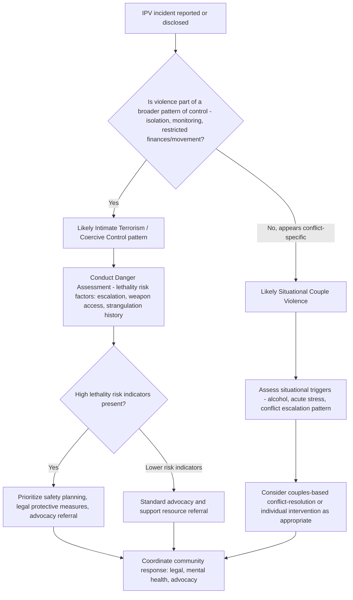

## Intimate Partner Violence

### Overview

Intimate partner violence (IPV) refers to physical, sexual, or psychological harm inflicted by a current or former romantic partner. As a topic within aggression and violence research, IPV integrates the situational and biological aggression mechanisms covered elsewhere in this chapter with relationship-specific dynamics, distinct typologies, and specialized measurement and intervention approaches. IPV is distinguished from general interpersonal aggression by its embeddedness within an ongoing, often emotionally significant, relationship context.

### Definitions and Scope

**Key Points**

- IPV encompasses multiple forms of harm: **physical violence** (hitting, pushing, use of weapons), **sexual violence** (coerced or non-consensual sexual activity within the relationship), **psychological/emotional abuse** (threats, humiliation, isolation, controlling behavior), and **coercive control** (a pattern of behavior designed to dominate and restrict a partner's autonomy, which may or may not include discrete violent incidents)
- IPV occurs across relationship types, including marital, dating, cohabiting, and same-sex relationships; historical research disproportionately focused on male-to-female heterosexual violence, but the field has since expanded to document female-to-male, same-sex, and bidirectional violence patterns
- **Coercive control** (Evan Stark) has been increasingly recognized in both research and some legal jurisdictions as a distinct, often more damaging pattern than isolated violent incidents, since it can produce comprehensive restriction of a victim's freedom and autonomy even with infrequent or no physical violence

### Typologies of Intimate Partner Violence

**Michael Johnson's Typology**

A widely cited framework distinguishing IPV subtypes by underlying dynamic rather than treating all IPV as a single homogeneous phenomenon:

| Type | Description | Key Feature |
| --- | --- | --- |
| Intimate Terrorism (Coercive Controlling Violence) | Violence embedded within a broader pattern of coercive control and domination | Asymmetric; typically perpetrated predominantly by one partner |
| Situational Couple Violence | Violence arising from specific conflict escalation, not part of a broader control pattern | Most common type in general population samples; often bidirectional |
| Violent Resistance | Violence used defensively by a victim of intimate terrorism | Reactive, not primarily motivated by control |
| Mutual Violent Control | Both partners exhibit controlling, violent behavior | Comparatively rare in the empirical literature |

**Key Points**

- [Inference] This typology has substantially influenced the field's understanding of why survey research using different sampling methods (e.g., general population surveys versus shelter/clinical samples) produces divergent findings about gender symmetry in IPV — general population surveys capture more situational couple violence (which shows more gender symmetry), while shelter and clinical samples disproportionately capture intimate terrorism (which shows a stronger asymmetric pattern), a methodological point central to the long-running "gender symmetry debate" in IPV research

### The Gender Symmetry Debate

**Key Points**

- Some survey-based research using instruments like the **Conflict Tactics Scale (CTS)** has found comparable rates of physical aggression perpetration reported by men and women in relationships, a finding that has generated substantial scholarly debate
- Critics of the symmetry interpretation argue that **CTS-based measures** often fail to capture injury severity, context (self-defense vs. initiation), fear induced, and coercive control patterns, and that physical outcomes (injury rates, homicide rates) remain substantially asymmetric, with women disproportionately experiencing severe injury, sexual violence, and intimate partner homicide
- The consensus reflected in current research generally supports **Johnson's typological resolution**: aggregate symmetry findings partly reflect the inclusion of situational couple violence (which does show more symmetric patterns) alongside the comparatively rarer, more asymmetric, and more severe intimate terrorism pattern, rather than either extreme position being fully correct on its own

### Risk Factors and Theoretical Mechanisms

**Individual-Level Risk Factors**

- Prior exposure to family violence during childhood (consistent with social learning theory — see companion topic — and the intergenerational transmission of violence)
- Trait hostility, hostile attribution bias, and poor emotion regulation
- Alcohol and substance use (consistent with alcohol myopia theory — see companion topic on situational triggers)
- Attachment insecurity, particularly anxious attachment combined with poor conflict-resolution skills

**Relationship-Level Risk Factors**

- Relationship conflict frequency and escalation patterns
- Power imbalances and economic dependency
- Jealousy and controlling behavior, which evolutionary theorists (see companion topic on biological/evolutionary bases) have linked to mate-guarding mechanisms, though this framework does not account for the full range of IPV patterns and is one of several competing explanatory approaches

**Societal-Level Risk Factors**

- Patriarchal social norms and gender inequality (emphasized particularly within feminist theoretical frameworks as structural, rather than purely individual, contributors)
- Economic stress and unemployment, consistent with frustration-aggression mechanisms (see companion topic) applied to relationship contexts
- Social isolation, which both increases vulnerability to controlling behavior and reduces access to protective intervention

### Cycle of Violence Theory (Lenore Walker)

**Key Points**

- Proposes a recurring **three-phase pattern** in abusive relationships: (1) **tension-building phase** (rising stress, minor conflicts), (2) **acute battering incident** (the violent episode itself), and (3) **honeymoon/reconciliation phase** (apology, affection, promises of change)
- The honeymoon phase is theorized to be a key mechanism sustaining the relationship despite violence, as it provides intermittent positive reinforcement (consistent with **intermittent reinforcement** learning principles, which produce behavior patterns that are particularly resistant to extinction) and can foster hope for change in the victim
- [Inference] While influential and widely taught, this cyclical model has been critiqued in later research as not universally applicable across all IPV relationships, particularly for the more chronic, less-cyclical coercive control pattern described in Johnson's typology, and contemporary practitioners generally treat it as one common but non-universal pattern

### Measurement Approaches

**Key Points**

- **Conflict Tactics Scale (CTS/CTS2)**: the most widely used self-report instrument, measuring frequency of specific tactics (reasoning, verbal aggression, physical assault, injury, sexual coercion) — subject to the symmetry-debate critiques noted above regarding context and severity capture
- **Danger Assessment Instrument**: a risk-assessment tool used in clinical and legal/advocacy contexts to estimate lethality risk in ongoing abusive relationships, incorporating escalation history, weapon access, and controlling-behavior indicators
- **Qualitative and mixed-methods approaches**: increasingly used to capture coercive control dynamics and victim experience dimensions poorly captured by frequency-count instruments like the CTS

### Consequences and Intervention

**Key Points**

- **Physical and mental health consequences**: documented associations with injury, chronic pain conditions, and elevated rates of depressive and anxiety symptoms among survivors, alongside broader impacts on children who witness IPV even without being direct targets
- **Batterer intervention programs**: commonly based on cognitive-behavioral and psychoeducational models targeting anger management, hostile attribution bias, and learned relational scripts (drawing on the social-learning and General Aggression Model mechanisms discussed in companion topics), though outcome research on program effectiveness shows mixed and generally modest results across evaluation studies
- **Situational risk-reduction approaches**: informed by the situational-triggers literature (alcohol, provocation) and the weapons-effect literature (see companion topics), including firearm-access restriction in high-risk cases and substance-use intervention
- **Coordinated community response models**: integrate legal, advocacy, and mental-health systems, reflecting the field's move toward addressing IPV as a multi-level (individual, relational, societal) phenomenon rather than a purely individual-psychological one

### Diagram: Integrated Risk Model for Intimate Partner Violence (svg_diagram)

<svg xmlns="http://www.w3.org/2000/svg" viewBox="0 0 780 440">
<text x="390" y="26" text-anchor="middle" font-size="16" font-weight="bold" fill="#1a1a1a">Integrated IPV Risk Model (svg_diagram)</text>
<rect x="30" y="50" width="220" height="55" rx="8" fill="#e8eef7" stroke="#3b5b92" stroke-width="2" />
<text x="140" y="73" text-anchor="middle" font-size="11" fill="#1a1a1a">Individual Factors</text>
<text x="140" y="90" text-anchor="middle" font-size="10" fill="#1a1a1a">Childhood modeling, hostility</text>
<rect x="280" y="50" width="220" height="55" rx="8" fill="#fdf2e3" stroke="#b5762a" stroke-width="2" />
<text x="390" y="73" text-anchor="middle" font-size="11" fill="#1a1a1a">Relationship Factors</text>
<text x="390" y="90" text-anchor="middle" font-size="10" fill="#1a1a1a">Conflict, jealousy, power imbalance</text>
<rect x="530" y="50" width="220" height="55" rx="8" fill="#f3e9f7" stroke="#7a3b92" stroke-width="2" />
<text x="640" y="73" text-anchor="middle" font-size="11" fill="#1a1a1a">Societal Factors</text>
<text x="640" y="90" text-anchor="middle" font-size="10" fill="#1a1a1a">Norms, economic stress, isolation</text>
<line x1="140" y1="105" x2="330" y2="150" stroke="#555" stroke-width="2" marker-end="url(#a12)" />
<line x1="390" y1="105" x2="390" y2="150" stroke="#555" stroke-width="2" marker-end="url(#a12)" />
<line x1="640" y1="105" x2="450" y2="150" stroke="#555" stroke-width="2" marker-end="url(#a12)" />
<rect x="270" y="155" width="240" height="50" rx="8" fill="#f7f7f7" stroke="#444" stroke-width="2" />
<text x="390" y="185" text-anchor="middle" font-size="12" fill="#1a1a1a">Situational Trigger + Provocation</text>
<line x1="390" y1="205" x2="390" y2="240" stroke="#555" stroke-width="2" marker-end="url(#a12)" />
<rect x="230" y="245" width="320" height="45" rx="8" fill="#fdeaea" stroke="#a13333" stroke-width="2" />
<text x="390" y="273" text-anchor="middle" font-size="12" fill="#1a1a1a">IPV Incident Occurs</text>
<line x1="330" y1="290" x2="220" y2="330" stroke="#555" stroke-width="2" marker-end="url(#a12)" />
<line x1="450" y1="290" x2="560" y2="330" stroke="#555" stroke-width="2" marker-end="url(#a12)" />
<rect x="90" y="335" width="260" height="55" rx="8" fill="#e9f5ec" stroke="#2f7d46" stroke-width="2" />
<text x="220" y="358" text-anchor="middle" font-size="11" fill="#1a1a1a">Situational Couple Violence</text>
<text x="220" y="375" text-anchor="middle" font-size="10" fill="#1a1a1a">Isolated, bidirectional pattern</text>
<rect x="430" y="335" width="260" height="55" rx="8" fill="#fadcdc" stroke="#a13333" stroke-width="2" />
<text x="560" y="358" text-anchor="middle" font-size="11" fill="#1a1a1a">Intimate Terrorism</text>
<text x="560" y="375" text-anchor="middle" font-size="10" fill="#1a1a1a">Coercive control pattern, asymmetric</text>
</svg>

### Process Flow: Classifying an IPV Case for Appropriate Response

### Applied Example: Differentiating Two Clinical Presentations

**Output**

Two couples present separately to a clinician reporting relationship violence.

**Couple A**: Both partners report occasional pushing/shoving during heated arguments about finances, roughly equal frequency reported by both, no reported fear of the other partner, no controlling behavior pattern (isolation, monitoring) described.

**Couple B**: One partner describes their spouse controlling all finances, monitoring phone activity, restricting contact with friends and family, and periodic physical violence following any perceived defiance; describes persistent fear of the partner.

Applying the typological framework:

1. **Couple A** fits the **situational couple violence** pattern — conflict-triggered, roughly bidirectional, no coercive-control markers; per Johnson's typology, this pattern typically responds better to conflict-resolution-oriented intervention approaches
2. **Couple B** fits the **intimate terrorism/coercive control** pattern — asymmetric, embedded within a systematic control structure, with fear as a defining feature; per the risk literature, this pattern warrants a formal danger assessment and prioritizes safety planning over couples-conflict-resolution approaches, given the different underlying dynamic and associated risk profile
3. **Clinical implication**: applying a single undifferentiated IPV intervention model to both cases would be inappropriate given their distinct mechanisms, risk profiles, and appropriate intervention pathways — the core practical contribution of the typological approach

### Related Topics / Next Steps

- Social learning theory and intergenerational transmission of violence (companion topic)
- Situational triggers: heat, alcohol, provocation (companion topic)
- Evolutionary bases of jealousy and mate-guarding (companion topic on biological/evolutionary aggression)
- Coercive control theory (Evan Stark) in depth
- Batterer intervention program outcome research
- Danger assessment and lethality risk prediction
- Children's exposure to IPV and developmental outcomes
- Legal and policy responses to intimate partner violence