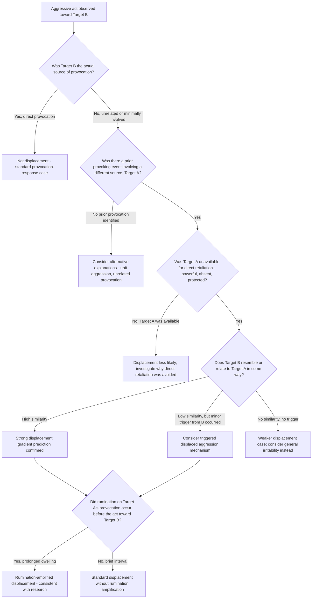

## Displaced Aggression and Scapegoating

### Overview

Displaced aggression occurs when an individual redirects aggressive impulses away from the original provoking source toward a substitute target, typically because retaliation against the actual source is unavailable, unsafe, or socially prohibited. Scapegoating extends this individual-level mechanism to group and societal levels, where collective frustration is redirected toward a relatively powerless outgroup. Both phenomena trace their theoretical roots to the frustration-aggression hypothesis and remain relevant to contemporary integrative aggression theory and intergroup relations research.

### Theoretical Origins

**Key Points**

- The concept originates in the **Dollard, Doob, Miller, Mowrer, and Sears (1939)** frustration-aggression formulation (see companion topic), which proposed displacement as a resolution to a specific puzzle: why aggression sometimes appears directed at targets who did not cause the original frustration
- **Psychodynamic roots**: the earliest formulations drew on Freudian drive-discharge concepts, treating aggressive "energy" generated by frustration as requiring some form of outlet, with displacement representing a substitute discharge pathway when the direct pathway is blocked
- **Miller's displacement gradient model (1948)**: proposed that the tendency to aggress toward a target is a function of two competing gradients — the **gradient of approach/instigation to aggress** (strongest toward the actual frustration source) and the **gradient of inhibition/fear of retaliation** (also strongest toward the actual source, particularly if it is powerful); displacement occurs toward targets where the net balance of instigation-minus-inhibition is more favorable than toward the original source

### The Displacement Gradient

**Key Points**

- Miller's model predicts that displaced aggression is **strongest toward targets that closely resemble the original source** (in similarity, proximity, or association) and **weakens as target similarity/proximity decreases**
- This generates a specific, testable prediction: aggression displaced toward a moderately similar substitute target should exceed aggression displaced toward a highly dissimilar target, producing a gradient rather than an all-or-nothing displacement pattern
- **Empirical support**: laboratory studies using **triggered displaced aggression paradigms** — in which a participant is provoked by one source and then given an opportunity to aggress against an unrelated, innocent second party — have consistently demonstrated elevated aggression toward the innocent target relative to non-provoked controls, confirming the core displacement phenomenon
- **Target availability as the key situational moderator**: displacement is most likely when the original source is unavailable for direct retaliation (physically absent, too powerful, e.g., an authority figure or employer, or protected by social/legal consequences for retaliation)

### Triggered Displaced Aggression

**Key Points**

- A refined experimental paradigm (Pedersen, Bushman, Vasquez, and colleagues) demonstrated that displaced aggression can be **triggered** by even a minor subsequent provocation from the substitute target, producing disproportionately intense aggression relative to what that minor trigger alone would generate
- This "triggered displaced aggression" finding is theoretically important because it shows displacement is not purely passive redirection but can be **catalyzed by a small additional provocation**, consistent with an excitation-transfer-like mechanism (see companion topic) whereby residual anger/arousal from the original provocation combines with the new minor trigger to produce an amplified response
- This pattern helps explain common real-world experiences of disproportionate reactions to minor irritations following an earlier, unrelated stressful event (e.g., snapping at a family member after a frustrating day at work triggered by a trivial household issue)

### Rumination as an Amplifying Mechanism

**Key Points**

- Subsequent research (notably by Bushman and colleagues) has examined the role of **rumination** — repetitive, prolonged mental dwelling on a provoking event — in sustaining and amplifying displaced aggression
- Rumination is theorized to **prolong the physiological and cognitive arousal state** generated by the original provocation, extending the window during which excitation transfer and displacement remain likely, in contrast to distraction or venting-alternative activities, which are generally associated with faster arousal dissipation
- [Inference] This finding has practical relevance for anger-management approaches, generally supporting distraction or engagement-based coping strategies over prolonged dwelling on a provoking incident, though direct expression-based "venting" has also been found in some research to fail to reduce (and sometimes increase) subsequent aggression, complicating simple coping recommendations

### Scapegoating: The Group-Level Extension

**Key Points**

- **Scapegoat theory** extends displacement to the intergroup level, proposing that widespread societal frustration (e.g., economic hardship, unemployment, social upheaval) can be collectively redirected toward a socially available, comparatively powerless outgroup, historically invoked as a contributing explanation for periods of heightened prejudice and intergroup hostility
- **Historical illustrative correlational analyses**: early scapegoat-theory-adjacent research (e.g., Hovland and Sears' widely cited but later methodologically contested analysis linking cotton price fluctuations to lynching rates in the early 20th-century American South) attempted to demonstrate economic-frustration-to-displaced-outgroup-aggression correlations at a societal level
- **Target selection in scapegoating**: consistent with the individual-level displacement gradient, scapegoated groups are theorized to be selected based on **social availability** (visibility, proximity) and **relative powerlessness** (limited capacity for retaliation or political defense), rather than any actual causal responsibility for the frustrating societal condition

### Contemporary Standing of Scapegoat Theory

**Key Points**

- [Inference] While scapegoating remains a widely taught and intuitively compelling explanatory framework, contemporary intergroup relations research treats it as **one contributing mechanism among several** rather than a complete standalone explanation for prejudice or intergroup violence, generally integrated alongside **realistic conflict theory** (competition over actual scarce resources) and **social identity theory** (ingroup favoritism and outgroup derogation as identity-maintenance processes)
- **Methodological critiques of classic scapegoat studies**: later re-analyses of foundational correlational studies (such as the cotton-price/lynching research) have raised concerns about the robustness of the original statistical findings, and contemporary researchers generally treat these historical studies as illustrative rather than definitive causal evidence
- **Modern applications**: scapegoat-theory-adjacent frameworks continue to be invoked in analyses of contemporary intergroup hostility during periods of economic strain, immigration anxiety, and social change, though current scholarship emphasizes multi-causal models over the singular economic-frustration mechanism of the original formulation

### Distinguishing Displacement from Related Concepts

| Concept | Key Distinction |
| --- | --- |
| Displacement | Aggression redirected toward an unrelated substitute target due to unavailability of the original source |
| Catharsis | Discharge of aggressive drive reducing subsequent aggressive urges — empirically largely unsupported and distinct from displacement, which does not require drive-reduction to occur |
| Scapegoating | Group-level, socially patterned displacement targeting a relatively powerless outgroup |
| Triggered displaced aggression | Displacement catalyzed by a subsequent minor provocation from the substitute target, rather than occurring without any secondary trigger |

### Diagram: Displacement and Scapegoating Pathway (svg_diagram)

<svg xmlns="http://www.w3.org/2000/svg" viewBox="0 0 780 440">
<text x="390" y="26" text-anchor="middle" font-size="16" font-weight="bold" fill="#1a1a1a">Displaced Aggression and Scapegoating Pathway (svg_diagram)</text>
<rect x="290" y="50" width="200" height="50" rx="8" fill="#e8eef7" stroke="#3b5b92" stroke-width="2" />
<text x="390" y="80" text-anchor="middle" font-size="12" fill="#1a1a1a">Original Frustration Source</text>
<line x1="390" y1="100" x2="390" y2="130" stroke="#555" stroke-width="2" marker-end="url(#a13)" />
<rect x="290" y="130" width="200" height="55" rx="8" fill="#fdf2e3" stroke="#b5762a" stroke-width="2" />
<text x="390" y="153" text-anchor="middle" font-size="12" fill="#1a1a1a">Source Unavailable</text>
<text x="390" y="170" text-anchor="middle" font-size="10" fill="#1a1a1a">Too powerful / absent / protected</text>
<line x1="330" y1="185" x2="190" y2="225" stroke="#555" stroke-width="2" marker-end="url(#a13)" />
<line x1="450" y1="185" x2="590" y2="225" stroke="#555" stroke-width="2" marker-end="url(#a13)" />
<rect x="60" y="230" width="260" height="55" rx="8" fill="#f3e9f7" stroke="#7a3b92" stroke-width="2" />
<text x="190" y="253" text-anchor="middle" font-size="11" fill="#1a1a1a">Individual-Level Displacement</text>
<text x="190" y="270" text-anchor="middle" font-size="10" fill="#1a1a1a">Substitute target, gradient of similarity</text>
<rect x="460" y="230" width="260" height="55" rx="8" fill="#f3e9f7" stroke="#7a3b92" stroke-width="2" />
<text x="590" y="253" text-anchor="middle" font-size="11" fill="#1a1a1a">Group-Level Scapegoating</text>
<text x="590" y="270" text-anchor="middle" font-size="10" fill="#1a1a1a">Socially available, powerless outgroup</text>
<line x1="190" y1="285" x2="190" y2="320" stroke="#555" stroke-width="2" marker-end="url(#a13)" />
<line x1="590" y1="285" x2="590" y2="320" stroke="#555" stroke-width="2" marker-end="url(#a13)" />
<rect x="60" y="325" width="260" height="55" rx="8" fill="#fadcdc" stroke="#a13333" stroke-width="2" />
<text x="190" y="348" text-anchor="middle" font-size="11" fill="#1a1a1a">Amplified by rumination</text>
<text x="190" y="365" text-anchor="middle" font-size="10" fill="#1a1a1a">or minor triggering provocation</text>
<rect x="460" y="325" width="260" height="55" rx="8" fill="#fadcdc" stroke="#a13333" stroke-width="2" />
<text x="590" y="348" text-anchor="middle" font-size="11" fill="#1a1a1a">Prejudice / intergroup hostility</text>
<text x="590" y="365" text-anchor="middle" font-size="10" fill="#1a1a1a">One factor among several</text>
</svg>

### Process Flow: Analyzing a Suspected Displacement Case

### Applied Example: Analyzing a Workplace-to-Home Displacement Case

**Output**

An employee receives harsh, unfair criticism from a supervisor during a meeting, says nothing in response, then later that evening snaps angrily at their partner over a minor, unrelated household issue (a chore left undone).

Applying the framework:

1. **Original source**: the supervisor, an authority figure with power over the employee's job security — a textbook case of an **unavailable target** for direct retaliation
2. **Displacement target**: the partner, an unrelated party to the workplace incident
3. **Similarity/gradient consideration**: while the partner does not resemble the supervisor directly, the presence of a **minor triggering provocation** (the undone chore) fits the **triggered displaced aggression** pattern rather than pure passive displacement
4. **Rumination check**: if the employee spent the drive home repeatedly replaying and dwelling on the criticism (rumination) rather than engaging in distraction, the framework predicts a **stronger, more prolonged** displaced reaction than if the employee had been distracted by an engaging activity during the intervening period
5. **Conclusion**: this pattern is well-explained by the combination of target-unavailability (supervisor), a minor secondary trigger (chore), and rumination-driven arousal maintenance — illustrating how the classic displacement concept has been refined by subsequent triggered-aggression and rumination research beyond the original 1939 formulation

### Related Topics / Next Steps

- Frustration-aggression hypothesis (foundational theory — companion topic)
- Excitation transfer theory (arousal-maintenance mechanism — companion topic)
- Realistic conflict theory and social identity theory (competing/complementary intergroup explanations)
- Rumination and anger regulation research
- The catharsis hypothesis and its empirical rejection
- Historical scapegoating case studies and their methodological critiques
- Measuring prejudice-reduction outcomes (companion topic, Intergroup Relations chapter)
- General Aggression Model integration of displacement as a proximate mechanism