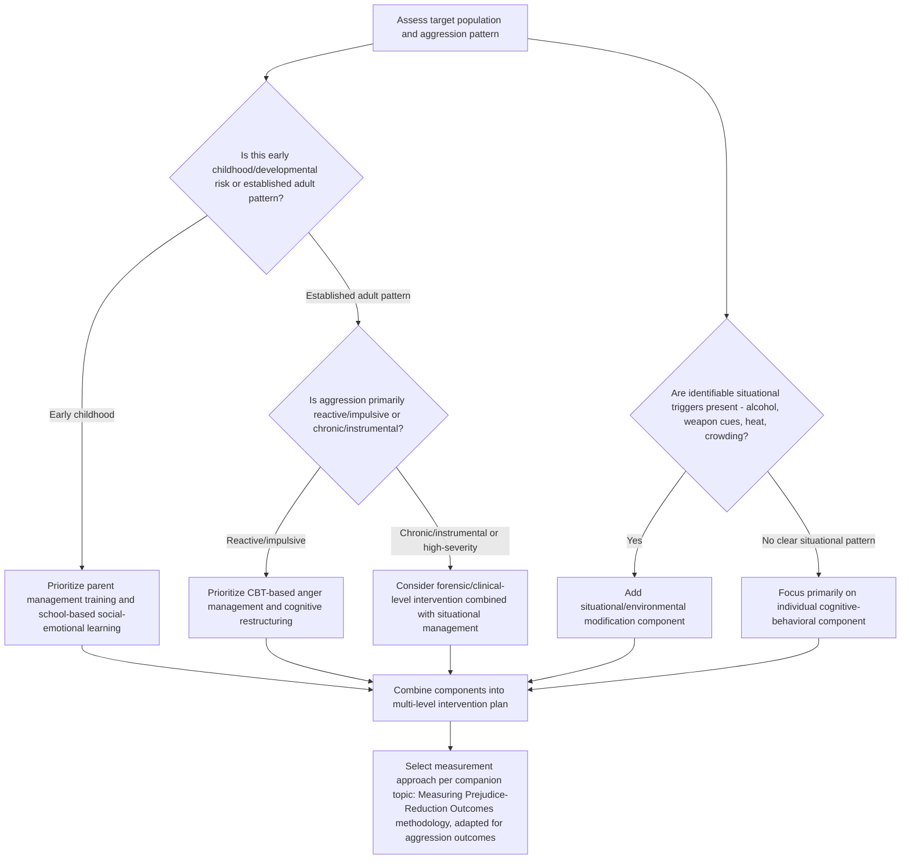

## Interventions to Reduce Aggression

### Overview

This entry surveys the major evidence-based approaches to reducing aggressive behavior, spanning individual-level cognitive-behavioral interventions, developmental/parenting programs, situational and environmental modifications, and broader public-health and policy strategies. Effective intervention design draws directly on the theoretical mechanisms covered throughout this chapter — cognitive appraisal processes (General Aggression Model), learned behavior (social learning theory), and situational triggers — translating explanatory theory into applied practice.

### Cognitive-Behavioral Interventions

**Key Points**

- **Cognitive-Behavioral Therapy (CBT) for anger and aggression** is among the most empirically supported individual-level intervention approaches, targeting the **cognitive appraisal processes** identified in the General Aggression Model (see companion topic) — specifically hostile attribution bias, automatic hostile scripts, and maladaptive beliefs about the necessity or legitimacy of aggression
- **Core CBT components** typically include: cognitive restructuring (identifying and challenging hostile interpretations of ambiguous situations), physiological arousal management (relaxation training, recognizing early arousal cues), and behavioral skills training (assertiveness and communication alternatives to aggression)
- **Novaco's stress inoculation model**, an influential CBT-based anger management framework, structures intervention around three phases: cognitive preparation (psychoeducation about anger triggers and the anger-aggression link), skill acquisition (relaxation and cognitive coping skills), and application/practice (graduated exposure to provoking scenarios with skill rehearsal)
- **Meta-analytic support**: CBT-based anger-management interventions have generally shown small-to-moderate positive effects on reducing aggressive behavior and anger across both clinical and community samples, though effect sizes vary considerably by population (e.g., generally larger effects in less severe/chronic cases) and intervention fidelity

### Social-Cognitive Skills Training

**Key Points**

- Directly targets the **hostile attribution bias** mechanism: interventions train individuals, particularly children showing early aggressive patterns, to generate and consider multiple possible (including non-hostile) interpretations of ambiguous social situations before responding
- **Social problem-solving skills training** teaches structured steps for generating and evaluating non-aggressive behavioral alternatives, directly targeting Miller's original "response hierarchy" concept (see companion topic on the frustration-aggression hypothesis) by expanding the repertoire of available non-aggressive responses
- **PATHS (Promoting Alternative Thinking Strategies)** and similar school-based social-emotional learning curricula incorporate this approach at a developmental level, with meta-analytic reviews generally finding positive but modest effects on reducing aggressive behavior in school settings

### Parenting and Family-Based Interventions

**Key Points**

- Directly targets the **social learning/modeling pathway** (see companion topic): given that harsh, inconsistent, or physically punitive parenting is associated with elevated child aggression, evidence-based parenting programs aim to replace modeled aggressive discipline with consistent, non-physical behavior management strategies
- **Parent Management Training (PMT)** and related programs (e.g., Incredible Years, Triple P) teach parents consistent reinforcement strategies, reduced use of physical punishment, and improved parent-child communication, with substantial randomized-controlled-trial evidence supporting reductions in child conduct problems and aggressive behavior
- **Early intervention timing** is emphasized in this literature: given the developmental cycle described in the General Aggression Model (repeated aggressive episodes progressively strengthening trait aggressiveness and hostile scripts), earlier intervention is generally associated with larger and more durable effects than intervention initiated after aggressive patterns are well-established in adolescence or adulthood

### Situational and Environmental Interventions

**Key Points**

- **Reducing aggressive cues**: informed by weapons-effect research (see companion topic), situational approaches include reducing incidental weapon visibility in high-conflict-risk settings and firearm storage practice recommendations in households with elevated domestic conflict risk
- **Alcohol-focused interventions**: given the alcohol × provocation interaction (see companion topic on situational triggers), venue-level and policy interventions include responsible alcohol service practices, reduced alcohol availability during high-risk periods, and server training programs aimed at reducing intoxication-linked aggression in nightlife settings
- **Environmental design (CPTED — Crime Prevention Through Environmental Design)**: modifying physical environments (lighting, crowd flow, visibility) to reduce situational friction and provocation opportunities, and to increase informal social surveillance that inhibits aggressive behavior
- **Heat-related interventions**: while direct causal intervention on ambient temperature is impractical, some public-health researchers have proposed cooling infrastructure and heat-wave response planning as indirect violence-mitigation measures during high-temperature periods, drawing on the heat hypothesis (see companion topic)

### Media Literacy and Content-Focused Approaches

**Key Points**

- Given the media violence literature (see companion topic), some intervention approaches focus on **media literacy education**, teaching critical evaluation of violent media content and its consequences, though evidence for durable behavioral effects from media-literacy-only interventions is comparatively limited relative to the broader skills-training literature
- **Parental mediation strategies** (co-viewing, content restriction, active discussion of media content) have shown more consistent evidence for moderating media-exposure effects on children's aggressive cognition than content restriction alone

### Public Health and Policy-Level Approaches

**Key Points**

- **Public health framing**: increasingly, violence (including but not limited to interpersonal aggression) is approached using public-health epidemiological models — identifying risk and protective factors across individual, relationship, community, and societal levels (the social-ecological model), paralleling the multi-level risk structure discussed in the companion topic on intimate partner violence
- **Firearm access policy**: given the weapons-effect and situational-trigger research base, some public-health researchers advocate for policy approaches targeting firearm access reduction during acute high-risk periods (e.g., extreme risk protection order/"red flag" laws), though this remains an area of active policy debate beyond the immediate psychological research base
- **Community-level violence-interruption programs** (e.g., models involving trained community violence interrupters who intervene directly in escalating conflicts) draw implicitly on displacement and de-escalation principles, aiming to interrupt the provocation-to-retaliation cycle before it escalates

### Comparative Effectiveness Considerations

**Key Points**

- [Inference] Across the intervention literature broadly, meta-analytic evidence generally supports **multi-component interventions** (combining cognitive-behavioral skills training with parent/family involvement, and situational modification where relevant) as more effective than single-component approaches targeting only one mechanism (e.g., cognition alone, without addressing situational triggers or modeling influences)
- **Timing and developmental stage** substantially moderate effectiveness: interventions targeting early childhood risk factors generally show larger and more durable effects than interventions initiated after chronic aggressive patterns are established, consistent with the GAM developmental cycle's emphasis on cumulative reinforcement of aggressive scripts over time
- **Population specificity**: intervention effectiveness varies by population and context (e.g., general community samples versus clinical/forensic populations with more severe or chronic aggression histories), and generalization of effect sizes across substantially different populations should be made cautiously

### Diagram: Intervention Points Across the Aggression Pathway (svg_diagram)

<svg xmlns="http://www.w3.org/2000/svg" viewBox="0 0 800 420">
<text x="400" y="26" text-anchor="middle" font-size="16" font-weight="bold" fill="#1a1a1a">Intervention Points Along the Aggression Pathway (svg_diagram)</text>
<rect x="30" y="55" width="160" height="50" rx="8" fill="#e8eef7" stroke="#3b5b92" stroke-width="2" />
<text x="110" y="85" text-anchor="middle" font-size="11" fill="#1a1a1a">Developmental Modeling</text>
<rect x="220" y="55" width="160" height="50" rx="8" fill="#e8eef7" stroke="#3b5b92" stroke-width="2" />
<text x="300" y="85" text-anchor="middle" font-size="11" fill="#1a1a1a">Situational Trigger</text>
<rect x="410" y="55" width="160" height="50" rx="8" fill="#e8eef7" stroke="#3b5b92" stroke-width="2" />
<text x="490" y="85" text-anchor="middle" font-size="11" fill="#1a1a1a">Cognitive Appraisal</text>
<rect x="600" y="55" width="170" height="50" rx="8" fill="#e8eef7" stroke="#3b5b92" stroke-width="2" />
<text x="685" y="85" text-anchor="middle" font-size="11" fill="#1a1a1a">Behavioral Outcome</text>
<line x1="190" y1="80" x2="220" y2="80" stroke="#555" stroke-width="2" marker-end="url(#a14)" />
<line x1="380" y1="80" x2="410" y2="80" stroke="#555" stroke-width="2" marker-end="url(#a14)" />
<line x1="570" y1="80" x2="600" y2="80" stroke="#555" stroke-width="2" marker-end="url(#a14)" />
<line x1="110" y1="105" x2="110" y2="145" stroke="#555" stroke-width="2" marker-end="url(#a14)" />
<line x1="300" y1="105" x2="300" y2="145" stroke="#555" stroke-width="2" marker-end="url(#a14)" />
<line x1="490" y1="105" x2="490" y2="145" stroke="#555" stroke-width="2" marker-end="url(#a14)" />
<line x1="685" y1="105" x2="685" y2="145" stroke="#555" stroke-width="2" marker-end="url(#a14)" />
<rect x="20" y="150" width="180" height="60" rx="8" fill="#dff0e0" stroke="#2f7d46" stroke-width="2" />
<text x="110" y="175" text-anchor="middle" font-size="11" fill="#1a1a1a">Parent Management</text>
<text x="110" y="192" text-anchor="middle" font-size="11" fill="#1a1a1a">Training</text>
<rect x="210" y="150" width="180" height="60" rx="8" fill="#dff0e0" stroke="#2f7d46" stroke-width="2" />
<text x="300" y="175" text-anchor="middle" font-size="11" fill="#1a1a1a">Alcohol/weapon-cue</text>
<text x="300" y="192" text-anchor="middle" font-size="11" fill="#1a1a1a">environmental design</text>
<rect x="400" y="150" width="180" height="60" rx="8" fill="#dff0e0" stroke="#2f7d46" stroke-width="2" />
<text x="490" y="175" text-anchor="middle" font-size="11" fill="#1a1a1a">CBT / cognitive</text>
<text x="490" y="192" text-anchor="middle" font-size="11" fill="#1a1a1a">restructuring</text>
<rect x="590" y="150" width="190" height="60" rx="8" fill="#dff0e0" stroke="#2f7d46" stroke-width="2" />
<text x="685" y="175" text-anchor="middle" font-size="11" fill="#1a1a1a">Violence interruption /</text>
<text x="685" y="192" text-anchor="middle" font-size="11" fill="#1a1a1a">de-escalation programs</text>
<line x1="400" y1="220" x2="400" y2="255" stroke="#555" stroke-width="2" marker-end="url(#a14)" />
<rect x="230" y="260" width="340" height="55" rx="8" fill="#f7f7f7" stroke="#444" stroke-width="2" />
<text x="400" y="283" text-anchor="middle" font-size="12" fill="#1a1a1a">Multi-component interventions</text>
<text x="400" y="300" text-anchor="middle" font-size="10" fill="#1a1a1a">generally outperform single-mechanism approaches</text>
</svg>

### Process Flow: Selecting an Aggression-Reduction Intervention

### Applied Example: Designing a Multi-Component Intervention

**Output**

A school district seeks to reduce aggressive incidents among a cohort of 8-year-olds showing early conduct problems, several of whom come from households with high parental conflict.

Applying the intervention-selection framework:

1. **Developmental stage check**: early childhood — favors parent-focused and school-based intervention over adult-oriented CBT anger management
2. **Family modeling factor**: household conflict exposure suggests a **Parent Management Training** component (e.g., Incredible Years) to reduce modeled aggressive conflict-resolution patterns at home, directly targeting the social-learning pathway
3. **School-based component**: a **PATHS-style social-emotional learning curriculum** targets hostile attribution bias and expands non-aggressive response repertoires among the children directly
4. **Situational component**: playground and classroom environmental review (crowding, supervision density) to reduce situational friction opportunities, informed by environmental design principles
5. **Evaluation plan**: pre/post and follow-up measurement using validated child aggression measures (teacher/peer report, observational coding — see companion topic on operationalizing aggression), with attention to durability of effects at 6- and 12-month follow-up, consistent with the durability concerns raised throughout this chapter's measurement-focused companion topics
6. **Conclusion**: this multi-component design (family + school + environmental) is consistent with meta-analytic evidence favoring combined approaches over any single intervention component in isolation

### Related Topics / Next Steps

- The General Aggression Model (theoretical basis for cognitive intervention targets — companion topic)
- Social learning theory of aggression (basis for parenting interventions — companion topic)
- Defining and operationalizing aggression (measurement for intervention evaluation — companion topic)
- Situational triggers: heat, alcohol, provocation (basis for environmental intervention — companion topic)
- The weapons effect (basis for firearm-access intervention — companion topic)
- Public health and social-ecological models of violence prevention
- Restorative justice approaches to interpersonal and community violence
- Measuring prejudice-reduction outcomes (methodological parallel for evaluating aggression interventions)