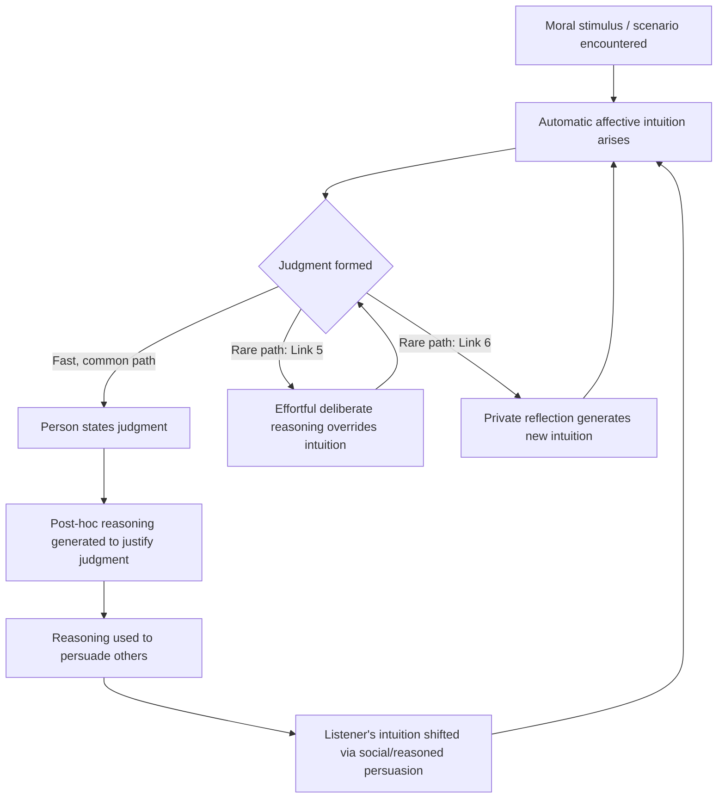

## Social Intuitionist Model of Moral Judgment

### Overview

The Social Intuitionist Model (SIM) is a theory of moral judgment developed primarily by Jonathan Haidt, first fully articulated in his 2001 paper "The Emotional Dog and Its Rational Tail." The model proposes that moral judgments arise primarily from quick, automatic affective intuitions rather than from deliberate moral reasoning. Conscious reasoning, in this framework, functions mainly as a post-hoc process that constructs justifications for judgments already made, rather than as the mechanism that produces those judgments.

The model was formulated as a direct challenge to rationalist models of moral development, particularly those associated with Lawrence Kohlberg and Jean Piaget, which held that moral judgment results from a process of conscious reasoning that develops through structured cognitive stages.

### Historical and Theoretical Context

**Key Points**

- Rationalist tradition (Piaget, Kohlberg): moral judgment is the output of domain-general reasoning applied to moral dilemmas; moral development proceeds through invariant cognitive stages; reasoning causes judgment.
- Haidt's critique: rationalist models cannot account for cases where people reach strong moral verdicts they cannot justify with coherent reasons — a phenomenon he terms "moral dumbfounding."
- Intellectual lineage: SIM draws on dual-process theories of cognition (automatic vs. controlled processing), Antonio Damasio's somatic marker hypothesis, and social psychological work on automaticity (e.g., Bargh, Zajonc's affective primacy research).
- Zajonc's "Feeling and Thinking" (1980) argued affective reactions can precede and occur independently of cognitive appraisal — a direct precursor to SIM's core claim.

### Core Claims of the Model

**1. Primacy of Intuition**

Moral judgments are typically the result of quick, automatic evaluations (intuitions) that occur with little or no conscious awareness of the underlying process. These intuitions feel like perceptions — they arrive in consciousness already formed, complete with an affective valence (approval or disapproval).

**2. Reasoning as Post-Hoc Rationalization**

Moral reasoning usually occurs after the judgment has already been made. Its primary function is not to generate the judgment but to search for reasons that justify it, particularly for the purpose of social communication and persuasion.

**3. Reasoned Persuasion Link**

Moral reasoning can influence other people's judgments, but typically only indirectly — by triggering new intuitions in the listener, not by rationally compelling them through logical argument.

**4. Social Persuasion Link**

Because humans are deeply social, other people's judgments and reasoning strongly influence an individual's own intuitions and subsequent judgments, even without private reflection.

**5. Two Minor Links**

- **Reasoned Judgment**: In rare cases, conscious reasoning can override an initial intuition and directly produce a judgment (effortful, occurs mainly when intuitions are weak or conflicting).
- **Private Reflection**: A person can, through self-generated reasoning, trigger a new intuition that changes their own judgment without external input.

### The SIM Diagram (Six Links)

Haidt's original model is often depicted as a diagram with four "fast, likely" links and two "slow, rare" links connecting two individuals' cognitive processes.

<svg xmlns="http://www.w3.org/2000/svg" viewBox="0 0 900 520" font-family="Arial, sans-serif">
<text x="450" y="30" text-anchor="middle" font-size="18" font-weight="bold">Social Intuitionist Model — Six Links (svg_diagram)</text>

<rect x="30" y="60" width="380" height="420" fill="none" stroke="#333" stroke-width="1.5" stroke-dasharray="4,3" />
<text x="220" y="85" text-anchor="middle" font-size="14" font-weight="bold">Person A</text>

<rect x="490" y="60" width="380" height="420" fill="none" stroke="#333" stroke-width="1.5" stroke-dasharray="4,3" />
<text x="680" y="85" text-anchor="middle" font-size="14" font-weight="bold">Person B</text>

<rect x="90" y="120" width="260" height="50" rx="8" fill="#dce8f7" stroke="#2b5b8a" />
<text x="220" y="150" text-anchor="middle" font-size="13">A: Intuition</text>
<rect x="90" y="220" width="260" height="50" rx="8" fill="#f7e6d0" stroke="#a86a1f" />
<text x="220" y="250" text-anchor="middle" font-size="13">A: Judgment</text>
<rect x="90" y="320" width="260" height="50" rx="8" fill="#e3f0d8" stroke="#4a7a2a" />
<text x="220" y="350" text-anchor="middle" font-size="13">A: Reasoning</text>

<rect x="550" y="120" width="260" height="50" rx="8" fill="#dce8f7" stroke="#2b5b8a" />
<text x="680" y="150" text-anchor="middle" font-size="13">B: Intuition</text>
<rect x="550" y="220" width="260" height="50" rx="8" fill="#f7e6d0" stroke="#a86a1f" />
<text x="680" y="250" text-anchor="middle" font-size="13">B: Judgment</text>
<rect x="550" y="320" width="260" height="50" rx="8" fill="#e3f0d8" stroke="#4a7a2a" />
<text x="680" y="350" text-anchor="middle" font-size="13">B: Reasoning</text>

<line x1="220" y1="170" x2="220" y2="220" stroke="#000" stroke-width="2" marker-end="url(#arrow)" />
<text x="235" y="198" font-size="11">1. Intuitive judgment</text>

<line x1="220" y1="270" x2="220" y2="320" stroke="#000" stroke-width="2" marker-end="url(#arrow)" />
<text x="235" y="298" font-size="11">2. Post-hoc reasoning</text>

<line x1="350" y1="345" x2="560" y2="145" stroke="#000" stroke-width="2" marker-end="url(#arrow)" />
<text x="420" y="230" font-size="11">3. Reasoned persuasion</text>

<line x1="350" y1="245" x2="550" y2="245" stroke="#000" stroke-width="2" marker-end="url(#arrow)" />
<text x="400" y="238" font-size="11">4. Social persuasion</text>

<path d="M 90 345 C 40 280, 40 190, 90 145" fill="none" stroke="#888" stroke-width="1.5" stroke-dasharray="5,4" marker-end="url(#arrowGray)" />
<text x="0" y="245" font-size="10" fill="#555" transform="rotate(-90 15 245)">5. Reasoned judgment (rare)</text>

<path d="M 300 320 C 340 260, 300 200, 260 175" fill="none" stroke="#888" stroke-width="1.5" stroke-dasharray="5,4" marker-end="url(#arrowGray)" />
<text x="345" y="260" font-size="10" fill="#555">6. Private reflection (rare)</text>
<text x="450" y="500" text-anchor="middle" font-size="11" fill="#555">Solid arrows = fast, common links. Dashed arrows = slow, rare links.</text>

</svg>

### Moral Dumbfounding

Moral dumbfounding refers to the phenomenon in which people maintain a strong moral judgment even after their stated reasons for that judgment have been logically refuted, and even when they cannot articulate any coherent justification at all. They often respond with statements like "I don't know, I can't explain it, I just know it's wrong."

**Example**

In Haidt's research, participants were presented with the "consensual incest" vignette: an adult brother and sister, on vacation together, decide to have sex once, using two forms of contraception, and experience no negative consequences — they feel closer afterward and never repeat it or tell anyone. Most participants immediately judge the act as wrong, but when asked to justify this using the story's stipulated facts (no harm, no pregnancy risk, no relational damage, secrecy maintained), they struggle to produce a harm-based argument and typically resort to something like "I just feel like it's wrong" — illustrating judgment preceding and outlasting reasoning.

Other classic SIM vignettes include:

- **Eating the family dog** (a dog killed by a car, then eaten by the family, no one finding out)
- **Cleaning with the flag** (using a worn-out national flag as a cleaning rag, privately)
- **Chicken carcass** (having sex with a dead chicken carcass before cooking and eating it)

These share a structure: harmless, taboo, disgust-eliciting acts that reliably generate condemnation disproportionate to articulable justification.

### Moral Intuition: Definition and Mechanism

**Key Points**

- Haidt defines moral intuition as the sudden appearance in consciousness of a moral judgment, including an affective valence (good–bad, like–dislike), without any conscious awareness of having gone through steps of search, weighing evidence, or inferring a conclusion.
- Intuitions are described as analogous to aesthetic judgments or perceptual judgments: fast, effortless, and automatic (System 1-type processing in dual-process terms).
- Reasoning, by contrast, is slow, effortful, and requires conscious, controllable mental steps (System 2-type processing).
- Moral intuitions are theorized to draw on evolved, culturally shaped moral modules or "taste buds" — later elaborated as Moral Foundations Theory (Care/Harm, Fairness/Cheating, Loyalty/Betrayal, Authority/Subversion, Sanctity/Degradation, and later Liberty/Oppression).

### Relationship to Dual-Process Theory

| Feature | Intuition (System 1) | Reasoning (System 2) |
| --- | --- | --- |
| Speed | Fast, automatic | Slow, deliberate |
| Effort | Effortless | Effortful |
| Awareness | Output only; process is opaque | Steps are consciously accessible |
| Controllability | Involuntary | Voluntary, can be suppressed/directed |
| Role in SIM | Generates the judgment | Justifies the judgment (usually) |
| Evolutionary framing | Old, shared with other social animals | Evolved later, partly for social signaling |

### Six Sources of Moral Intuitions (Elaborated in Later Work)

1. **Affect-laden evolved modules** — innate, preorganized responses to recurrent adaptive challenges (e.g., disgust responses to pathogen cues, protective responses to suffering).
2. **Cultural learning / socialization** — norms internalized through upbringing and community, becoming automatic over development.
3. **Rational reasoning that becomes intuitive with practice** — deliberate conclusions that, once well-rehearsed, are retrieved automatically in future encounters ("reasoning residue").
4. **Emotion (specifically moral emotions)** — such as disgust, anger, contempt, compassion, and gratitude, which directly color the valence of a judgment.
5. **Social/peer influence** — the social persuasion link, whereby the intuitions of one's in-group shift one's own intuitions.
6. **Embodied/perceptual cues** — physical sensations (e.g., bodily cleanliness, physical disgust) shown experimentally to shift moral judgments (e.g., handwashing reducing severity of moral condemnation in some studies).

### Empirical Support

**Key Points**

- **Wheatley & Haidt (2005)**: hypnotic suggestion to feel disgust at arbitrary neutral words (e.g., "often") caused participants to rate unrelated, mundane vignettes as moral violations, and to judge even morally unremarkable actions (a student who picks discussion topics that "interest and engage" classmates) as somewhat wrong — demonstrating that incidental affect can causally shape moral judgment content.
- **Schnall, Haidt, Clore & Jordan (2008)**: physical disgust induction (foul odor, dirty environment, or recalled disgusting experience) increased the severity of moral judgments across a range of unrelated dilemmas.
- **Valdesolo & DeSteno (2006)**: induced positive affect changed judgments on trolley-style dilemmas, showing affect's causal role in classically "reasoned" dilemma judgments.
- **Greene et al. (2001, fMRI studies)**: personal moral dilemmas (e.g., footbridge variant of the trolley problem) activated emotion-related brain regions (medial prefrontal cortex, posterior cingulate, angular gyrus) more than impersonal dilemmas, and longer response times occurred when people gave utilitarian answers to personal dilemmas — consistent with an intuitive/emotional default being overridden by effortful reasoning in atypical cases.
- **Moral dumbfounding studies (Haidt, Björklund & Murphy, unpublished/cited widely)**: found that a majority of participants continued to condemn harmless taboo violations even after all their stated reasons were rebutted.

### Criticisms and Limitations

**Key Points**

- **Underestimating reasoning's causal role**: Critics (e.g., Joshua Greene's dual-process model of moral cognition, and philosophers like Jeanette Kennett and Cordelia Fine) argue SIM understates cases where deliberate reasoning genuinely drives judgment, particularly for utilitarian/impersonal moral dilemmas and philosophical reflection.
- **Vagueness of "intuition"**: Critics note the term covers a heterogeneous set of processes (perceptual heuristics, emotional reactions, retrieved cultural rules) without a precise, falsifiable definition, making the model difficult to test rigorously. [Inference — this is a frequently cited methodological critique rather than a settled empirical refutation.]
- **Selection effects in dumbfounding paradigms**: Some researchers argue vignette-based demonstrations (incest, flag, chicken carcass) are constructed specifically to elicit disgust-based responses and may not generalize to the full space of moral judgments (e.g., justice, rights violations, harm-based dilemmas where reasoning is more clearly load-bearing).
- **Pizarro & Bloom (2003) critique**: argued that people can and do use reasoning to actively shape which situations they expose themselves to, indirectly cultivating their own future intuitions — a form of reasoning's causal influence that SIM's original framing underplays.
- **Underestimating individual variation**: Some individuals (and some cultures/subpopulations) may rely more heavily on deliberate reasoning than the model's general claims suggest; SIM is a claim about typical/modal processing, not a universal law.
- **Relationship to virtue ethics and moral development**: Kohlberg-tradition researchers argue SIM does not adequately explain developmental change in moral reasoning sophistication across the lifespan, which rationalist stage models were originally built to capture.

### Relationship to Moral Foundations Theory

SIM provides the process-level architecture (how judgments are generated and justified), while Moral Foundations Theory (Haidt & Joseph, developed after SIM) provides the content-level architecture (what specific concerns generate intuitions). MFT proposes the taxonomy of foundations — Care/Harm, Fairness/Cheating, Loyalty/Betrayal, Authority/Subversion, Sanctity/Degradation, Liberty/Oppression — that function as the evolved "taste receptors" generating the intuitive flashes described in Link 1 of SIM.

### Process Flow Summary

### Applications

**Key Points**

- **Political psychology**: Haidt applies SIM in *The Righteous Mind* to explain political polarization, arguing liberals and conservatives rely on different weightings of moral foundations, with intuitive reactions driving political judgments that are then rationalized.
- **Persuasion and moral argumentation**: suggests that changing minds on moral issues is more effective through evoking new intuitions (narrative, emotional appeals, perspective-taking) than through syllogistic argument alone.
- **Legal and policy reasoning**: has been used to explain why public reactions to legal/ethical controversies (e.g., bioethics debates on cloning, GMOs) often precede and outpace articulated justifications.
- **Moral education**: raises implications for how moral education should proceed — cultivating good intuitions and social environments rather than solely training explicit reasoning skills.

### Comparison Table: Rationalist Model vs. Social Intuitionist Model

| Dimension | Rationalist Model (Kohlberg/Piaget) | Social Intuitionist Model (Haidt) |
| --- | --- | --- |
| Primary driver of judgment | Conscious reasoning | Automatic intuition |
| Role of emotion | Peripheral/contaminating | Central/causal |
| Role of reasoning | Generative | Primarily justificatory (post-hoc) |
| Development | Sequential cognitive stages | Intuitions shaped by evolution + culture + social learning |
| Social influence | Reasoning changes minds directly | Social/reasoned persuasion changes intuitions, which change minds |
| Key evidence type | Moral dilemma reasoning tasks (e.g., Heinz dilemma) | Dumbfounding studies, affect-induction experiments, neuroimaging |

**Related Topics**

- Moral Foundations Theory (Haidt & Joseph)
- Dual-process theory of moral cognition (Joshua Greene)
- Trolley problem and personal vs. impersonal moral dilemmas
- Disgust and moral judgment (Contamination-sensitivity research)
- Moral dumbfounding paradigm and methodology
- Kohlberg's stages of moral development (contrast model)
- Embodied cognition and moral judgment (cleanliness priming effects)
- Moral emotions: guilt, shame, contempt, anger, disgust
- Political psychology of moral foundations (liberal-conservative differences)
- Somatic marker hypothesis (Antonio Damasio)