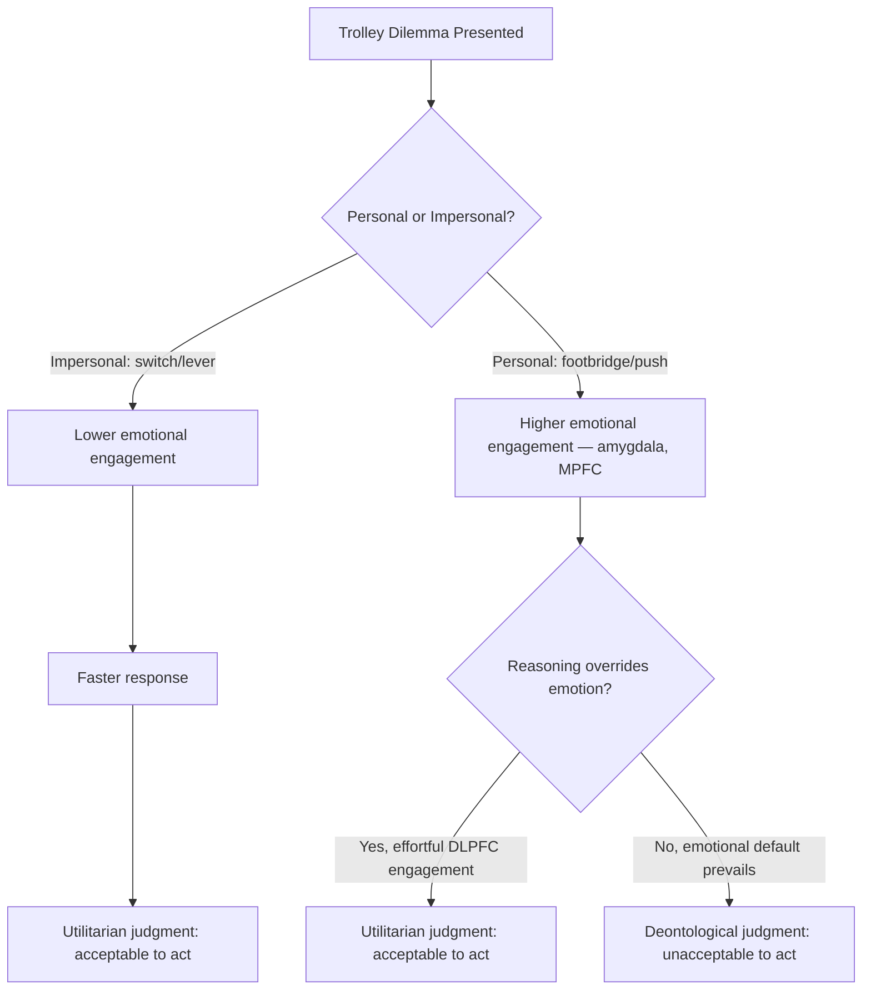

## Moral Reasoning versus Moral Emotion

### Overview

The reasoning–emotion distinction in moral psychology concerns the relative contribution of two theorized processing systems to moral judgment: deliberate, controlled cognitive reasoning versus automatic, affect-laden emotional response. The debate spans philosophy (Hume vs. Kant), developmental psychology (Kohlberg's rationalism), affective neuroscience (Damasio, Greene), and social psychology (Haidt's Social Intuitionist Model). Contemporary consensus, largely built on dual-process frameworks, treats reasoning and emotion not as strictly separate or competing systems but as interacting processes that jointly determine moral judgment and behavior, with their relative weight varying by dilemma type, individual differences, and context.

### Philosophical Origins

**Key Points**

- **Humean sentimentalism**: David Hume argued that "reason is, and ought only to be, the slave of the passions" — moral distinctions are derived from sentiment (feeling), not reason; reason can inform us of facts and consequences but cannot itself generate moral motivation or judgment.
- **Kantian rationalism**: Immanuel Kant argued moral worth derives from acting according to duty as determined by rational principles (the categorical imperative), with emotion viewed as a potentially corrupting influence on genuinely moral action — the right action is the one reason dictates, regardless of inclination.
- This philosophical split prefigures the empirical debate: Hume's position anticipates Haidt's intuitionism; Kant's position anticipates Kohlberg's rationalism and later rationalist critiques of intuitionism (e.g., Greene's utilitarian defense of reasoning-driven judgment in impersonal dilemmas).

### Defining the Two Systems

**Moral Reasoning**

- Conscious, effortful, sequential mental activity involving the transformation of information about people and events in order to reach a moral judgment.
- Typically slow, resource-limited, and consciously accessible/reportable.
- Associated with rule application, cost-benefit calculation, perspective-taking, and logical inference.
- Kohlberg's stage model treats moral reasoning sophistication as developing through six stages across three levels (Preconventional, Conventional, Postconventional), assessed via hypothetical dilemmas (e.g., the Heinz dilemma).

**Moral Emotion**

- Affective states that arise in connection with moral concerns, either about the self (self-conscious moral emotions: guilt, shame, embarrassment) or about others' actions (other-condemning emotions: anger, contempt, disgust; other-praising emotions: gratitude, elevation, admiration; and other-suffering emotions: compassion, sympathy).
- Typically fast, automatic, and often occur without full conscious deliberation over their cause.
- Carry intrinsic motivational force (action tendencies) — e.g., disgust motivates withdrawal/rejection; anger motivates confrontation/punishment; compassion motivates helping.

### Taxonomy of Moral Emotions (Haidt, 2003)

| Category | Emotions | Elicitor | Action Tendency |
| --- | --- | --- | --- |
| Other-condemning | Contempt, Anger, Disgust ("CAD" triad) | Violations of community, autonomy, or divinity norms respectively | Confrontation, punishment, avoidance |
| Self-conscious | Shame, Guilt, Embarrassment | Own moral failure or social exposure | Withdrawal, reparation, appeasement |
| Other-suffering | Compassion, Sympathy | Perceiving others in distress | Helping, caregiving |
| Other-praising | Gratitude, Elevation, Admiration | Witnessing moral excellence or receiving benefit | Prosocial reciprocity, emulation, self-improvement |

**Note (CAD Triad Hypothesis)**: Rozin, Lowery, Imada & Haidt (1999) proposed each of Shweder's three moral codes (community, autonomy, divinity) maps onto a specific emotion: contempt to community violations, anger to autonomy violations, and disgust to divinity/purity violations.

### Neuroscience: Greene's Dual-Process Model

Joshua Greene's fMRI research on trolley-type dilemmas provides the most influential empirical architecture for the reasoning/emotion distinction.

**Key Points**

- **Impersonal dilemmas** (e.g., switch/lever version of the trolley problem: divert a runaway trolley by pulling a lever, killing one to save five) elicit predominantly utilitarian judgments (acceptable to divert) and greater engagement of cognitive-control regions (dorsolateral prefrontal cortex, DLPFC).
- **Personal dilemmas** (e.g., footbridge version: push a person off a footbridge with your own hands to stop the trolley, killing one to save five) elicit predominantly deontological judgments (unacceptable to push) and greater engagement of emotion-related regions (medial prefrontal cortex, posterior cingulate cortex, amygdala, angular gyrus).
- **Reaction time data**: participants who give utilitarian judgments on personal dilemmas take significantly longer to respond, consistent with an automatic emotional/deontological default being effortfully overridden by controlled reasoning.
- **Cognitive load manipulations**: adding a concurrent cognitive load task selectively slows utilitarian judgments (which are argued to require controlled processing) without slowing deontological judgments (argued to be intuitive/automatic) — supporting the claim that reasoning, not emotion, underlies utilitarian responses in these paradigms.
- **Patients with ventromedial prefrontal cortex (VMPFC) damage**: show abnormally high rates of utilitarian judgments on personal dilemmas, consistent with diminished emotional input to moral judgment (Koenigs et al., 2007) — directly supporting Damasio's somatic marker hypothesis, in which emotional signals normally guide (and in this case, are needed to counterbalance) decision-making.

[Unverified/debated] Greene's "dual-process theory of moral judgment" interpretation — that deontological judgments are intuitive/emotional and utilitarian judgments are the product of controlled cognitive reasoning — remains actively contested; critics (e.g., Kahane et al., 2012) argue that utilitarian judgments can also be intuitive for some individuals, and that the personal/impersonal distinction confounds several variables (directness of harm, use of personal force, intentionality) rather than isolating emotion vs. reason cleanly.

### The Trolley Problem as Empirical Paradigm

### Somatic Marker Hypothesis (Damasio)

**Key Points**

- Proposes that emotional/bodily signals ("somatic markers"), learned through experience, are attached to anticipated outcomes of possible actions and bias decision-making before or in parallel with conscious deliberation.
- Damage to the ventromedial prefrontal cortex disrupts the generation of these markers, producing patients (e.g., the case of "Elliot," described by Damasio) who retain intact abstract reasoning ability but show severely impaired real-world decision-making, including social and moral decisions.
- Interpreted as evidence that emotion is not merely a disruptive influence on rational decision-making but a necessary input for functional, adaptive judgment — reframing the reasoning/emotion relationship as complementary rather than purely oppositional.

### Reconciling the Two: Interactionist Models

**Key Points**

- Most contemporary researchers reject a strict either/or framing. Reasoning and emotion are increasingly modeled as interacting inputs to a single judgment process rather than fully separable causal pathways.
- **Cognitive appraisal theory** (e.g., Lazarus, Scherer): emotions themselves partly depend on rapid, often unconscious cognitive appraisals of a situation (harm, agency, intent), meaning "emotion" already contains an evaluative/cognitive component — blurring a clean reason/emotion boundary.
- **Iterative feedback**: emotional reactions can trigger reasoning (as in SIM's post-hoc rationalization), and reasoning/reflection can, over repeated exposure, become automatized into intuitive/emotional responses (the "practical wisdom" or expertise effect).
- **Individual and situational variability**: the balance shifts depending on dilemma structure (personal vs. impersonal harm), cognitive load, time pressure, expertise (e.g., trained ethicists or professionals with more reasoning-driven judgments in domain-relevant dilemmas), and individual differences in trait empathy, psychopathy, and need for cognition.

### Comparison Table: Reasoning-Dominant vs. Emotion-Dominant Views

| Dimension | Reasoning-Dominant View (Kohlberg, Greene's utilitarian route) | Emotion-Dominant View (Hume, Haidt, Damasio) |
| --- | --- | --- |
| Primary causal role | Reasoning generates judgment | Emotion/intuition generates judgment |
| Neural correlates emphasized | DLPFC, prefrontal cognitive control regions | Amygdala, MPFC, insula, VMPFC |
| Key paradigm | Hypothetical moral dilemmas (Heinz dilemma), impersonal trolley variants | Moral dumbfounding, disgust induction, personal trolley variants |
| Role of clinical deficits | N/A (reasoning ability is the focus) | VMPFC damage → impaired real-world moral decisions despite intact reasoning (supports emotion's necessity) |
| Judgment type favored | Utilitarian/consequentialist | Deontological/intuitive |

### Practical and Experimental Illustration

**Example**

Consider two versions of a resource-allocation dilemma used in lab paradigms:

1. **Impersonal version**: A policy allocates a fixed budget in a way that statistically saves more lives overall but does not require directly and physically harming a specific identified person. Most participants judge this acceptable relatively quickly.
2. **Personal version**: The same net outcome requires an actor to physically and directly harm one identified, present individual (e.g., in organ-harvesting or forced-sacrifice vignettes). Most participants judge this unacceptable, respond more slowly, and show elevated activation in emotion-related brain regions when scanned.

This contrast is the empirical backbone of Greene's model and is frequently used to argue that "personal force" and directness of harm — not the utilitarian calculus itself — trigger the emotional response that drives deontological judgment.

### Individual Differences Relevant to the Debate

- **Psychopathy**: individuals high in psychopathic traits show reduced emotional response to others' distress and are more likely to endorse utilitarian/instrumental harm in personal dilemmas, consistent with diminished emotional input to judgment. [Inference — effect sizes and specificity vary across studies and psychopathy subtypes.]
- **Alexithymia**: difficulty identifying and describing one's own emotions has been associated with altered moral judgment patterns in some studies, though findings are less consistent than for psychopathy.
- **Need for cognition / analytic thinking style**: individuals higher in dispositional analytic reasoning show relatively greater utilitarian responding on sacrificial dilemmas in several studies.
- **Expertise effects**: moral philosophers and trained professionals (e.g., in bioethics) do not consistently show reduced emotional engagement or different judgment patterns compared to laypeople on the same dilemmas in some studies — a finding sometimes cited against a simple "more reasoning training = more utilitarian" model. [Unverified — mixed findings across studies (e.g., Schwitzgebel & Cushman) complicate a straightforward relationship between philosophical training and dilemma judgments.]

### Applications

**Key Points**

- **Legal reasoning and jury decision-making**: understanding emotion's role in judgments of culpability and punishment informs debates over victim impact statements, emotionally evocative evidence, and sentencing.
- **Bioethics and public policy**: debates over triage protocols, resource allocation in healthcare, and autonomous vehicle ethics (the "trolley problem" applied to self-driving car crash algorithms) directly draw on this reasoning/emotion literature.
- **Moral education and intervention design**: informs whether interventions to reduce prejudice or increase prosocial behavior should target explicit reasoning (persuasive argument, perspective-taking exercises) or affective processes (empathy induction, exposure-based emotion regulation).
- **Clinical and forensic psychology**: VMPFC-damage and psychopathy research informs assessments of moral competence and culpability in legal contexts.

**Related Topics**

- Trolley problem variants and the personal/impersonal distinction
- Joshua Greene's dual-process theory of moral judgment
- Somatic marker hypothesis (Damasio)
- Social Intuitionist Model (Haidt)
- CAD triad hypothesis (Contempt, Anger, Disgust)
- Moral emotions: guilt, shame, disgust, compassion, elevation
- Ventromedial prefrontal cortex and moral decision-making
- Psychopathy and moral judgment
- Kohlberg's stages of moral development
- Utilitarianism versus deontology in applied ethics