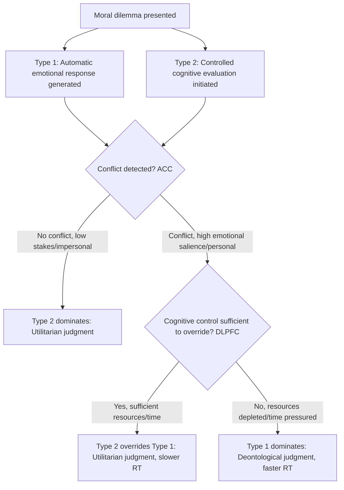

## Dual-Process Theories of Moral Judgment

### Overview

Dual-process theories of moral judgment propose that moral cognition arises from two functionally and neurally distinct types of processing: a fast, automatic, affect-laden process and a slow, controlled, cognitively effortful process. While related to the reasoning-versus-emotion distinction generally, "dual-process theory" in moral psychology specifically refers to the more formalized computational/neuroscientific architecture developed principally by Joshua Greene, building on general dual-process frameworks from cognitive psychology (e.g., Kahneman's System 1/System 2, Stanovich & West's Type 1/Type 2 processing, Sloman's associative/rule-based systems).

### Theoretical Lineage

**Key Points**

- **General dual-process cognition**: Predates moral-specific applications. Kahneman (2011) popularized System 1 (fast, automatic, intuitive, associative) versus System 2 (slow, deliberate, rule-governed, effortful) as a general architecture for judgment and decision-making under uncertainty.
- **Sloman (1996)**: proposed associative versus rule-based reasoning systems operating in parallel, sometimes producing conflicting outputs (e.g., knowing a coin flip probability is 50/50 while an associative "gambler's fallacy" intuition persists).
- **Application to morality**: Greene (2001, 2004, 2007) adapted this general architecture specifically to explain divergent judgment patterns across personal versus impersonal moral dilemmas, grounding the two processes in distinct neural systems identified via fMRI.
- Distinguished from Haidt's Social Intuitionist Model: SIM emphasizes intuition as the dominant, default process with reasoning as largely post-hoc, whereas Greene's dual-process model treats reasoning (Type 2) as a genuine, sometimes-dominant alternative pathway capable of directly producing (not just justifying) a judgment, particularly for utilitarian/impersonal judgments.

### The Two Systems in Greene's Model

| Feature | Process Type 1 (Intuitive/Emotional) | Process Type 2 (Controlled/Cognitive) |
| --- | --- | --- |
| Speed | Fast | Slow |
| Effort | Automatic, low-effort | Deliberate, high-effort, resource-limited |
| Neural correlates | Amygdala, medial prefrontal cortex (MPFC), posterior cingulate cortex, angular gyrus | Dorsolateral prefrontal cortex (DLPFC), anterior cingulate cortex (ACC, for conflict detection) |
| Judgment favored | Deontological (rule/rights-based, "don't use people as means") | Utilitarian/consequentialist (cost-benefit, "maximize outcomes") |
| Dilemma type activated | Personal moral dilemmas (direct, "up close and personal" harm) | Impersonal moral dilemmas (indirect, mechanically mediated harm) |
| Susceptibility to cognitive load | Relatively unaffected by concurrent cognitive load | Selectively slowed/disrupted by concurrent cognitive load |
| Response under time pressure | Preserved / can dominate | Degraded — time pressure increases deontological (Type 1) responses |

### Personal vs. Impersonal Dilemmas: Operational Definitions

**Key Points**

- **Personal dilemma** (originally defined by three criteria: (a) reasonably expected to cause serious bodily harm, (b) to a particular identifiable person or group, (c) not by deflecting an existing threat onto a different party) — e.g., the footbridge dilemma (pushing a large man off a footbridge to stop a trolley, killing him to save five others).
- **Impersonal dilemma**: harm is caused more indirectly, often by deflecting an existing threatening force rather than initiating direct bodily contact — e.g., the switch/lever version of the trolley problem (pulling a lever diverts the trolley onto a different track, killing one instead of five).
- Later refinements (Greene et al., 2009) emphasized "personal force" (direct muscular contact causing harm, e.g., pushing) and "intention" (harm as a means to an end versus a foreseen side-effect) as the operative variables rather than the personal/impersonal label itself.

### Neuroimaging Evidence

**Key Points**

- **Greene et al. (2001, Science)**: first fMRI study comparing personal and impersonal moral dilemmas; found personal dilemmas selectively engaged brain regions associated with emotion and social cognition (medial frontal gyrus, posterior cingulate/precuneus, bilateral angular gyrus/STS), while impersonal dilemmas engaged regions associated with working memory (DLPFC, parietal cortex).
- **Greene et al. (2004, Neuron)**: introduced the concept of "difficult" personal dilemmas (where utilitarian reasoning is nonetheless chosen, e.g., some versions of the crying baby dilemma) and found these recruited both emotional regions and cognitive control regions (ACC, DLPFC), interpreted as evidence of conflict between the two systems being resolved by cognitive control overriding the emotional default.
- **Reaction time findings**: utilitarian judgments on personal dilemmas take significantly longer than deontological judgments on the same dilemmas, consistent with an effortful override process.
- **Cognitive load studies (Greene et al., 2008)**: a concurrent working-memory load task selectively slowed utilitarian judgments (but not deontological ones) on personal dilemmas, supporting the claim that utilitarian judgment specifically draws on limited-capacity controlled cognitive resources.

### Neurological and Pharmacological Evidence

- **VMPFC lesion patients** (Koenigs et al., 2007; Ciaramelli et al., 2007): show markedly increased rates of utilitarian judgment specifically on personal, high-conflict dilemmas, consistent with reduced emotional signal normally opposing utilitarian calculation.
- **Frontotemporal dementia patients**: exhibit similarly abnormal (increased) utilitarian judgment rates, attributed to emotional/empathic deficits from degeneration in relevant frontal-limbic circuitry. [Inference — clinical population findings; generalizability to healthy variation is debated.]
- **Pharmacological manipulation** (e.g., serotonergic modulation via citalopram in some studies) has been shown to shift utilitarian/deontological judgment ratios, supporting a causal (not merely correlational) role for affect-regulating neurochemistry in these judgments. [Unverified — findings in this area are less consistently replicated than core fMRI/lesion findings.]

### Process Diagram

### Dual-Process Signature: Empirical Predictions and Tests

**Key Points**

The dual-process model generates falsifiable predictions, several of which have been tested:

1. Cognitive load should selectively impair utilitarian (not deontological) judgment → supported (Greene et al., 2008).
2. Time pressure should increase deontological responding → supported in several studies (e.g., Suter & Hertwig, 2011).
3. Individuals with reduced emotional reactivity (psychopathy, VMPFC damage) should show increased utilitarian responding → supported (Koenigs et al., 2007; Bartels & Pizarro, 2011, though the latter linked utilitarian responding to broader antisocial/psychopathic traits, complicating a purely "more rational" interpretation).
4. Inducing positive affect should reduce deontological responding on personal dilemmas → supported (Valdesolo & DeSteno, 2006, using comedy clips before dilemma presentation).
5. Explicit instruction to use reasoning/deliberation should increase utilitarian responding → mixed support.

### Major Criticisms and Alternative Interpretations

**Key Points**

- **Confounded variables**: Kahane, Everett, Brand, Farias & Savulescu (2012, 2015) argue "utilitarian" judgments in sacrificial dilemmas (endorsing killing one to save five) do not necessarily reflect genuine impartial welfare-maximizing reasoning; they may instead reflect reduced empathic concern or antisocial tendencies rather than positive engagement with utilitarian principles — proposing that "sacrificial utilitarian judgment" conflates two separable dimensions: reduced deontological inhibition and increased genuine utilitarian concern for the greater good (the "process dissociation" approach, Conway & Gawronski, 2013).
- **Conway & Gawronski (2013) process dissociation**: statistically decomposed responses into separate deontology (D) and utilitarianism (U) parameters, finding these are not simply opposite poles of one dimension; cognitive load reduced U (consistent with Greene) but did not straightforwardly increase D, complicating the simple "Type 1 vs Type 2 tradeoff" narrative.
- **Ecological validity concerns**: sacrificial trolley-style dilemmas are rare, artificial, and may not generalize to real-world moral judgment or behavior; some researchers argue lab dilemma responses correlate poorly with actual prosocial or antisocial behavior.
- **Personal force vs. personal/impersonal distinction**: subsequent work (Greene et al., 2009) itself revised the original personal/impersonal dichotomy, acknowledging that "personal force" (physical contact) rather than personal/impersonal categorization per se better predicts the emotional/deontological response — a refinement of, not wholesale rejection of, the dual-process framework.
- **Cushman's action/outcome model**: Fiery Cushman proposed a related but distinct dual-process account distinguishing action-based (rule-based, "what did you do") versus outcome-based (consequence-based, "what happened") moral evaluation, offering an alternative decomposition to Greene's emotional/cognitive framework.

### Comparison: Greene's Dual-Process Model vs. Haidt's Social Intuitionist Model

| Dimension | Greene's Dual-Process Model | Haidt's Social Intuitionist Model |
| --- | --- | --- |
| Status of reasoning | Genuine causal pathway, can independently produce judgment | Predominantly post-hoc justification, rarely causal |
| Primary evidence base | fMRI, lesion studies, cognitive load, reaction time | Moral dumbfounding, affect-induction, social psychology |
| View of utilitarian judgment | Product of effortful cognitive override of emotion | Not specifically privileged; still ultimately intuition-driven in SIM's framing, though SIM allows for "reasoned judgment" as a minor link |
| Relationship between systems | Competitive/conflict-based (ACC detects conflict, DLPFC resolves it) | Largely sequential (intuition first, reasoning after), with occasional override |
| Normative implication drawn by proponent | Greene has argued (controversially) that the dual-process findings should make us suspicious of deontological intuitions in some contexts, favoring reflective utilitarian reasoning | Haidt is more agnostic/descriptive, less inclined to draw normative conclusions from the descriptive model |

### Applications

**Key Points**

- **Moral machine / autonomous vehicle ethics**: dual-process findings inform debates about how AI systems should handle trolley-style crash-optimization dilemmas, and how human intuitions about such choices differ from stated ethical principles.
- **Jury and legal decision-making**: informs understanding of why juries may respond differently to direct versus indirect harm cases (e.g., an active assault versus a negligent omission) even when consequences are equivalent.
- **Clinical assessment**: lesion and psychopathy research using sacrificial dilemmas is used as one (contested) tool for probing empathic/emotional processing deficits.
- **Philosophy and metaethics**: the dual-process account has been invoked in debates over moral intuitions' evidential status — whether the neural/automatic origin of deontological intuitions should reduce their normative weight (a live and contested area in metaethics). [Speculation — the inference from descriptive neuroscience to normative ethical conclusions ("the debunking argument") is philosophically contested and not a settled empirical matter.]

**Related Topics**

- Joshua Greene's personal/impersonal dilemma paradigm
- Trolley problem and footbridge dilemma variants
- Social Intuitionist Model (Haidt) — comparative framework
- Process dissociation approach (Conway & Gawronski)
- Cushman's action-based versus outcome-based moral evaluation
- Ventromedial prefrontal cortex and utilitarian judgment
- Cognitive load and moral decision-making
- Debunking arguments in metaethics
- Kahneman's System 1 / System 2 general dual-process theory
- Psychopathy and utilitarian judgment research