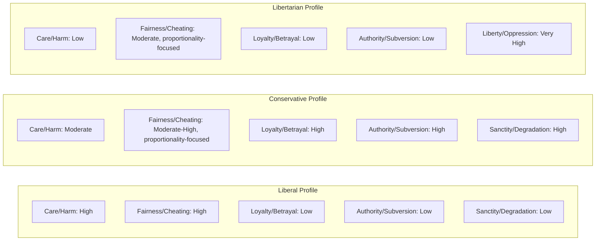

## Moral Foundations Theory

### Overview

Moral Foundations Theory (MFT) is a social psychological theory developed by Jonathan Haidt, Craig Joseph, and colleagues (notably Jesse Graham) proposing that human moral judgment is built upon a small set of innate, evolutionarily prepared psychological systems ("foundations"), each of which was shaped by a recurrent adaptive challenge in ancestral social life. Cultures elaborate, emphasize, and combine these foundations differently, producing the observed diversity of moral systems across societies while explaining why certain moral concerns (e.g., harm, fairness) recur nearly universally. MFT was developed partly as a content-level complement to the Social Intuitionist Model's process-level architecture, and partly as a response to the narrowness of harm/fairness-centric moral psychology dominant in the Kohlberg tradition.

### Theoretical Foundations and Motivation

**Key Points**

- **Critique of harm/fairness-centric models**: Haidt and Joseph argued that Kohlberg-tradition research (and much of Western academic moral psychology) implicitly defined morality almost exclusively in terms of harm and justice/fairness, reflecting the values of secular, educated, Western liberal populations rather than a genuinely cross-cultural or cross-ideological picture of moral concern.
- **Richard Shweder's "Big Three" ethics**: MFT draws directly on anthropologist Richard Shweder's cross-cultural work identifying three broad ethical codes used across world cultures — the Ethic of Autonomy (harm, rights, justice), the Ethic of Community (duty, hierarchy, interdependence), and the Ethic of Divinity (purity, sanctity, natural order).
- **Evolutionary psychology framing**: each foundation is proposed to have arisen because it solved a specific, recurrent adaptive problem faced by social primates/early humans (e.g., protecting vulnerable offspring, detecting cheaters in cooperative exchange, maintaining group cohesion against out-group threats).
- **Intuitionist premise**: consistent with the Social Intuitionist Model, each foundation is theorized to generate fast, automatic affective intuitions (not deliberated conclusions) when relevant triggers are perceived.
- First systematically presented in Haidt & Joseph (2004, "Intuitive Ethics") and Haidt & Graham (2007), later popularized and extended in Haidt's *The Righteous Mind* (2012).

### The Five (Later Six) Foundations

| Foundation | Adaptive Challenge | Original Triggers | Current Triggers | Associated Virtues | Associated Emotion |
| --- | --- | --- | --- | --- | --- |
| Care/Harm | Protect and care for vulnerable offspring | Suffering, distress, or threat to one's own children | Baby seals, charity appeals, cruelty to animals | Kindness, compassion, nurturance | Compassion |
| Fairness/Cheating | Reap benefits of two-way (dyadic) cooperation without being exploited | Cheating, cooperation, deception | Tax fraud, marital fidelity, contract violations | Justice, trustworthiness | Anger, gratitude, guilt |
| Loyalty/Betrayal | Form and maintain cohesive coalitions | Threat or challenge to group | Sports teams, patriotism, national identity | Loyalty, patriotism, self-sacrifice | Group pride, rage at traitors |
| Authority/Subversion | Navigate hierarchical social interactions beneficially | Signs of dominance/submission | Respect for legitimate authority, traditions | Obedience, deference | Respect, fear |
| Sanctity/Degradation | Avoid contaminants, pathogens (behavioral immune system) | Waste products, diseased people | Taboo ideas, "degrading" behaviors, bodily purity | Temperance, chastity, piety | Disgust |
| Liberty/Oppression* | Resist domination and coercion by more powerful others | Signs of attempted domination | Bullying, tyranny, restriction of autonomy | Autonomy, resistance to tyranny | Reactance, resentment |

*Liberty/Oppression was added later (Haidt, 2012) as a sixth foundation, proposed to underlie both left-leaning concerns about oppressed groups and right-leaning/libertarian concerns about government overreach.

### Foundation Details

**Care/Harm**

Rooted in mammalian attachment systems, particularly the neural circuitry supporting caregiving and response to offspring distress. Underlies moral concerns about suffering, cruelty, and need for protection, extending in modern contexts to concern for animals, distant strangers, and other species.

**Fairness/Cheating**

Rooted in the evolutionary logic of reciprocal altruism and the need to identify and punish cheaters in cooperative exchange (cf. Cosmides & Tooby's cheater-detection module research). Encompasses both equality-based and proportionality/merit-based fairness intuitions; later refinements (Haidt, 2012) shifted emphasis toward proportionality (getting rewarded/punished in proportion to one's contribution) as the more evolutionarily fundamental component, distinguishing it from equality per se.

**Loyalty/Betrayal**

Rooted in the adaptive challenge of coalitional psychology — forming stable groups capable of collective action, defense, and resource competition against rival groups. Generates strong reactions to betrayal, defection, and disloyalty (e.g., strong negative reactions to a citizen badmouthing their own country to outsiders, even if the criticism is factually accurate).

**Authority/Subversion**

Rooted in primate dominance hierarchies but, in Haidt's formulation, distinguished from mere power/dominance by an emphasis on legitimate, voluntarily-respected hierarchy that provides social order (as opposed to raw coercive power). Encompasses respect for parents, teachers, elders, and legitimate institutions.

**Sanctity/Degradation**

Rooted in the "behavioral immune system" — evolved disgust responses to pathogen and contaminant cues (spoiled food, bodily fluids, disease markers) that were later extended, via cultural elaboration, to abstract moral and symbolic domains (treating the body as a "temple," purity norms around sex, food, and substances). Strongly linked to disgust sensitivity as an individual-difference variable.

**Liberty/Oppression**

Concerns reactions to attempts by more powerful individuals or groups to dominate, restrict, or bully weaker ones. Proposed to explain both egalitarian resistance to oppression (a common left-leaning concern) and resistance to government/authority overreach (a common libertarian/right-leaning concern), making it somewhat unusual among the foundations in cutting across the typical liberal-conservative ideological split.

### The Moral Foundations Questionnaire (MFQ)

**Key Points**

- The primary measurement instrument developed to operationalize MFT empirically. Typically presented in two parts:
  - **Moral Relevance section**: asks respondents to rate how relevant various considerations (e.g., "whether or not someone suffered emotionally," "whether or not someone showed a lack of respect for authority") are to their judgments of right and wrong.
  - **Moral Judgments section**: presents agree/disagree statements tapping each foundation (e.g., "Justice is the most important requirement for a society" for Fairness; "Chastity is an important and valuable virtue" for Sanctity).
- Typically yields five (or six) subscale scores per respondent, allowing comparison of relative foundation endorsement across individuals, groups, or cultures.
- Available in validated translations across many languages and widely used in political psychology, cross-cultural psychology, and consumer/marketing research.

### Political Ideology and Moral Foundations

**Key Points**

- **Central empirical finding** (Graham, Haidt & Nosek, 2009): self-identified liberals in the U.S. sample rely primarily on the Care/Harm and Fairness/Cheating foundations when making moral judgments, relatively de-emphasizing Loyalty, Authority, and Sanctity ("individualizing foundations" vs. "binding foundations").
- **Conservatives** endorse all five (now six) foundations more equally, giving substantially more moral weight to Loyalty, Authority, and Sanctity ("binding foundations," which bind individuals into groups and hierarchies) than liberals do, while still endorsing Care and Fairness (though sometimes interpreted through a proportionality rather than equality lens).
- This asymmetry is proposed to explain persistent cross-ideological miscommunication: each side perceives the other as not just wrong but morally blind, because each is not weighting (or in some cases not perceiving) the foundations the other side considers self-evidently important.
- **Moral "taste buds" metaphor**: Haidt frames the foundations as analogous to taste receptors (sweet, sour, salty, bitter, umami) — everyone possesses the receptors, but culture and ideology determine which "flavors" are emphasized, amplified, or suppressed in a given moral cuisine.
- Libertarians show a distinctive profile: low endorsement of all five original foundations, but a distinct high valuation of individual liberty — a key empirical motivation for adding Liberty/Oppression as a sixth foundation (Iyer, Koleva, Graham, Ditto & Haidt, 2012).

### Foundation Endorsement by Political Orientation (Schematic)

### Cross-Cultural Evidence

**Key Points**

- MFQ studies across dozens of countries generally find the individualizing/binding distinction replicates, though specific foundation weightings and the political-ideology correlation vary by cultural and political context. [Inference — cross-national replication is broadly supported but not uniform; some non-WEIRD samples show different foundation structures than the original five/six-factor model.]
- Collectivist cultures show relatively higher average endorsement of binding foundations (Loyalty, Authority, Sanctity) compared to individualist Western cultures, consistent with Shweder's original cross-cultural "Big Three" ethics framework.
- Some factor-analytic studies outside WEIRD (Western, Educated, Industrialized, Rich, Democratic) samples have found the foundations do not always separate as cleanly as in U.S./U.K. samples, leading to ongoing psychometric refinement (e.g., the MFQ-2, released with revised item sets and an added Equality subscale distinct from Proportionality within Fairness).

### Applications

**Key Points**

- **Political communication and persuasion**: MFT-informed "moral reframing" research (Feinberg & Willer, 2013, 2015) shows that framing a policy argument in terms of the target audience's dominant moral foundations (e.g., framing environmental protection in terms of purity/sanctity rather than harm, to appeal to conservatives) increases persuasive success across ideological lines.
- **Marketing and brand psychology**: used to analyze and design brand messaging that resonates with foundation-specific consumer values.
- **Organizational and workplace ethics**: applied to understand differing perceptions of fairness, loyalty, and authority within organizational culture and compliance contexts.
- **Conflict resolution and bridging polarization**: used in initiatives (e.g., some designed by Haidt and collaborators, such as work connected to OpenMind and related depolarization projects) aiming to increase mutual understanding across ideological divides by making each side's foundation-based reasoning legible to the other.
- **Content moderation and platform design**: has been referenced in analyses of how moral-emotional language (especially "moral-emotional" words tied to specific foundations) spreads faster on social media platforms (Brady, Wills, Jost, Tucker & Van Bavel, 2017, on "moral contagion").

### Criticisms and Limitations

**Key Points**

- **Foundation count and boundaries are contested**: critics question whether five or six is the correct/complete number, whether the foundations are truly modular/dissociable versus overlapping dimensions of a smaller number of underlying factors, and whether some (e.g., Liberty) were added post hoc to fit political data rather than derived from independent evolutionary/anthropological reasoning. [Inference — this is a live methodological debate rather than a resolved empirical question.]
- **Circularity concerns**: some critics argue the theory risks circularity — foundations are partly defined and validated by the very political-correlation data they are then used to explain.
- **Innateness claims are difficult to test directly**: the claim that foundations are "innate" (in Haidt's sense of "organized in advance of experience," not fixed/unmodifiable) is difficult to falsify with the survey-based MFQ methodology, which measures endorsed values in adults already shaped by culture, not the hypothesized underlying evolved modules directly.
- **Alternative framings**: some researchers (e.g., Rai & Fiske, 2011, relational models theory) propose alternative taxonomies of moral motives grounded more directly in relationship structures (unity, hierarchy, equality, proportionality) rather than Haidt's evolutionary-module framing, arguing for a different theoretical basis for similar empirical content.
- **Measurement and translation validity**: cross-cultural comparisons using the MFQ face standard psychometric challenges (measurement invariance, translation equivalence) that complicate strong claims about universal foundation structure.

### Comparison: MFT vs. Shweder's Big Three Ethics

| Shweder's Ethic | Corresponding MFT Foundation(s) |
| --- | --- |
| Autonomy | Care/Harm, Fairness/Cheating, Liberty/Oppression |
| Community | Loyalty/Betrayal, Authority/Subversion |
| Divinity | Sanctity/Degradation |

**Related Topics**

- Social Intuitionist Model (Haidt) — process-level companion theory
- Moral Foundations Questionnaire (MFQ) and MFQ-2
- Individualizing versus binding foundations
- Moral reframing and political persuasion (Feinberg & Willer)
- Shweder's Big Three ethics (Autonomy, Community, Divinity)
- Cheater-detection and evolutionary psychology of cooperation
- Disgust sensitivity and the behavioral immune system
- Political psychology of ideology and moral cognition
- Relational Models Theory (Rai & Fiske) — alternative framework
- Moral contagion and social media (Brady et al.)