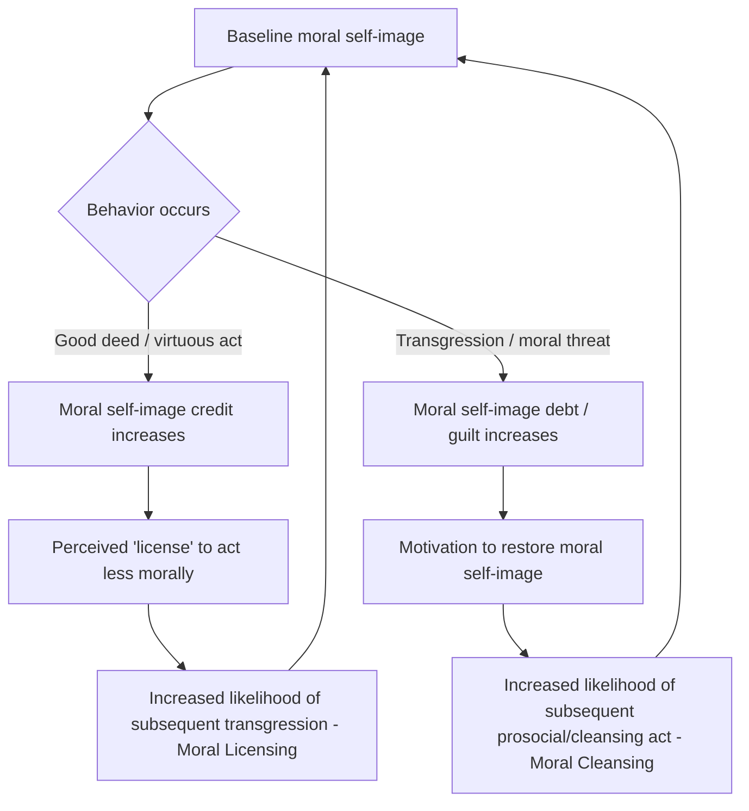

## Moral Licensing and Moral Cleansing

### Overview

Moral licensing and moral cleansing describe two opposing self-regulatory dynamics in which past moral or immoral behavior shifts the likelihood of subsequent moral or immoral behavior. Moral licensing occurs when a prior good deed (or an established positive moral self-image) increases the likelihood of a subsequent transgression, as the earlier act "licenses" or provides psychological permission for the later one. Moral cleansing (also called "moral compensation" in some literature) occurs when a prior transgression (or threat to moral self-image) increases the likelihood of a subsequent good deed, as the person seeks to restore or repair a threatened moral identity. Both phenomena are explained within a broader framework of moral self-regulation, in which people monitor and maintain a subjective sense of moral adequacy over time rather than evaluating each act in isolation.

### Theoretical Framework: Moral Self-Regulation

**Key Points**

- **Moral self-image / moral identity**: individuals are theorized to hold an internal, dynamically updated sense of themselves as a "good enough" moral person, which functions similarly to a self-regulatory resource or account balance.
- **Homeostatic model** (Zhong & Liljenquist, 2006; Sachdeva, Iliev & Medin, 2009): moral self-worth operates like a thermostat or balance — good deeds push the balance up (creating "moral credits" that can be spent on subsequent minor transgressions), while transgressions push it down (creating "moral debt" that motivates compensatory good behavior to restore equilibrium).
- **Moral credentialing** (Monin & Miller, 2001): a related but distinct mechanism in which an established reputation for being unbiased or moral (e.g., having previously expressed egalitarian views) creates "credentials" that free a person to act in ways that might otherwise appear prejudiced or immoral, both to themselves and to observers, without fear that the act will be interpreted as revealing their "true" immoral character.
- Both licensing and cleansing are typically explained as motivated by a need to maintain a stable, threshold-based sense of moral self-regard ("moral self-image maintenance") rather than to maximize morality on every single occasion.

### Moral Licensing: Mechanisms and Evidence

**Key Points**

- **Monin & Miller (2001)**: participants given the opportunity to disagree with blatantly sexist statements (establishing non-prejudiced credentials) were subsequently more likely to favor a man for a stereotypically male job in a later, ostensibly unrelated hiring decision — demonstrating credentialing-based licensing for gender bias.
- **Khan & Dhar (2006)**: found that merely intending or committing to a virtuous future action (e.g., committing to volunteer) increased subsequent self-indulgent choices (e.g., choosing a luxury/hedonic product over a practical one), showing licensing can operate even from imagined or committed-but-not-yet-completed virtuous acts.
- **Green consumerism licensing** (Mazar & Zhong, 2010): participants who purchased "green" (environmentally friendly) products in a simulated shopping task subsequently behaved less honestly and more selfishly in a following economic game (e.g., cheating more on a subsequent task, being less generous in a dictator game) compared to participants who purchased conventional products.
- **Political licensing**: some studies find that expressing support for a Black political candidate (e.g., Barack Obama) increased subsequent expression of preferences favoring White individuals over Black individuals in unrelated hiring-style judgments, interpreted as licensing effects operating on racial bias. [Inference — specific studies of this kind have faced replication scrutiny in the broader replication-crisis context; treat as illustrative of the licensing paradigm rather than a settled, robust effect size.]
- **Underlying mechanism debate**: researchers distinguish between (a) a genuine shift in moral self-concept that changes the felt cost of a later transgression, and (b) simple contrast/anchoring effects, or (c) attentional shifts away from moral considerations after a moral act has satisfied a goal (goal-completion accounts, e.g., Susewind & Hoelzl).

### Moral Cleansing: Mechanisms and Evidence

**Key Points**

- **Zhong & Liljenquist (2006), "Macbeth Effect"**: participants asked to recall an unethical act from their past (versus an ethical act) subsequently showed increased preference for cleansing products (soap, wipes) and, when given the choice, were more likely to volunteer for a subsequent altruistic task if not given the opportunity to physically cleanse — interpreted as evidence that physical cleansing and prosocial compensatory behavior serve as functionally interchangeable routes to restoring threatened moral self-image.
- **Physical-to-moral metaphor extension**: the Macbeth Effect research proposes that the psychological system treats moral purity and physical cleanliness as metaphorically and functionally linked (drawing on conceptual metaphor theory), such that literal handwashing can partially substitute for prosocial reparative behavior in restoring moral self-regard.
- **Sachdeva, Iliev & Medin (2009)**: found that writing about one's own positive traits led to reduced subsequent donation behavior (a licensing effect via inflated moral self-concept), while writing about one's own negative traits led to increased subsequent donation behavior (a cleansing effect via threatened moral self-concept) — directly demonstrating both effects within a single balanced study design and framing them as two sides of a single self-regulatory mechanism.
- **Guilt as the proximate mechanism**: cleansing behavior is frequently mediated by state guilt — the transgression or moral threat induces guilt, and the subsequent prosocial or cleansing act functions to reduce that aversive affective state (consistent with broader negative-state relief models of prosocial behavior).

### Moral Self-Regulation Cycle Diagram

### Distinguishing Related Constructs

| Construct | Definition | Direction of Effect | Key Study |
| --- | --- | --- | --- |
| Moral licensing | Prior good act enables subsequent bad act | Good → Bad | Monin & Miller (2001); Mazar & Zhong (2010) |
| Moral cleansing | Prior bad act (or guilt) motivates subsequent good act | Bad → Good | Zhong & Liljenquist (2006); Sachdeva et al. (2009) |
| Moral credentialing | Established non-prejudiced reputation frees later biased behavior | Reputation → Bad | Monin & Miller (2001) |
| Moral consistency / spillover | Prior good act increases likelihood of subsequent good act (opposite prediction to licensing) | Good → Good | Various; competes with licensing predictions under certain conditions |
| Moral hypocrisy | Holding oneself to a lower standard than one applies to others, without necessarily involving a sequential behavioral pattern | N/A (distinct construct) | Batson et al. (1997) |

### Moderators: When Licensing Occurs vs. Moral Consistency/Spillover

**Key Points**

Research indicates licensing and consistency (spillover) effects are not universal but depend on specific conditions — a key area of theoretical refinement (Blanken, van de Ven & Zeelenberg, 2015 meta-analysis):

- **Domain relevance**: licensing is more likely when the initial and subsequent behaviors are in different but morally related domains (e.g., green purchase → dishonesty); when behaviors are in the identical domain and highly comparable, consistency effects (continuing to act well) are sometimes observed instead.
- **Ambiguity of the subsequent act**: licensing effects on the second behavior are stronger when that behavior's moral status is ambiguous or justifiable, allowing self-serving reinterpretation; clearly, unambiguously wrong acts are less susceptible to licensing.
- **Public vs. private behavior**: some effects are moderated by whether the subsequent behavior is observed by others (reputational concerns) versus entirely private.
- **Meta-analytic effect size**: Blanken et al.'s (2015) meta-analysis found a small but statistically significant overall licensing effect across the literature, while also noting substantial heterogeneity and several non-replications, situating moral licensing within the broader social-psychological replication debate. [Unverified — exact effect size figures vary by meta-analytic model and inclusion criteria; treat specific numeric point-estimates from any single meta-analysis as provisional rather than fixed facts.]

### Example

**Example**

A person who has just donated a substantial sum to a charitable cause may, later the same day, feel more comfortable skipping a scheduled volunteer shift, rationalizing that they have "already done their part" for the week — a licensing effect. Conversely, a person who snapped angrily at a colleague earlier in the day may find themselves unusually generous in offering to cover another colleague's task that afternoon, even without consciously connecting the two events — a cleansing effect driven by unacknowledged guilt.

### Applications

**Key Points**

- **Consumer behavior and marketing**: relevant to understanding "green" or "ethical" product marketing, where purchase of an ethically branded product may inadvertently license subsequent less ethical consumption (a concern for sustainability-focused marketing design).
- **Public health and behavior change interventions**: relevant to compensatory health behaviors, e.g., exercising leading to subsequent overeating ("licensing" one's diet), a pattern studied under related "compensatory health beliefs" research.
- **Organizational ethics and compliance**: informs understanding of why individuals or organizations with strong stated ethical commitments or diversity initiatives may sometimes exhibit unexpected lapses, and how compliance programs might be designed to avoid inadvertently creating "moral credentialing" effects.
- **Philanthropy and prosocial behavior design**: informs fundraising and volunteer-recruitment strategies seeking to avoid single-donation "licensing" effects that reduce sustained giving, for example via commitment devices or reframing donations as identity-affirming rather than one-off transactions.
- **Political and social attitude research**: used to explain fluctuations in expressed prejudice or bias following salient egalitarian actions or statements by individuals or institutions.

### Criticisms and Open Questions

**Key Points**

- **Replication concerns**: as with much of social priming-adjacent literature from the same era, several foundational licensing and cleansing findings (including aspects of the original Macbeth Effect studies) have faced replication difficulties or produced smaller effects in high-powered replication attempts, and should be considered with appropriate caution regarding effect size and robustness. [Inference — general caution warranted; specific replication outcomes vary by individual study and are an active area of ongoing research rather than fully resolved.]
- **Mechanism ambiguity**: it remains debated whether licensing/cleansing effects reflect genuine shifts in moral self-concept, versus simpler processes like affect regulation, attentional depletion, ego-depletion-style resource accounts (themselves contested), or motivated reasoning/self-serving reinterpretation of the second act's moral status.
- **Boundary conditions still being mapped**: the conditions determining whether people show licensing (good→bad) or consistency (good→good) after an initial moral act remain an active area of theoretical and empirical refinement rather than a fully resolved question.

**Related Topics**

- Moral credentialing (Monin & Miller)
- The Macbeth Effect and embodied cognition of morality
- Moral self-regulation and moral identity theory
- Cognitive dissonance and self-justification
- Compensatory health beliefs
- Motivated reasoning in moral judgment
- Ego depletion and self-control (related self-regulatory framework)
- Moral hypocrisy (Batson)
- Green consumerism and ethical consumption psychology
- Guilt as a moral emotion and behavioral motivator