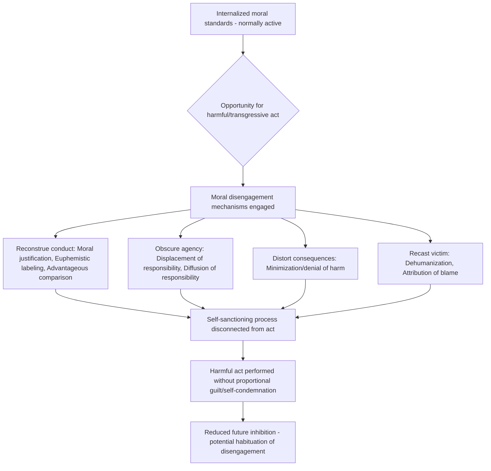

## Moral Disengagement Mechanisms

### Overview

Moral disengagement is a social-cognitive theory developed by Albert Bandura describing the psychological processes through which individuals selectively deactivate their internalized moral standards, allowing them to engage in harmful, unethical, or transgressive behavior without experiencing the self-condemnation, guilt, or diminished self-regard that would normally follow such conduct. The theory extends Bandura's broader Social Cognitive Theory of moral agency, which holds that moral conduct is regulated by self-sanctions — anticipatory self-approval or self-censure that individuals apply to their own prospective actions based on internalized standards. Moral disengagement describes the specific cognitive mechanisms by which this self-regulatory system can be selectively and temporarily disconnected from action.

### Theoretical Foundation: Bandura's Self-Regulatory Model of Moral Agency

**Key Points**

- Bandura (1986, 1991) proposed that moral self-regulation operates through a triadic reciprocal system in which personal standards, self-monitoring, and self-reactive influences (self-approval or self-condemnation) ordinarily deter harmful conduct.
- Moral agency has two facets: an **inhibitive** form (the power to refrain from behaving inhumanely) and a **proactive** form (the power to behave humanely).
- Self-sanctions are normally activated by anticipated transgression, creating an internal deterrent; moral disengagement mechanisms operate by disconnecting the behavior from this self-sanctioning process at one or more points, rather than by changing the person's underlying moral standards themselves.
- Crucially, Bandura emphasized that moral disengagement does not require a change in personal moral values — the same person retains the same standards but reconstrues the situation, the act, the agency, or the consequences so that self-sanctions are not triggered for the specific act in question.

### The Eight Mechanisms of Moral Disengagement

Bandura organized the mechanisms according to which point in the self-regulatory process they target: the behavior itself (reconstruing the conduct), the agency/responsibility for the act, the outcomes of the act, or the recipient of the act.

| Locus | Mechanism | Description |
| --- | --- | --- |
| Reconstruing the conduct | Moral justification | Harmful conduct is reframed as serving a socially worthy or moral purpose |
| Reconstruing the conduct | Euphemistic labeling | Sanitized, technical, or agentless language is used to disguise or legitimize harmful conduct |
| Reconstruing the conduct | Advantageous comparison | Harmful conduct is made to appear less severe by contrasting it with worse acts |
| Obscuring/distorting agency | Displacement of responsibility | Responsibility for the act is attributed to legitimate authority who ordered or sanctioned it |
| Obscuring/distorting agency | Diffusion of responsibility | Responsibility for the act is spread across a group, dividing individual culpability |
| Disregarding/distorting consequences | Distortion of consequences | The harmful effects of the conduct are minimized, ignored, or disbelieved |
| Dehumanizing/blaming the recipient | Dehumanization | The victim is stripped of human qualities, making cruelty toward them feel less morally consequential |
| Dehumanizing/blaming the recipient | Attribution of blame | The victim is portrayed as having brought the harm upon themselves, or circumstances are blamed |

### Mechanism Detail and Illustrative Examples

**1. Moral Justification**

Harmful conduct is portrayed as serving a higher moral, social, or ideological purpose, making it personally and socially acceptable.

**Example**: Framing civilian casualties in warfare as a necessary and justified cost of defending national security or a righteous cause.

**2. Euphemistic Labeling**

Language is used to strip an act of its harmful connotations, often through sanitized technical jargon, passive constructions, or agentless phrasing.

**Example**: Referring to civilian deaths as "collateral damage," layoffs as "workforce optimization," or torture as "enhanced interrogation."

**3. Advantageous Comparison**

The morality of an act is judged relative to a worse alternative, making the act in question appear minor, restrained, or even benevolent by contrast.

**Example**: A person justifying minor workplace dishonesty by comparing it favorably to embezzlement or fraud committed by others.

**4. Displacement of Responsibility**

Individuals view their actions as flowing from the directives of a legitimate authority rather than as products of their own agency, reducing felt personal accountability. Closely connected to the classic Milgram obedience paradigm.

**Example**: "I was just following orders" — a subordinate carrying out harmful directives from a superior without personally endorsing the act.

**5. Diffusion of Responsibility**

Responsibility is spread across a group, division of labor, or collective decision process, such that no single individual feels fully accountable for the outcome.

**Example**: Members of a firing squad, some given blanks, so no individual can be certain their shot was lethal; or bureaucratic decision-making where harm results from a chain of small, distributed contributions.

**6. Distortion of Consequences**

The severity, existence, or reality of the harm caused is minimized, disputed, ignored, or actively avoided from attention.

**Example**: A factory manager minimizing or disbelieving reports of environmental damage caused by industrial waste disposal practices.

**7. Dehumanization**

The victim(s) are perceptually or conceptually stripped of human qualities — cast as sub-human, animalistic, or object-like — reducing the empathic and moral inhibition normally triggered by harming a fellow human being.

**Example**: Propaganda depicting an enemy group using animalistic or vermin-related imagery during wartime or genocide, a well-documented precursor mechanism in genocide studies.

**8. Attribution of Blame**

The victim or external circumstances are blamed for having caused or provoked the harmful treatment, recasting the perpetrator as a reactive party rather than an initiator.

**Example**: Blaming a harassment victim for "provoking" the harasser through their behavior or clothing; blaming a defrauded person for "being naive."

### Process Diagram

### Measurement: Moral Disengagement Scale

**Key Points**

- Bandura, Barbaranelli, Caprara & Pastorelli (1996) developed the original **Mechanisms of Moral Disengagement Scale**, initially validated with adolescent samples, using Likert-type agreement items tapping each of the eight mechanisms (e.g., "It is okay to fight to protect your friends," "Some people deserve to be treated like animals").
- Subsequent adaptations exist for adult, workplace, and domain-specific populations (e.g., sport-specific moral disengagement scales, military contexts, corporate/organizational contexts).
- Typically yields either eight subscale scores or, more commonly in practice, a single aggregate moral disengagement score, given the mechanisms are usually highly intercorrelated and often modeled as reflecting a single underlying latent propensity.

### Empirical Applications and Correlates

**Key Points**

- **Aggression and antisocial behavior**: higher moral disengagement scores robustly predict increased aggression, bullying (including cyberbullying), and delinquency in adolescent samples across numerous studies.
- **Bystander behavior**: moral disengagement is associated with reduced bystander intervention in bullying and other harmful situations, partly by reducing the sense of personal responsibility to act.
- **Organizational and corporate misconduct**: applied to explain unethical behavior in organizational settings, including fraud, safety violations, and environmentally harmful corporate decisions, often facilitated by bureaucratic diffusion of responsibility and euphemistic corporate language.
- **Military and combat contexts**: applied to understand psychological processes enabling participation in wartime violence and, in extreme cases, atrocities and genocide, with dehumanization and displacement of responsibility identified as particularly salient mechanisms in historical and social-psychological analyses of such events.
- **Performance-enhancing drug use in sport**: moral disengagement scales have been used to predict doping intentions and behavior among athletes, with advantageous comparison and distortion of consequences frequently implicated.
- **Cyberbullying and online behavior**: the relative anonymity and physical distance of online interaction have been proposed to facilitate several disengagement mechanisms (particularly dehumanization and distortion of consequences) more readily than face-to-face contexts. [Inference — this is a well-supported theoretical extension in the cyberbullying literature, though the precise causal weighting of anonymity versus other online features remains an active research question.]

### Relationship to Classic Obedience and Conformity Research

**Key Points**

- Bandura explicitly connected displacement and diffusion of responsibility to Stanley Milgram's obedience experiments, in which participants administered what they believed were painful or dangerous electric shocks to a confederate under the direction of an experimenter — high compliance rates were interpreted as illustrating displacement of responsibility onto the authority figure.
- Also connected to Philip Zimbardo's Stanford Prison Experiment, in which guards' escalating abusive behavior toward "prisoners" has been analyzed (with methodological caveats now widely noted in the field regarding that study's validity) as illustrating dehumanization and diffusion of responsibility within an institutional role structure. [Unverified — the Stanford Prison Experiment's scientific validity and interpretation have been substantially challenged in recent scholarship (e.g., Le Texier, 2019); it is best treated as an illustrative historical case rather than methodologically robust evidence.]
- Distinct from moral disengagement in that Milgram and Zimbardo's paradigms are situational/experimental demonstrations, whereas moral disengagement is framed by Bandura as a more general, measurable individual-difference-relevant cognitive style that also operates outside acute experimental coercion.

### Distinction from Related Constructs

| Construct | Core Distinction from Moral Disengagement |
| --- | --- |
| Cognitive dissonance reduction | Dissonance reduction resolves post-hoc discomfort from inconsistency between belief and action; moral disengagement operates proactively/anticipatorily to permit the action in the first place |
| Neutralization theory (Sykes & Matza, 1957) | Criminological precursor theory identifying similar "techniques of neutralization" (denial of responsibility, denial of injury, denial of victim, condemnation of condemners, appeal to higher loyalties) — substantial conceptual overlap with moral disengagement, with Bandura's framework offering a more general social-cognitive theoretical grounding and empirical measurement tool |
| Moral licensing | Licensing operates via accumulated moral credit from genuinely good past behavior; moral disengagement operates via cognitive restructuring of the harmful act itself, independent of prior good deeds |
| Psychopathy | Psychopathy is a stable personality/clinical construct involving reduced empathy and behavioral traits; moral disengagement is a cognitive-social mechanism available to typical individuals in specific situational and dispositional degrees, not a clinical diagnosis |

### Criticisms and Limitations

**Key Points**

- **Overlap and redundancy among subscales**: factor-analytic work has frequently found the eight proposed mechanisms do not cleanly separate empirically, often loading onto a single general factor, raising questions about whether the eight-mechanism taxonomy reflects genuinely distinct cognitive processes or a single broad disengagement disposition measured redundantly. [Inference — widely noted psychometric finding across multiple validation studies.]
- **Direction of causality**: most moral disengagement research is correlational; it remains debated whether moral disengagement causally enables harmful behavior, or whether it partly (or largely) develops as a retrospective justification following initial transgressions — a question with some conceptual overlap with the reasoning-as-post-hoc-rationalization debate found elsewhere in moral psychology (cf. Social Intuitionist Model).
- **State versus trait ambiguity**: the construct is used both as a stable individual-difference trait (via aggregate scale scores) and as a situationally activated process, and the literature has not fully resolved how these two framings relate to each other empirically.
- **Cultural generalizability**: most foundational validation work was conducted in Western (particularly Italian and American) samples; cross-cultural measurement invariance of the scale is less thoroughly established than for some other moral psychology instruments.

### Applications

**Key Points**

- **Bullying and school-based interventions**: informs prevention programs targeting bystander intervention by explicitly countering diffusion-of-responsibility and dehumanizing narratives among students.
- **Corporate ethics training and compliance**: used to design training that makes euphemistic language and diffusion-of-responsibility patterns within organizations explicit and visible, aiming to re-engage moral self-sanctioning in decision chains.
- **Military ethics and law-of-war training**: informs training protocols aiming to maintain moral accountability and resist dehumanization of adversaries or civilians in combat contexts.
- **Media and propaganda analysis**: provides an analytic framework for identifying disengagement mechanisms (particularly euphemistic labeling and dehumanization) in political rhetoric, propaganda, and media framing of out-groups.
- **Criminology and rehabilitation**: informs offender treatment programs that target cognitive distortions overlapping with moral disengagement mechanisms (particularly victim-blaming and minimization of harm) as part of relapse-prevention and empathy-building interventions.

**Related Topics**

- Bandura's Social Cognitive Theory and self-efficacy
- Neutralization theory (Sykes & Matza) — criminological precursor
- Milgram's obedience to authority experiments
- Dehumanization and intergroup psychology
- Diffusion of responsibility and bystander effect
- Cyberbullying and online disinhibition effect
- Cognitive distortions in offender treatment programs
- Genocide studies and the psychology of mass atrocity
- Corporate/organizational misconduct and white-collar crime psychology
- Moral licensing and moral cleansing (contrast framework)