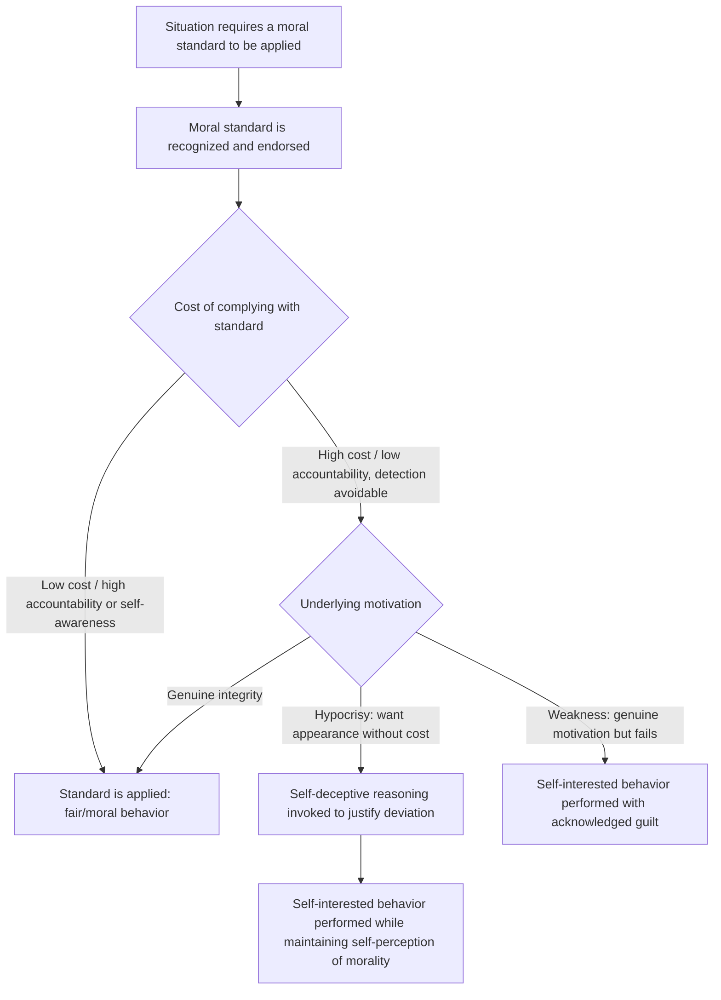

## Moral Hypocrisy

### Overview

Moral hypocrisy refers to the tendency to hold oneself to a lower moral standard than one applies to others, or to appear moral to oneself and others while avoiding the material or psychological costs of actually being moral. The construct was most systematically developed by social psychologist C. Daniel Batson, who distinguished moral hypocrisy sharply from moral integrity (genuine motivation to be moral) and moral weakness (a failure to act morally despite recognizing and being genuinely motivated toward the correct standard). Batson's research program used behavioral economic-style paradigms to empirically isolate the motivational signature of hypocrisy from these alternative explanations.

### Batson's Conceptual Framework

**Key Points**

- Batson proposed that apparent moral behavior can arise from at least three distinct underlying motivational states, which are behaviorally difficult to distinguish without careful experimental design:
  - **Moral integrity**: genuine motivation to actually be moral (to uphold a moral principle even at personal cost), which should produce moral behavior consistently regardless of whether transgression could go undetected.
  - **Moral hypocrisy**: motivation to *appear* moral to oneself and/or others while avoiding the cost of *actually being* moral, which should produce moral behavior only when the situation makes appearing moral important (e.g., under observation, or when self-deceptive routes to a positive self-view are unavailable) but self-interested behavior when moral appearance can be maintained without genuine moral action.
  - **Moral weakness**: a failure of will — genuinely wanting to act morally but succumbing to temptation or self-interest despite recognizing the correct standard, distinguished from hypocrisy by the presence of guilt/dissonance following the failure and by not requiring active self-deceptive justification.
- The defining feature of hypocrisy in this framework is not merely a gap between stated values and behavior (which weakness also produces) but a specific preference for the *appearance* of morality over its costly *substance*, often facilitated by self-deceptive reasoning that obscures this preference from the actor's own awareness.

### The Classic Paradigm: Batson et al. (1997)

**Key Points**

- Participants were asked to assign themselves and another (fictitious) participant to one of two tasks: a positive task with a chance to win a prize, or a dull, unrewarded task, and told most participants considered a coin flip the fairest method for allocating tasks.
- Participants were given a coin and told it was entirely up to them whether to actually use it.
- **Key finding**: Despite widespread agreement that flipping a coin was the fair procedure, the large majority of participants who did not flip the coin (or who flipped it but disregarded an unfavorable result) assigned themselves the positive task — while participants told to flip the coin under conditions of full accountability (e.g., told the assignment would be checked, or made highly self-aware via a mirror) behaved significantly more fairly.
- **Self-awareness manipulation**: In a key follow-up condition, placing a mirror in front of participants (heightening private self-awareness) sharply increased actual coin-flipping and adherence to its outcome — interpreted as evidence that when self-deceptive avoidance of one's own unfairness becomes difficult (because the mirror makes self-scrutiny unavoidable), people become more genuinely fair, consistent with a hypocrisy (rather than pure weakness) interpretation, since weakness accounts would not straightforwardly predict such a strong self-awareness effect.
- This paradigm became the template for subsequent moral hypocrisy research: create a situation where a fair/moral procedure is known and available, allow private discretion over whether to follow it, and measure whether behavior diverges from stated moral standards specifically when personal cost can be avoided undetected.

### Distinguishing Hypocrisy from Weakness and Integrity

| Feature | Moral Integrity | Moral Hypocrisy | Moral Weakness |
| --- | --- | --- | --- |
| Underlying goal | Genuinely be moral | Appear moral while minimizing cost of being moral | Genuinely be moral (same as integrity) |
| Behavior when unobserved/undetectable | Moral behavior maintained | Self-interested behavior, often facilitated by self-deception | Self-interested behavior, but recognized as a failure |
| Response to self-awareness manipulations (e.g., mirror) | Little change (already moral) | Sharp increase in moral behavior | Variable; some increase but framed by ongoing conflict rather than self-deceptive resolution |
| Post-transgression affect | N/A (no transgression) | Reduced guilt due to self-deceptive justification | Guilt and dissonance clearly present |
| Awareness of the standard-behavior gap | N/A | Reduced due to self-deception | Present and acknowledged |

### Process Model

### The Role of Self-Deception

**Key Points**

- Self-deception is theorized as the key psychological mechanism that allows hypocritical behavior to coexist with a maintained positive self-image, distinguishing hypocrisy from cynical, consciously acknowledged self-interest.
- Batson and colleagues proposed that people engaging in moral hypocrisy are not typically consciously lying to themselves in a simple sense, but rather selectively attend to, interpret, and weight information in ways that produce a self-serving but subjectively sincere moral justification for their self-interested choice (overlapping conceptually with motivated reasoning research more broadly).
- This connects moral hypocrisy research to broader motivated reasoning and self-serving bias literatures (e.g., self-serving attributions for success versus failure), situating moral hypocrisy as a domain-specific application of general self-serving cognitive biases to moral judgment and behavior.

### Empirical Extensions

**Key Points**

- **Valdesolo & DeSteno (2007, 2008)**: extended the paradigm to show an "asymmetry" form of moral hypocrisy — participants judged their own unfair or norm-violating behavior as less unethical than the identical behavior performed by another person, demonstrating hypocrisy operates in moral *judgment* (not just moral *behavior*), and linked this asymmetry to differential emotional processing (reduced negative affect toward one's own transgressions).
- **Lammers, Stapel & Galinsky (2010)**: found that experimentally inducing a sense of power increased the gap between the moral standards people applied to their own behavior versus others' behavior (power increased hypocrisy specifically, more than it increased general rule-breaking), linking moral hypocrisy to social power research.
- **Group and intergroup contexts**: research has extended the paradigm to intergroup settings, finding people sometimes apply different fairness standards depending on whether the beneficiary is an in-group versus out-group member, connecting moral hypocrisy to intergroup bias literatures.
- **Political hypocrisy perception**: distinct related research examines third-party perceptions of hypocrisy (e.g., in politicians), finding that perceived hypocrisy is often judged more harshly than the underlying transgression itself, and that accusations of hypocrisy can be strategically potent because they attack perceived sincerity rather than merely disputing the moral standard itself. [Inference — this line of applied/political research is somewhat distinct from Batson's original experimental paradigm and draws on a broader social-perception literature.]

### Distinction from Related Constructs

| Construct | Core Distinction |
| --- | --- |
| Moral disengagement (Bandura) | Disengagement involves cognitive restructuring of the act/agency/victim to avoid self-sanction for a specific harmful act; hypocrisy specifically involves preferring the appearance over the substance of morality, often in fairness/allocation contexts rather than harm |
| Cognitive dissonance | Dissonance describes general discomfort from inconsistent cognitions and its resolution; hypocrisy is a more specific motivational pattern (preference for appearing moral) that can employ dissonance-reduction-like self-deceptive processes as a mechanism |
| Moral licensing | Licensing involves genuine past good behavior creating permission for a later transgression; hypocrisy does not require a genuine prior good act — the "appearance" of morality can be entirely concurrent with or substitute for genuine moral action |
| Social desirability bias | Social desirability describes a general tendency to present oneself favorably on self-report measures; moral hypocrisy specifically concerns a self-interest/appearance-over-substance motivational structure that can manifest even in behavior, not just self-report |

### Applications

**Key Points**

- **Organizational fairness and management**: informs understanding of why formally stated fairness policies (e.g., merit-based promotion criteria) may be undermined by decision-makers who privately favor self-serving or in-group-favoring outcomes while sincerely believing they are applying fair standards — relevant to research and design of accountability structures and blind evaluation procedures.
- **Political communication and accountability**: informs analysis of why hypocrisy accusations are a particularly effective form of political attack, and how accountability and transparency mechanisms (analogous to the "mirror" self-awareness manipulation) can reduce hypocritical behavior in public officials and institutions.
- **Environmental and ethical consumoption behavior**: connects to research on the "attitude-behavior gap" in ethical consumption, where stated environmental or ethical values are not reliably reflected in purchasing behavior, partly attributable to hypocrisy-like appearance-motivated rather than substance-motivated value expression.
- **Design of fairness-promoting institutions**: the self-awareness/accountability findings from Batson's mirror manipulation have informed broader institutional design principles suggesting that transparency, observability, and structured accountability reduce the behavioral gap between stated and enacted moral standards.

### Criticisms and Limitations

**Key Points**

- **Alternative interpretations of key findings**: some researchers have questioned whether the classic coin-flip paradigm cleanly isolates "hypocrisy" as opposed to simple self-interested rule-bending under ambiguous justification, given the inherent difficulty of directly measuring an unconscious self-deceptive process. [Inference — a recurring methodological critique in this literature given the difficulty of operationalizing self-deception directly.]
- **Generalizability of laboratory paradigms**: as with much moral psychology relying on artificial allocation/economic-game paradigms, questions remain about how well findings generalize to complex, real-world moral hypocrisy (e.g., in political, organizational, or interpersonal contexts) where stakes, relationships, and reputational dynamics are far more complex than a one-shot coin flip.
- **Cultural and individual variation**: most foundational studies were conducted with Western (often North American) undergraduate samples; the extent to which the specific hypocrisy/weakness/integrity distinction and its self-awareness moderation generalizes cross-culturally is less thoroughly established. [Unverified — limited direct cross-cultural replication of the core paradigm is available in the mainstream literature.]

**Related Topics**

- Batson's empathy-altruism hypothesis (related research program)
- Self-deception and motivated reasoning
- Moral disengagement mechanisms (Bandura) — contrast framework
- Moral licensing and moral cleansing — contrast framework
- Social power and ethical behavior (Lammers, Stapel & Galinsky)
- Cognitive dissonance theory (Festinger)
- Self-serving bias and attribution theory
- Accountability and transparency in institutional design
- Attitude-behavior gap in ethical consumption
- Perceived hypocrisy in political psychology