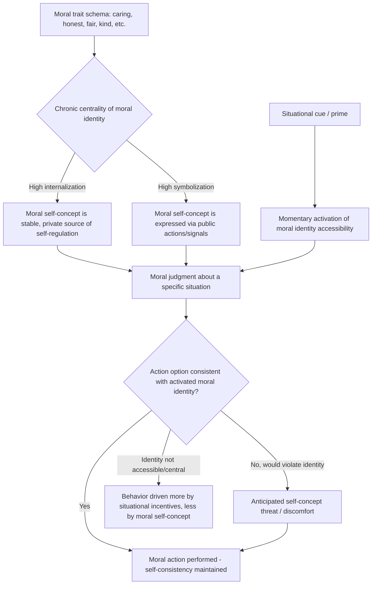

## Moral Identity and Behavior

### Overview

Moral identity refers to the degree to which being a moral person is central and important to an individual's overall self-concept. Rather than treating morality primarily as a matter of reasoning ability, situational pressure, or isolated judgment, moral identity theory frames ethical behavior as substantially driven by self-consistency motivation — people act morally, in significant part, because doing so is congruent with who they understand themselves to be. The construct bridges social-cognitive theories of the self with moral psychology, and has become one of the most robust individual-difference predictors of moral behavior in the contemporary literature.

### Theoretical Origins

**Key Points**

- **Augusto Blasi (1980, 1983, 1984)**: the foundational theorist of moral identity, proposed the "self model" of moral functioning, arguing that moral reasoning (as studied by Kohlberg) is necessary but insufficient to explain moral action — a person must also perceive morality as integral to their sense of self for moral judgment to reliably translate into moral behavior. Blasi introduced the concept of "moral integrity" as consistency between one's moral judgments/standards and one's actions, mediated by the self.
- **Hart, Atkins & Ford; Damon & Hart (developmental tradition)**: examined how moral identity develops across childhood and adolescence, and its relationship to sustained civic and prosocial engagement (notably studied in extraordinary moral exemplars).
- **Augusto Blasi's "moral motivation gap"**: addressed the classic and persistent problem in moral psychology — why moral judgment (knowing the right thing to do) often fails to produce moral action — by proposing that motivation to act consistently with moral judgment depends on the self-relevance of morality, not on judgment sophistication alone.

### Aquino & Reed's Social-Cognitive Model of Moral Identity

**Key Points**

The most widely used contemporary operationalization is Karl Aquino and Americus Reed II's (2002) social-cognitive model, which conceptualizes moral identity as a self-schema organized around a set of moral trait associations (e.g., caring, compassionate, fair, honest, generous, helpful, hardworking, kind), and decomposes it into two distinct dimensions:

| Dimension | Definition | Behavioral Relevance |
| --- | --- | --- |
| Internalization | The degree to which moral traits are experienced as deeply and personally important to one's sense of self — a private, internal centrality of moral identity | More strongly predicts private/internal moral motivation and behavior not dependent on external recognition |
| Symbolization | The degree to which moral traits are reflected outwardly in one's public actions, associations, and social presentation | More strongly predicts publicly visible moral or prosocial behaviors, especially those with reputational/signaling value |

- Measured via the **Self-Importance of Moral Identity (SIMI) Scale**, in which respondents are presented with a list of moral traits, asked to visualize a person with those traits, and then rate agreement with items tapping internalization (e.g., "It would make me feel good to be a person who has these characteristics") and symbolization (e.g., "The kind of person I am is obvious to other people from the clothes I wear").
- The internalization/symbolization distinction is theoretically important because it predicts that moral identity's effects on behavior will differ depending on whether a situation calls for privately-verifiable versus publicly-visible moral action.

### Self-Consistency and the Moral Self-Regulation Process

**Key Points**

- Central mechanism: moral identity is theorized to function as a **self-regulatory standard**. When a moral identity is highly self-important (chronically or situationally activated/accessible), behavioral options that are inconsistent with that identity generate anticipated psychological discomfort (self-concept threat), motivating avoidance of immoral action and pursuit of identity-congruent moral action.
- **Activation/accessibility framing**: consistent with broader social-cognitive self theory, moral identity's influence on any specific behavior is proposed to depend not only on its chronic centrality (a stable trait-like individual difference) but also on its momentary cognitive accessibility — situational cues can temporarily activate ("prime") moral identity, temporarily increasing its behavioral influence even for individuals who do not have chronically high moral identity centrality.
- This framing distinguishes moral identity theory from pure trait models — it is explicitly an interactionist framework in which stable individual differences and situational activation jointly determine moral behavior.

### Empirical Evidence

**Key Points**

- **Aquino & Reed (2002)**: validated the SIMI scale and found moral identity (particularly internalization) predicted self-reported volunteering, charitable behavior, and other prosocial outcomes.
- **Aquino, Freeman, Reed, Lim & Felps (2009)**: demonstrated experimentally that priming moral identity (e.g., having participants unscramble sentences containing moral trait words, or copy the Ten Commandments) increased prosocial behavior (e.g., donation amounts) and decreased unethical behavior (e.g., cheating on a subsequent task), directly supporting the causal, situationally-activatable nature of moral identity's influence.
- **Reed & Aquino (2003)**: found that expanding the psychological boundaries of one's moral identity to include more distant others (broadening the "moral circle" of who counts as relevant to one's moral self-concept) increased willingness to allocate resources to out-group members and reduced support for war-related casualties among out-groups.
- **Business ethics and organizational research**: moral identity centrality has been shown across numerous studies to predict reduced unethical workplace behavior (e.g., resistance to fraudulent reporting, reduced susceptibility to unethical instructions from authority figures) and increased ethical leadership and voice behavior.
- **Moral exemplars research** (Colby & Damon, 1992; Hart & Fegley, 1995): studies of individuals recognized for extraordinary sustained moral commitment (e.g., civil rights activists, humanitarian workers) found these individuals characteristically describe their moral commitments as deeply fused with personal identity ("I couldn't NOT do this and still be me") rather than as separate, effortfully-applied principles — consistent with Blasi's original self-model framing.

### Moral Identity and the Judgment-Action Gap

**Key Points**

- A central function attributed to moral identity in the literature is closing (or explaining variation in) the well-documented gap between moral judgment/reasoning and actual moral behavior — a gap that purely cognitive-developmental models (Kohlberg) struggled to explain, since reasoning sophistication alone correlates only modestly with real-world moral conduct.
- Moral identity is proposed to function as the crucial motivational bridge: judgment determines *what* is understood to be right, but moral identity centrality determines the *motivational force* behind translating that judgment into action, particularly when acting morally carries personal cost.

### Process Diagram

### Distinction from Related Constructs

| Construct | Core Distinction from Moral Identity |
| --- | --- |
| Moral reasoning (Kohlberg) | Reasoning concerns the cognitive sophistication of moral judgment; moral identity concerns the self-relevance/centrality of morality, explaining motivation to act on judgment |
| Moral emotions (guilt, shame) | Emotions are episodic affective states following specific acts; moral identity is a relatively stable self-concept structure that can generate anticipatory emotion but is conceptually broader and more persistent |
| Moral licensing/cleansing | Licensing/cleansing describe short-term fluctuations in perceived moral "balance" following specific acts; moral identity describes a longer-term, more stable self-schema that moderates susceptibility to such fluctuations (individuals high in moral identity centrality show reduced licensing effects in some studies) |
| Self-concept clarity (general) | General self-concept clarity concerns coherence of the self-concept broadly; moral identity is domain-specific to the moral trait subset of the self-concept |

### Moral Identity as a Moderator of Other Moral Phenomena

**Key Points**

- Moral identity centrality has been found in multiple studies to moderate (typically attenuate) moral disengagement's effects on harmful behavior — individuals high in moral identity centrality are less likely to employ moral disengagement mechanisms to justify transgressions.
- Similarly implicated as a moderator of moral licensing: individuals for whom morality is more chronically central to self-concept show reduced licensing effects (a single good deed is less likely to "free" them for a subsequent transgression, plausibly because a stable identity-based standard is less susceptible to single-instance moral accounting fluctuations). [Inference — supported in several individual studies; not yet a fully settled, universally replicated moderation effect across the literature.]
- Interacts with situational strength: in "strong" situations with clear external moral demands or incentives (e.g., strict organizational rules, high surveillance), the incremental predictive power of moral identity for behavior tends to be reduced, since the situation itself is already constraining behavior; moral identity's predictive power is comparatively stronger in "weak," ambiguous, or low-accountability situations where personal discretion is high.

### Applications

**Key Points**

- **Moral education and character development**: informs educational approaches that aim to cultivate not just moral reasoning skills but genuine identity-level integration of moral values (e.g., service-learning programs designed to foster identification with a "helper" or "moral" self-concept through sustained real-world moral action).
- **Organizational ethics and hiring/selection**: informs use of moral identity assessment (formally or informally) in contexts concerned with predicting resistance to unethical organizational pressures, and design of workplace interventions (e.g., ethics reminders, identity-priming) shown experimentally to reduce dishonest behavior.
- **Marketing and consumer psychology**: moral/ethical identity concepts are used in cause-marketing and corporate social responsibility research to understand which consumers are most responsive to ethical brand positioning and most likely to translate stated ethical values into purchase behavior.
- **Prosocial behavior and volunteering research**: used to explain sustained (versus one-off) volunteering and civic engagement, since identity-based motivation is theorized to be more durable and self-sustaining than externally-incentivized or purely norm-compliant prosocial behavior.
- **Moral exemplar and heroism research**: provides a theoretical framework for understanding sustained extraordinary moral commitment (e.g., rescuers during the Holocaust, long-term humanitarian workers) as arising from deep identity fusion with moral values rather than exceptional reasoning ability alone.

### Criticisms and Limitations

**Key Points**

- **Measurement limitations of the SIMI scale**: relies on self-report of trait associations with a fixed, researcher-selected list of moral traits, raising questions about whether it captures the full, culturally variable content of what different individuals or groups consider centrally "moral." [Inference — a commonly noted psychometric limitation rather than a settled empirical refutation.]
- **Correlational dominance**: while experimental priming studies (e.g., Aquino et al., 2009) provide causal evidence for short-term activation effects, much of the broader literature linking chronic moral identity centrality to real-world behavior remains correlational, leaving open questions about reverse causation (e.g., habitual moral behavior increasing self-perceived moral identity, rather than the reverse) or third-variable explanations.
- **Cultural variability**: the specific trait list used to operationalize "moral identity" in the SIMI scale reflects particular (largely Western, individualist) conceptions of moral virtue; the construct's structure and behavioral predictive power in more collectivist or non-WEIRD cultural contexts is comparatively less thoroughly studied. [Unverified — cross-cultural validation exists but is less extensive than the North American literature base.]
- **Symbolization's more complex relationship to behavior**: unlike internalization, which shows fairly consistent positive associations with genuinely prosocial and ethical behavior across studies, symbolization has shown more mixed and context-dependent associations, in some studies correlating with self-promotional or reputation-driven behavior that is not straightforwardly "moral" in substance, complicating simple interpretation of the two-dimensional model.

**Related Topics**

- Blasi's self model of moral functioning
- Aquino & Reed's Self-Importance of Moral Identity (SIMI) Scale
- Kohlberg's stages of moral reasoning — contrast with identity-based motivation
- Moral disengagement mechanisms — moderation by moral identity
- Moral licensing and moral cleansing — moderation by moral identity
- Moral exemplars and extraordinary prosocial commitment
- Self-concept and self-schema theory (general social cognition)
- Prosocial behavior and sustained volunteering
- Corporate social responsibility and consumer ethics
- Moral circle expansion (Reed & Aquino)