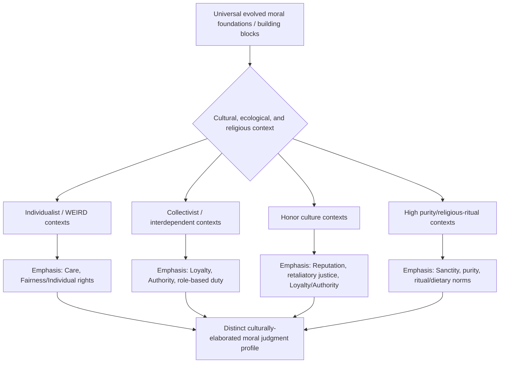

## Cultural Variation in Moral Judgment

### Overview

Cultural variation in moral judgment refers to the systematic differences across societies, subcultures, and social ecologies in what is considered morally relevant, how moral violations are weighted and categorized, and which psychological processes are recruited in forming moral evaluations. Rather than treating morality as a single universal domain best captured by Western frameworks centered on harm and individual rights, cross-cultural moral psychology examines how ecological, economic, religious, and social-structural factors shape moral cognition, generating both substantial cross-cultural convergence in some respects and substantial divergence in others.

### Foundational Frameworks

**Key Points**

- **Richard Shweder's "Big Three" ethics** (Shweder, Much, Mahapatra & Park, 1997): based on ethnographic comparison of moral reasoning in Bhubaneswar, India versus the United States, Shweder identified three distinct moral "codes" used across cultures: the **Ethic of Autonomy** (centered on harm, rights, justice, and individual freedom), the **Ethic of Community** (centered on duty, hierarchy, loyalty, and interdependence within social roles), and the **Ethic of Divinity** (centered on purity, sanctity, and the treatment of the body/self as a spiritually significant entity). Shweder found Indian participants invoked Community and Divinity codes substantially more than American participants, who relied heavily on the Autonomy code.
- **Moral Foundations Theory** (Haidt & Joseph; Graham, Haidt & Nosek): directly built on Shweder's framework, proposing the five/six-foundation model (Care, Fairness, Loyalty, Authority, Sanctity, Liberty) as evolutionarily-prepared building blocks that cultures combine and weight differently, providing a more granular, empirically measurable extension of the Big Three framework.
- **WEIRD critique** (Henrich, Heine & Norenzayan, 2010): a highly influential methodological critique noting that the overwhelming majority of published psychological research, including moral psychology, draws on samples from Western, Educated, Industrialized, Rich, Democratic societies — a narrow and often non-representative slice of human psychological diversity — raising serious concerns about the generalizability of moral psychology findings claimed as universal.

### Individualism-Collectivism and Moral Judgment

**Key Points**

- **Individualist cultures** (typically Western, North American, Northern/Western European): moral judgment tends to emphasize individual rights, personal autonomy, harm avoidance, and rule-based fairness; moral violations are frequently evaluated based on identifiable individual victims and intentions.
- **Collectivist cultures** (typically many East Asian, South Asian, and various African and Latin American societies, though with substantial within-region variation): moral judgment places greater relative weight on group harmony, role obligations, hierarchical duties, and the maintenance of social order; moral violations are frequently evaluated relative to their disruption of relationships and group cohesion rather than purely individual harm.
- **Triandis's individualism-collectivism framework**: provides the broader cross-cultural psychology architecture (also incorporating horizontal/vertical distinctions — egalitarian versus hierarchical variants of each) that moral psychology research on cultural variation frequently draws upon to predict and interpret differences in foundation weighting and judgment style.
- **Caveat on oversimplification**: contemporary cross-cultural psychologists caution against treating "individualist" and "collectivist" as monolithic, binary cultural categories; substantial within-country and within-region heterogeneity exists, and many societies show mixed or context-dependent patterns rather than uniform profiles. [Inference — a widely-noted methodological caution in the contemporary cross-cultural literature, reflecting increased sophistication beyond earlier binary East-West framings.]

### Purity and Sanctity Across Cultures

**Key Points**

- Sanctity/purity-based moral concerns (rooted in disgust and bodily/behavioral norms around food, sex, and the sacred) show substantially more cross-cultural variability in both content and intensity than harm-based concerns, though the underlying disgust-sensitivity mechanism itself appears to have cross-culturally recurrent features.
- Religious traditions with strong purity/pollution concepts (e.g., orthodox interpretations within Hinduism's caste-linked purity concerns, Islamic and Jewish dietary and ritual purity laws, various indigenous purification practices) provide especially elaborated cultural content for the Sanctity foundation, while more secular Western contexts show comparatively attenuated (though not absent) purity-based moral judgment, often redirected toward secular domains (e.g., environmental "contamination," bodily "wellness" purity norms).
- Rozin's cross-cultural disgust research documents substantial variation in specific disgust elicitors (foods, bodily practices) while finding the core disgust response architecture (oral rejection, contamination sensitivity, sympathetic magic-like contagion reasoning) recurs across highly diverse cultural samples. [Inference — reflects a broadly-supported pattern in the cross-cultural disgust literature, though the precise universal/culture-specific boundary continues to be refined by ongoing research.]

### Honor Cultures and Moral Judgment

**Key Points**

- **Honor culture research** (Nisbett & Cohen, 1996, "Culture of Honor," originally studying the U.S. South versus North): documents a distinct moral-behavioral syndrome in which personal and family reputation, willingness to respond forcefully to insults or challenges, and protection of status are strongly morally sanctioned, producing patterns of moral judgment that differ systematically from non-honor cultural contexts (e.g., greater moral justification for retaliatory violence following an insult to reputation).
- Honor-based moral systems are frequently linked ecologically to historical herding/pastoral economies (where resources are vulnerable to theft and reputation for toughness deters predation) versus agricultural economies (where resources are less mobile and reputation for toughness offers less protective advantage) — an evolutionary-ecological explanation for the geographic and historical distribution of honor cultures.
- Honor culture moral judgment often integrates strongly with the Loyalty and Authority foundations from MFT, alongside a distinctive emphasis on individual/family reputation that is less clearly captured by the standard MFT taxonomy.

### Moral Judgment of Intentionality Across Cultures

**Key Points**

- A substantial body of research has examined whether the weight given to an actor's **intentions** (versus outcomes) in moral judgment is culturally universal or culturally variable.
- Some cross-cultural studies (e.g., Barrett et al., 2016, across diverse small-scale societies) find that sensitivity to intent in moral judgment (judging accidental harm less harshly than intentional harm) appears with substantial regularity across highly diverse cultural and economic contexts, suggesting a degree of universality in intent-sensitivity, though the relative *weighting* of intent versus outcome severity varies meaningfully across societies.
- Other research (e.g., work contrasting some East Asian and Western samples) suggests outcome severity may be weighted relatively more heavily (relative to intent) in some collectivist contexts compared to some individualist contexts, though findings in this specific area show meaningful heterogeneity across studies and populations. [Unverified — this remains an actively researched and somewhat mixed area rather than a settled cross-cultural generalization.]

### Diagram: Moral Foundation Weighting Across Cultural Contexts (Schematic)

### Cross-Cultural Universals in Moral Judgment

**Key Points**

Despite substantial cultural variation, several features of moral judgment show notable cross-cultural recurrence, an important counterbalance to purely relativist interpretations:

- **Prohibition on unprovoked harm to in-group members**: some prohibition against gratuitous, unprovoked harm to others appears with high (though not perfect) cross-cultural regularity, consistent with evolutionary accounts of harm-aversion as an ancient, broadly shared moral intuition.
- **Reciprocity and fairness norms in cooperative exchange**: some form of fairness/reciprocity-based moral evaluation of cooperative exchange appears widely, consistent with cheater-detection and reciprocal altruism research (Cosmides & Tooby) suggesting evolutionarily ancient origins.
- **In-group loyalty and coalition-based moral concern**: concern for group loyalty and negative evaluation of betrayal appears to recur across highly diverse societies, though the specific groups considered relevant (family, clan, nation, religion) vary substantially by cultural and historical context.
- **Basic emotional architecture of moral response**: core moral emotions (anger at unfairness, guilt following perceived wrongdoing, disgust at perceived contamination/degradation) appear to have recognizable cross-cultural analogs, even as their specific triggers and behavioral expression vary. [Inference — this reflects a broadly convergent, though not unanimous, position across current cross-cultural moral psychology and moral emotion research.]

### Moral Relativism vs. Universalism: The Psychological Debate

**Key Points**

- Cross-cultural moral psychology findings are frequently invoked (with caution) in broader debates between descriptive moral relativism (the empirical claim that moral beliefs and practices vary substantially across cultures) and moral universalism (the empirical or normative claim that certain moral principles hold across all human societies).
- Psychological research on cultural variation is generally understood by researchers in the field as supporting a **nuanced middle position**: substantial cultural variation exists in the *specific content, relative weighting, and situational application* of moral judgment, layered on top of some degree of shared underlying evolved psychological architecture (evolved emotional and cognitive building blocks) that constrains but does not fully determine the resulting cultural moral systems.
- It is important to distinguish this descriptive psychological claim (about how moral cognition actually varies) from the separate normative/philosophical question of whether moral relativism or universalism is correct as an ethical theory — psychological data on variation does not by itself resolve the normative philosophical debate, a point emphasized by philosophically-informed commentators on this research. [Inference — this distinction between descriptive and normative claims is a standard methodological caution frequently made explicit in careful treatments of this literature, though not always maintained consistently in popular discussions.]

### Methodological Considerations in Cross-Cultural Moral Psychology Research

**Key Points**

- **Translation and construct equivalence**: cross-cultural comparison of moral judgment requires careful attention to whether instruments (e.g., the Moral Foundations Questionnaire, vignette-based dilemmas) carry equivalent meaning and psychometric properties across languages and cultural contexts — a nontrivial methodological challenge given morality's deep embedding in culturally specific language and concepts.
- **Sampling beyond convenience/student samples**: increasing methodological emphasis on moving beyond convenience samples (often university students) toward more representative and diverse population sampling, including small-scale, non-industrialized societies (e.g., research conducted with the Ju/'hoansi, various Amazonian and Pacific Island societies), which sometimes reveals moral judgment patterns not well-predicted by theories built primarily on WEIRD samples.
- **Emic versus etic approaches**: a persistent methodological tension between etic approaches (applying researcher-derived, ostensibly universal categories like the MFT foundations across all cultures) and emic approaches (deriving moral categories from within each culture's own concepts and language), each with distinct strengths and limitations for cross-cultural comparison.

### Applications

**Key Points**

- **International business ethics and negotiation**: informs training and practice in cross-cultural business contexts where differing weightings of fairness, hierarchy, and loyalty can produce genuine miscommunication or conflict over what counts as ethical conduct.
- **Global health and humanitarian intervention design**: informs culturally sensitive design of health, development, and humanitarian interventions, recognizing that moral framing effective in one cultural context (e.g., individual-rights-based public health messaging) may be less persuasive or even counterproductive in contexts where community/authority-based framing carries more moral weight (connecting to moral reframing research).
- **International law, human rights discourse, and diplomacy**: informs understanding of genuine cross-cultural disagreement (versus mere misunderstanding) in international human rights negotiations and discourse, where differing foundational moral emphases can underlie substantive disagreement about policy and legal norms.
- **Immigration, acculturation, and multicultural psychology**: informs research on how individuals navigate moral judgment across cultural contexts during migration and acculturation, including bicultural individuals' capacity to flexibly shift moral judgment frameworks depending on cultural context cues (cultural frame-switching research).

**Related Topics**

- Shweder's Big Three ethics (Autonomy, Community, Divinity)
- Moral Foundations Theory — cross-cultural extensions
- WEIRD samples critique (Henrich, Heine & Norenzayan)
- Honor culture psychology (Nisbett & Cohen)
- Individualism-collectivism (Triandis; Hofstede's cultural dimensions)
- Cross-cultural disgust and purity research (Rozin)
- Intentionality in moral judgment across societies
- Cultural frame-switching and bicultural identity
- Moral reframing and cross-cultural persuasion
- Evolutionary psychology of cooperation and reciprocity