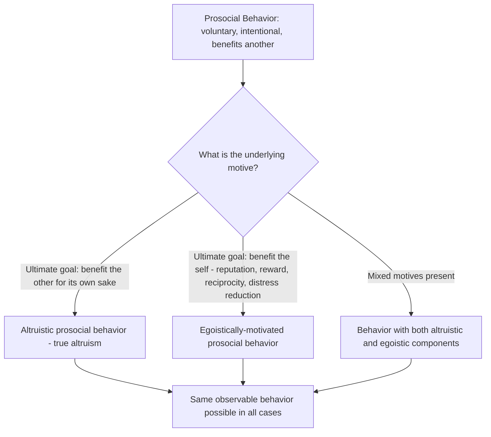

## Defining Prosocial Behavior and Altruism

### Overview

Prosocial behavior and altruism are foundational constructs in social psychology concerned with voluntary actions intended to benefit others. While often used loosely and interchangeably in everyday language, the two terms are conceptually distinct within the research literature: prosocial behavior is the broader category, defined primarily by its observable consequences and voluntary nature, while altruism is a narrower, motivationally defined subset concerned specifically with the underlying intent behind the behavior. Precisely defining these constructs — and disentangling behavior from motivation — has been a central and persistently contested project in the field since its emergence.

### Defining Prosocial Behavior

**Key Points**

- **Standard definition**: Prosocial behavior is voluntary behavior intended to benefit another individual or group of individuals (Eisenberg & Mussen, 1989; Batson, 1998; Penner, Dovidio, Piliavin & Schroeder, 2005).
- **Key definitional criteria**:
  - **Voluntariness**: the behavior must be freely chosen rather than coerced or role-obligated in a way that removes discretion (though the boundary between voluntary and role-based helping is itself debated).
  - **Intentionality**: the actor must intend the behavior to benefit the recipient — accidental benefit does not qualify as prosocial behavior in the technical sense.
  - **Benefit to another**: the behavior must be directed at improving another's welfare, broadly construed (material, emotional, physical, or social benefit).
- **Motivation-neutral**: critically, the standard definition of prosocial behavior makes no claim about the underlying motive — a prosocial act can be motivated by genuine concern for the other person, by self-interest (e.g., reputational gain, reciprocity expectation, guilt avoidance), or by some mixture of both. This motivational neutrality is what distinguishes prosocial behavior as a category from altruism specifically.
- **Behavioral scope**: the category encompasses a wide range of specific behaviors studied somewhat separately in the literature, including helping, sharing, cooperating, comforting, donating, volunteering, and bystander intervention.

### Defining Altruism

**Key Points**

- **Standard definition**: Altruism is prosocial behavior motivated primarily or exclusively by the goal of increasing another's welfare, rather than by the goal of increasing one's own welfare (Batson, 2011).
- **The defining criterion is motivational, not behavioral**: two behaviorally identical acts of helping can differ entirely in their altruistic status depending on the underlying motivational structure — one driven by genuine other-oriented concern, the other by self-interested calculation (reputation, reciprocity, guilt-avoidance, personal distress-reduction) despite an outwardly identical helping act.
- **"Ultimate" versus "instrumental" goal distinction** (central to Batson's framework): an act is altruistic if benefiting the other is the *ultimate* goal of the action (the end point the actor is aiming for), even if instrumental or secondary goals are also present. An act is *not* altruistic (but may still be prosocial) if benefiting the other is merely an *instrumental* goal on the way to some other ultimate self-benefiting goal (e.g., helping someone specifically and only in order to gain their approval).
- **Egoism as the primary theoretical contrast**: altruism is defined in explicit contrast to psychological egoism — the view that all human motivation, including apparently helping behavior, is ultimately self-interested at its root. The central empirical and theoretical question in altruism research has been whether genuine altruistic motivation (as opposed to disguised self-interest) actually exists.

### Conceptual Relationship Between the Two Constructs

### Historical Development of the Definitional Debate

**Key Points**

- **Early 20th-century behaviorism and psychological egoism**: dominant early psychological frameworks (influenced by behaviorism and simple hedonic/reinforcement models) tended to assume all behavior, including apparent helping, was ultimately reducible to self-interested reinforcement history, making genuine altruism theoretically suspect or definitionally impossible within these frameworks.
- **Post-WWII emergence of bystander research**: the 1964 murder of Kitty Genovese in New York City (and the widely reported, though later empirically contested and partially exaggerated, claim that numerous witnesses failed to intervene or call for help) catalyzed a surge of empirical research into helping behavior, beginning with Bibb Latané and John Darley's foundational work on the bystander effect and diffusion of responsibility, establishing prosocial behavior as a major distinct research area within social psychology.
- **Emergence of the altruism-specific debate**: through the 1970s-1990s, researchers including Batson, Cialdini, and Dovidio developed increasingly precise experimental paradigms specifically designed to empirically distinguish altruistic from egoistic motivation, rather than treating "helping behavior" as a single undifferentiated category — most notably crystallizing in Batson's empathy-altruism hypothesis research program.

### Related and Overlapping Constructs

| Construct | Relationship to Prosocial Behavior/Altruism |
| --- | --- |
| Cooperation | Joint action toward a shared goal, which may or may not involve one party benefiting another at personal cost; overlaps with but is not identical to prosocial behavior (cooperation can be mutually self-interested without qualifying as other-oriented helping) |
| Reciprocal altruism (evolutionary biology) | A distinct technical term from evolutionary theory (Trivers, 1971) describing helping that evolved because it increases the probability of future reciprocal benefit to the helper — importantly, "reciprocal altruism" in the evolutionary sense is not altruism in Batson's psychological/motivational sense, since it is ultimately self-benefiting at the level of evolutionary function, even if the proximate psychological experience feels genuinely other-oriented |
| Kin selection / inclusive fitness (Hamilton) | An evolutionary mechanism explaining helping directed toward genetic relatives; again distinct from psychological altruism, since it describes an evolutionary/functional account rather than a claim about proximate conscious motivation |
| Empathy | An affective/cognitive response (feeling what another feels, or feeling concern for another's welfare) that is theorized as a primary proximate cause of altruistic motivation in Batson's model, but is conceptually distinct from altruism itself (a motivational state) or prosocial behavior (an observable act) |
| Compassion | An affective state involving concern for another's suffering combined with a desire to help; overlaps substantially with empathic concern in Batson's framework and is frequently used near-interchangeably with empathic concern in the altruism literature |
| Volunteering | A specific, typically sustained and organizationally-structured form of prosocial behavior, studied with some distinct theoretical tools (e.g., functional approach to volunteer motivation, Clary & Snyder) alongside general prosocial behavior frameworks |

### Levels of Analysis: Proximate versus Ultimate Explanation

**Key Points**

- A recurring source of definitional confusion in this literature stems from conflating two distinct levels of explanation, a distinction borrowed from evolutionary biology (Tinbergen's four questions, particularly proximate versus ultimate causation):
  - **Proximate (psychological) level**: concerns the immediate, felt motivational state driving a specific helping act — this is the level at which Batson's altruism/egoism distinction operates.
  - **Ultimate (evolutionary/functional) level**: concerns why the capacity for helping behavior (including feelings of empathy and apparently altruistic motivation) evolved at all — evolutionary explanations (kin selection, reciprocal altruism, costly signaling, group selection debates) operate at this level and are compatible with proximate altruistic motivation actually existing, since an evolved psychological mechanism can produce genuinely other-oriented proximate motivation even if that mechanism itself evolved because it was, at the ultimate/functional level, adaptive for the helper's genes.
- This distinction resolves an otherwise persistent confusion: evolutionary accounts of why helping evolved (ultimate level) do not, by themselves, settle the separate empirical psychological question of whether people's immediate, felt motivation when helping is genuinely other-oriented or self-oriented (proximate level) — a point emphasized explicitly by Batson to defend the coherence and testability of psychological altruism as a construct despite evolutionary "selfish gene"-style explanations of its origins.

### Measurement and Operationalization Challenges

**Key Points**

- **The fundamental measurement problem**: because altruism is defined motivationally rather than behaviorally, and because motives are internal and not directly observable, researchers cannot simply observe a helping act and classify it as altruistic or egoistic — specialized experimental paradigms are required that manipulate the presence or absence of plausible egoistic explanations while holding the helping opportunity constant (the core logic of Batson's empathy-altruism experimental program).
- **Self-report limitations**: directly asking people why they helped is subject to substantial self-presentation bias, limited introspective access to one's own motivation, and post-hoc rationalization, making self-report an insufficient sole method for adjudicating the altruism/egoism question.
- **Behavioral proxies commonly used in research**: donation amount, helping under costly or easy-escape conditions, willingness to help when anonymous versus observed, and physiological/neural measures (e.g., activation in reward-related brain regions during helping) are all used as converging behavioral and physiological evidence, though each carries its own interpretive limitations.

### Applications

**Key Points**

- **Charitable giving and nonprofit fundraising**: definitional clarity about mixed altruistic/egoistic motives informs fundraising strategy (e.g., understanding why donor recognition, tax incentives, and genuine philanthropic concern often operate simultaneously rather than as mutually exclusive motivators).
- **Organizational citizenship behavior research**: applies the prosocial behavior framework to workplace contexts, studying voluntary employee behaviors that benefit colleagues or the organization beyond formal job requirements.
- **Public health and blood/organ donation research**: informs understanding and design of donation appeals, given that blood and organ donation are frequently studied as relatively "pure" test cases for altruistic motivation due to typically low reputational visibility and reciprocity expectation.
- **Evolutionary and comparative psychology**: the proximate/ultimate distinction is foundational to ongoing comparative research examining whether nonhuman animals exhibit behavior analogous to human prosocial behavior, and whether any proximate motivational analog to human empathic concern can be inferred in other species.

**Related Topics**

- Batson's empathy-altruism hypothesis
- Bystander effect and diffusion of responsibility (Latané & Darley)
- Kin selection and inclusive fitness (Hamilton)
- Reciprocal altruism (Trivers)
- Psychological egoism versus altruism debate
- Negative-state relief model of helping (Cialdini)
- Functional approach to volunteer motivation (Clary & Snyder)
- Organizational citizenship behavior
- Empathic concern and perspective-taking
- Costly signaling theory and competitive altruism