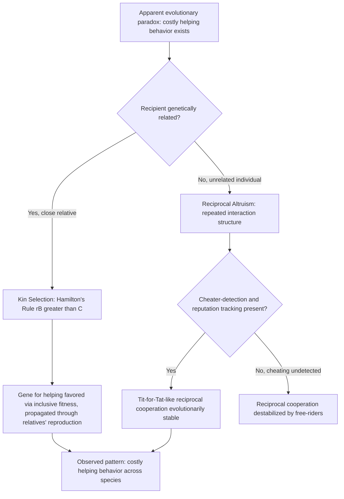

## Kin Selection and Reciprocal Altruism

### Overview

Kin selection and reciprocal altruism are the two foundational evolutionary theories explaining how apparently self-sacrificing helping behavior could evolve through natural selection despite its individual fitness cost. Both theories resolve the apparent paradox that Darwinian selection, acting on individual survival and reproduction, should eliminate any behavior that reduces an individual's own reproductive success — yet helping behavior, including behavior costly to the helper, is ubiquitous across the animal kingdom, including in humans. These theories operate at the **ultimate (evolutionary/functional)** level of explanation, addressing why the capacity for helping behavior evolved, and are conceptually distinct from proximate psychological questions about whether any given helping act is subjectively experienced as altruistic (see the proximate/ultimate distinction in altruism theory).

### Kin Selection Theory

**Key Points**

- **W.D. Hamilton (1964)**: formalized kin selection theory, proposing that natural selection favors genes that increase an organism's **inclusive fitness** — the sum of an individual's own direct reproductive success plus its effect on the reproductive success of genetic relatives, weighted by the degree of genetic relatedness.
- **Hamilton's Rule**: the central formal prediction of kin selection theory, specifying the condition under which a gene for altruistic/helping behavior will be favored by selection:

$$rB > C$$

Where $r$ is the coefficient of genetic relatedness between the actor and the recipient, $B$ is the fitness benefit to the recipient, and $C$ is the fitness cost to the actor. When the relatedness-weighted benefit exceeds the cost to the helper, a gene predisposing toward that helping behavior will increase in frequency in the population, even though the individual helper incurs a net personal fitness cost.

- **"The selfish gene" framing** (Richard Dawkins, 1976): popularized the gene-centered view underlying kin selection, reframing the theory as selection acting fundamentally at the level of the gene (or "replicator") rather than the individual organism — an organism that sacrifices itself to save enough close relatives is, from the gene's perspective, still propagating copies of itself carried in those relatives.
- **Relatedness coefficients**: standard genetic relatedness values used in kin selection calculations include $r = 0.5$ for full siblings and parent-offspring pairs, $r = 0.25$ for half-siblings, grandparent-grandchild, aunt/uncle-niece/nephew pairs, and $r = 0.125$ for first cousins — these values directly predict, and have been broadly empirically supported in, patterns of nepotistic favoritism and helping across many species, including humans.
- **Famous (possibly apocryphal) illustrative quote**: J.B.S. Haldane is often credited with the informal remark that he would lay down his life for two brothers or eight cousins — illustrating the core relatedness-weighted logic of Hamilton's Rule in intuitive form, though the precise attribution and wording of this anecdote is disputed in the historical record. [Unverified — widely repeated illustrative anecdote whose exact origin and wording are not firmly established.]

### Empirical Evidence for Kin Selection

**Key Points**

- **Eusocial insects**: kin selection provided the first major successful explanation for the evolution of extreme self-sacrificing behavior in eusocial insect colonies (bees, ants, wasps), where sterile worker castes forgo their own reproduction entirely to help raise siblings — explained by the unusually high relatedness among sisters ($r = 0.75$) produced by haplodiploid sex determination in Hymenoptera, making sister-rearing genetically more "profitable" than direct reproduction in some models. [Inference — the haplodiploidy explanation for eusociality, while historically influential, remains a debated point in evolutionary biology, with alternative explanations (e.g., ecological/monogamy-based models by Boomsma) also receiving significant support in contemporary research.]
- **Human nepotism and kin favoritism**: cross-cultural and experimental research broadly finds that humans show reliably greater willingness to help, share resources with, and take risks for genetic relatives compared to genetically unrelated individuals, and that this favoritism scales with relatedness in patterns broadly consistent with Hamilton's Rule predictions (e.g., Burnstein, Crandall & Kitayama, 1994, found hypothetical helping decisions in life-or-death scenarios tracked genetic relatedness more strongly than in low-cost helping scenarios, consistent with the cost-scaling prediction of the theory).
- **Parental investment asymmetries**: differential parental investment and favoritism patterns (e.g., patterns of inheritance, caregiving intensity) across various human and non-human species have been documented as broadly consistent with relatedness-based predictions, though substantial cultural and individual variation exists.
- **Alarm calling in ground squirrels and vervet monkeys**: classic field studies (e.g., Paul Sherman's Belding's ground squirrel research) found individuals were more likely to emit costly, predator-attracting alarm calls when close kin were nearby, consistent with kin-selected risk-taking.

### Reciprocal Altruism

**Key Points**

- **Robert Trivers (1971)**: proposed reciprocal altruism as a distinct evolutionary mechanism explaining helping behavior directed toward genetically **unrelated** individuals, based on the logic that helping another individual can be evolutionarily favored if the helper has a sufficiently high probability of receiving reciprocated help in the future, such that the net expected lifetime fitness benefit of the reciprocal exchange relationship exceeds the cost of any single helping act.
- **Necessary preconditions for reciprocal altruism to evolve** (per Trivers's original formulation and subsequent refinement):
  - Repeated interaction between the same individuals over time (or a sufficiently structured social environment allowing reputation tracking).
  - Sufficient cognitive capacity to recognize individuals and remember past interactions (individual recognition and memory).
  - Sufficient time delay tolerance and low enough discounting of future benefit relative to immediate cost.
  - A mechanism for detecting and appropriately responding to "cheaters" who accept help but fail to reciprocate.
- **The cheater-detection problem**: because reciprocal altruism is vulnerable to exploitation by individuals who accept help without reciprocating ("cheaters" or "free-riders"), evolutionary theorists (notably Cosmides & Tooby's subsequent work on cheater-detection cognitive modules) have argued that reciprocal altruism's evolutionary stability depends critically on the co-evolution of psychological mechanisms specialized for detecting and punishing or avoiding non-reciprocators.

### Reciprocal Altruism Strategy Models: The Prisoner's Dilemma and Tit-for-Tat

**Key Points**

- **Robert Axelrod's iterated Prisoner's Dilemma tournaments** (Axelrod & Hamilton, 1981; Axelrod, 1984): provided the most influential formal/computational demonstration of how reciprocal cooperation can evolve and stabilize in a population of self-interested agents, using repeated (iterated) rounds of the Prisoner's Dilemma game, in which mutual cooperation yields a better joint payoff than mutual defection, but unilateral defection yields the single highest payoff for the defector at the cooperator's expense.
- **"Tit-for-Tat" strategy**: the simple strategy of cooperating on the first interaction and thereafter mirroring the other player's previous move (cooperate if they cooperated, defect if they defected) won Axelrod's computer tournaments and was identified as remarkably robust and evolutionarily stable under a wide range of conditions, due to four key properties: it is **nice** (never defects first), **retaliatory** (punishes defection immediately), **forgiving** (returns to cooperation if the other player does), and **clear/simple** (easily recognized by other strategies, facilitating stable cooperative relationships).
- **Evolutionary stability requires an iterated (repeated) game structure**: reciprocal altruism/cooperation is not predicted to be evolutionarily stable in single-shot (one-time) interactions with no future consequences, since defection is always the payoff-maximizing choice in a genuinely one-shot game — the shadow of future interaction is theoretically essential to sustaining reciprocal cooperation.

### Comparison Table: Kin Selection vs. Reciprocal Altruism

| Feature | Kin Selection | Reciprocal Altruism |
| --- | --- | --- |
| Recipient of helping | Genetic relatives | Genetically unrelated individuals (or relatives, though theory specifically explains non-kin cases) |
| Core mechanism | Inclusive fitness via shared genes (Hamilton's Rule) | Expected future reciprocation across repeated interactions |
| Formal model | $rB > C$ | Iterated Prisoner's Dilemma; Tit-for-Tat and related strategies |
| Key requirement | Sufficient genetic relatedness ($r$) | Repeated interaction, individual recognition, cheater detection |
| Vulnerability | Kin misidentification (helping non-kin mistaken for kin) | Exploitation by non-reciprocating "cheaters"/free-riders |
| Key theorist | W.D. Hamilton | Robert Trivers; Robert Axelrod (game-theoretic formalization) |
| Applicable scope | Explains helping strongly biased toward relatives | Explains helping directed at unrelated individuals in ongoing social relationships |

### Process Diagram

### Extensions and Related Evolutionary Mechanisms

**Key Points**

- **Indirect reciprocity** (Nowak & Sigmund, 2005; Alexander, 1987): extends reciprocal altruism beyond direct two-party exchange to reputation-based systems, in which helping a third party (observed by others) increases one's own reputation and likelihood of receiving help from *different* individuals in the future — proposed as particularly important for explaining large-scale human cooperation among many individuals who may never directly interact twice.
- **Costly signaling / handicap principle** (Zahavi, 1975; extended to altruism by Gintis, Smith & Bowles as "competitive altruism"): proposes that costly generous or helping behavior can function as an honest signal of underlying quality (resources, status, cooperative intent), attracting mates, allies, or social status benefits, offering an additional evolutionary route to costly helping distinct from both kin selection and direct reciprocity.
- **Group selection debates**: a historically contentious alternative/supplementary evolutionary mechanism proposing that selection can act at the level of groups (not just genes/individuals), favoring groups containing more cooperative members; this remains an actively and often heatedly debated area in evolutionary theory, with most mainstream evolutionary biologists (following strong critiques by George C. Williams and others) treating group selection as, at minimum, requiring much more restrictive conditions to operate than kin selection or reciprocal altruism, though some researchers (notably E.O. Wilson and D.S. Wilson via "multilevel selection theory") have argued for its greater importance, particularly for explaining human ultra-sociality. [Unverified/contested — group selection remains one of the more actively disputed areas of evolutionary theory relevant to altruism, without full field-wide consensus.]

### Important Clarification: Evolutionary versus Psychological Altruism

**Key Points**

- A critical and frequently misunderstood point: kin selection and reciprocal altruism are explanations of **why** the *capacity* for helping behavior evolved (ultimate-level, functional explanations), not claims about the **proximate psychological motivation** experienced by an individual performing a specific helping act.
- An organism (including a human) can be, at the ultimate/evolutionary level, "selfishly" propagating genes or securing future reciprocal benefit via kin selection or reciprocal altruism, while simultaneously experiencing, at the proximate psychological level, a genuine, subjectively other-oriented altruistic motivation with no conscious calculation of genetic or reciprocal payoff whatsoever.
- This distinction (elaborated further under proximate/ultimate explanation in the broader altruism literature) is essential to avoid the common but logically flawed inference that "evolutionary biology has shown altruism is really just disguised selfishness" — the evolutionary account explains the origin of a psychological mechanism, not necessarily the content or subjective character of that mechanism's operation. [Inference — this represents the broadly accepted resolution among researchers working across both evolutionary and social-psychological approaches to altruism, though popular science communication does not always maintain this distinction carefully.]

### Applications

**Key Points**

- **Understanding human family dynamics and inheritance patterns**: kin selection theory informs research on parental investment, sibling rivalry, inheritance customs, and step-family/blended-family dynamics (e.g., elevated risk statistics associated with genetically unrelated co-resident caregivers in some family-violence research, controversially referred to in some literature as consistent with a kin-selection-informed prediction, though this application remains debated).
- **Organizational and workplace cooperation**: reciprocal altruism and reputation-based indirect reciprocity models inform understanding of cooperative behavior, trust-building, and free-rider problems in organizational and team contexts.
- **Online platform and reputation system design**: indirect reciprocity and reputation-tracking theory directly inform the design of rating and reputation systems on peer-to-peer platforms (e.g., online marketplaces, ride-sharing services) intended to sustain cooperative behavior among strangers who will not necessarily interact repeatedly.
- **Conservation and wildlife management**: kin selection and reciprocal altruism models inform understanding and prediction of cooperative and alarm-calling behavior relevant to conservation biology and behavioral ecology field research.

**Related Topics**

- Hamilton's Rule and inclusive fitness theory
- Eusociality and haplodiploidy in social insects
- Axelrod's iterated Prisoner's Dilemma tournaments and Tit-for-Tat
- Indirect reciprocity and reputation systems (Nowak & Sigmund)
- Cheater-detection cognitive modules (Cosmides & Tooby)
- Costly signaling theory and competitive altruism
- Group selection and multilevel selection theory debates
- Proximate versus ultimate explanation (Tinbergen's four questions)
- Parental investment theory (Trivers)
- Empathy-altruism hypothesis (Batson) — proximate-level counterpart