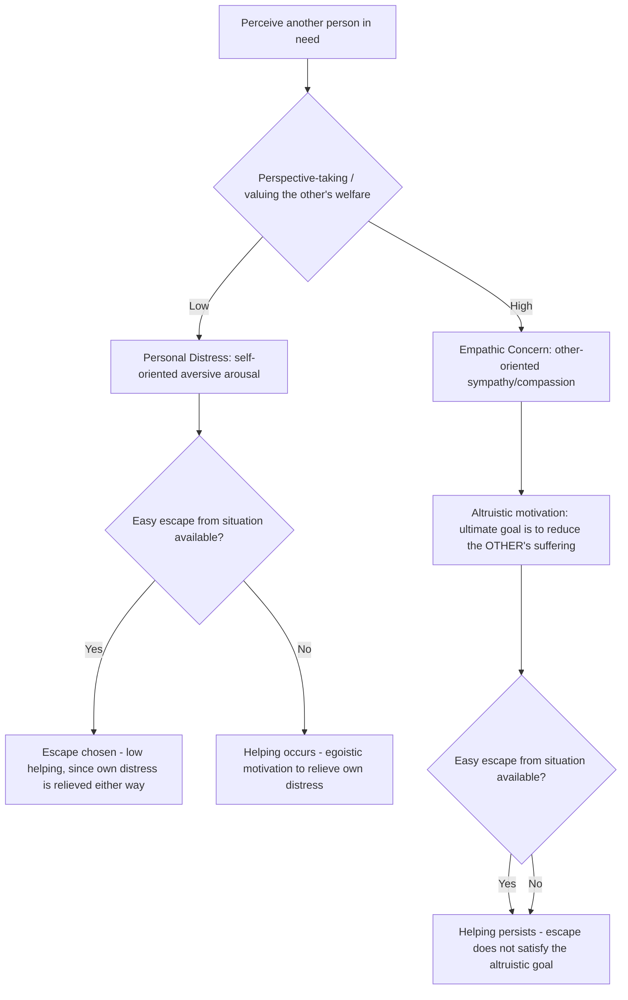

## Empathy-Altruism Hypothesis

### Overview

The empathy-altruism hypothesis, developed primarily by C. Daniel Batson across several decades of research beginning in the late 1970s, proposes that empathic concern felt for a person in need produces genuinely altruistic motivation to reduce that person's suffering — motivation with the ultimate goal of benefiting the other person, not merely the self. The hypothesis stands as the most extensively tested and influential attempt within psychology to empirically demonstrate that true altruism (as distinct from disguised or instrumental self-interest) actually exists as a genuine causal force in human behavior, directly contesting universal psychological egoism.

### Core Theoretical Claim

**Key Points**

- **Central proposition**: Empathic concern — an other-oriented emotional response congruent with the perceived welfare of a person in need, involving feelings of sympathy, compassion, tenderness, and concern — evokes altruistic motivation, defined as motivation with the ultimate goal of increasing that person's welfare.
- **Distinguished from egoistic alternative explanations**: Batson's research program was specifically designed to rule out several plausible egoistic explanations for apparently empathy-driven helping, rather than simply demonstrating a correlation between empathy and helping (which egoistic theories could equally predict).
- **The hypothesis does not deny that egoistic motives for helping exist**: Batson's position is explicitly that *both* egoistic and altruistic motivations for helping occur, and that empathic concern specifically (as opposed to other antecedents of helping) evokes the altruistic type — a pluralistic rather than a purely altruistic model of human motivation.

### Empathic Concern versus Personal Distress: The Critical Distinction

**Key Points**

Batson's model depends on a foundational distinction between two qualitatively different emotional responses to witnessing another's suffering, each predicted to produce a different motivational structure:

| Feature | Empathic Concern | Personal Distress |
| --- | --- | --- |
| Emotional quality | Other-oriented: sympathy, compassion, tenderness, softheartedness | Self-oriented: alarm, anxiety, discomfort, distress |
| Underlying appraisal | Focus on the welfare of the person in need | Focus on one's own aversive emotional state triggered by witnessing the need |
| Resulting motivation | Altruistic — ultimate goal is to reduce the other's suffering | Egoistic — ultimate goal is to reduce one's own aversive arousal |
| Predicted response to escape opportunity | Helping persists even when easy, non-helping escape from the situation is available | Helping drops sharply when easy escape from the distressing situation is available (since escaping removes one's own distress just as effectively as helping does) |
| Theoretical lineage | Batson's empathy-altruism hypothesis | Piliavin's arousal-cost-reward model; Cialdini's negative-state relief model |

- This distinction directly generates the central falsifiable, testable prediction that differentiates the empathy-altruism hypothesis from egoistic alternative accounts: if helping is altruistically motivated by empathic concern, helping should remain high even when a person could easily escape further exposure to the need without helping; if helping is egoistically motivated by personal distress reduction, helping should drop substantially when easy escape is available, since escape resolves the egoistic (distress-reduction) goal just as effectively as helping does.

### The Empathy-Altruism Experimental Paradigm

**Key Points**

- Batson and colleagues developed a standardized experimental logic, replicated across dozens of studies with methodological variations, generally following this structure:
  1. Manipulate empathic concern for a person in need (e.g., via perspective-taking instructions, perceived similarity to the person in need, or attachment-related priming) to create high- versus low-empathy conditions.
  2. Manipulate the ease of escaping further exposure to the person's need without helping (easy escape vs. difficult escape conditions).
  3. Measure whether participants help.
- **Key predicted interaction pattern**: Egoistic accounts predict an interaction in which helping rates drop sharply in the easy-escape condition regardless of empathy level (since escape resolves self-oriented distress). The empathy-altruism hypothesis predicts helping remains consistently high in the high-empathy condition *even under easy escape*, while helping drops under easy escape specifically in the low-empathy condition (where personal distress, rather than empathic concern, is presumed to be driving any helping that occurs).
- Across a large number of these studies (reviewed comprehensively in Batson, 1991, 2011), the predicted empathy-altruism interaction pattern was found with notable consistency, providing convergent support for the hypothesis.

### Ruling Out Specific Egoistic Alternative Explanations

Batson's research program systematically tested and sought to rule out several specific competing egoistic accounts, each requiring distinct experimental logic:

**1. Aversive-Arousal Reduction (Personal Distress) Model**

Tested via the easy-escape/difficult-escape paradigm described above; empathic concern was shown to maintain helping under easy escape, inconsistent with a pure personal-distress-reduction account.

**2. Punishment-Avoidance Model**

Proposes helping is motivated by avoidance of social or self-punishment (guilt, disapproval) for failing to help. Tested by manipulating whether failure to help would be known/visible to others or to oneself; empathy-associated helping persisted even under conditions minimizing anticipated punishment or disapproval.

**3. Reward-Seeking (Social/Self-Reward) Model**

Proposes helping is motivated by anticipated social approval, praise, or self-reward (mood enhancement, positive self-regard) rather than genuine concern for the other. Tested via studies manipulating whether the helper's identity/contribution would be known, and via studies examining whether high-empathy participants would still prefer to help directly rather than choosing an equally effective but less personally-rewarding alternative means of helping (e.g., Batson et al., 1988, "empathy-specific reward" studies).

**4. Negative-State Relief Model** (Cialdini and colleagues, offered as a specific, sustained rival account)

Proposes that empathic concern itself is simply a form of sadness/negative mood, and that helping occurs because it is a learned, socially reinforced means of relieving one's own negative mood state — an explicitly egoistic reinterpretation of "empathic concern." Cialdini, Schaller and colleagues conducted a sustained multi-study debate with Batson through the late 1980s and 1990s, each side producing studies designed to disconfirm the other's account (e.g., testing whether alternative mood-repair opportunities unrelated to helping the victim would eliminate helping in high-empathy participants — the negative-state relief model predicts they should, since any mood repair would suffice, while the empathy-altruism hypothesis predicts they should not, since the goal is specifically to help the person in need, not merely repair one's own mood).

**5. Empathy-Specific Punishment / Self-Focused Guilt**

A later-proposed alternative suggesting empathic individuals help specifically to avoid anticipated guilt at their own failure to live up to a self-standard, tested via manipulations of whether failure to help would be attributable to the participant versus external circumstances.

### Process Diagram

### Empirical Extensions and Related Findings

**Key Points**

- **Empathy-induced altruism and the "identifiable victim effect"**: empathic concern, and the altruistic motivation it evokes, is more readily elicited by identifiable, vivid, single individuals in need than by large, statistical, abstract groups — connecting Batson's paradigm to the broader identifiable victim effect literature (Slovic and colleagues) concerning numbing and reduced compassion toward large-scale, statistically-described suffering.
- **Empathy-induced altruism and helping at a cost to broader collective welfare**: Batson and colleagues (e.g., Batson & Ahmad, 2001; Batson, Batson, Todd et al., 1995) demonstrated that empathy for a specific individual can, under some conditions, motivate helping that individual even at some cost to a larger group or to principles of impartial fairness (e.g., moving a specific empathized-with individual up a waiting list ahead of others with equal or greater claim) — raising important normative and applied questions about tension between empathy-driven altruism and impartial justice.
- **Empathy-altruism and intergroup relations**: extended research (Batson, Chang, Orr & Rowland, 2002; and related work by Stephan & Finlay) has examined whether inducing empathy for a member of a stigmatized or out-group can generalize to more positive attitudes toward the broader out-group, with some but not fully consistent supportive evidence.
- **Neuroscience convergence**: subsequent affective neuroscience research (e.g., work distinguishing empathic concern/compassion-related neural circuitry, associated with reward and affiliative systems, from personal-distress-related neural circuitry, associated with pain/threat-related systems, in researchers such as Tania Singer and colleagues) has provided some convergent biological support for a qualitative empathic-concern/personal-distress distinction analogous to Batson's psychological one, though the neuroscience and psychological literatures use somewhat different operationalizations and are not perfectly mapped onto one another. [Inference — represents a broadly convergent but not fully unified cross-disciplinary finding, given differing measurement approaches between the affective neuroscience and social-psychological traditions.]

### Criticisms and Limitations

**Key Points**

- **Persistent alternative-explanation challenges**: despite the extensive series of studies designed to rule out egoistic alternatives, critics (most persistently Cialdini and colleagues, but also others) have continued to propose further, more sophisticated egoistic reinterpretations of the data, and the debate has not been regarded by all researchers in the field as fully and conclusively settled in favor of genuine altruism, even though Batson's cumulative body of evidence is widely regarded as the strongest empirical case for psychological altruism available. [Inference — reflects the genuinely contested, ongoing status of this debate in the field, notwithstanding the substantial weight of evidence Batson's program has amassed.]
- **Laboratory paradigm artificiality and generalizability**: as with much experimental social psychology, questions remain about how well the tightly controlled, often modest-cost helping opportunities used in these laboratory paradigms generalize to more costly, complex, real-world altruistic behavior.
- **Philosophical unfalsifiability concerns**: some philosophers and psychologists have argued that because *any* egoistic account can in principle be rescued by proposing an ever-more-specific hidden self-interested goal (a "moving target" problem), the empirical altruism/egoism debate may face inherent limits in full resolvability through behavioral experimentation alone, regardless of how many specific egoistic alternatives are successively ruled out. [Inference — a recurring meta-theoretical critique in philosophy of psychology rather than a specific empirical finding.]
- **Measurement of empathic concern itself**: empathic concern is typically measured via self-report (e.g., adjective rating scales of sympathy, compassion, tenderness), which carries standard self-report limitations regarding introspective accuracy and social desirability, though this is a general limitation of emotion measurement rather than one specific to this research program.

### Comparison with Rival Models of Helping Motivation

| Model | Proposed Ultimate Motivation for Helping | Key Predicted Behavioral Signature |
| --- | --- | --- |
| Empathy-Altruism Hypothesis (Batson) | Genuine other-oriented concern for the victim's welfare | Helping persists under easy escape when empathy is high |
| Negative-State Relief Model (Cialdini) | Repair of one's own negative mood/sadness state | Any effective mood-repair opportunity (not only helping) should reduce helping |
| Aversive-Arousal Reduction / Personal Distress Model (Piliavin et al.) | Reduction of one's own uncomfortable physiological/emotional arousal | Helping drops sharply under easy escape |
| Empathic Joy Hypothesis (Smith, Keating & Stotland) | Anticipated positive affect ("warm glow") from successfully helping | Helping should require feedback that one's help was effective to be fully rewarding |
| Social/Self-Reward and Punishment-Avoidance Models | Anticipated approval/reward or avoidance of disapproval/guilt | Helping should decrease when anonymity/unaccountability is high |

### Applications

**Key Points**

- **Charitable giving and fundraising design**: informs the well-documented effectiveness of identifiable-victim, narrative-driven fundraising appeals over abstract statistical appeals, by connecting elicited empathic concern to genuinely motivated (not merely reputation-seeking) giving behavior.
- **Healthcare and caregiving training**: informs training for healthcare providers and caregivers on distinguishing empathic concern (associated with sustained, effective compassionate care and lower burnout in some models) from personal distress/empathic over-arousal (associated with avoidance, burnout, and compassion fatigue) — connecting to the broader "empathy versus compassion" distinction developed further in contemplative and clinical psychology (e.g., work by Tania Singer and Matthieu Ricard on compassion training as an alternative to empathy-driven distress).
- **Conflict resolution and intergroup contact interventions**: informs perspective-taking and empathy-induction techniques used in prejudice-reduction and conflict-resolution programs, alongside caution regarding the documented tension between empathy-driven partiality (favoring an empathized-with individual or group) and impartial fairness.
- **Moral philosophy and effective altruism discourse**: the identifiable-victim/empathy-partiality tension documented in this research program is frequently invoked in effective altruism and moral philosophy discussions of the limitations of empathy as a guide to impartially optimal helping (most notably in Paul Bloom's critique in *Against Empathy*, which draws substantially on this literature while diverging from Batson in normative conclusions).

**Related Topics**

- Personal distress versus empathic concern (Batson)
- Negative-state relief model (Cialdini)
- Identifiable victim effect (Slovic)
- Empathic joy hypothesis (Smith, Keating & Stotland)
- Psychological egoism versus altruism debate
- Compassion training and empathy-compassion distinction (Singer, Ricard)
- Bystander effect and arousal-cost-reward model (Piliavin)
- Perspective-taking and intergroup empathy
- Effective altruism and critiques of empathy-based giving (Bloom)
- Moral emotions: compassion, sympathy, and sadness