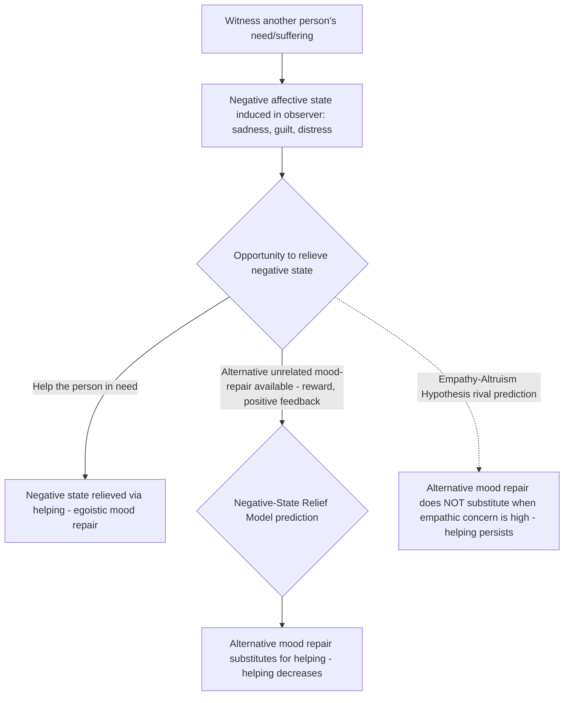

## Negative-State Relief Model

### Overview

The negative-state relief model, developed principally by Robert Cialdini and colleagues beginning in the late 1970s and elaborated through the 1980s, proposes that helping behavior is frequently motivated by the egoistic goal of relieving one's own negative emotional state (sadness, guilt, distress) rather than by genuine other-oriented concern for the person in need. The model was formulated specifically as a rival explanation to Batson's empathy-altruism hypothesis, reinterpreting the well-documented empirical link between empathy/sadness and helping as evidence of sophisticated mood management rather than genuine altruism, and became the central and most sustained opposing theoretical position in the decades-long empirical debate over whether true psychological altruism exists.

### Core Theoretical Claim

**Key Points**

- **Central proposition**: Witnessing another person's suffering or need induces a negative affective state (particularly sadness) in the observer; helping the person in need is one learned, socially reinforced behavioral strategy for relieving this self-experienced negative state, and is therefore performed to serve the helper's own emotional goals, not primarily the recipient's welfare.
- **Learned association mechanism**: Cialdini's model draws on social learning and classical/operant conditioning principles, proposing that across development, individuals repeatedly learn (through socialization, reinforcement, and modeling) that helping others is associated with relief of negative mood and with positive self-regard and social approval — such that helping becomes an automatized, internalized mood-repair strategy, functionally similar to other mood-regulation behaviors (e.g., eating comfort food, seeking positive distraction).
- **Reinterpretation of empathic sadness**: crucially, the model does not deny the empirical finding that empathy and sadness are associated with increased helping — it reinterprets *why* this association exists, proposing that what Batson terms "empathic concern" is, at its functional/motivational core, simply a form of self-relevant negative mood (sadness) that motivates helping via the same egoistic mood-repair logic as any other negative mood state.
- **Mood management as the general egoistic framework**: the model situates helping within Cialdini's broader interest in mood-as-motivator frameworks, related conceptually to his earlier work on the "door-in-the-face" compliance technique and broader social influence research examining how affective states shape social behavior.

### The Central Falsifiable Prediction

**Key Points**

The negative-state relief model generates a distinctive, directly testable prediction that differentiates it from the empathy-altruism hypothesis:

- **If helping serves to relieve a negative mood state (as this model proposes)**, then providing an alternative, equally effective means of relieving that negative mood — one entirely unrelated to helping the specific person in need (e.g., receiving an unexpected reward, positive feedback, or mood-boosting experience before the helping opportunity arises) — should be just as satisfying to the underlying motivational goal, and should therefore **reduce subsequent helping**, since the mood-repair goal has already been satisfied by other means.
- **If helping serves a genuinely altruistic goal specifically focused on the welfare of the person in need (as the empathy-altruism hypothesis proposes)**, then an unrelated mood-boost should **not** reduce helping in high-empathy conditions, since it does nothing to address the ultimate goal (the other person's welfare) — only actually helping that specific person, or something that improves their situation, should satisfy an altruistic goal.
- This "alternative mood-repair" manipulation became the central battleground of the empirical dispute between Cialdini's and Batson's research programs across numerous published studies and rebuttals.

### Key Empirical Studies

**Key Points**

- **Cialdini, Darby & Vincent (1973)**: early precursor work demonstrating that inducing guilt increased subsequent helping even toward an unrelated party, interpreted as supporting a general negative-state relief account of guilt-driven helping (predating the full negative-state relief model's formal articulation but establishing its conceptual groundwork).
- **Cialdini, Kenrick & Baumann (1982)** and related studies: found that providing participants with an unrelated positive mood boost (e.g., monetary reward, positive feedback) after sadness induction, but before a helping opportunity, reduced helping — interpreted by Cialdini and colleagues as supporting the negative-state relief model's prediction that alternative mood repair should substitute for helping.
- **Batson, Dyck, Brandt et al. (1988), specifically designed rebuttal studies**: manipulated both empathic concern and the availability of an unrelated mood-enhancing experience prior to the helping opportunity, finding that in *high-empathy* conditions specifically, the unrelated mood boost did *not* reduce helping to the same degree found in low-empathy conditions — interpreted by Batson and colleagues as evidence that empathy-driven helping is not equivalent to generic mood-repair-driven helping, since a genuine mood-repair account should have predicted reduced helping regardless of empathy level.
- **The competing-studies pattern**: across the late 1980s and into the 1990s, Cialdini and colleagues and Batson and colleagues published a series of studies and reanalyses, each designed to address methodological critiques of the other side's prior work (e.g., disputes over whether mood manipulations were successfully independent of empathic concern, whether measurement timing adequately captured the relevant emotional states, and whether specific study designs adequately isolated the proposed mechanisms). [Inference — this reflects the well-documented back-and-forth structure of the published debate rather than a single decisive study; the field generally regards this exchange as a productive but not fully conclusively resolved theoretical contest.]

### Process Diagram

### Distinguishing Negative-State Relief from Related Egoistic Models

| Model | Proposed Negative State | Mechanism Type | Key Distinguishing Feature |
| --- | --- | --- | --- |
| Negative-State Relief Model (Cialdini) | General negative mood/sadness, including what others call "empathic concern" | Learned, socialized association between helping and mood repair | Predicts substitutability: any effective mood-repair method should reduce helping equally |
| Aversive-Arousal Reduction Model (Piliavin, Dovidio, Gaertner) | Physiological/emotional arousal specifically from witnessing an emergency | Drive-reduction, closer to classical arousal theory | Predicts helping drops under easy escape (arousal can be resolved by leaving the situation) |
| Empathic Joy Hypothesis (Smith, Keating & Stotland) | Not a negative state at all — anticipated positive affect from effective helping | Reward-anticipation | Predicts helping requires feedback of effectiveness to be motivating; distinct from relief of a prior negative state |
| Guilt-driven helping / norm of social responsibility | Guilt specifically, tied to violated social or personal standards | Norm-activation and self-standard maintenance | Somewhat overlapping with negative-state relief but tied more specifically to normative/standard-violation appraisals than to general negative mood |

### Theoretical and Methodological Significance

**Key Points**

- **Advancing methodological rigor in motivation research**: regardless of which side is judged more correct, the sustained Cialdini-Batson exchange is widely regarded within social psychology as a model example of productive theoretical adversarial collaboration, in which each side's studies forced increasingly precise operationalization of previously vague motivational constructs (sadness, empathy, distress) and increasingly rigorous experimental controls. [Inference — a common characterization of this debate's disciplinary significance in social psychology textbooks and review literature.]
- **Implications for the broader altruism/egoism debate**: the negative-state relief model remains the most theoretically serious and empirically sustained rival to genuine psychological altruism within mainstream social psychology, in contrast to less empirically developed forms of generic psychological egoism.
- **Partial convergence in later theorizing**: some later theoretical treatments (including some acknowledgment within Batson's own later writing) have moved toward a more integrative position, acknowledging that both altruistic and egoistic (including mood-repair-related) motives likely operate simultaneously and in varying proportion across different helping situations, rather than treating the debate as requiring a single, universally correct answer for all helping behavior. [Inference — reflects a general trend toward motivational pluralism in the field's more recent treatments, though this represents a synthesis observation rather than an uncontested consensus position.]

### Criticisms and Limitations

**Key Points**

- **Post-hoc flexibility concern**: critics of the negative-state relief model (primarily Batson and colleagues) have argued that its core construct — "negative state" broadly defined to potentially encompass empathic concern itself — risks being defined so broadly and flexibly that it becomes difficult to fully falsify, since almost any emotional antecedent of helping could in principle be redescribed as a "negative state" requiring relief. [Inference — a central point of contention raised specifically by proponents of the empathy-altruism hypothesis in the published exchange; not a universally accepted characterization by all researchers in the field.]
- **Mixed replication of the "alternative mood-repair" substitution effect**: subsequent studies attempting to replicate the specific substitution prediction (that unrelated mood boosts reduce helping) have produced mixed results across different experimental paradigms and mood-induction methods, with the effect appearing more reliably under some conditions (e.g., certain timing and mood-induction procedures) than others.
- **Ecological validity of laboratory mood manipulations**: as with related paradigms in this literature, questions remain about how artificially induced, typically mild laboratory mood states relate to naturally occurring emotional responses to real-world suffering and need.
- **Does not fully address the possibility of coexisting motives**: even where negative-state relief effects are found, this does not, by itself, rule out the simultaneous presence of some genuinely altruistic motivational component — a point raised by researchers seeking a more integrative resolution to the debate rather than treating it as a strict either/or contest.

### Applications

**Key Points**

- **Fundraising and charitable appeal design**: informs understanding of why sad, guilt-inducing charitable appeals can be effective at generating one-time donations (consistent with a mood-repair account) while raising separate questions about whether such appeals cultivate durable, altruistically-sustained giving versus more transient, mood-driven giving.
- **Understanding "moral cleansing" and guilt-driven prosocial behavior**: the negative-state relief model shares conceptual territory with, and has informed, subsequent research on guilt-driven moral cleansing behavior (see moral cleansing), in which transgression-induced guilt (a specific negative state) motivates compensatory prosocial behavior.
- **Consumer psychology and mood-as-information research**: connects to broader consumer behavior and social-cognition research examining how transient mood states bias helping, spending, risk-taking, and other judgment and decision-making processes, situating helping within a more general mood-and-behavior research tradition.
- **Clinical and counseling contexts**: informs understanding of potentially mixed or self-serving motivations underlying caregiving and helping behavior in clinical populations, relevant to caregiver burnout and motivation research, though this application draws on the model's general logic rather than being a primary focus of the original research program.

**Related Topics**

- Empathy-altruism hypothesis (Batson) — primary theoretical rival
- Personal distress versus empathic concern
- Aversive-arousal reduction / arousal-cost-reward model (Piliavin)
- Empathic joy hypothesis (Smith, Keating & Stotland)
- Moral cleansing and guilt-driven prosocial behavior
- Mood-as-information theory in judgment and decision-making
- Psychological egoism versus altruism debate
- Cialdini's principles of social influence and compliance
- Norm of social responsibility in helping behavior
- Guilt as a moral emotion and behavioral motivator