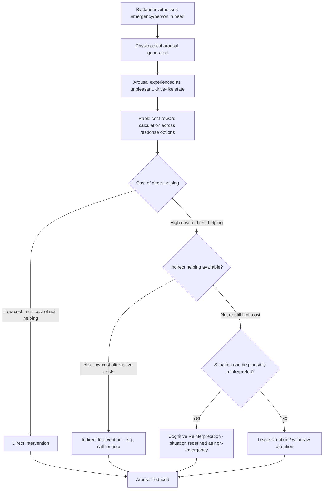

## Arousal: Cost-Reward Model of Helping

### Overview

The arousal: cost-reward model, developed by Jane Allyn Piliavin, John Dovidio, Samuel Gaertner, and Russell Clark across the late 1960s through the 1980s, is a comprehensive model of bystander intervention proposing that witnessing an emergency produces physiological arousal in the observer, and that this arousal is experienced as an unpleasant state the observer is motivated to reduce. Which specific response the bystander chooses to reduce that arousal — direct helping, indirect helping, reinterpreting the situation, or leaving — is determined by a rapid, largely automatic cost-benefit analysis weighing the costs and rewards of each available option. The model integrates physiological arousal theory with a decision-theoretic cost-benefit framework, and represents one of the most influential and empirically supported comprehensive models of bystander helping behavior, extending and refining the foundational work of Latané and Darley on the bystander effect.

### Historical and Theoretical Context

**Key Points**

- **Building on Latané and Darley's bystander intervention model**: the arousal: cost-reward model was developed partly as an elaboration of Latané and Darley's earlier (1970) cognitive decision-tree model of bystander intervention, which identified five sequential decision points a bystander must pass through (notice the event, interpret it as an emergency, assume responsibility, know how to help, decide to implement help) but did not fully specify the underlying motivational/affective mechanism driving the decision to help.
- **The "Subway Samaritan" field studies** (Piliavin, Rodin & Piliavin, 1969): provided the original empirical foundation, using a field experiment on New York City subway trains in which a confederate collapsed, appearing either ill (holding a cane) or drunk (smelling of alcohol, carrying a liquor bottle), while researchers recorded bystander helping rates, latency to help, and diffusion of responsibility effects as a function of number of bystanders present — finding, notably, that unlike some prior bystander-effect research, helping rates for the "ill" victim remained remarkably high and diffusion of responsibility effects were comparatively weaker in this face-to-face, high-arousal field context, prompting the theoretical development of the arousal-based model to explain these differences.
- Subsequent theoretical elaboration (Piliavin, Dovidio, Gaertner & Clark, 1981, *Emergency Intervention*) formalized the full arousal: cost-reward decision model.

### Core Mechanism: Arousal as Motivator

**Key Points**

- **Physiological arousal as the proximate driver**: witnessing another person's distress or an emergency situation is proposed to produce genuine physiological arousal (increased heart rate, skin conductance, and other sympathetic nervous system activation) in the observer — this arousal component has more direct empirical grounding in autonomic physiology measurement than some competing models.
- **Arousal is experienced as unpleasant and drive-like**: consistent with general drive-reduction theory (drawing on earlier Hullian learning theory traditions), the model proposes that unresolved arousal functions as an aversive drive state that motivates behavior aimed at reducing it, regardless of which specific behavior accomplishes that reduction.
- **Arousal intensity is influenced by identifiable factors**: the model specifies that arousal (and therefore the urgency of the resulting motivation to act) increases with factors such as: the clarity/severity of the emergency, physical proximity to the victim, perceived similarity between the bystander and the victim, and the duration of continued exposure to the distressing stimulus.
- **"We-ness" and empathic arousal**: later refinements of the model incorporated the concept that perceived similarity or connectedness to the victim ("we-ness") intensifies empathic arousal specifically, linking the arousal-based account to broader empathy research while maintaining the model's core emphasis on arousal reduction as the proximate egoistic motivator (distinguishing this model's interpretation of empathic arousal from Batson's altruistic interpretation of empathic concern).

### The Cost-Reward Decision Matrix

**Key Points**

Once arousal is generated, the model proposes bystanders engage in a rapid (often described as occurring outside full conscious deliberation) cost-benefit calculation across several categories of costs and rewards associated with different possible responses:

| Category | Description | Examples |
| --- | --- | --- |
| Costs of helping | Negative consequences associated with directly intervening | Physical danger, effort/time required, embarrassment, disruption to one's own activities, potential for making the situation worse |
| Costs of not helping | Negative consequences associated with failing to intervene | Guilt, self-blame, disapproval from others (especially if other bystanders are present and aware), continued personal distress from witnessing unresolved suffering |
| Rewards of helping | Positive consequences associated with intervening | Social approval, praise, positive self-regard, material reward, relief of one's own arousal/distress |
| Rewards of not helping | Positive consequences associated with not intervening | Avoiding costs/risks, being able to continue with one's own activities uninterrupted, avoiding potential embarrassment of unnecessary intervention |

- The model proposes that bystanders are motivated to select whichever response path minimizes net costs while achieving arousal reduction — which may be direct helping, but may equally be indirect helping (e.g., calling for assistance rather than personally intervening), cognitive reinterpretation of the situation (e.g., deciding the "emergency" is not actually serious, thereby reducing arousal without any behavioral cost), or simply leaving the situation.

### Predicted Response Pathways: The Four Response Categories

**Key Points**

The model identifies four characteristic pathways bystanders may take to resolve emergency-induced arousal, determined jointly by the arousal level and the relative cost-reward structure of the situation:

1. **Direct intervention**: chosen when costs of helping are low (e.g., low personal risk, bystander has relevant skills) and costs of not helping are high (e.g., clear personal responsibility, high empathic arousal).
2. **Indirect intervention**: chosen when costs of direct helping are high but the bystander still seeks to reduce arousal and avoid the costs of complete non-response — e.g., calling emergency services, alerting others, without direct personal engagement with the victim.
3. **Cognitive reinterpretation of the situation**: chosen when both direct and indirect helping carry high costs, and the bystander instead reduces their own arousal by reappraising the situation as non-serious, ambiguous, or not actually requiring intervention ("perhaps he's just resting," "someone else more qualified will handle it") — this pathway allows arousal reduction without any behavioral cost, but at the expense of the victim not receiving help.
4. **Leaving the situation / diffusion of attention**: chosen when reinterpretation is not plausible but direct and indirect costs remain high, leading the bystander to physically or attentionally withdraw from the arousing situation.

### Process Diagram

### Empirical Support and Key Findings

**Key Points**

- **Piliavin, Rodin & Piliavin (1969) subway studies**: found helping rates for the ill victim were very high (approximately 95% helped within a short latency) and largely unaffected by group size in the way classic diffusion-of-responsibility research had predicted, attributed to the high arousal and low-ambiguity nature of the face-to-face subway emergency, consistent with the model's prediction that high arousal combined with low-cost helping opportunities produces rapid direct intervention.
- **Drunk versus ill victim manipulation**: helping rates were substantially lower for the victim who appeared drunk compared to the victim who appeared ill, consistent with the cost-reward framework's prediction that perceived cause/responsibility of the victim's plight (affecting both cost calculations and empathic arousal) shapes bystander response.
- **Physiological measurement studies**: subsequent laboratory research directly measuring heart rate, skin conductance, and other autonomic indices during exposure to simulated or filmed emergencies has generally supported the prediction that arousal precedes and correlates with helping decisions, and that arousal intensity varies systematically with situational factors (proximity, clarity, severity) as the model predicts.
- **Cost manipulation studies**: numerous studies manipulating the physical or social costs of helping (e.g., risk of injury, embarrassment, time cost) have found helping rates shift in the predicted direction, supporting the cost-reward calculation component of the model.

### Comparison with Related Models of Helping

| Model | Primary Mechanism | Motivational Character | Distinguishing Feature |
| --- | --- | --- | --- |
| Arousal: Cost-Reward Model (Piliavin et al.) | Physiological arousal reduction via cost-benefit calculated response selection | Egoistic (arousal reduction) | Explicitly incorporates multiple possible response pathways beyond direct helping (reinterpretation, indirect helping, leaving) |
| Latané & Darley's Bystander Intervention Model | Sequential cognitive decision-tree (notice, interpret, assume responsibility, know how, decide to act) | Primarily cognitive/normative, less explicitly affective | Focuses on the stepwise cognitive process rather than an arousal-driven motivational engine |
| Empathy-Altruism Hypothesis (Batson) | Empathic concern evokes genuinely altruistic motivation | Altruistic (for empathic concern specifically) | Explicitly denies that empathy-driven helping is reducible to arousal/distress reduction; direct theoretical rival regarding the interpretation of empathic arousal |
| Negative-State Relief Model (Cialdini) | Mood repair via learned association between helping and relief of negative affect | Egoistic (mood repair) | More focused on affective/mood states broadly than on physiological arousal and situational cost-structure specifically |

### Relationship to the Empathy-Altruism Debate

**Key Points**

- The arousal: cost-reward model shares with the negative-state relief model an explicitly egoistic interpretation of the arousal generated by witnessing another's suffering — both models treat this arousal as something the bystander is ultimately motivated to reduce for their own sake, in contrast to Batson's altruistic interpretation of empathic concern as evoking genuine other-oriented motivation.
- The key empirical test distinguishing arousal-reduction/cost-reward accounts from the empathy-altruism hypothesis parallels the logic used against the negative-state relief model: if arousal reduction (rather than genuine concern for the other) is the operative goal, then any effective means of reducing arousal — including escape from the situation when costs of helping are high — should be equally satisfying; Batson's easy-escape paradigm studies (discussed under the empathy-altruism hypothesis) were designed specifically to test this shared prediction across both rival egoistic models.
- The arousal: cost-reward model is generally regarded as more explicitly integrative of situational/economic decision factors (the detailed cost-reward matrix) than either the negative-state relief model or the empathy-altruism hypothesis, making it particularly well-suited to explaining variation in *which* helping response (direct, indirect, reinterpretation, withdrawal) occurs, rather than solely predicting whether helping occurs at all.

### Applications

**Key Points**

- **Emergency responder training and public safety campaigns**: informs bystander-intervention training programs (e.g., CPR/first-aid campaigns, sexual assault bystander-intervention programs) that explicitly aim to lower the perceived costs of direct intervention and increase bystanders' confidence and skill, shifting the cost-reward calculation toward direct helping.
- **Urban design and public space safety**: informs understanding of how ambient environmental factors (crowding, ambiguity of distress signals, visibility) affect bystander arousal and cost perception, relevant to public safety and emergency-response infrastructure design.
- **Workplace and organizational harassment intervention**: informs bystander-intervention training in organizational contexts (e.g., workplace harassment prevention programs) by targeting the specific perceived costs (social awkwardness, retaliation fear) that inhibit direct intervention.
- **Understanding real-world diffusion of responsibility variation**: helps explain why some real-world emergencies (e.g., the original subway studies) show weaker diffusion-of-responsibility effects than classic laboratory bystander-effect studies, attributed to the higher arousal and lower ambiguity of face-to-face, high-stakes emergencies compared to more ambiguous laboratory analogs.

### Criticisms and Limitations

**Key Points**

- **Arousal measurement and specificity challenges**: while physiological arousal is more directly measurable than some competing models' constructs, distinguishing "arousal specifically caused by empathic concern for the victim" from general situational arousal (e.g., surprise, general activation) remains methodologically challenging, complicating clean tests of the model's specific causal claims. [Inference — a recurring methodological point raised across the broader arousal-and-helping literature.]
- **Overlap and integration challenges with rival models**: because the model shares substantial conceptual territory with both the negative-state relief model and general drive-reduction theory, some critics have questioned whether it constitutes a fully distinct theoretical framework or primarily an elaboration/integration of existing egoistic helping theories with an added decision-theoretic cost-reward layer.
- **Complexity and reduced parsimony**: the model's inclusion of four distinct response pathways and multiple cost/reward categories, while providing more explanatory flexibility than simpler models, has been noted as making the model somewhat more difficult to generate sharply falsifiable, single-prediction tests compared to the more streamlined logic of the empathy-altruism easy-escape paradigm.
- **Ecological validity of subsequent laboratory tests**: while the original subway field studies had strong ecological validity, much of the follow-up cost-manipulation research has occurred in more artificial laboratory settings, raising standard generalizability questions common across this research area.

**Related Topics**

- Latané and Darley's bystander intervention decision model
- Diffusion of responsibility and the bystander effect
- Empathy-altruism hypothesis (Batson) — theoretical rival regarding arousal interpretation
- Negative-state relief model (Cialdini) — related egoistic account
- Drive-reduction theory (Hull) — foundational learning-theory lineage
- Physiological measures in emotion research (heart rate, skin conductance)
- Bystander intervention training programs
- Norm of social responsibility
- "We-ness" and perceived similarity in empathic arousal
- Cost-benefit decision-making frameworks in social psychology