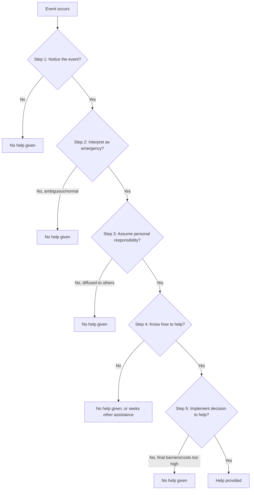

## Bystander Effect

### Overview

The bystander effect refers to the well-documented social psychological phenomenon in which individuals are less likely to intervene or offer help to a person in need when other bystanders are present, with the likelihood and speed of intervention decreasing as the number of bystanders increases. First systematically studied and named by Bibb Latané and John Darley in a landmark series of experiments beginning in 1968, the bystander effect became one of the most extensively replicated and theoretically influential findings in the history of social psychology, catalyzing the entire subfield of research on bystander intervention and prosocial emergency response.

### Historical Origin: The Kitty Genovese Case

**Key Points**

- **The catalyzing incident**: The 1964 murder of Kitty Genovese in Kew Gardens, Queens, New York, was widely reported at the time (most influentially in a New York Times article) as having been witnessed by 38 bystanders who allegedly failed to intervene or call police during a prolonged attack, sparking intense public and academic interest in the psychology of bystander non-intervention.
- **Subsequent historical reassessment**: later investigative journalism and scholarly reexamination (notably by researchers including Rachel Manning, Mark Levine, and Alan Williams in 2007, and further detailed in Kevin Cook's 2014 book *Kitty Genovese*) substantially revised the original account, finding that the "38 witnesses" figure was likely exaggerated, that the attack occurred in two separate locations reducing any single witness's ability to observe the full event, that at least some witnesses did attempt to intervene or call for help, and that police were contacted, contrary to the original narrative's central claims. [Verified — this historical reassessment and correction is well-documented in subsequent journalism and scholarship and is now widely acknowledged in the field, including in many contemporary textbook treatments.]
- **Enduring scientific legacy despite historical inaccuracy**: notwithstanding the significant inaccuracies in the original journalistic account, the case served as the motivating impetus for genuinely rigorous and independently replicated experimental research by Latané and Darley, whose findings regarding bystander effects have been robustly supported across numerous controlled studies independent of the accuracy of the original Genovese case narrative — the scientific phenomenon and its underlying causal mechanisms are empirically well-established regardless of the factual issues with the case that inspired the initial research question.

### Latané and Darley's Decision Model of Bystander Intervention

**Key Points**

Latané and Darley (1970) proposed that a bystander must pass through five sequential decision points before intervening, and that a "no" response or excessive delay at any single stage results in a failure to help:

1. **Notice the event**: the bystander must first perceive that something unusual is happening at all.
2. **Interpret the event as an emergency**: the bystander must correctly interpret ambiguous cues as indicating a genuine emergency requiring action, rather than something benign.
3. **Assume responsibility for helping**: the bystander must decide that they personally bear responsibility for acting, rather than assuming someone else will or should.
4. **Know an appropriate form of assistance**: the bystander must determine what form of help is appropriate and that they are capable of providing it.
5. **Implement the decision to help**: the bystander must actually act on the decision, overcoming any final situational or social barriers to action.

### Core Explanatory Mechanisms

**Key Points**

Research has identified several distinct, empirically supported psychological mechanisms that operate at different stages of Latané and Darley's decision model to produce the bystander effect as the number of present bystanders increases:

**1. Diffusion of Responsibility**

The perceived personal responsibility to intervene is divided among all bystanders present, such that each individual bystander feels less personally obligated to act, since responsibility is shared across the group rather than falling uniquely on any one person. This is generally considered the central and most extensively documented mechanism.

**2. Pluralistic Ignorance**

In ambiguous situations, bystanders look to others' reactions to help interpret whether a situation is genuinely an emergency; if other bystanders appear calm or unconcerned (often because they too are uncertain and are similarly monitoring others), each individual may incorrectly infer from others' apparent lack of concern that the situation is not actually serious, producing a collective misinterpretation even though each individual bystander may privately harbor genuine concern.

**3. Evaluation Apprehension / Audience Inhibition**

The presence of other people can increase social evaluative concern about intervening incorrectly, unnecessarily, or ineffectively in front of an audience, producing embarrassment-avoidance-driven inaction distinct from diffusion of responsibility per se.

### The Latané and Darley Experimental Paradigms

**Key Points**

- **The "smoke-filled room" study** (Latané & Darley, 1968): participants completing a questionnaire in a room, either alone, with two passive confederates who ignored smoke seeping into the room, or with two other genuine participants, were far less likely and far slower to report the smoke when in the presence of passive confederates or other bystanders than when alone — demonstrating pluralistic ignorance and diffusion effects even for a non-social-emergency ambiguous hazard.
- **The "lady in distress" study** (Latané & Rodin, 1969): participants who heard a staged accident (a researcher apparently falling and crying out in an adjoining room) were substantially more likely to help when alone than when in the presence of a passive confederate or another bystander.
- **The "seizure" study** (Darley & Latané, 1968): participants believed they were communicating via intercom with either one other person or multiple other people when a staged seizure occurred; helping rates and speed of helping were inversely related to the number of perceived bystanders, providing some of the most direct and widely cited experimental evidence for the numerical bystander effect and diffusion of responsibility specifically.

### Meta-Analytic Evidence

**Key Points**

- **Latané and Nida (1981)**: an early comprehensive review confirmed the robustness of the bystander effect across a substantial body of accumulated studies by that time, while also beginning to identify boundary conditions and moderating variables.
- **Fischer, Krueger, Greitemeyer et al. (2011), major meta-analysis**: a large-scale meta-analysis synthesizing over five decades of bystander research (encompassing many dozens of studies) confirmed the overall bystander effect as a robust and reliable phenomenon, while also finding that the effect is significantly attenuated (and in some conditions, reversed) under specific conditions — notably, in situations involving high danger/dangerous emergencies (e.g., physical violence, as opposed to lower-ambiguity or lower-danger situations), the bystander effect was substantially weaker, and in some highly dangerous or unambiguous situations, bystanders showed increased likelihood to help as the number of bystanders increased, potentially due to safety-in-numbers or a shift toward coordinated group intervention. [Verified — this meta-analytic refinement is well-established in the field and represents an important qualification of the classic, unconditional bystander-effect finding.]

### Moderating Variables and Boundary Conditions

**Key Points**

Contemporary research has identified numerous factors that moderate the strength (and in some cases, the direction) of the bystander effect:

| Moderator | Effect on Bystander Effect |
| --- | --- |
| Situational danger/clarity | Bystander effect substantially weaker (or reversed) in high-danger, unambiguous emergencies (Fischer et al., 2011) |
| Group identity/social identification with other bystanders | Shared group identity between bystander and other witnesses (or between bystander and victim) has been found to reduce the bystander effect, consistent with self-categorization/social identity theory predictions that "we-ness" increases felt responsibility (Levine & Crowther, 2008) |
| Bystander competence/expertise | Individuals with relevant skills (e.g., medical training, lifeguard/first-aid certification) show reduced susceptibility to diffusion of responsibility effects in relevant emergencies |
| Prior acquaintance with other bystanders | Familiarity among bystanders (as opposed to being strangers to one another) has been associated with reduced diffusion effects in some studies |
| Cultural context | Some cross-cultural research suggests variation in bystander intervention rates across cultural contexts, though findings in this area are less extensively developed than the core Western experimental literature. [Unverified — cross-cultural bystander research is a comparatively less mature area within the broader literature.] |
| Media/CCTV and digital-age observation | Contemporary research has examined bystander effects in online contexts (e.g., cyberbullying bystanders, livestreamed emergencies), generally finding analogous diffusion and pluralistic ignorance dynamics extend to digital bystander contexts, though this remains an actively developing research area. |

### Relationship to the Arousal: Cost-Reward Model

**Key Points**

- The arousal: cost-reward model (Piliavin, Dovidio, Gaertner & Clark) was developed partly to extend and refine Latané and Darley's cognitive decision-tree model by adding an explicit motivational/affective (arousal-based) mechanism and a formal cost-benefit decision framework, addressing why bystander effects were notably weaker in the original high-arousal, face-to-face Piliavin subway field studies than in some more ambiguous laboratory paradigms.
- This integration illustrates how the bystander effect literature evolved from Latané and Darley's foundational cognitive-sequential model toward more comprehensive, multiply-determined models incorporating cognitive, affective, and social-structural (group identity) factors.

### Real-World Applications and the "CPR Effect" / Training Interventions

**Key Points**

- **Bystander intervention training programs**: informed by the identified mechanisms (particularly diffusion of responsibility and pluralistic ignorance), effective bystander training programs (e.g., CPR/AED training, sexual assault bystander-intervention programs such as the "Green Dot" or "Bringing in the Bystander" curricula) explicitly teach participants to recognize and counteract these specific psychological barriers — for example, training people to directly assign responsibility to a specific individual bystander ("You, call 911") rather than issuing a general appeal, which research shows substantially increases the likelihood of actual intervention by circumventing diffusion of responsibility.
- **Emergency response and public safety design**: informs the design of public emergency-response systems and signage, encouraging designs that reduce ambiguity (thereby limiting pluralistic ignorance) and clarify individual responsibility in crowded public settings.
- **Workplace and organizational safety and harassment prevention**: bystander-effect research directly informs contemporary workplace harassment-prevention training, which similarly emphasizes overcoming diffusion of responsibility and evaluation apprehension to promote active bystander intervention.
- **Online safety and content moderation**: increasingly applied to understanding and designing interventions against cyberbullying and online harassment, where classic bystander dynamics (diffusion of responsibility across large, anonymous online audiences) appear to operate with particular intensity due to the scale and anonymity of digital bystander populations. [Inference — a reasonable and increasingly studied extension of the classic framework, though the digital bystander literature is comparatively newer and less extensively validated than the foundational offline research.]

### Distinction from Related Constructs

| Construct | Relationship to Bystander Effect |
| --- | --- |
| Diffusion of responsibility | The primary specific mechanism proposed to underlie the bystander effect, though not fully synonymous with it — the bystander effect is the overall behavioral phenomenon, while diffusion of responsibility is one (of several) proposed causal mechanisms |
| Pluralistic ignorance | A distinct mechanism operating primarily at the interpretation stage (Step 2) of Latané and Darley's model, complementary to but conceptually distinct from diffusion of responsibility (which operates primarily at the responsibility-assumption stage, Step 3) |
| Social loafing | A related but distinct phenomenon concerning reduced individual effort on collective tasks in group settings; conceptually parallel to diffusion of responsibility but studied within a separate literature on group productivity rather than emergency helping specifically |
| Groupthink | A distinct phenomenon concerning flawed collective decision-making in cohesive groups; shares some surface similarity (group presence affecting individual judgment) but addresses a different domain (decision quality in deliberative groups rather than emergency intervention) |

### Applications Summary

**Key Points**

- **Emergency medical response and CPR training**: the specific "point and assign" technique (directly designating a specific bystander to perform a specific task) derived from bystander-effect research is now standard practice in first-aid and CPR training curricula worldwide.
- **Legal and policy context — "Duty to rescue" laws**: bystander-effect research has been referenced in policy discussions regarding "duty to rescue" or "Good Samaritan" legislation debates in various jurisdictions, informing discussion of whether and how legal incentives might counteract diffusion-of-responsibility-driven inaction.
- **Public health campaign design**: informs public health messaging strategies (e.g., overdose-response training, choking-response public awareness campaigns) that explicitly incorporate bystander-effect-countering techniques.

**Related Topics**

- Diffusion of responsibility
- Pluralistic ignorance
- Latané and Darley's five-stage decision model
- Arousal: cost-reward model of helping (Piliavin et al.)
- Kitty Genovese case and its historical reassessment
- Social identity theory and intergroup "we-ness" in helping (Levine & Crowther)
- Bystander intervention training programs (e.g., Green Dot, Bringing in the Bystander)
- Cyberbullying and digital bystander effects
- Social loafing in group productivity research
- Good Samaritan laws and duty-to-rescue policy debates