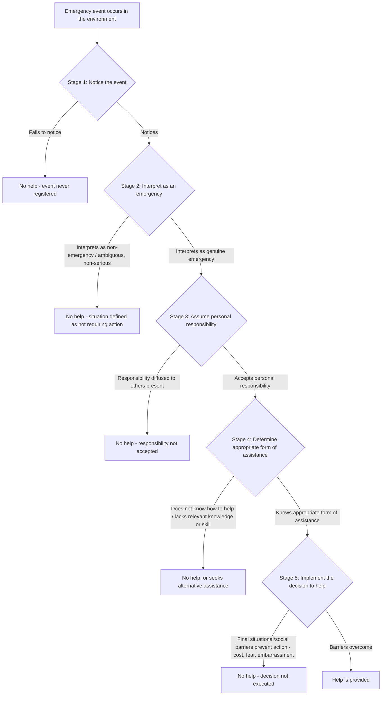

## Latané and Darley's Decision Model of Helping

### Overview

Latané and Darley's decision model of helping, developed by Bibb Latané and John Darley beginning in 1968 and fully articulated in their 1970 book *The Unresponsive Bystander: Why Doesn't He Help?*, is the foundational cognitive-sequential framework explaining bystander intervention in emergencies. The model proposes that helping is the outcome of a series of discrete cognitive decisions a bystander must make, each occurring in sequence, and that a negative outcome or excessive hesitation at any single stage results in a complete failure to help — regardless of whether the bystander would have helped had that specific stage been resolved differently. The model was developed directly in response to public and academic interest generated by the 1964 Kitty Genovese case and became the theoretical and empirical foundation for the entire subsequent bystander effect research tradition.

### Theoretical Purpose and Innovation

**Key Points**

- **Reframing the explanatory question**: prior to Latané and Darley's work, public and some academic discourse around bystander non-intervention (particularly following the Genovese case) tended to attribute failures to help to dispositional explanations — apathy, alienation, "big city" indifference, or moral deficiency in individual bystanders. Latané and Darley's central theoretical contribution was to reframe non-intervention as the predictable product of specific, identifiable **situational and cognitive processes** operating on ordinary, non-apathetic individuals, rather than as evidence of unusual callousness or moral failure.
- **A process model, not a single-cause model**: rather than proposing one unitary explanation for bystander non-intervention, the model's innovation was decomposing the helping decision into multiple discrete, sequential sub-decisions, each with its own distinct psychological determinants — allowing for precise experimental isolation and testing of each stage independently.
- **Emphasis on decision failure as multiply determined**: the model explicitly allows that failure to help can arise from breakdown at any of several different points, meaning that superficially similar instances of bystander non-intervention could reflect quite different underlying psychological processes (e.g., failure to notice, versus failure to interpret correctly, versus failure to assume responsibility) — a theoretically important nuance for both scientific understanding and applied intervention design.

### The Five Sequential Decision Stages

**Stage 1: Notice the Event**

The bystander must first perceive that something out of the ordinary is occurring at all. This stage can fail simply due to inattention, distraction, environmental noise, or being preoccupied with other tasks — a purely perceptual/attentional bottleneck rather than a motivational or social one. Urban environments, characterized by high sensory stimulation and time-pressured routines, were specifically theorized by Latané and Darley to reduce the likelihood of clearing this first stage, offering a situational (rather than dispositional "big city apathy") explanation for lower rates of urban bystander intervention observed in some studies.

**Stage 2: Interpret the Event as an Emergency**

Having noticed the event, the bystander must correctly interpret ambiguous cues as constituting a genuine emergency requiring intervention, as opposed to a benign, staged, or non-serious occurrence. Real-world emergencies are frequently ambiguous in their early stages (is that person having a medical emergency or simply resting; is that a fight or horseplay), and this interpretive stage is where **pluralistic ignorance** operates as a key mechanism — bystanders look to others' reactions for interpretive cues, and if others appear unconcerned, each individual may erroneously conclude the situation is not serious, even if each bystander privately harbors uncertainty or concern.

**Stage 3: Assume Personal Responsibility**

The bystander must decide that responsibility for helping falls specifically on them, rather than assuming that responsibility is either diffused across the group of bystanders present or will naturally be assumed by someone else (particularly someone perceived as more qualified or appropriately positioned to act). This is the stage at which **diffusion of responsibility** operates as the central mechanism, and is generally considered the most extensively documented and empirically robust component of the overall bystander effect.

**Stage 4: Know an Appropriate Form of Assistance**

Even a bystander who has noticed the emergency, correctly interpreted it as serious, and accepted personal responsibility to act may fail to help if they do not know what specific action would constitute appropriate or effective assistance. This stage highlights the importance of relevant skills, knowledge, and training (e.g., first aid, CPR certification) as a distinct determinant of helping, separate from motivational willingness to help.

**Stage 5: Implement the Decision to Help**

Even after deciding that help is needed, that one is personally responsible, and knowing what action to take, a bystander must still overcome final situational barriers to actually executing the helping behavior — including fear of physical danger, social embarrassment, concern about legal liability, or uncertainty about how the intervention will be received by the victim or other bystanders. This final implementation stage connects most directly to the cost-reward calculations later elaborated in the arousal: cost-reward model (Piliavin et al.).

### Key Supporting Experiments

**Key Points**

- **The "smoke-filled room" study** (Latané & Darley, 1968): tested primarily Stages 1 and 2 — participants alone, with passive non-reacting confederates, or with other genuine participants, were exposed to smoke seeping into a room; those in groups (especially with passive confederates modeling non-concern) were significantly slower and less likely to report the smoke, demonstrating pluralistic ignorance's operation at the interpretation stage even for a non-interpersonal hazard.
- **The "seizure" study** (Darley & Latané, 1968): specifically isolated Stage 3 (diffusion of responsibility) by having participants believe they were one of two, three, or six people (via intercom, with no visual contact, ruling out audience inhibition/evaluation apprehension as an alternative explanation) overhearing another participant experiencing an apparent seizure; helping likelihood and speed decreased systematically as the number of perceived bystanders increased, providing clean experimental isolation of the responsibility-diffusion mechanism specifically.
- **Latané and Rodin (1969), "lady in distress" study**: examined the combined effect of multiple stages in a more naturalistic laboratory setting, finding bystanders alone were much more likely to help a researcher who appeared to have fallen and been injured than bystanders in groups, with additional evidence suggesting both interpretive ambiguity and diffusion processes contributed to the observed group-size effect.

### Distinguishing the Five Stages from Later Elaborations

**Key Points**

- The five-stage model is explicitly a **cognitive-sequential** model, focused on identifying discrete decision points rather than specifying the underlying affective/motivational engine driving movement through those decisions — this was a deliberate scope limitation of the original model, later addressed by complementary theoretical developments.
- The **arousal: cost-reward model** (Piliavin, Dovidio, Gaertner & Clark) was developed specifically to supplement Latané and Darley's cognitive stages with an explicit physiological-arousal-driven motivational mechanism and a formal cost-benefit decision calculus, particularly to explain variation observed at Stage 5 (implementation) and to address cases (such as the high-arousal Piliavin subway field studies) where bystander effects were notably weaker than typical laboratory findings would predict.
- Later social identity and self-categorization theory extensions (e.g., Levine & Crowther, 2008) have proposed that perceived group membership and "we-ness" between bystanders (or between bystander and victim) specifically affects Stage 3 (responsibility assumption), providing a further refinement of that stage's determinants beyond simple numerical diffusion.

### Comparison of the Five Stages: Mechanisms and Interventions

| Stage | Primary Psychological Barrier | Key Manipulating Study | Applied Countermeasure |
| --- | --- | --- | --- |
| 1. Notice | Inattention, distraction, environmental overload | N/A — largely attentional, less experimentally isolated as a distinct manipulated variable in the classic studies | Reducing environmental distraction; salience of distress signals |
| 2. Interpret as emergency | Pluralistic ignorance; situational ambiguity | Latané & Darley (1968), smoke-filled room | Training to recognize ambiguous emergency cues; clear, unambiguous distress signaling |
| 3. Assume responsibility | Diffusion of responsibility | Darley & Latané (1968), seizure study | Direct assignment of responsibility to a specific individual ("You — call 911") |
| 4. Know how to help | Lack of relevant knowledge/skill | N/A — primarily addressed via applied training research rather than isolated in the original experimental series | First aid, CPR, and relevant skills training |
| 5. Implement decision | Cost/fear/embarrassment barriers to action | Connects to arousal: cost-reward model (Piliavin et al.) | Reducing perceived costs and social risk of intervening; bystander confidence-building |

### Empirical Robustness and Meta-Analytic Confirmation

**Key Points**

- The overall predicted relationship between number of bystanders and reduced/slowed helping (an aggregate behavioral signature consistent with breakdown occurring somewhere across the five stages, most commonly attributed to Stage 3) has been confirmed as a robust phenomenon across decades of subsequent research, most comprehensively synthesized in Fischer, Krueger, Greitemeyer et al.'s (2011) large-scale meta-analysis, which also identified important moderating boundary conditions (e.g., attenuation or reversal of the effect in high-danger, unambiguous emergencies) — see the broader bystander effect treatment for details of these boundary conditions.
- The specific decomposition into five discrete sequential stages, while highly influential as an organizing framework and pedagogically valuable, has been noted by some methodologists as difficult to fully disentangle empirically in real-world or even many laboratory helping situations, since multiple stages may be processed rapidly, in parallel, or with feedback between stages rather than in strictly sequential, cleanly separable steps. [Inference — a commonly noted theoretical/methodological caveat regarding the model's stage-sequential framing, rather than a rejection of the model's core predictive and explanatory value.]

### Applications

**Key Points**

- **Bystander intervention training program design**: the five-stage decomposition directly informs the structure of contemporary evidence-based bystander training curricula (e.g., sexual assault prevention programs, CPR/first-aid training, workplace harassment-prevention training), which typically target each stage explicitly and sequentially — teaching recognition skills (Stage 1-2), responsibility-acceptance framing (Stage 3), concrete skill knowledge (Stage 4), and confidence/barrier-reduction techniques (Stage 5).
- **Public safety communication and emergency signage design**: informs the design of public safety messaging and environmental cues intended to reduce ambiguity at the interpretation stage (Stage 2) and clarify individual responsibility at the point of an emergency.
- **Organizational and institutional policy**: informs institutional protocols (e.g., "see something, say something" campaigns, mandatory reporting training) that are explicitly structured to counteract diffusion of responsibility by assigning clear, individual reporting obligations rather than relying on diffuse collective responsibility.
- **Forensic and legal analysis of bystander non-intervention**: the model provides a scientifically grounded framework used in legal, journalistic, and policy analysis of real-world bystander non-intervention incidents, offering a more nuanced explanatory framework than simple dispositional attributions of apathy or callousness.

**Related Topics**

- Bystander effect (overall phenomenon)
- Diffusion of responsibility
- Pluralistic ignorance
- Arousal: cost-reward model of helping (Piliavin et al.)
- Kitty Genovese case and its historical reassessment
- Social identity theory and "we-ness" in bystander responsibility (Levine & Crowther)
- Bystander intervention training programs
- Evaluation apprehension and audience inhibition
- Fischer et al. (2011) meta-analysis and boundary conditions
- Good Samaritan laws and duty-to-rescue policy