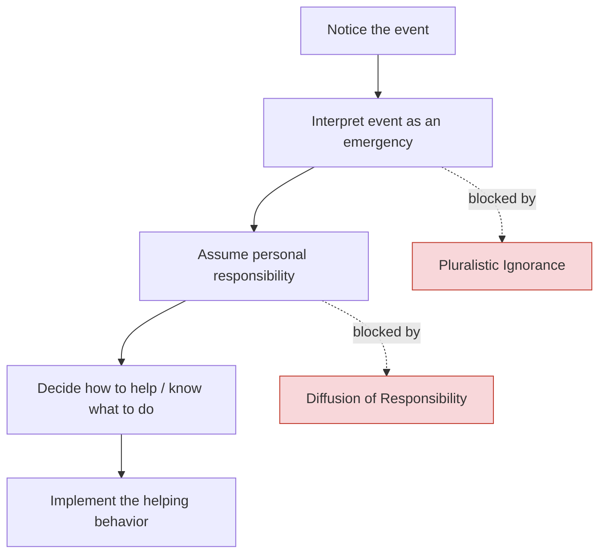

## Diffusion of Responsibility

### Definition

Diffusion of responsibility is a social-psychological phenomenon in which individuals feel less personal responsibility to act, intervene, or take initiative when other people are present or believed to be present. As the number of bystanders or co-actors increases, each individual's felt obligation to respond decreases, because the responsibility is perceived as distributed across the group rather than resting on any one person.

This concept is foundational to the study of prosocial behavior because it explains a counterintuitive finding: people are often *less* likely to help in an emergency when more people are around, not more.

### Historical Origins

- **Bibb Latané and John Darley** formally proposed the concept in 1968, following public fascination with the murder of Kitty Genovese in New York City in 1964, in which numerous witnesses reportedly failed to intervene or call for help.
- [Unverified] Later journalistic investigations disputed several details of the original Genovese case reporting (e.g., the actual number of witnesses who were aware of what was happening), but the case remains the historical catalyst that motivated Latané and Darley's research program, independent of those factual disputes.
- Latané and Darley's experimental work sought to test whether the presence of other bystanders itself — rather than apathy or moral decay — could suppress helping behavior.

### The Latané and Darley Model (Bystander Intervention Model)

Diffusion of responsibility is one stage within a broader **five-stage cognitive model** of bystander intervention. A person must pass through each stage for helping to occur; failure at any stage results in no intervention.

- **Stage 1 — Notice:** The bystander must attend to the event at all.
- **Stage 2 — Interpret:** The bystander must label it as an emergency (susceptible to **pluralistic ignorance** — see Related Topics).
- **Stage 3 — Assume responsibility:** This is the stage diffusion of responsibility directly undermines. With more bystanders, each person's perceived personal obligation drops.
- **Stage 4 — Know how to help:** Competence and knowledge of appropriate action.
- **Stage 5 — Act:** Overcoming audience inhibition, costs, and fear of embarrassment to actually intervene.

### The Bystander Effect vs. Diffusion of Responsibility

These terms are closely related but not identical:

| Term | Scope |
| --- | --- |
| **Bystander effect** | The overall empirical phenomenon: helping likelihood decreases as the number of bystanders increases |
| **Diffusion of responsibility** | The proposed *mechanism* (one of several) that explains *why* the bystander effect occurs |

Other mechanisms that can contribute to the bystander effect alongside diffusion of responsibility include pluralistic ignorance and evaluation apprehension (audience inhibition).

### Classic Experimental Evidence

**Darley & Latané (1968) — "Seizure Study"**

- **Setup:** Participants believed they were having a discussion over an intercom with either 1, 2, or 5 other participants (in reality, pre-recorded confederates). One "participant" simulated an epileptic seizure over the intercom.
- **Key manipulation:** Participants believed group size varied, controlling how many *other* people they thought could also hear and respond.
- **Findings:**
  - 85% of participants who believed they were alone with the victim (group size of 2) helped.
  - Only 31% of participants who believed 4 other bystanders were present (group size of 6) helped.
  - Participants in larger perceived groups also took significantly longer to respond, when they did respond.
- **Interpretation:** Since participants could not see each other and could not diffuse responsibility through observed inaction, the effect was attributed purely to *cognitive* diffusion — the mere belief that others were available to help.

**Latané & Rodin (1969) — "Lady in Distress"**

- Participants overheard a staged accident (a female experimenter appearing to fall and get hurt) either alone, with a passive confederate, or with another naive participant.
- Solo participants helped significantly more often and faster than those in groups.

**Latané & Darley (1970) — "Smoke-Filled Room"**

- Participants filling out a questionnaire either alone or in groups noticed smoke entering the room through a vent.
- 75% of solo participants reported the smoke; only 38% did so when in a group of three naive participants, illustrating diffusion combined with pluralistic ignorance (each person read others' calm inaction as a signal that there was no real danger).

### Underlying Mechanisms

**Key Points**

- **Shared perceived responsibility:** Responsibility is treated as a fixed, divisible quantity; with $n$ bystanders, each person's felt share can be approximated conceptually as:

$$\text{Perceived personal responsibility} \approx \frac{1}{n}$$

[Inference] This formula is a simplified heuristic used to describe the pattern of results, not a precise psychological law that Latané and Darley claimed governs individual cognition.

- **Cost-diffusion of blame:** If the bystander fails to help, blame for the failure is also diffused across the group, lowering the personal cost of inaction.
- **Social comparison:** Individuals monitor others' reactions to gauge appropriate behavior, which can compound with pluralistic ignorance.
- **Anonymity within the group:** The less identifiable an individual is within a crowd, the more diffusion tends to occur (related to **deindividuation**).

### Moderating Variables

Diffusion of responsibility is not a fixed-strength effect; several factors reliably moderate its magnitude.

**Factors that increase diffusion (reduce helping):**

- Larger number of bystanders
- Ambiguity about whether a genuine emergency is occurring
- Anonymity among bystanders (no eye contact, strangers, no accountability)
- Low personal competence to help (e.g., no medical training)
- Low cost of not helping / high cost of helping (physical risk, time, social embarrassment)

**Factors that decrease diffusion (increase helping):**

- Direct eye contact or being singled out (e.g., "You in the blue jacket, call 911")
- Prior relationship or in-group membership with the victim
- Clear, unambiguous emergencies
- Bystander has relevant expertise (e.g., off-duty medical staff)
- Small group size or one-on-one situations
- Personal accountability being made salient (e.g., being observed or named)

### Practical Example

**Example**

A person collapses on a busy sidewalk during rush hour.

- **High diffusion scenario:** Dozens of pedestrians pass by. Each assumes someone else has already called for help or is better positioned to assist, and no one stops.
- **Low diffusion scenario:** Only one pedestrian is present. There is no one else to defer to, so personal responsibility is unambiguous, and helping rates rise sharply.
- **Applied fix:** A witness who directs a specific bystander — "You, call an ambulance now" — collapses the diffusion by assigning individualized, undeniable responsibility.

### Real-World and Applied Contexts

- **Emergency response training:** First-aid and CPR courses (e.g., American Red Cross protocols) explicitly teach trainees to counteract diffusion by pointing at a specific bystander and issuing a direct command, rather than shouting a general request to the crowd.
- **Workplace and organizational behavior:** Diffusion of responsibility appears in group decision-making failures, safety-reporting lapses, and "someone else will flag it" dynamics in teams and committees.
- **Online behavior:** [Inference] Diffusion of responsibility has been proposed as a partial explanation for bystander inaction in cyberbullying incidents and unmoderated online harassment, where the size and anonymity of the observing audience can be very large. This application extends the original offline paradigm and is more difficult to isolate experimentally from other online-specific factors.
- **Corporate and institutional accountability:** Diffusion of responsibility is often cited (informally, in organizational psychology and business ethics literature) as a contributor to diluted accountability in large bureaucracies, where decisions pass through many hands and no single actor feels fully responsible for outcomes.

### Diffusion of Responsibility (svg_diagram)

<svg xmlns="http://www.w3.org/2000/svg" viewBox="0 0 720 320">
<text x="360" y="28" text-anchor="middle" font-size="18" font-weight="bold" fill="#222">Perceived Personal Responsibility vs. Number of Bystanders (svg_diagram)</text>

<line x1="80" y1="270" x2="660" y2="270" stroke="#333" stroke-width="2" />
<line x1="80" y1="270" x2="80" y2="50" stroke="#333" stroke-width="2" />

<text x="370" y="305" text-anchor="middle" font-size="14" fill="#333">Number of Bystanders</text>

<text x="30" y="160" text-anchor="middle" font-size="14" fill="#333" transform="rotate(-90 30 160)">Felt Personal Responsibility</text>

<path d="M 100 70 Q 200 140 300 190 T 500 235 T 640 250" fill="none" stroke="#c0392b" stroke-width="3" />

<circle cx="100" cy="70" r="5" fill="#2c3e50" />
<text x="100" y="55" text-anchor="middle" font-size="12">n=1</text>
<circle cx="260" cy="175" r="5" fill="#2c3e50" />
<text x="260" y="160" text-anchor="middle" font-size="12">n=3</text>
<circle cx="420" cy="222" r="5" fill="#2c3e50" />
<text x="420" y="207" text-anchor="middle" font-size="12">n=6</text>
<circle cx="600" cy="246" r="5" fill="#2c3e50" />
<text x="600" y="231" text-anchor="middle" font-size="12">n=10+</text>

<line x1="80" y1="270" x2="80" y2="265" stroke="#333" />
<line x1="660" y1="270" x2="660" y2="265" stroke="#333" />
</svg>

### Distinguishing Related Constructs

**Key Points**

- **Pluralistic ignorance:** Misreading others' calm inaction as evidence that no emergency exists (an *interpretation* failure at Stage 2, distinct from diffusion's *responsibility* failure at Stage 3).
- **Deindividuation:** Loss of individual self-awareness and accountability within a group or crowd, which can amplify diffusion but is a broader phenomenon covering conformity and disinhibited behavior generally.
- **Social loafing:** Reduced individual effort on a *collective task* (e.g., group projects, tug-of-war) when working in a group versus alone. Social loafing concerns *effort* on shared *goal-directed tasks*, whereas diffusion of responsibility concerns *moral/helping obligation* in emergencies — they are conceptually parallel but studied in different literatures (Latané's work spans both).
- **Free-rider problem:** An economic/game-theory parallel where individuals benefit from a collective good without contributing, structurally similar to diffusion but framed in cost-benefit rather than moral-obligation terms.

### Critiques and Boundary Conditions

- [Inference] Meta-analytic work (e.g., Fischer et al., 2011, "The Bystander-Effect: A Meta-Analysis") found that the classic bystander-inhibiting effect is attenuated or reversed in situations of high **danger** (e.g., physically dangerous emergencies) and when bystanders have **relevant expertise**, suggesting diffusion of responsibility is not a universal law but is moderated substantially by situational severity and competence.
- Some replications show that in highly dangerous, unambiguous emergencies, larger groups can actually increase helping, possibly because greater danger increases perceived need and reduces ambiguity, overriding diffusion pressures.
- [Speculation] Cultural variation in individualism/collectivism may moderate the strength of diffusion of responsibility, though cross-cultural experimental replication of the original paradigms is comparatively sparse.

### Summary Table

| Aspect | Description |
| --- | --- |
| Coined by | Latané & Darley (1968) |
| Core mechanism | Responsibility perceived as divided among all present |
| Primary stage affected | Stage 3 of 5 (assuming personal responsibility) |
| Classic study | Seizure study (intercom groups of 2, 3, 6) |
| Key moderator | Group size, ambiguity, anonymity, competence, danger level |
| Real-world countermeasure | Direct, individualized appeals for help |

**Related Topics**

- Bystander effect (overall phenomenon)
- Pluralistic ignorance
- Deindividuation
- Social loafing
- Kitty Genovese case and its historiographical revisions
- Latané and Darley's five-stage bystander intervention model
- Empathy-altruism hypothesis (Batson)
- Arousal: cost-reward model of helping (Piliavin)
- Norm of social responsibility vs. norm of reciprocity
- Applied bystander-intervention training programs (e.g., "Green Dot," "Step UP!")