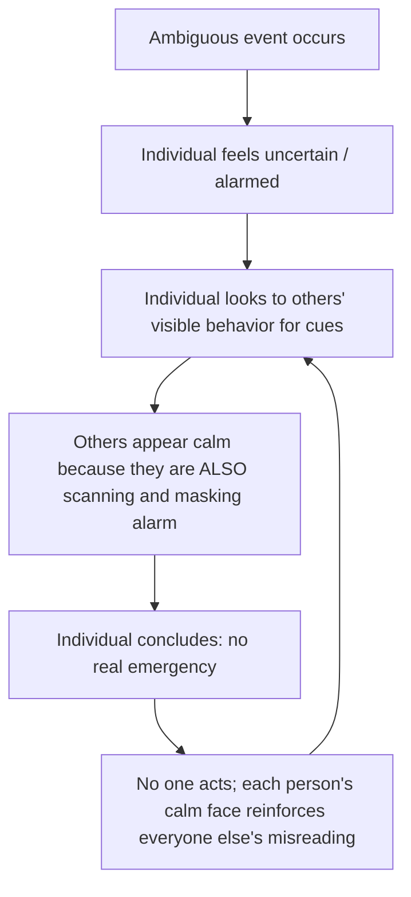
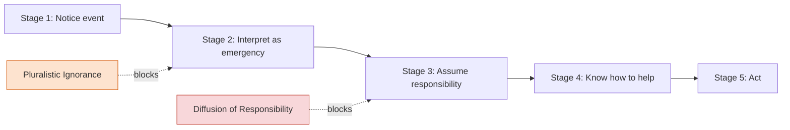

## Pluralistic Ignorance

### Definition

Pluralistic ignorance is a social-psychological phenomenon in which a majority of group members privately reject a norm, belief, or interpretation of a situation, but incorrectly assume that most others accept it — because everyone is outwardly conforming while privately disagreeing. Each individual looks to others' *behavior* for cues about what is true or appropriate, not realizing those others are doing the exact same thing, and misreading the group's collective outward calm or conformity as genuine consensus.

In the context of prosocial behavior, pluralistic ignorance most commonly refers to a failure at the **interpretation stage** of an emergency: bystanders scan each other's reactions for signs of alarm, see everyone else looking calm (because everyone else is also scanning and trying not to overreact), and conclude the situation is not actually an emergency.

### Historical Origins

- The term is generally credited to psychologists **Floyd Allport** and **Daniel Katz** in the 1920s–1930s, who used it to describe situations where individuals in a group privately hold minority views but believe (incorrectly) that they hold majority ones.
- The concept was applied specifically to bystander behavior by **Bibb Latané and John Darley** in their bystander intervention research program of the late 1960s, as a companion mechanism to **diffusion of responsibility**.

### Mechanism

The mechanism is self-reinforcing: because each bystander suppresses visible signs of concern (to avoid overreacting or appearing foolish), the group as a whole projects an appearance of calm that does not reflect anyone's actual internal state. This creates a feedback loop where inaction breeds more inaction.

**Key Points**

- The error is not a failure of individual reasoning in isolation — it is a *social inference* error based on misreading others' outward behavior as an accurate signal of their private beliefs.
- It requires ambiguity; in a completely unambiguous emergency (e.g., visible flames, someone screaming for help), pluralistic ignorance has little room to operate because there is no interpretive gap to fill.
- It differs from simple conformity: in pluralistic ignorance, people do not even realize their private view is a minority (or, in the bystander case, that others privately share their alarm) — they believe the group consensus is genuinely different from their own view.

### Classic Experimental Evidence

**Latané & Darley (1968) — "Smoke-Filled Room" Experiment**

- **Setup:** Participants completed a questionnaire in a room, either alone, with two passive confederates instructed to ignore smoke that began seeping through a wall vent, or with two other naive participants.
- **Findings:**
  - 75% of solo participants got up to investigate or report the smoke.
  - Only 10% of participants did so when seated with two passive confederates who deliberately ignored the smoke.
  - 38% did so in groups of three naive participants (still lower than solo, though higher than the passive-confederate condition).
- **Interpretation:** Participants in groups glanced at others, saw no reaction, assumed the smoke was not dangerous (e.g., steam, air conditioning vapor), and suppressed their own alarm accordingly — a textbook demonstration of pluralistic ignorance layered with diffusion of responsibility.

**Prentice & Miller (1993) — College Drinking Norms Study**

- **Setup:** Surveyed university students' personal comfort with campus drinking norms versus their perception of the *average* student's comfort.
- **Findings:** Most students privately felt uncomfortable with the heavy-drinking culture but believed their peers were personally comfortable with it, when in fact most peers privately felt the same discomfort.
- **Significance:** This study extended pluralistic ignorance beyond emergency bystander contexts into everyday social norm misperception, showing the phenomenon operates broadly in norm-maintenance (not only acute emergencies), and it became foundational for later **social norms marketing** interventions on campuses.

### Distinguishing Pluralistic Ignorance from Related Constructs

| Construct | Core feature | Key difference from pluralistic ignorance |
| --- | --- | --- |
| **Diffusion of responsibility** | Responsibility is perceived as divided among bystanders | Concerns *who should act*, not *whether the situation requires action* |
| **Pluralistic ignorance** | Everyone privately disagrees with a norm/interpretation but believes others accept it | Concerns misreading of *others' private beliefs* via their *public behavior* |
| **Conformity (Asch-type)** | Individual changes behavior/judgment to match a known or perceived majority | Person is often aware their view may differ; in pluralistic ignorance, the person misjudges what the majority privately believes at all |
| **False consensus effect** | Overestimating how much others share *one's own* view | Opposite direction of error — pluralistic ignorance is underestimating how much others share one's own view |
| **Groupthink** | Group actively suppresses dissent to preserve cohesion during decision-making | Involves explicit group deliberation dynamics; pluralistic ignorance can occur with no discussion at all, purely through behavioral observation |

### Role Within the Bystander Intervention Model

Pluralistic ignorance specifically undermines **Stage 2** of Latané and Darley's five-stage model of bystander intervention (interpreting the event as an emergency), while diffusion of responsibility undermines **Stage 3** (assuming personal responsibility to act). The two mechanisms frequently co-occur and compound one another in real-world bystander scenarios, but they are analytically distinct failure points.

### Practical Example

**Example**

In a large lecture hall, a professor asks, "Does anyone have questions?" after a confusing explanation.

- Privately, most students are confused and want clarification.
- Each student glances around, sees no one else raising a hand, and infers that everyone else understood the material.
- To avoid appearing slow, no one raises their hand — even though the room is, in aggregate, full of confused students who all privately share the same uncertainty.
- **Result:** The professor moves on, believing the material was clear, when pluralistic ignorance has masked near-universal private confusion.

### Real-World and Applied Contexts

- **Bystander emergencies:** As in the smoke-room paradigm — ambiguous danger cues (smoke, distant screams, someone slumped on a bench) are especially susceptible to pluralistic-ignorance-driven inaction.
- **Campus alcohol and social norms interventions:** Social norms marketing campaigns (e.g., "most students drink less than you think") were directly built on Prentice and Miller's pluralistic ignorance findings, aiming to correct misperceived peer norms and reduce risky behavior.
- **Classroom and organizational silence:** Employees or students who privately disagree with a proposal or policy but say nothing because they believe (incorrectly) that everyone else supports it — a phenomenon sometimes discussed under related labels like the "Abilene paradox" in organizational behavior.
- **Bullying and harassment bystander contexts:** [Inference] Pluralistic ignorance has been proposed as a contributing factor in why peer groups fail to intervene in bullying, where each bystander assumes others' inaction signals tacit approval or that "it's not a big deal," even when most privately object. This extension is widely cited in applied prevention literature but is harder to isolate experimentally from diffusion of responsibility and fear of retaliation in field settings.
- **Political and social attitude misperception:** Pluralistic ignorance has also been studied in political science contexts (e.g., misperceiving the prevalence of a controversial opinion within one's community), where visible public behavior lags behind actual private attitude change — a well-documented pattern in the norms literature, though the degree to which it applies to any specific contested contemporary issue is empirically variable and outside the scope of a settled, uncontested claim. [Unverified for any specific current issue without citation]

### Reducing Pluralistic Ignorance

**Key Points**

- **Making private opinions explicit:** Anonymous surveys, secret ballots, or structured go-arounds (e.g., asking each person individually) prevent people from relying solely on ambiguous public behavior as their information source.
- **Reducing ambiguity in emergencies:** Clear, direct verbal statements ("This is an emergency, I need help") remove the interpretive gap pluralistic ignorance exploits.
- **Correcting misperceived norms directly:** Social-norms-marketing-style interventions that present accurate data about others' private beliefs can close the gap between perceived and actual consensus.
- **Encouraging early, visible dissent:** A single person visibly expressing genuine concern can break the feedback loop, since it gives others accurate information to update on rather than another data point of feigned calm.

### Summary Table

| Aspect | Description |
| --- | --- |
| Coined by (general concept) | Floyd Allport, Daniel Katz (1920s–30s) |
| Applied to bystander behavior by | Latané & Darley (1968, 1970) |
| Stage of bystander model affected | Stage 2 (interpretation as emergency) |
| Classic study | Smoke-filled room experiment |
| Key extension | Prentice & Miller (1993), campus drinking norms |
| Core error type | Misreading others' *masked* private state via their *public* behavior |
| Primary remedy | Making private beliefs explicit; reducing situational ambiguity |

**Related Topics**

- Diffusion of responsibility
- Bystander effect and the five-stage intervention model
- False consensus effect
- Groupthink
- Social norms marketing interventions
- Abilene paradox (organizational behavior)
- Deindividuation
- Informational social influence vs. normative social influence
- Kitty Genovese case and bystander research origins