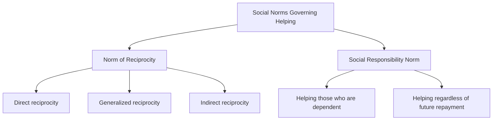
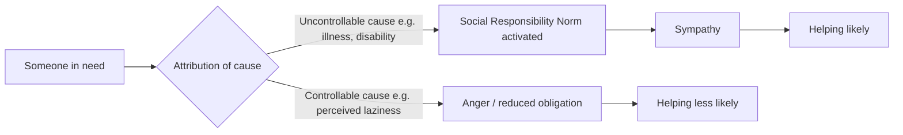

## Norm of Reciprocity and Social Responsibility Norm

### Overview

Social norms are informal rules that guide behavior by specifying what is expected, appropriate, or obligatory in a given context. Within the study of prosocial behavior and altruism, two norms are considered primary explanatory mechanisms for why people help others even without external enforcement: the **norm of reciprocity** and the **social responsibility norm**. Both are theorized as internalized standards that create a felt obligation to help, operating independently of — and sometimes in tension with — purely egoistic cost-benefit calculations.

### Norm of Reciprocity

**Definition**

The norm of reciprocity is the socially learned expectation that people should help those who have helped them, and should not injure those who have helped them. First articulated systematically by sociologist **Alvin Gouldner (1960)** in "The Norm of Reciprocity: A Preliminary Statement," it is proposed as a near-universal social norm found across virtually all human cultures, functioning to stabilize social exchange and cooperation.

**Key Points**

- **Obligatory returning of benefits:** Receiving help, a gift, or a favor creates a psychological sense of indebtedness that motivates the recipient to reciprocate.
- **Proportionality expectation:** The norm generally expects the return to be roughly proportional to the value of what was received — neither trivially small nor excessively large (over-repayment can itself feel socially awkward or manipulative).
- **Stabilizing function:** Gouldner proposed that the norm functions as a "starting mechanism" for social relationships and helps stabilize social systems by discouraging free-riding and exploitation.
- **Universality claim:** Gouldner argued this norm, in some form, appears in nearly every society, though its specific expressions and scope (who counts as owed reciprocity) vary substantially cross-culturally. [Inference: the specific cross-cultural variation in scope is well documented in later cross-cultural psychology, though the "near-universal" framing originates with Gouldner's theoretical claim rather than an exhaustive global survey]

**Subtypes of Reciprocity**

| Type | Description | Example |
| --- | --- | --- |
| **Direct reciprocity** | A helps B; B later helps A directly | Returning a borrowed tool with a favor |
| **Generalized reciprocity** | A helps B; B helps C (paying it forward), without expectation A benefits | Someone who was helped as a student later mentors a different junior colleague |
| **Indirect reciprocity** | A helps B; A's reputation for helping increases, leading others (C, D...) to help A in the future | Reputation-based cooperation in repeated group settings |

**Example**

A neighbor helps another neighbor move furniture on a weekend. Weeks later, when the helper's car breaks down, the original recipient offers a ride to work for a week — fulfilling the reciprocity norm even though no explicit agreement was made.

### Social Responsibility Norm

**Definition**

The social responsibility norm is the expectation that people should help those who are dependent on them and need assistance, *regardless of any future exchange or ability to reciprocate*. This norm most directly motivates helping in situations involving children, the elderly, disabled individuals, or anyone in a position of genuine dependency, where reciprocal repayment is impossible or unlikely.

**Key Points**

- **No repayment expectation:** Unlike the norm of reciprocity, the social responsibility norm operates independent of whether the recipient can or will ever return the favor.
- **Triggered by dependency:** The norm is activated most strongly when the person in need is perceived as genuinely dependent (through no fault of their own) rather than responsible for their own predicament.
- **Attribution-sensitivity:** Whether the social responsibility norm is invoked depends heavily on **causal attributions** about the need — this links directly to Weiner's attributional model of helping (see Related Topics), where need attributed to uncontrollable causes (illness, disability, accident) elicits stronger felt obligation than need attributed to controllable causes (perceived laziness, self-inflicted circumstances).
- **Cultural and institutional embedding:** This norm underlies many formalized social structures, such as welfare systems, charitable institutions, and professional duties of care (e.g., medical, legal, or educational obligations toward dependents).

**Example**

A stranger helps an elderly person who has fallen on an icy sidewalk, with no expectation that the elderly person will ever be able to repay the favor. The helping behavior is motivated by the perceived vulnerability and dependency of the recipient, not by anticipated future exchange.

### Comparative Summary

| Feature | Norm of Reciprocity | Social Responsibility Norm |
| --- | --- | --- |
| Core expectation | Help those who help you | Help those who depend on you |
| Repayment expected | Yes (direct, generalized, or indirect) | No |
| Primary originator | Alvin Gouldner (1960) | Leonard Berkowitz & Louise Daniels (1963) |
| Best predicts helping when... | A prior exchange relationship exists or reputational stakes are present | The recipient is dependent and cannot reciprocate |
| Key moderator | Perceived proportionality, relationship history | Attribution of need (controllable vs. uncontrollable) |

### Interaction with Attribution Theory

The social responsibility norm connects closely to **Bernard Weiner's attributional analysis of helping behavior**, which proposes that observers' willingness to help a dependent person is shaped by three causal dimensions: locus (internal/external), stability, and especially **controllability**.

[Inference] This attributional pattern is well-replicated in the helping-behavior literature (e.g., studies of reactions to homelessness, addiction, or illness framed as controllable vs. uncontrollable), though the strength of the effect varies across specific populations and need-contexts studied.

### Reciprocity and Responsibility Norms in Applied Contexts

- **Charitable fundraising:** Direct-mail and door-to-door fundraising techniques often exploit the reciprocity norm by including a small unsolicited gift (address labels, pens) before requesting a donation, increasing compliance through induced felt obligation (related to the **door-in-the-face** and **that's-not-all** compliance techniques).
- **Foot-in-the-door and reciprocity-based compliance:** Reciprocity is one of Robert Cialdini's six principles of influence/persuasion, illustrating its relevance beyond pure altruism research into applied social influence and marketing.
- **Public policy and welfare framing:** How social welfare recipients are portrayed in media and political discourse (as dependent-through-circumstance vs. dependent-through-choice) can shift public support by engaging or disengaging the social responsibility norm via attribution framing.
- **Organ donation and blood donation systems:** Generalized and indirect reciprocity norms are often invoked in donation campaigns ("give the gift someone once gave you" or "pay it forward"), since direct reciprocation to a specific past donor is typically impossible.
- **Workplace mentorship programs:** Corporate and academic mentorship structures frequently rely on generalized reciprocity, encouraging those who received mentorship to mentor others rather than repay their original mentor directly.

### Boundary Conditions and Critiques

- **Reciprocity can be exploited:** Because the norm creates a compliance pressure, it is vulnerable to manipulation in sales and negotiation contexts (unsolicited "gifts" designed to trigger obligation), raising ethical questions distinct from genuine prosocial motivation.
- **Cultural variation in scope:** [Inference] Collectivist cultures have been argued in cross-cultural psychology literature to extend reciprocity and social responsibility obligations more broadly to in-group members (extended family, community) compared to more individualist cultures, though the precise magnitude and consistency of this difference across studies is not settled with a single definitive figure.
- **Conflict between norms:** The two norms can conflict — e.g., a person may feel obligated by reciprocity to help a friend who previously helped them, while social responsibility simultaneously pulls attention toward a stranger in more urgent, uncompensated need. Which norm dominates depends on situational salience, relationship closeness, and perceived urgency.
- **Overjustification and norm-based vs. genuine altruism:** Critics (e.g., proponents of the empathy-altruism hypothesis) argue that norm-based helping models describe helping driven by internalized social obligation or self-image concerns rather than genuine other-oriented concern, a debate central to the broader egoism-altruism controversy in the field.

### Summary Table

| Aspect | Norm of Reciprocity | Social Responsibility Norm |
| --- | --- | --- |
| Key theorist | Gouldner (1960) | Berkowitz & Daniels (1963) |
| Mechanism | Obligation to return benefits | Obligation to aid dependents |
| Repayment required | Yes | No |
| Sensitive to attribution | Less central | Highly central (controllable vs. uncontrollable need) |
| Applied domains | Persuasion, fundraising, exchange relationships | Welfare policy, caregiving, charity for vulnerable groups |

**Related Topics**

- Diffusion of responsibility
- Pluralistic ignorance
- Weiner's attributional model of helping behavior
- Empathy-altruism hypothesis (Batson)
- Negative-state relief model
- Cialdini's principles of persuasion (reciprocity, commitment/consistency)
- Social exchange theory
- Kin selection and evolutionary theories of altruism
- Cross-cultural variation in prosocial norms (individualism vs. collectivism)