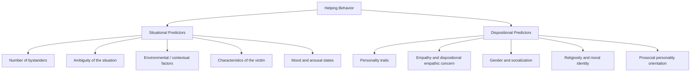
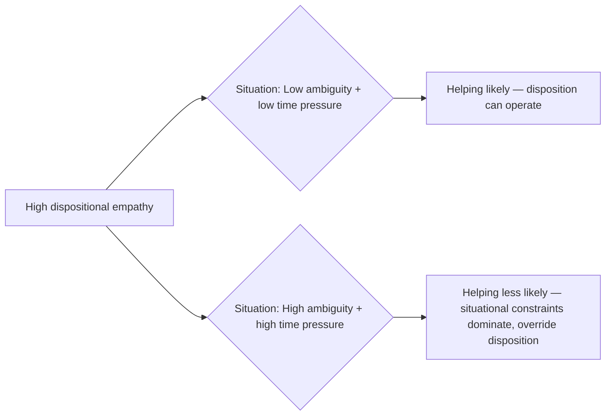

## Situational and Dispositional Predictors of Helping

### Overview

Research on prosocial behavior distinguishes between two broad classes of factors that predict whether a person will help someone in need: **situational predictors** (features of the immediate context or environment) and **dispositional predictors** (relatively stable characteristics of the potential helper). Most contemporary models treat helping as jointly determined by an interaction between the two, rather than by either class alone.

### Situational Predictors

**Key Points**

**1. Number of Bystanders**

- As established by Latané and Darley's bystander research, the presence of additional bystanders reduces individual helping likelihood via **diffusion of responsibility** and **pluralistic ignorance**.
- This is one of the most robust and replicated situational effects in the helping literature.

**2. Ambiguity of the Situation**

- Clear, unambiguous emergencies (visible injury, explicit calls for help) produce much higher helping rates than ambiguous situations (is that person sleeping or unconscious? is that a domestic argument or an assault?).
- Ambiguity opens space for pluralistic ignorance and slows progression through the cognitive stages of the bystander intervention model.

**3. Environmental and Contextual Factors**

- **Urban vs. rural settings:** Classic field research (e.g., studies comparing helping rates in large cities vs. small towns) has generally found higher helping rates in less densely populated areas. [Inference] The leading theoretical explanation involves urban overload — the idea that dense, high-stimulation environments lead residents to psychologically conserve attention and involvement, reducing responsiveness to strangers' needs, though the precise magnitude of urban-rural differences varies by study and population.
- **Noise and environmental stressors:** Loud, unpleasant, or distracting environments have been found in experimental work to reduce helping, plausibly by narrowing attentional focus and increasing stress and self-focus.
- **Weather:** [Inference] Some field studies have linked pleasant weather conditions to modest increases in spontaneous helping (e.g., outdoor helping requests, tipping behavior), consistent with mood-based explanations, though effect sizes reported across studies are inconsistent.
- **Time pressure:** The classic **Darley & Batson (1973) "Good Samaritan" study** found that seminary students asked to hurry to deliver a talk (some specifically on the parable of the Good Samaritan) were dramatically less likely to stop and help a slumped, coughing confederate in an alley than those not rushed — time pressure was a far stronger predictor of helping than religious disposition or content of the talk they were about to give.

**4. Characteristics of the Person in Need**

- **Similarity:** People are generally more likely to help those perceived as similar to themselves (in-group membership, shared identity, similar appearance or attire).
- **Attractiveness:** Some studies have found modestly higher helping rates toward physically attractive individuals, though this effect interacts with gender and type of request.
- **Perceived deservingness / attribution of need:** As covered under the social responsibility norm, need attributed to uncontrollable causes (illness, accident) elicits more helping than need attributed to controllable causes (perceived personal fault).
- **Gender of the person in need:** [Inference] Some classic studies found bystanders (particularly male bystanders) were more likely to help women than men in certain contexts (e.g., roadside car trouble), though this pattern is understood as shaped by gender-role socialization rather than a fixed rule, and results vary across specific helping contexts studied.

**5. Mood States**

- **Positive mood (the "feel good, do good" effect):** Experimentally induced positive mood (e.g., finding a dime in a phone booth, receiving a small gift) has been repeatedly shown to increase subsequent helping behavior.
- **Negative mood:** The relationship is more complex; guilt tends to increase helping (guilt-driven prosocial behavior), while sadness's effects depend on whether helping is perceived as a viable mood-repair strategy (see **negative-state relief model** in Related Topics).

**6. Physiological Arousal**

- The **Piliavin et al. arousal: cost-reward model** proposes that witnessing an emergency produces an unpleasant state of physiological arousal, which the bystander is motivated to reduce — either by helping directly, seeking help from others, or leaving the situation, depending on the relative costs of each option.

### Dispositional Predictors

**Key Points**

**1. Personality Traits**

- **Empathic concern (trait empathy):** Individuals higher in dispositional empathy consistently show higher rates of prosocial and helping behavior across contexts; this is one of the more robust dispositional predictors in the literature.
- **Agreeableness (Big Five):** Higher trait agreeableness is associated with greater cooperative and prosocial behavior across multiple studies.
- **Self-monitoring:** [Inference] Some research suggests high self-monitors may be more responsive to situational cues about what helping behavior is socially rewarded, while low self-monitors' helping is more consistently driven by internal values, though this distinction is more theoretically proposed than uniformly confirmed across all helping domains.

**2. Prosocial Personality Orientation**

- Researchers (e.g., **Penner and colleagues**) have proposed a **Prosocial Personality Battery**, identifying two broad dimensions:
  - **Other-oriented empathy:** Concern for others' welfare, feelings of responsibility, and empathic perspective-taking.
  - **Helpfulness:** Self-reported history of engaging in helping behaviors and self-efficacy about one's ability to help.
- [Inference] This battery has been used in applied research (e.g., predicting sustained volunteerism), though like most personality-behavior measures, predictive strength for any single helping episode is generally more modest than for aggregated helping behavior across many occasions.

**3. Moral Identity and Values**

- Individuals for whom being a "helpful" or "moral" person is central to their self-concept (**moral identity centrality**) show more consistent prosocial behavior, particularly when that identity is made salient.
- Values related to universalism and benevolence (as studied in Schwartz's value theory) correlate with self-reported prosocial tendencies.

**4. Religiosity**

- Findings are mixed and context-dependent: some studies find higher self-reported prosociality among more religious individuals, particularly toward in-group members, while controlled behavioral studies (including the Good Samaritan study above) have found situational factors like time pressure to override any effect of religious disposition or salience in actual helping behavior.

**5. Gender Differences in Helping Style**

- [Inference] A frequently cited meta-analytic pattern (Eagly & Crowley, 1986) suggests men have historically been somewhat more likely to engage in helping that is heroic, chivalrous, or involves physical risk/intervention (e.g., roadside assistance), while women have been somewhat more likely to engage in nurturant, long-term, relational helping (e.g., caregiving, emotional support). This pattern is explained in the social-role theory framework as arising from gender-role socialization rather than fixed biological predisposition, and specific effect sizes and applicability vary considerably by context and have evolved alongside changing social roles since the original research.

**6. Competence and Prior Experience**

- Individuals with relevant skills or training (e.g., off-duty medical professionals, trained lifeguards) are dispositionally more likely to help in relevant emergencies, both because they correctly interpret the event as serious and because they know how to act (Stage 4 of the bystander model).

### Situational × Dispositional Interaction

Modern models generally reject a pure "trait vs. situation" dichotomy in favor of interactionist frameworks, where dispositional tendencies predict helping most strongly under certain situational conditions (and vice versa).

**Example**

Two individuals both score high on dispositional empathy. One walks past a person who has dropped groceries on a quiet, unhurried afternoon and stops to help — the situation permits the disposition to express itself. The other is late for an urgent meeting (mirroring the Good Samaritan study's time-pressure manipulation) and walks past the same scenario without stopping, despite equally high trait empathy — illustrating how strong situational constraints can override dispositional tendencies.

### Comparative Summary Table

| Category | Predictor | Direction of Effect | Key Study/Source |
| --- | --- | --- | --- |
| Situational | Number of bystanders | More bystanders → less helping | Latané & Darley (1968) |
| Situational | Time pressure | More rush → less helping | Darley & Batson (1973) |
| Situational | Positive mood | Better mood → more helping | Isen & Levin (1972) |
| Situational | Urban vs. rural setting | Urban → somewhat less helping | Various field studies |
| Situational | Attribution of need (controllable vs. not) | Uncontrollable → more helping | Weiner's attribution model |
| Dispositional | Trait empathy | Higher empathy → more helping | Penner et al.; Batson |
| Dispositional | Agreeableness | Higher agreeableness → more helping | Big Five personality research |
| Dispositional | Moral identity centrality | Higher centrality → more consistent helping | Aquino & Reed |
| Dispositional | Competence/training | Relevant skills → more effective helping | Applied bystander research |

### Applied and Real-World Implications

- **Bystander intervention training programs** (e.g., "Green Dot," campus sexual-assault prevention programs) are explicitly designed around situational predictors — teaching participants to reduce ambiguity, counteract diffusion of responsibility, and lower the effective "cost" of intervening.
- **Volunteer recruitment and retention** research draws heavily on dispositional predictors (prosocial personality, moral identity) to identify individuals likely to sustain long-term volunteering commitments, as opposed to one-off helping acts more driven by situational mood or context.
- **Public space design:** Understanding environmental predictors (noise, crowding, urban overload) informs urban planning and public safety interventions intended to increase bystander responsiveness (e.g., visible emergency call points, reduced ambient stressors in public transit systems).
- **Emergency responder selection and training:** Recognizing that competence and situational clarity are strong joint predictors of effective intervention (not empathy alone) has informed the emphasis on skills-based training (CPR, first aid) in addition to motivational appeals in public health campaigns.

**Related Topics**

- Diffusion of responsibility
- Pluralistic ignorance
- Norm of reciprocity and social responsibility norm
- Empathy-altruism hypothesis (Batson)
- Negative-state relief model
- Arousal: cost-reward model (Piliavin)
- Weiner's attributional model of helping
- Social role theory and gender differences in prosocial behavior
- Prosocial Personality Battery (Penner et al.)
- Moral identity and self-concept research (Aquino & Reed)