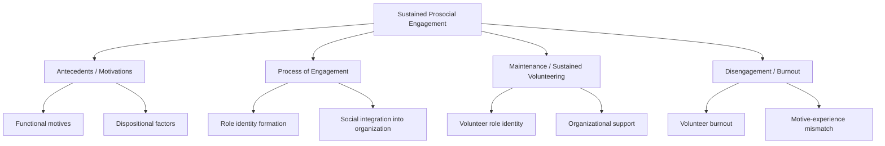
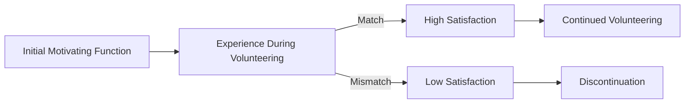
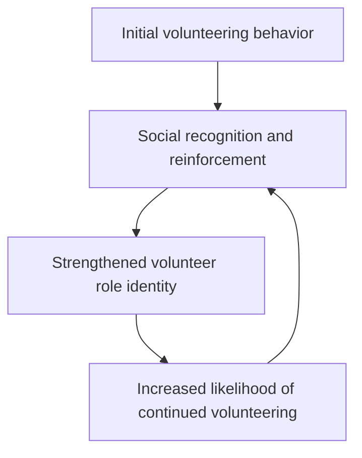

## Volunteering and Sustained Prosocial Engagement

### Overview

Volunteering is a distinct category within prosocial behavior research, differentiated from spontaneous helping (e.g., bystander intervention) by several defining features: it is **planned rather than spontaneous**, **sustained over time rather than a single episode**, typically **non-obligatory**, often occurs within an **organizational context**, and frequently involves helping **strangers** rather than known individuals. Because of these features, the psychological processes that initiate volunteering, sustain it over months or years, and eventually lead to its discontinuation differ meaningfully from the processes governing one-time emergency helping.

### Defining Features of Volunteering vs. Spontaneous Helping

| Feature | Spontaneous Helping | Volunteering |
| --- | --- | --- |
| Planning | Unplanned, reactive | Deliberate, planned in advance |
| Duration | Single episode | Sustained over weeks, months, or years |
| Decision process | Rapid (seconds) | Deliberate (extended decision-making) |
| Recipient | Often a specific known individual | Often unknown strangers or a general cause |
| Context | Ad hoc, any setting | Typically organizational/institutional |
| Cost structure | Often low-cost, brief | Often high cumulative time/effort cost |
| Theoretical framework | Bystander intervention model | Functional approach; role identity theory |

### The Functional Approach to Volunteer Motivation

The dominant framework for understanding *why* people begin volunteering is the **Volunteer Functions Inventory (VFI)**, developed by **E. Gil Clary, Mark Snyder, and colleagues (1998)**. This approach proposes that volunteering serves multiple distinct psychological functions simultaneously, and that different individuals may volunteer for the same activity to satisfy different underlying motives.

**Key Points — Six Functions of Volunteering (VFI Model)**

1. **Values function:** Expressing one's altruistic and humanitarian values (e.g., "I feel compassion toward people in need").
2. **Understanding function:** Gaining new knowledge, skills, or experiences through volunteering.
3. **Social function:** Strengthening or building social relationships (volunteering with friends, meeting new people, social approval from valued others).
4. **Career function:** Gaining career-related experience, skills, or networking benefits.
5. **Protective function:** Reducing negative feelings about oneself (e.g., guilt over one's own good fortune) or escaping personal problems.
6. **Enhancement function:** Personal growth, increased self-esteem, and positive feelings about oneself through helping.

$$\text{Sustained Volunteering} \approx f(\text{Motive} \times \text{Experienced Benefit Match})$$

[Inference] This functional-matching formulation is a conceptual summary of the VFI research program's core prediction rather than a formally validated equation; the underlying claim — that volunteers whose actual experiences match their motivating functions show greater satisfaction and persistence — is empirically supported across multiple VFI studies, but the "formula" itself is illustrative, not a measured statistical model reported in the original research.

### Functional-Fit Hypothesis

A central empirical finding from the VFI research program is the **functional-fit (or matching) hypothesis**: satisfaction, intention to continue, and actual persistence in volunteering are higher when the benefits a volunteer actually experiences align with the motives that initially drew them to the activity — regardless of which specific motive is involved.

**Example**

A retired professional volunteers primarily for the **understanding function** (wanting to learn new skills). If the volunteer role turns out to offer genuine skill development and learning opportunities, satisfaction and persistence are high. If instead the role consists of repetitive, unstimulating tasks with no learning component, the volunteer is more likely to disengage — even if the cause itself remains personally meaningful — because the specific motivating function goes unmet.

### Role Identity Theory and Volunteer Role Identity

Beyond initial motivation, **sustained** volunteering (particularly long-term, multi-year commitment) is strongly predicted by the development of a **volunteer role identity** — internalizing "volunteer" (or a more specific role, e.g., "hospice volunteer," "mentor") as part of one's self-concept.

**Key Points**

- Drawing on **identity theory** (Stryker; Callero, Howard & Piliavin), the more central and salient a volunteer identity becomes to a person's overall self-concept, the more resistant that behavior becomes to situational barriers (time constraints, fatigue, competing demands).
- Role identity develops through a feedback loop: volunteering behavior → social recognition/reinforcement from others (organization staff, beneficiaries, peer volunteers) → strengthened self-identification as "a volunteer" → increased likelihood of continued volunteering.
- Longitudinal research (e.g., **Penner's integrated model of sustained volunteerism**) frames long-term volunteering as substantially different from one-off helping precisely because it becomes woven into identity and social role rather than remaining a discrete, motive-driven decision each time.

### Organizational and Social-Structural Factors

**Key Points**

- **Social integration:** Volunteers who form friendships and a sense of belonging within the volunteering organization show substantially higher retention than those who remain socially peripheral.
- **Organizational support and role clarity:** Clear expectations, adequate training, recognition practices, and perceived organizational appreciation are consistently associated with volunteer retention in applied nonprofit-management research.
- **Recruitment source:** [Inference] Volunteers recruited through personal social networks (friends, family, existing volunteers) tend to show higher initial engagement and retention than those recruited through impersonal channels (advertisements, cold outreach), consistent with broader findings on the role of social ties in sustained prosocial commitment, though retention drivers can vary by organization type and cause.
- **Episodic vs. continuous volunteering:** Modern volunteering research increasingly distinguishes **continuous volunteering** (ongoing, regular commitment to one organization) from **episodic volunteering** (short-term, one-off, or occasional engagements, e.g., a single disaster-relief deployment), which are theorized to draw on somewhat different motivational and identity processes.

### Dispositional Predictors of Sustained Volunteering

- **Prosocial personality orientation** (Penner et al.'s Prosocial Personality Battery — other-oriented empathy and helpfulness dimensions) predicts both initial volunteering and persistence over time better than it predicts single spontaneous helping acts, since sustained behavior allows dispositional tendencies more consistent opportunity to express themselves (see the situational × dispositional interaction principle).
- **Moral identity centrality** predicts sustained volunteering commitment, particularly when the volunteering role is publicly visible and reinforces self-concept.
- **Life-course and generativity concerns** (Erikson's psychosocial theory): [Inference] Some research links increased volunteering in midlife and older adulthood to generativity motives — a concern with contributing to and guiding future generations — though this is one contributing factor among several rather than the primary driver identified across all age-related volunteering research.

### Volunteer Burnout and Disengagement

Sustained prosocial engagement carries risk of **volunteer burnout**, conceptually related to occupational burnout research (Maslach), typically characterized by:

- **Emotional exhaustion:** Depleted emotional resources from sustained exposure to others' needs or suffering (particularly relevant in caregiving-type volunteering, e.g., hospice, crisis hotlines).
- **Depersonalization/cynicism:** Growing detachment from beneficiaries or the cause itself.
- **Reduced sense of accomplishment:** Diminished feeling that one's efforts are making a meaningful difference.

**Key Points — Predictors of Burnout and Disengagement**

- Motive-experience mismatch (as above) is a leading predictor of early disengagement.
- Excessive workload or unclear role boundaries without organizational support increases burnout risk.
- Lack of visible impact or feedback on outcomes can erode the enhancement and values functions that sustain motivation.
- [Inference] Emotionally intensive volunteering domains (e.g., disaster response, hospice care, crisis counseling) appear to carry elevated burnout risk relative to lower-intensity domains (e.g., administrative or event-based volunteering), consistent with occupational burnout patterns in analogous caregiving professions, though direct comparative burnout-rate data specifically for volunteer populations across domains is less extensive than for paid caregiving occupations.

### Real-World and Applied Contexts

- **Nonprofit volunteer management:** VFI-based motive assessments are widely used in practitioner settings to match prospective volunteers to roles likely to satisfy their specific motivating functions, with the goal of improving retention.
- **Corporate volunteering programs:** Many companies structure employee volunteer programs around the career and social functions, offering skill-based volunteering opportunities and team-based volunteer events to align with employees' likely motivating functions.
- **Public health and blood/organ donation systems:** Sustained donor behavior (recurring blood donation) has been studied through frameworks parallel to volunteering research, with role-identity formation ("regular donor" identity) shown to strongly predict long-term donation continuation.
- **Disaster response and episodic volunteering surges:** Large-scale disasters (e.g., hurricanes, pandemics) often produce a surge of episodic volunteers; retention of these episodic volunteers into longer-term engagement is a persistent challenge for humanitarian organizations, since episodic volunteers' initial motives (often situational or values-driven) may not translate into durable role identity without deliberate organizational follow-up.
- **Youth and school-based service-learning programs:** Structured volunteering programs for adolescents aim to cultivate early prosocial role identity and moral identity centrality, with the theoretical goal of establishing durable lifelong volunteering patterns.

### Summary Table

| Aspect | Description |
| --- | --- |
| Core theoretical model | Volunteer Functions Inventory (Clary, Snyder et al., 1998) |
| Six motivating functions | Values, Understanding, Social, Career, Protective, Enhancement |
| Central predictive principle | Functional-fit (matching) hypothesis |
| Long-term maintenance mechanism | Volunteer role identity formation |
| Key risk to sustained engagement | Volunteer burnout / motive-experience mismatch |
| Distinguishing feature vs. spontaneous helping | Planned, sustained, often stranger-directed, identity-linked |

**Related Topics**

- Norm of reciprocity and social responsibility norm
- Situational and dispositional predictors of helping
- Empathy-altruism hypothesis (Batson)
- Prosocial Personality Battery (Penner et al.)
- Moral identity and self-concept (Aquino & Reed)
- Identity theory (Stryker; Callero)
- Occupational burnout (Maslach Burnout Inventory)
- Generativity and Erikson's psychosocial stages
- Social exchange theory and cost-reward models of helping
- Corporate social responsibility and employee volunteering programs