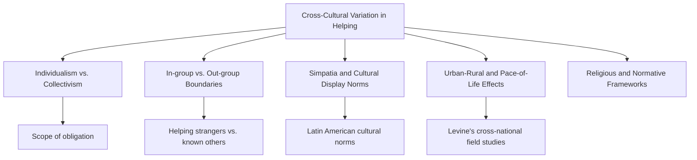
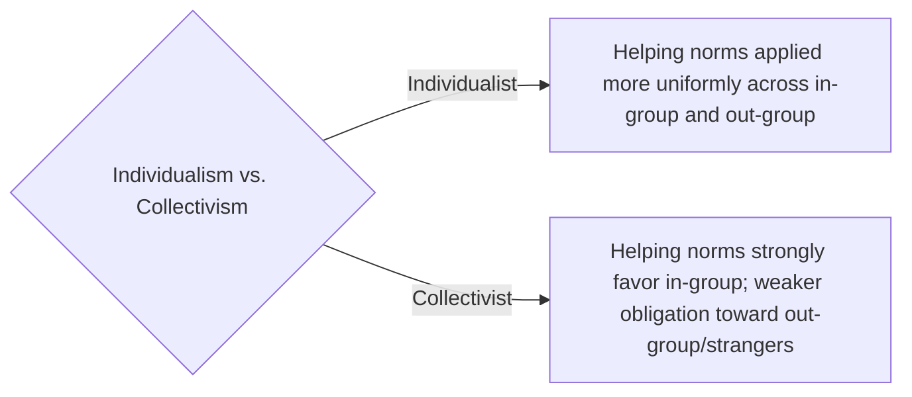

## Cross-Cultural Variation in Helping

### Overview

Cross-cultural research on prosocial behavior examines how helping tendencies, norms of obligation, and the psychological mechanisms underlying helping vary across societies and cultural groups. While the core cognitive and motivational processes studied in Western-dominated helping research (empathy, attribution, social norms) appear broadly present across cultures, the **strength, scope, and situational triggers** of helping behavior show substantial and systematic cross-cultural variation.

### Individualism–Collectivism and the Scope of Helping Obligation

**Key Points**

- The most extensively studied cultural dimension in helping research is **individualism vs. collectivism** (Hofstede; Triandis), which describes whether a culture emphasizes independent, autonomous selves or interdependent selves embedded in group relationships.
- [Inference] Collectivist cultures are generally theorized and found in cross-cultural psychology literature to extend strong helping obligations more broadly to in-group members (extended family, community, close social network) but not necessarily to strangers or out-group members, whereas individualist cultures tend to apply helping norms somewhat more uniformly regardless of group membership, though this pattern is a general tendency rather than a fixed rule and specific studies vary in the size of the difference observed.
- This produces a key theoretical prediction: the *individualism-collectivism* dimension should moderate the **in-group/out-group distinction** in helping more strongly than it affects overall helping rates.

### In-Group/Out-Group Boundaries in Helping

- Across virtually all cultures studied, people show some degree of **in-group favoritism** in helping — a well-replicated pattern in intergroup and social identity research broadly, not unique to any one culture.
- [Inference] The *magnitude* of the in-group/out-group helping gap, however, appears to vary cross-culturally, with some collectivist societies showing a sharper distinction between helping close in-group members versus strangers compared to some individualist societies, where the gap, while still present, tends to be somewhat narrower. This is a general pattern drawn from cross-cultural social psychology rather than a single definitive cross-national ranking.
- **Example:** A person in a strongly collectivist cultural context might feel a very high, almost non-negotiable obligation to help an extended family member relocate, while feeling comparatively little spontaneous obligation to assist an unfamiliar stranger with a minor task — a contrast that, per the theoretical prediction above, may be less pronounced in a strongly individualist cultural context, where the drop-off in obligation from family to stranger tends to be smaller.

### "Simpatia" and Culturally Specific Helping Norms

- Cross-cultural social psychology has documented culturally specific norms that structure everyday prosocial interaction beyond the broad individualism-collectivism dimension.
- **Simpatía**, studied by Levine and colleagues, refers to a cultural script prominent in many Latin American cultures emphasizing warmth, politeness, and social smoothness in interactions, including with strangers.
- Levine's cross-national field studies found that participants in several Latin American cities (including Rio de Janeiro and San José) showed notably higher rates of helping strangers in staged field experiments (e.g., helping someone who dropped papers, assisting a person with an injured leg) compared to participants in some large cities in other regions, a pattern researchers linked to the *simpatía* cultural script rather than to individualism-collectivism status alone, since some of the higher-helping cities were not strongly collectivist by other measures.
- [Inference] This finding is notable because it demonstrates that culturally specific normative scripts can predict cross-national helping variation independently of, or in addition to, the broader individualism-collectivism framework — suggesting the latter is not a complete explanatory model on its own.

### Robert Levine's Cross-National Field Studies

**Key Points**

- **Robert Levine and colleagues (late 1990s–2000s)** conducted one of the most systematic cross-national field studies of helping, staging standardized scenarios (returning a dropped pen, assisting a blind person cross a street, helping someone with an injured leg pick up dropped magazines, providing change for a stranger) across dozens of cities worldwide.
- **Key finding — Pace of life:** Cities with a faster overall "pace of life" (measured via walking speed, postal transaction speed, and public clock accuracy) tended to show lower rates of spontaneous stranger-helping, a pattern conceptually consistent with the **time-pressure effect** found in Darley and Batson's Good Samaritan study, but demonstrated here as a stable *cultural/city-level* characteristic rather than a within-person situational manipulation.
- **Key finding — population density:** Larger, more densely populated cities generally showed somewhat lower helping rates, broadly consistent with **urban overload** theory, though pace of life and population density were themselves correlated, complicating attribution of the effect to either variable alone. [Inference: the specific relative contribution of pace-of-life versus population density is discussed as an open interpretive question in this line of research rather than fully disentangled]
- **Economic factors:** [Inference] Levine's research and related cross-national work found country-level economic prosperity was not a strong independent predictor of helping rates once pace of life and cultural factors were accounted for, challenging a simple "wealthier countries help more" assumption, though this remains an area with some inconsistency across different cross-national helping datasets.

### Religious and Normative-Institutional Frameworks

- Formalized religious and cultural institutions (e.g., zakat in Islamic tradition, tzedakah in Jewish tradition, dana in Buddhist and Hindu traditions) provide structured normative frameworks that codify helping obligations, sometimes extending the social responsibility norm into a formal, quasi-obligatory practice with specified scope (e.g., percentage-based charitable giving).
- [Inference] Cross-cultural comparisons of the psychological experience of "obligatory" versus "discretionary" giving suggest that formalized charitable obligations may be experienced with different emotional and motivational qualities (e.g., less guilt-driven, more identity- and duty-driven) compared to discretionary Western-style volunteering, though rigorous comparative psychological data directly contrasting these experiences across traditions is more limited than the broader theological and sociological literature describing the practices themselves.

### Methodological Considerations in Cross-Cultural Helping Research

**Key Points**

- **WEIRD sample bias:** A substantial proportion of foundational helping-behavior research (bystander studies, attribution studies) was conducted with Western, Educated, Industrialized, Rich, and Democratic (WEIRD) samples, raising ongoing questions about the generalizability of core findings (e.g., diffusion of responsibility, the bystander effect) to non-WEIRD populations. [Inference] Some cross-cultural replications of bystander-effect-type paradigms exist, but the breadth of replication across diverse cultural contexts is narrower than for WEIRD-sample findings, making full generalizability an open empirical question rather than a settled conclusion.
- **Operationalization challenges:** What counts as "helping" and what triggers an obligation to help can be culturally variable in itself, complicating direct behavioral comparisons across cultures using identical staged scenarios (a scenario may carry different social meaning in different cultural contexts).
- **Confound between culture and structural factors:** Cross-national comparisons often struggle to fully separate cultural values from confounding structural factors such as economic development, urbanization, population density, and climate, all of which can independently influence helping rates.

### Comparative Summary Table

| Factor | Pattern Observed | Key Source |
| --- | --- | --- |
| Individualism vs. collectivism | Collectivist cultures show larger in-group/out-group helping gap | Hofstede; Triandis cross-cultural framework |
| Simpatía cultural script | Higher stranger-helping in cultures emphasizing warmth/politeness norms | Levine et al. cross-national field studies |
| Pace of life | Faster-paced cities show lower spontaneous stranger-helping | Levine & Norenzayan (1999) |
| Population density | Larger/denser cities generally show somewhat lower helping | Urban overload theory; Levine et al. |
| Economic prosperity | Not a strong independent predictor once other factors controlled | Levine et al. cross-national data |
| Religious/institutional norms | Formalized giving obligations shape scope and psychological experience of helping | Comparative religion and prosocial behavior literature |

### Real-World and Applied Implications

- **International humanitarian and NGO program design:** Organizations operating across cultural contexts must account for varying in-group/out-group helping norms when designing community-based aid distribution or volunteer mobilization strategies, since appeals effective in one cultural context (e.g., stranger-directed individual appeals) may be less effective in another (e.g., where community/family-mediated appeals carry more weight).
- **Cross-cultural training for expatriates and global organizations:** Understanding pace-of-life and simpatía-type norms informs training for individuals and businesses operating in unfamiliar cultural contexts, to avoid misreading local helping norms as unfriendliness or, conversely, over-relying on assumed reciprocity expectations.
- **Global health and public health campaign design:** Blood/organ donation and public health helping campaigns are increasingly tailored to local cultural helping norms and institutional/religious giving frameworks rather than applying a single Western-normed messaging strategy.
- **Urban planning implications:** Findings linking pace of life and density to reduced spontaneous helping have been referenced in discussions of designing public spaces and social infrastructure intended to counteract "urban overload" effects on community responsiveness.

**Related Topics**

- Norm of reciprocity and social responsibility norm
- Situational and dispositional predictors of helping
- Diffusion of responsibility and pluralistic ignorance
- In-group/out-group bias and social identity theory
- Individualism-collectivism (Hofstede; Triandis)
- WEIRD samples and generalizability in psychological research
- Volunteering and sustained prosocial engagement
- Urban overload hypothesis
- Kin selection and evolutionary theories of altruism