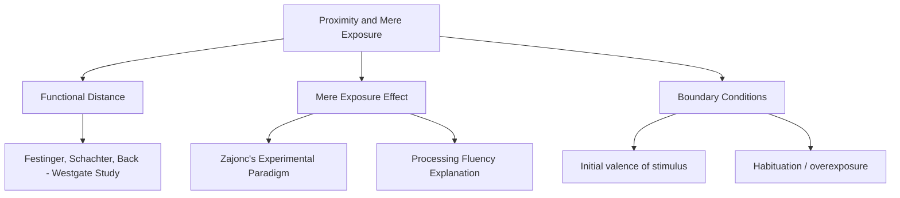
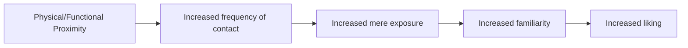
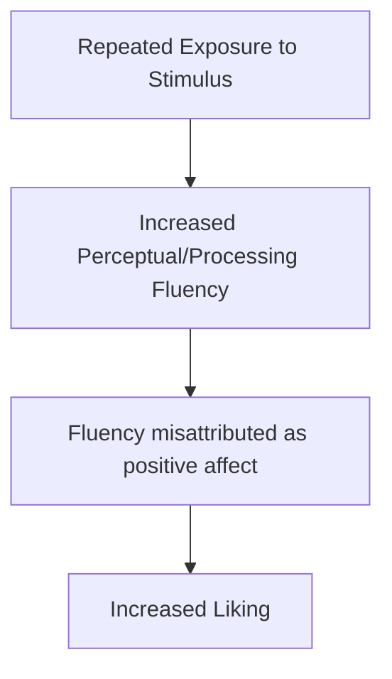

## Proximity and the Mere Exposure Effect

### Overview

Proximity and the mere exposure effect are two closely related, foundational determinants of interpersonal attraction. **Proximity** refers to the physical or functional closeness between individuals that increases the likelihood of interaction, while the **mere exposure effect** is the broader psychological principle explaining *why* repeated contact — even without interaction — tends to increase liking. Together they form one of the most robust and earliest-documented predictors of who becomes friends, romantic partners, and acquaintances.

### Proximity Effect

**Definition**

The proximity effect is the well-documented finding that physical or functional closeness between individuals substantially increases the likelihood that they will form a relationship (friendship, romantic, or otherwise), primarily because proximity increases the frequency of unplanned contact and interaction opportunities.

**Classic Study — Festinger, Schachter, and Back (1950), Westgate Housing Study**

- **Setup:** Studied friendship patterns among married student veterans and their families living in the Westgate and Westgate West housing complexes at MIT, where apartment assignments were effectively random with respect to prior acquaintance.
- **Key findings:**
  - Residents were far more likely to become friends with immediate next-door neighbors than with residents living just a few doors away.
  - Residents living near stairwells and mailboxes (high-traffic "functional distance" points) had more friends overall than those in more isolated units, because these locations generated more incidental contact regardless of literal physical distance.
- **Key concept — Functional distance:** Festinger and colleagues distinguished *functional distance* (how often paths cross, determined by architectural layout) from mere physical distance, showing that architectural design features (stairwell placement, hallway layout) could predict friendship formation better than raw distance in feet.

**Key Points**

- Proximity operates largely through increasing the **base rate of interaction opportunities**, not through any inherent property of physical closeness itself.
- The effect applies broadly: dormitory roommate assignments, classroom seating charts, workplace desk placement, and online "proximity" (e.g., algorithmically frequent digital contact) have all been associated with elevated relationship formation in various studies.
- [Inference] Some contemporary research has examined whether "virtual proximity" (frequent online interaction, shared digital spaces) produces analogous effects to physical proximity, with findings generally suggestive of similar underlying exposure-based mechanisms, though this extension of the classic paradigm to digital contexts is a more recent and less extensively replicated area compared to the original physical-proximity literature.

### The Mere Exposure Effect

**Definition**

The mere exposure effect, formally established by **Robert Zajonc (1968)**, is the finding that repeated, mere (non-reinforced) exposure to a stimulus is sufficient to increase an individual's liking or positive affect toward that stimulus, even in the complete absence of conscious recognition or interaction.

**Classic Experimental Paradigm (Zajonc, 1968)**

- Participants were shown a series of stimuli (nonsense words, Chinese-like characters, photographs of unfamiliar faces) at varying frequencies (e.g., 0, 1, 2, 5, 10, or 25 exposures), each presented very briefly.
- Participants then rated how much they liked each stimulus.
- **Finding:** Liking ratings increased systematically and reliably with the number of prior exposures, forming a positive monotonic (though decelerating) function.

$$\text{Liking} \propto \log(\text{Number of Exposures})$$

[Inference] This logarithmic relationship is a commonly cited characterization of the exposure-liking curve from the mere exposure literature (rapid gains at low exposure counts, diminishing returns at higher counts), consistent with the general shape of results across many mere exposure studies, though the precise mathematical form varies somewhat by study, stimulus type, and exposure parameters rather than following one universally fixed equation.

**Key Points**

- **No conscious recognition required:** The effect occurs even under **subliminal exposure conditions** (stimuli presented too briefly for conscious identification), indicating the mechanism does not require explicit memory or awareness of having seen the stimulus before.
- **Domain generality:** The effect has been replicated across a very wide range of stimulus types: words, shapes, faces, melodies, and even genuinely novel foods, suggesting a broad, low-level cognitive mechanism rather than a domain-specific social process.
- **Applies to face perception directly:** This makes the mere exposure effect directly relevant to interpersonal attraction, since repeated exposure to a person's face (e.g., a classmate, coworker, neighbor) can increase liking for that person independent of any actual social interaction or exchange of information.

### Theoretical Explanation: Processing Fluency

**Key Points**

- The leading contemporary explanation for the mere exposure effect is the **perceptual/processing fluency account**: repeated exposure makes a stimulus easier and faster to process (perceptually and cognitively), and this subjective ease of processing is misattributed as a positive affective response ("this feels good/familiar, therefore I must like it").
- [Inference] This fluency-based account, developed and extended by researchers including Rajeev Bornstein and later fluency-attribution researchers (e.g., Winkielman, Schwarz), is widely regarded as the dominant explanatory mechanism in the contemporary literature, though Zajonc's original theorizing proposed a more direct, minimally cognitive affective pathway; the relative contribution of purely affective versus fluency-misattribution processes remains an area of ongoing theoretical discussion rather than a fully settled single-mechanism consensus.
- Processing fluency also explains why *familiarity in general* — not just exposure to the exact same stimulus — can produce mild positive affect (e.g., liking stimuli that merely resemble previously seen ones).

### Boundary Conditions and Moderators

**Key Points**

**1. Initial Valence of the Stimulus**

- The mere exposure effect is most reliable for **neutral or mildly positive** initial stimuli.
- For stimuli with a strongly **negative** initial valence, repeated exposure can fail to increase liking, and in some cases may increase dislike (an important boundary condition, since the effect is not universal across all initial impressions).

**2. Overexposure and Habituation/Boredom**

- The positive exposure-liking relationship is not indefinitely monotonic; at very high exposure counts, liking can plateau or decline — a pattern sometimes discussed as **stimulus satiation** or overexposure.
- [Inference] The exact exposure threshold at which satiation begins to outweigh continued fluency gains varies by stimulus complexity and context, with simpler stimuli reaching a decline point sooner than more complex ones in some studies, though this moderation is more a general pattern noted across the literature than a fixed universal exposure count.

**3. Stimulus Complexity**

- More complex stimuli (e.g., detailed images, intricate melodies) tend to show mere exposure benefits across a larger number of exposures before satiation sets in, compared to very simple stimuli, consistent with the fluency account (complex stimuli take longer to reach maximal processing ease).

**4. Awareness of Exposure**

- The effect tends to be stronger under conditions where the exposure is *not* consciously recognized or is only weakly recognized, since conscious recognition can introduce competing explicit judgment processes (e.g., "I recognize this, but do I actually like it based on its features?") that can attenuate the pure fluency-based affective boost.

### Interaction Between Proximity and Mere Exposure in Attraction

Proximity and mere exposure are conceptually linked in a causal chain relevant to interpersonal attraction: proximity increases the *frequency* of exposure to another person (their face, voice, mannerisms), and mere exposure theory explains why that increased frequency of contact — independent of the content or quality of any specific interaction — tends to increase baseline liking.

**Example**

Two students assigned to adjacent seats in a large lecture hall for a semester, with minimal direct conversation, often report a modest increase in liking and familiarity toward each other by the semester's end compared to two students seated at opposite ends of the room, purely as a function of repeated visual exposure and incidental proximity — illustrating the proximity-exposure-liking chain even without a personal relationship having actively formed through explicit self-disclosure or conversation (self-disclosure and other attraction-boosting processes typically build on top of this initial exposure-based liking foundation once actual interaction begins).

### Real-World and Applied Contexts

- **Advertising and marketing:** Mere exposure effect is a foundational principle behind repetitive brand advertising, on the premise that repeated (even non-informative) exposure to a brand name or logo increases consumer liking and preference independent of message content.
- **Political campaigning:** Repeated exposure to a candidate's name, face, and slogans (yard signs, repeated ads) is theorized to leverage mere exposure to increase voter familiarity-based favorability, distinct from persuasion based on policy content.
- **Urban and workplace design:** Understanding functional distance informs deliberate architectural and office layout choices (e.g., placing shared kitchens, printers, or common areas to maximize incidental cross-team contact) intended to foster collaboration and relationship formation among employees who might not otherwise interact.
- **Online dating and algorithmic matching:** [Inference] Some discussion in applied and popular science contexts has drawn on mere exposure theory to explain why repeated algorithmic exposure to the same potential match's profile can increase interest over time, though rigorous experimental extension of the classic mere exposure paradigm specifically to modern dating-app repeated-exposure contexts is a more recent and less thoroughly established research area compared to the foundational studies above.
- **Roommate and seating assignment policy:** University housing and classroom seating research has drawn directly on the Westgate findings to inform deliberate mixing policies intended to increase cross-group contact and friendship formation (e.g., for reducing prejudice via increased intergroup proximity, connecting to contact hypothesis research in intergroup relations).

### Summary Table

| Concept | Key Finding | Source |
| --- | --- | --- |
| Proximity effect | Physical/functional closeness increases likelihood of relationship formation | Festinger, Schachter & Back (1950) |
| Functional distance | Architectural/traffic-pattern closeness predicts friendship better than raw distance | Westgate housing study |
| Mere exposure effect | Repeated exposure increases liking, even without conscious recognition | Zajonc (1968) |
| Processing fluency account | Ease of processing from repeated exposure is misattributed as positive affect | Bornstein; Winkielman & Schwarz |
| Boundary condition 1 | Effect weak/reversed for initially negative stimuli | Multiple replications |
| Boundary condition 2 | Effect can plateau/reverse at very high exposure (satiation) | Multiple replications |

**Related Topics**

- Similarity and attraction (attitude and value similarity)
- Reciprocity of liking
- Physical attractiveness and the halo effect
- Self-disclosure and relationship escalation
- Social exchange and equity theories of relationships
- Contact hypothesis and intergroup prejudice reduction
- Processing fluency in judgment and decision-making
- Matching hypothesis in romantic partner selection