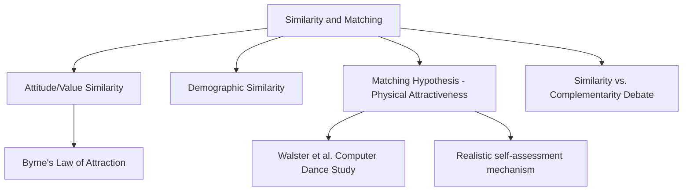
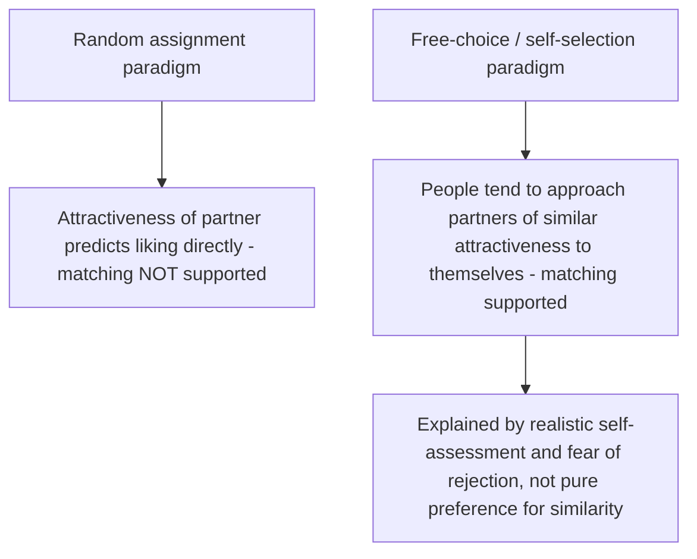

## Similarity and the Matching Hypothesis

### Overview

Similarity and the matching hypothesis are two closely related principles explaining why people tend to form relationships with others who resemble them. **Similarity** refers to the broad finding that people are attracted to others who share their attitudes, values, interests, and background characteristics. The **matching hypothesis** is a more specific proposition concerning physical attractiveness, predicting that people tend to pair off romantically with partners of roughly similar attractiveness level to their own, largely as a function of realistic self-assessment and fear of rejection rather than a pure preference for similar-looking partners.

### Similarity-Attraction Principle

**Definition**

The similarity-attraction principle, most systematically studied by **Donn Byrne**, holds that perceived similarity in attitudes, values, beliefs, and personal characteristics between two individuals increases mutual liking and attraction. This is among the most robustly replicated findings in the interpersonal attraction literature.

**Byrne's "Law of Attraction" (1971)**

- Byrne's research program used a standardized paradigm ("bogus stranger" technique): participants were shown a fabricated attitude questionnaire allegedly completed by another person, with the proportion of shared attitudes experimentally manipulated.
- **Key finding:** Liking for the fictitious stranger increased as a linear function of the **proportion** of attitudes shared (not merely the absolute number), a relationship Byrne formalized as the "law of attraction."

$$\text{Attraction} = f\left(\frac{\text{Number of similar attitudes}}{\text{Total number of attitudes compared}}\right)$$

[Inference] This ratio-based formulation is how Byrne's own research program characterized the relationship (proportion rather than raw count of similarities driving liking), and it is a well-established finding within that specific experimental paradigm; it functions as a summary descriptive principle from that body of work rather than a universal law governing all real-world attraction contexts outside the controlled bogus-stranger procedure.

**Key Points**

- **Reinforcement-affect model:** Byrne's theoretical explanation proposed that agreement from another person is inherently rewarding (validates one's own worldview, reduces uncertainty, and provides social reinforcement), and this positive affect becomes classically conditioned to the person expressing the agreement.
- **Domains of similarity:** Robust similarity effects have been found for attitudes and values, but also extend to demographic characteristics (age, education, religion, socioeconomic status — sometimes discussed under **homogamy** in relationship/marriage research), personality traits, and even more superficial characteristics.
- **Perceived similarity matters most:** Some research distinguishes *actual* similarity from *perceived* similarity, with several studies suggesting perceived similarity is often a stronger and more proximal predictor of attraction than objectively measured similarity, since people can misjudge how similar a partner actually is to them.

### Explanations for the Similarity-Attraction Effect

**Key Points**

- **Validation of worldview:** Agreement from similar others provides consensual validation that one's own beliefs, attitudes, and perceptions of reality are correct and reasonable.
- **Anticipated positive interaction:** People assume, often correctly, that interactions with similar others will be smoother, more predictable, and less conflict-prone than interactions with dissimilar others.
- **Reduced uncertainty:** Similar others are easier to understand and predict, reducing the cognitive and social uncertainty inherent in new relationships.
- **In-group categorization:** Similarity can trigger social categorization processes (treating a similar other as an in-group member), which independently tends to increase liking, connecting this principle to social identity theory in intergroup relations research.

### The Similarity vs. Complementarity Debate

- An alternative and popularly circulated idea — that "opposites attract" (**complementarity**) — has received substantially weaker and less consistent empirical support in controlled research compared to the similarity-attraction principle.
- [Inference] The empirical consensus in social psychology strongly favors similarity as the dominant predictor of attraction and relationship satisfaction across most domains studied, while genuine complementarity effects appear to be limited to specific, narrower circumstances (e.g., complementary needs in some interpersonal dynamics, such as one partner being more dominant and the other more submissive in a specific interactional style), rather than functioning as a general alternative principle of comparable strength to similarity.
- Popular belief in "opposites attract" is generally regarded in the field as exceeding what the empirical evidence supports, though the appeal of the idea in popular culture remains independent of its research standing.

### The Matching Hypothesis

**Definition**

The matching hypothesis, proposed by **Elaine Walster (Hatfield) and colleagues (1966)**, predicts that individuals tend to select romantic partners who are approximately similar to themselves in physical attractiveness, not because people inherently prefer partners who look like them, but because they realistically calibrate their romantic aspirations to their own perceived attractiveness level in order to minimize the risk of rejection.

**Classic Study — Walster, Aronson, Abrahams & Rottmann (1966), "Computer Dance" Study**

- **Setup:** University students were told they had been matched by computer for a dance (in reality, pairings were random). Participants had been independently rated on physical attractiveness beforehand.
- **Key initial finding:** Immediately after the dance, participants' liking for their date was predicted almost entirely by the date's physical attractiveness rating — the matching hypothesis was **not** supported in this first study; more attractive dates were simply liked more, regardless of the participant's own attractiveness level.
- **Later refinement:** Subsequent studies using different methodologies — allowing participants to *choose* among potential partners themselves (rather than being randomly assigned) — found more consistent support for the matching hypothesis: when given a genuine choice, people tended to select partners whose attractiveness roughly matched their own, particularly when they believed there was a realistic chance of the partner reciprocating interest.

**Key Points**

- **Mechanism — realistic self-assessment:** The dominant explanation for the matching hypothesis is not that people are *attracted* to similarly-attractive partners per se, but that they strategically pursue partners they believe are attainable, weighing the desirability of a highly attractive partner against the perceived risk of rejection.
- **Risk of rejection moderator:** [Inference] Studies manipulating perceived likelihood of rejection (e.g., leading participants to believe a highly attractive target is either very selective or relatively open to being approached) have found people are more willing to pursue higher-attractiveness targets when rejection risk is minimized, supporting the strategic/self-assessment explanation over a pure aesthetic-similarity preference account, though the size of this moderation effect varies across specific study designs.
- **Actual couple data:** Correlational studies of established real-world romantic couples do generally find a modest positive correlation between partners' independently rated physical attractiveness levels, consistent with the matching hypothesis's *outcome* prediction, even though the underlying *mechanism* is understood as strategic self-selection rather than a direct preference for attractiveness-similarity.
- **Compensatory matching:** Some research suggests attractiveness can be "traded" against other valued resources (status, wealth, warmth, humor) in partner selection, such that a matching-like pairing pattern can emerge even between partners who differ somewhat in physical attractiveness but are matched in overall perceived "mate value," an idea sometimes discussed under **social exchange** or **resource-exchange** models of relationship formation.

### Comparative Summary Table

| Concept | Core Claim | Key Study/Source | Primary Mechanism |
| --- | --- | --- | --- |
| Similarity-attraction | Similar attitudes/values increase liking | Byrne (1971), "Law of Attraction" | Reinforcement-affect / validation |
| Complementarity ("opposites attract") | Dissimilarity can increase attraction | Weak/inconsistent support | Limited to specific need-based dynamics |
| Matching hypothesis | People pair with similarly-attractive partners | Walster et al. (1966) | Realistic self-assessment / rejection avoidance |
| Compensatory matching | Attractiveness can be traded against other resources | Social exchange-based extensions | Overall "mate value" equivalence |

### Practical Example

**Example**

A person rates themselves as moderately attractive and, when given a free choice among potential dating profiles varying in attractiveness, tends to send messages primarily to individuals of similarly moderate attractiveness rather than exclusively pursuing the most conventionally attractive profiles available — not necessarily because they find moderately attractive partners more appealing in the abstract, but because they perceive a higher likelihood of a positive response and lower risk of rejection from someone whose attractiveness roughly matches their own self-assessed level.

### Real-World and Applied Contexts

- **Online dating platform design:** [Inference] Some dating app matching algorithms and user behavior research have referenced matching-hypothesis-consistent patterns (users tending to message others of similar self-rated or platform-rated attractiveness), though the extent to which this reflects the same psychological mechanism identified in Walster et al.'s original research, versus platform-specific behavioral dynamics, is an area of ongoing applied research rather than a fully established direct replication.
- **Relationship counseling and satisfaction research:** Similarity in values, communication styles, and life goals (as opposed to attractiveness-matching specifically) is more consistently linked in relationship-science literature to long-term relationship satisfaction, informing premarital and couples counseling approaches that emphasize compatibility assessment.
- **Workplace team formation:** Similarity-attraction findings have been applied in organizational psychology to explain patterns of workplace friendship formation and, more controversially, to critique homogeneity-reinforcing hiring and promotion patterns that can arise when similarity-based liking influences professional judgments (a concern connected to research on **similar-to-me bias** in personnel evaluation).
- **Social psychology of prejudice reduction:** The similarity-attraction principle is sometimes leveraged in intergroup contact interventions, which attempt to highlight shared attitudes or superordinate goals between members of different groups to increase cross-group liking, connecting to contact hypothesis research.

**Related Topics**

- Proximity and the mere exposure effect
- Reciprocity of liking
- Physical attractiveness and the halo effect
- Self-disclosure and relationship escalation
- Social exchange theory and equity theory in relationships
- Contact hypothesis and intergroup prejudice reduction
- Homogamy in marriage and partner selection research
- Similar-to-me bias in organizational judgment