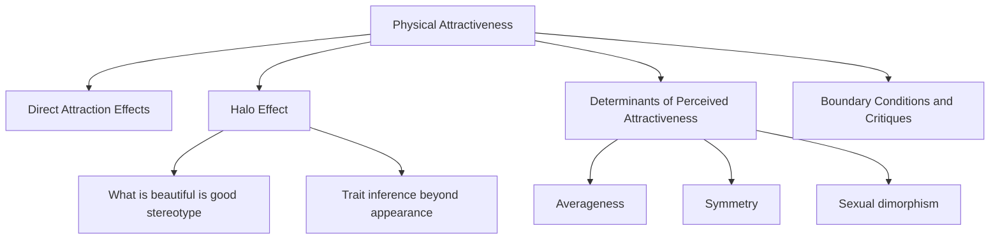
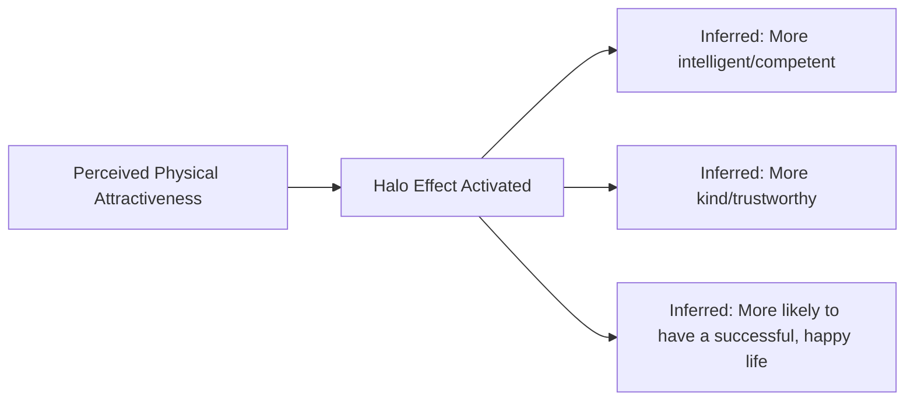

## Physical Attractiveness and the Halo Effect

### Overview

Physical attractiveness is one of the most consistently powerful predictors of initial interpersonal attraction, and its influence extends well beyond romantic contexts into broader social judgment through the **halo effect** — the tendency to attribute a wide range of positive, unrelated traits (intelligence, kindness, competence, morality) to physically attractive individuals, based solely on their appearance. This chapter topic examines both the empirical strength of attractiveness as a predictor of liking and the cognitive bias through which attractiveness judgments bleed into unrelated trait inferences.

### Physical Attractiveness as a Predictor of Attraction

**Key Points**

- Across a large body of social psychological research, physical attractiveness consistently emerges as one of the strongest single predictors of initial liking and dating interest, particularly in early-stage, low-information encounters (first impressions, blind dates, brief interactions) where little else is known about a person.
- The influence of attractiveness on initial attraction is notably stronger for judgments made with minimal other information; as relationships develop and more information becomes available (personality, values, shared experiences), the relative predictive weight of attractiveness on continued liking and relationship satisfaction tends to diminish relative to other factors such as similarity and self-disclosure.
- [Inference] Some research has examined whether the importance of physical attractiveness differs for men and women in stated dating preferences, with certain studies (e.g., some analyses of personal ad content and stated preferences) suggesting men report placing relatively greater emphasis on physical attractiveness in mate selection criteria than women do; however, findings across the broader literature on this question are mixed and sensitive to methodology (stated preferences vs. actual behavioral choices often diverge), so this should be treated as a debated pattern rather than a settled universal finding.

### Determinants of Perceived Physical Attractiveness

**Key Points**

- **Averageness:** Composite/morphed faces created by digitally blending many individual faces together are consistently rated as more attractive than most of the individual faces used to create them — a well-replicated finding in face-perception research (Langlois & Roggman and related work).
- **Symmetry:** Facial and bodily symmetry is reliably associated with higher attractiveness ratings across many studies, with evolutionary psychology explanations proposing symmetry as a signal of developmental stability and genetic quality. [Inference] The evolutionary interpretation of symmetry preferences is a widely cited theoretical framework in this literature, though it remains an interpretive account of *why* the symmetry-attractiveness correlation exists rather than a directly observable causal mechanism.
- **Sexual dimorphism:** Facial and bodily features that are more pronounced expressions of typical sex-differentiated characteristics (e.g., more "masculine" jawlines in male faces, more "feminine" facial proportions in female faces) have been associated with higher attractiveness ratings in numerous studies, though preferences for dimorphism level have also been found in some research to vary with contextual factors (e.g., perceived pathogen prevalence, relationship context being considered), an area with less consensus than the averageness and symmetry findings.
- **Cultural and contextual variability:** [Inference] While averageness and symmetry preferences show notable cross-cultural consistency in the literature, specific attractiveness standards (body size ideals, skin tone preferences, particular facial feature ideals) show meaningful cross-cultural and historical variation, indicating that attractiveness judgment involves both some broadly shared perceptual/cognitive mechanisms and substantial culturally learned components operating together.

### The Halo Effect: "What Is Beautiful Is Good"

**Definition**

The halo effect, in the specific context of physical attractiveness, refers to the well-documented tendency for people to assume that physically attractive individuals also possess other positive, often unrelated, personal qualities — a pattern classically termed the **"what is beautiful is good" stereotype**, established in foundational research by **Karen Dion, Ellen Berscheid, and Elaine Walster (Hatfield) (1972)**.

**Classic Study — Dion, Berscheid & Walster (1972)**

- **Setup:** Participants rated photographs varying in physical attractiveness on a range of unrelated personality and life-outcome dimensions (e.g., personality traits, occupational success, marital happiness, overall life satisfaction), with no other information provided about the individuals pictured.
- **Key finding:** Physically attractive individuals were rated as more likely to possess socially desirable personality traits, achieve greater occupational success, and have happier marriages and more fulfilling lives — judgments based purely on facial photographs with zero actual information about the target's personality, career, or relationship history.
- **Significance:** This established that attractiveness functions as a heuristic cue that biases a broad range of unrelated social judgments, not merely romantic desirability judgments.

**Key Points**

- The halo effect operates largely **automatically and outside deliberate reasoning**, functioning as an implicit heuristic rather than a consciously endorsed belief that attractiveness causes good character.
- The effect has been replicated across many judgment domains, including:
  - **Employment/hiring judgments:** Attractive candidates are often rated as more competent and hireable in resume/photo-based hiring studies, independent of actual qualifications.
  - **Legal/courtroom judgments:** [Inference] Some mock-jury and courtroom studies have found attractive defendants receive somewhat more lenient judgments (shorter recommended sentences, lower perceived guilt) in certain crime-type conditions, though this effect has been found in some research to reverse for certain offense types (e.g., when attractiveness was itself instrumental to the crime, such as fraud involving charm/seduction), indicating this specific application is more context-dependent and less uniformly consistent than the general halo-effect pattern in non-legal judgment domains.
  - **Educational judgments:** Some studies have found teachers rating hypothetical student work attached to attractive versus unattractive photos rate attractive students' work more favorably.
  - **Political judgments:** [Inference] Some research on political candidate evaluation has linked facial attractiveness (and related "competence" facial-inference judgments) to voting preference and perceived electability, though isolating the independent contribution of pure attractiveness versus related facial-competence inference processes is methodologically complex and remains an active area of research rather than a single settled effect size.

### Boundary Conditions and Critiques of the Halo Effect

**Key Points**

- **Not unconditionally positive:** [Inference] Some research has found that extreme attractiveness in certain contexts (e.g., same-sex evaluators judging potential same-sex romantic rivals, or evaluators assessing candidates for traditionally "unglamorous"-coded roles) can trigger *less* favorable judgments in specific dimensions, suggesting the halo effect is moderated by evaluator motivation and context rather than being a uniformly positive bias in all situations.
- **Accuracy of halo-based inferences is generally weak:** Meta-analytic reviews (e.g., Eagly, Ashmore, Makhijani & Longo, 1991, and related work) have found that while the *stereotype* linking attractiveness to positive traits is robust and widespread, the actual real-world correlation between physical attractiveness and traits like intelligence, kindness, or genuine life happiness is generally weak or inconsistent — meaning the halo effect is best understood as a largely inaccurate cognitive bias rather than a shortcut that reliably tracks real underlying differences.
- **Self-fulfilling prophecy component:** Some research (e.g., Snyder, Tanke & Berscheid, 1977) has demonstrated that being *treated* as attractive (based on being perceived that way by an interaction partner) can actually shape a target's subsequent behavior to become warmer or more socially skilled during the interaction — a self-fulfilling-prophecy mechanism suggesting the halo effect can partially create the very correlation it presumes, at least within specific interpersonal interactions, though this is a distinct (behavioral-confirmation) mechanism from a claim about pre-existing real trait correlations.

### Comparative Summary Table

| Concept | Core Finding | Key Source |
| --- | --- | --- |
| Attractiveness-attraction link | Attractiveness strongly predicts initial liking, especially with little other information | General attraction literature |
| Averageness effect | Composite/blended faces rated more attractive than most individual source faces | Langlois & Roggman |
| Symmetry preference | Facial/body symmetry associated with higher attractiveness ratings | Multiple replications |
| Halo effect ("beautiful is good") | Attractive people assumed to have unrelated positive traits | Dion, Berscheid & Walster (1972) |
| Accuracy of halo inferences | Generally weak/inconsistent real-world correlation despite strong stereotype | Eagly et al. (1991) meta-analysis |
| Self-fulfilling prophecy | Being treated as attractive can shape more favorable actual behavior | Snyder, Tanke & Berscheid (1977) |

### Practical Example

**Example**

Two otherwise-identical resumes are submitted for a job opening, one attached to a photo independently rated as more physically attractive than the other. Evaluators, without any other differentiating information, tend to rate the more attractive candidate's resume as reflecting a more competent, capable professional — despite the actual work experience and qualifications listed being identical — illustrating the halo effect's operation on a judgment (professional competence) entirely unrelated to physical appearance.

### Real-World and Applied Contexts

- **Hiring and personnel decisions:** Awareness of attractiveness-based halo effects has informed structured interview and blind resume-review practices in organizational hiring aimed at reducing appearance-based bias in competence judgments.
- **Media and advertising:** Marketing and advertising extensively leverage the halo effect by pairing attractive models with products, implicitly transferring inferred positive qualities (quality, desirability, trustworthiness) from the model to the product itself.
- **Legal and courtroom procedure:** Findings on attractiveness bias in juror judgment have contributed to broader discussions in the legal psychology field about extralegal bias in jury decision-making and have informed some jury-instruction and voir dire considerations, though implementation of specific bias-mitigation procedures varies by jurisdiction.
- **Educational assessment practices:** Findings on attractiveness bias in evaluating student work have supported arguments for anonymized or blind grading practices in some educational contexts to reduce appearance-based grading bias.
- **Social media and self-presentation:** [Inference] The pervasiveness of photo-based self-presentation on social media and dating platforms has been discussed in applied research as potentially amplifying the practical real-world impact of attractiveness-based halo judgments in everyday social and romantic evaluation, though this is a more recent extension of the classic findings and represents an evolving area of study rather than a well-established body of directly comparable long-term research.

**Related Topics**

- Proximity and the mere exposure effect
- Similarity and the matching hypothesis
- Self-disclosure and relationship escalation
- First impressions and thin-slice judgments
- Implicit bias and automatic social categorization
- Evolutionary psychology of mate preferences
- Self-fulfilling prophecy and behavioral confirmation
- Stereotyping and social cognition heuristics